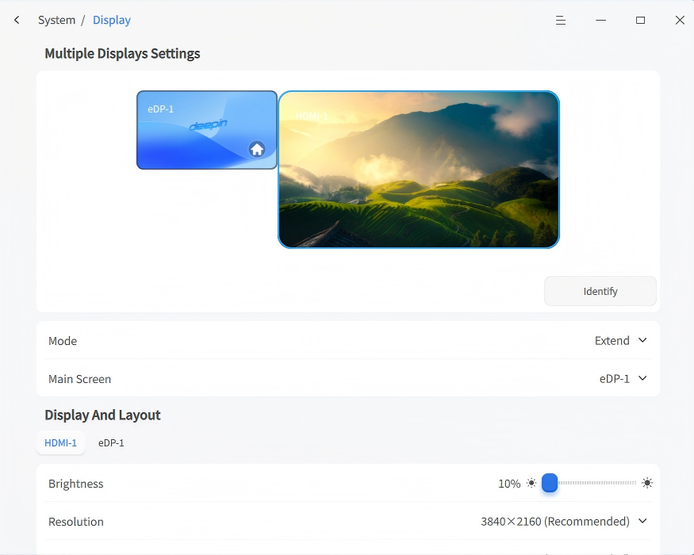
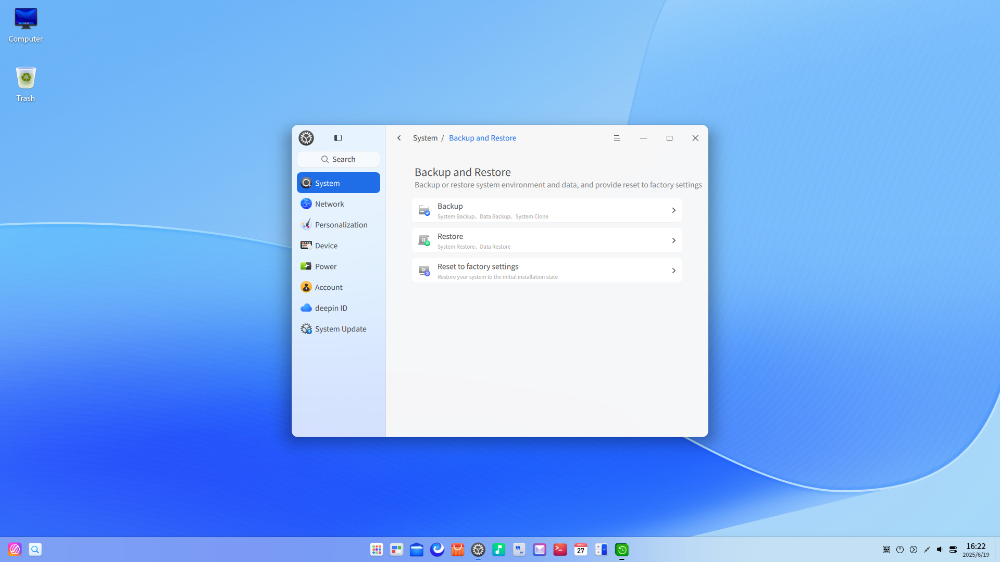
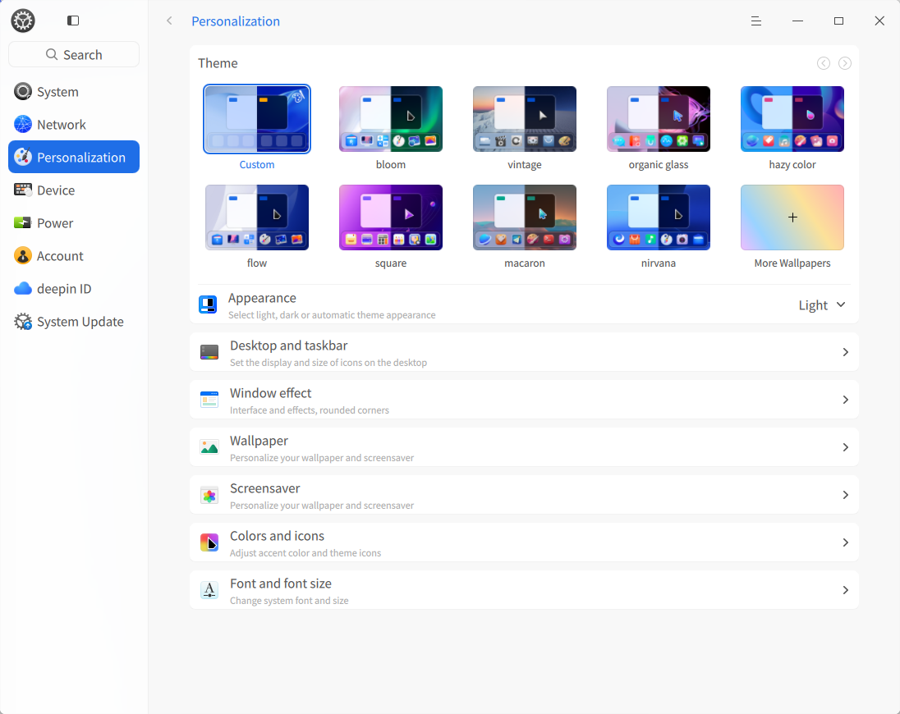

# Desktop Environment|DDE

## Overview

Deepin Operating System (deepin) is a visually appealing, user-friendly, and secure domestically developed desktop OS. It comes pre-installed with native applications like File Manager, App Store, Image Viewer, System Monitor, and more. It caters to both entertainment and daily work needs. With continuous upgrades, deepin has become one of China's most popular desktop operating systems.

### System Introduction

Upon first login, the Welcome app automatically opens. Watch videos to explore features, select desktop modes/icon themes, and learn about the system.

After successful login, experience the deepin Desktop Environment (DDE). DDE consists of the Desktop, Taskbar, Launcher, Control Center, and Window Manager, forming the foundation of your OS interaction.

## Desktop

The desktop is the main screen area after login. Here, you can create files/folders, arrange icons, open terminals, set wallpapers/screensavers, or add app shortcuts via [Send to Desktop](#Set-Shortcut).

>  Note: On touchpads, swipe down with four/five fingers to show the desktop; swipe up immediately after to hide it (equivalent to **Super** + **D**).

### Create Folder/Document

Create folders/documents on the desktop or perform file operations like in File Manager.

- Right-click desktop > **New Folder** > Name it.
- Right-click desktop > **New Document** > Select type > Name it.

Right-click a file/folder for these options:

| Function         | Description                                         |
| ---------------- | --------------------------------------------------- |
| Open With        | Choose default or other apps to open the file.      |
| Compress/Extract | Compress files/folders or extract archives.         |
| Cut              | Move file/folder.                                   |
| Copy             | Copy file/folder.                                   |
| Rename           | Rename file/folder.                                 |
| Delete           | Delete file/folder.                                 |
| Create Link      | Create a shortcut.                                  |
| Tag Info         | Add tags for categorized management.                |
| Properties       | View basic info, sharing settings, and permissions. |

>  Notes:
> 
> - On touchscreens: Long-press (1s) to open the right-click menu.
> - On touchpads: Two-finger click for right-click menu.
> - Keyboard: **Alt** + **M** opens the right-click menu.

### Arrange Icons

Sort desktop icons as needed.

1. Right-click desktop.
2. Click **Sort By**:
   - **Name**: Sort by filename.
   - **Modified**: Sort by last modification date.
   - **Created**: Sort by creation date.
   - **Size**: Sort by file size.
   - **Type**: Sort by file type.

>  Tip: Enable **Auto Arrange** to auto-fill gaps when icons are deleted.

### Adjust Icon Size

1. Right-click desktop.
2. Click **Icon Size**.
3. Select a size.

>  Tip: Use **Ctrl** + **+**/**-** or mouse scroll to adjust icon size on desktop/launcher.

### Display Settings

Access display settings quickly via the desktop right-click menu.

1. Right-click desktop.
2. Click **Display Settings** to open Control Center’s display settings.

>  Note: See [Display Settings](#Display-Settings) for details.

### Clipboard

The clipboard displays all text, images, and files copied/cut after login. Use it to quickly copy items. Content is cleared after logout/shutdown.

Drag images/files from clipboard to desktop to save; drag text to editable fields.

1. Press **Super** + **V** to open the clipboard.
2. Double-click an item to copy it instantly; the item moves to the top.
3. Paste at the target location.
4. Hover over an item and click **×** to delete it; click **Clear All** to empty the clipboard.

## Taskbar

The taskbar (usually at the bottom) includes Launcher, app icons, system tray, and plugins. Use it to open apps, show desktop, switch workspaces, manage apps (open/close/force quit), set input methods, adjust volume, connect networks, view calendar, or shut down.

>  Note: Taskbar mode, position, and status can also be configured in **Control Center > Personalization > Taskbar**.

### Taskbar Icons

Icons include Launcher, app shortcuts, tray icons, and system plugins.

| Icon                                                                  | Description                                     | Icon                                                                | Description                                       |
| --------------------------------------------------------------------- | ----------------------------------------------- | ------------------------------------------------------------------- | ------------------------------------------------- |
|                             | Launcher: View installed apps.                  |             | Global Search: Find content.                      |
|       | Multitasking View: Show workspaces.             |                  | File Manager: Browse files.                       |
|                    | UOS AI Bar: AI feature entry.                   |              | Browser: Open web pages.                          |
|                     | App Store: Install apps.                        |                   | Control Center: System settings.                  |
|                         | Music: Play music.                              |                      | Text Editor: Edit text files.                     |
|                          | Email: Manage emails.                           |                    | Terminal: Terminal emulator.                      |
|                         | Calendar: View dates/schedules.                 |                  | Calculator: Standard/scientific/programmer modes. |
|                            | Notification Center: System/app alerts.         |                                    | Onboard: Virtual keyboard.                        |
|  | Quick Settings Panel: Quick system adjustments. |  | Power: Shutdown menu.                             |

### Switch Display Mode

Taskbar has two modes: **Classic Mode** (small icons) and **Centered Mode** (large icons with activation effects).

  
*Classic Mode*

  
*Centered Mode*

To switch modes:

1. Right-click taskbar.
2. Under **Mode**, select a mode.

### Set Taskbar Position

Place taskbar on any screen edge.

1. Right-click taskbar.
2. Under **Position**, select a direction.

### Adjust Height

Drag taskbar edge to resize.

### Show/Hide Taskbar

Hide taskbar to maximize desktop space.

1. Right-click taskbar.
2. Under **Status**:
   - **Always Show**: Taskbar stays visible.
   - **Always Hide**: Taskbar hides; shows on mouse hover.
   - **Smart Hide**: Auto-hides when windows overlap it.

>  Note: On touchscreens with hidden taskbar:
> 
> - Bottom: Swipe up from bottom edge.
> - Top: Swipe down from top edge.
> - Left: Swipe right from left edge.
> - Right: Swipe left from right edge.

### Show/Hide Plugins

1. Right-click taskbar > **Taskbar Settings** (opens Control Center).
2. Under **Plugins**, toggle **Recycle Bin**, **System Monitor**, **Power**, **Show Desktop**, **Onboard**, **Notification Center**, **Time**, **Desktop AI Assistant**, **Screenshot/Recording**, etc.

### View Notifications

System/app notifications appear at top. Click buttons to act or **×** to dismiss.

Click  on taskbar to open Notification Center.

>  Note: On touchscreens, swipe inward from right edge (above taskbar height) to open Notification Center.

### View Date/Time

- Hover over taskbar time to see date/week/time.
- Click time to open calendar plugin.

### Power Menu

Click  on taskbar or Launcher (mini mode) to open power menu.

| Function       | Icon                                                          | Description                              |
| -------------- | ------------------------------------------------------------- | ---------------------------------------- |
| Shutdown       |              | Turn off PC.                             |
| Restart        |                  | Reboot PC.                               |
| Suspend        |                | Low-power state.                         |
| Hibernate      |                      | Saves to disk (requires swap partition). |
| Lock           |                      | Lock screen (**Super** + **L**).         |
| Switch User    |          | Switch accounts.                         |
| Log Out        |                  | End session.                             |
| System Monitor |  | Launch System Monitor.                   |

>  Note: **Switch User** appears only with multiple accounts.

### Recycle Bin

Temporarily deleted files stay here. Restore or empty them.

#### Restore File

Restore deleted files or press **Ctrl** + **Z** to undo recent deletion.

1. Select file(s) in Recycle Bin.
2. Right-click > **Restore**.
3. Files return to original location.

>  Warning: If original folder is deleted, a new folder is created.

#### Delete File Permanently

1. Select file(s) in Recycle Bin.
2. Right-click > **Delete**.

#### Empty Recycle Bin

Click **Empty** to permanently delete all content.

## Launcher

Launcher  manages all installed apps. Use categories or search to find apps quickly.

Newly installed apps show a blue dot indicator.

>  Note: On touchpads, tap with four fingers to show/hide the launcher (**Super** key).

### Switch Mode

Launcher has **Fullscreen** and **Mini Window** modes. Toggle via the top-right icon.

Both support app search and shortcut creation. Mini mode also offers quick access to File Manager, Control Center, and Shutdown.

  

  

### Arrange Apps

In Mini mode, apps default to **Free Sort** (newest on top, sorted by frequency). Switch to:

- **By Category**: Group by app type.
- **By Name**: Alphabetical order.

### Find Apps

Scroll or use categories to browse. Type app name/initials in the search box.

### Set Shortcuts

Quickly launch apps from the desktop/taskbar.

#### Create Shortcut

Send apps to desktop/taskbar.

1. In Launcher, right-click an app icon:
   - **Send to Desktop**: Creates a desktop shortcut.
   - **Send to Taskbar**: Pins to taskbar.

>  Note: Drag app icons from Launcher to taskbar. If app is running, right-click taskbar icon > **Pin to Taskbar**.

#### Delete Shortcut

Remove from desktop/taskbar/Launcher.

**From Taskbar**:

- Drag the icon off the taskbar.
- Right-click taskbar icon > **Unpin**.

**From Launcher**:
Right-click app icon:

- **Remove from Desktop**: Deletes desktop shortcut.
- **Remove from Taskbar**: Unpins from taskbar.

>  Note: This removes shortcuts only, not the app.

### Install Apps

Use App Store to download/install missing apps.

### Run Apps

Open apps via:

- Double-click desktop icons or right-click > **Open**.
- Click taskbar icons or right-click > **Open**.
- Click launcher icons or right-click > **Open**.

>  Tip: For frequently used apps, right-click in launcher > **Add to startup** to run it when the computer boots.

### Uninstall Apps

Remove unused apps to save space.

1. In Launcher, right-click the app icon.
2. Click **Uninstall**.

>  Note: Some system apps cannot be uninstalled.

## Control Center

Manage system settings via Control Center: accounts, network, time/date, personalization, display, updates, etc. Open via  on taskbar.

### Homepage

Homepage displays modules for quick access.

Switch modules via left sidebar.

#### Title Bar

Includes back button, search box, main menu, and window controls.

- : Return to previous level.
- Breadcrumb navigation: Navigate page hierarchy.
- Search box: Enter keywords to find settings.
- Main menu: Set window theme, view version, or exit.

### System

#### Display

Adjust brightness, resolution, orientation, and scaling for optimal viewing.

##### Single Display Settings

Adjust brightness, resolution, refresh rate, and orientation.

###### Adjust Brightness

*Available if hardware supports.*

1. Go to **Control Center > System > Display**.
2. Drag the brightness slider.

###### Set Screen Scaling

Resize oversized/undersized displays.

1. Go to **Control Center > System > Display**.
2. Select a scaling factor from the dropdown.
3. Log out/in to apply.

>  Notes:
> 
> - High-DPI screens auto-adjust scaling.
> - For apps incompatible with scaling, right-click in Launcher > **Disable Scaling**.

###### Change Resolution

1. Go to **Control Center > System > Display**.
2. Select a resolution from the dropdown.
3. Click **Save**.

###### Set Desktop Display

*Available at non-recommended resolutions.*

1. Go to **Control Center > System > Display**.
2. Choose a display effect under **Desktop Display**.

###### Set Refresh Rate

1. Go to **Control Center > System > Display**.
2. Select a refresh rate.
3. Click **Save**.

###### Change Orientation

1. Go to **Control Center > System > Display**.
2. Select an orientation.
3. Click **Save**.

###### Set Eye Comfort Mode

*Available if hardware supports.*

1. Go to **Control Center > System > Display**.
2. Under **Eye Comfort**:
   - Toggle **Eye Comfort Mode** on.
   - Set schedule: **All Day**, **Sunset to Sunrise**, or **Custom**.
   - Adjust color temperature slider.

##### Multi-Display Settings

Extend your workspace using VGA/HDMI/DP cables.

1. Go to **Control Center > System > Display**.
2. Under **Multi-Screen Display**, choose:
   - **Duplicate**: Mirror primary screen.
   - **Extend**: Expand desktop across screens.
   - **Only on [Screen]**: Display only on selected screen.

Click **Identify** to show screen names. In extended mode, settings windows group on each screen.

>  Note: In **Extend** mode, set taskbar behavior in **Personalization** > **Taskbar** > **Multi-Screen Display** (**Show on Primary Only** or **Follow Mouse Position**).

Press **Super** + **P** to toggle multi-display OSD:

1. Hold **Super**, press **P** or click a mode.
2. Release to confirm.

>  Note: Secondary screens support desktop icons and right-click menus.

Brightness, scaling, resolution, etc., settings match single-display setup. See [Single Display Settings](#single-display-settings).

#### Sound

Optimize input/output devices (speakers, microphones).

##### Output Settings

1. Go to **Control Center > System > Sound**.
2. Under **Output**:
   - Adjust volume/balance.
   - Enable **Volume Boost** (0–150% range).
   - Enable **Mono Audio** (merge channels).
   - Enable **Auto Pause on Unplug**.
   - Select output device.

##### Input Settings

1. Go to **Control Center > System > Sound**.
2. Under **Input**:
   - Adjust input volume.
   - Enable **Noise Suppression**.
   - Select input device.

>  Tip: Test microphone at normal volume; avoid distor.

##### System Sounds

1. Go to **Control Center > System > Sound**.
2. Click **System Sounds**.
3. Toggle event sounds (e.g., login, logout).

>  Tip: Click to preview sounds.

##### Device Management

1. Go to **Control Center > System > Sound**.
2. Click **Device Management**.
3. Enable/disable input/output devices.

#### Notification

Configure "Do Not Disturb" mode and app-specific notifications.

##### System Notifications

1. Go to **Control Center > System > Notifications**.
2. Toggle **Do Not Disturb** on/off.
   - Set start/end times.
   - Enable **Show Notifications on Lock Screen**.

##### App Notifications

Customize per-app alerts.

1. Go to **Control Center > System > App Notifications**.
2. Select an app and configure:
   - Play sound on notification.
   - Show in Notification Center/desktop.
   - Show message preview.

#### Time & Date

Set time zoshijine, sync automatically, or configure manually.

##### Modify Time/Date

1. Go to **Control Center > System > Time & Date**.

2. Toggle **Auto Sync** off.

3. Manually set time/date.

4. Click **OK**.

>  Note: Re-enable **Auto Sync** to use NTP servers.

##### Change Time Zone

1. Go to **Control Center > System > Time & Date**.
2. Click **Change System Time Zone**.
3. Select a time zone.

##### Add Time Zone

View multiple time zones.

1. Go to **Control Center > System > Time & Date**.
2. Under **Time Zone List**, click **Add**.
3. Search/select a time zone > **Add**.

##### Delete Time Zone

1. Go to **Control Center > System > Time & Date**.
2. Under **Time Zone List**, click **Edit**.
3. Click **Delete**.

#### Language & Region

Add/switch system languages and regional formats.

##### Add System Language

1. Go to **Control Center > System > Language & Region**.
2. Click **Add** > select language.

##### Set System Language

1. Select a language; system installs language pack.
2. Log out/in to apply.

>  Warning: Keyboard layout may change; ensure correct layout at login.

##### Region

1. Go to **Control Center > System > Language & Region**.
2. Under **Region**:
   - **Area**: Affects input methods, keyboard layouts, and formats.
   - **Region & Format**: Sets date, currency, number formats.
   - **Current Format**: Customize taskbar time/date display.

#### Default Programs

Set default apps for file types when multiple options exist.

##### Set Default Program

1. Right-click file > **Open With** > **Select Default Program**.
2. Choose an app, check **Set as Default**, click **OK**.
   - *App auto-added to Control Center list.*

##### Change Default Program

1. Go to **Control Center > System > Default Programs**.
2. Select a file type.
3. Choose another app.

##### Add Default Program

1. Go to **Control Center > System > Default Programs**.
2. Select a file type.
3. Click **Add** > Choose a `.desktop` file (e.g., `/usr/share/applications`) or binary.
4. Check the app to set as default.

##### Delete Default Program

Only user-added apps can be deleted. System apps require uninstallation.

1. Go to **Control Center > System > Default Programs**.
2. Select a file type.
3. Click  next to the app.

#### Boot Menu

Manage boot options and theme.

##### Set Boot Menu

Menu for selecting OS at startup.

>  Note: ARM systems support only GRUB verification; MIPS systems lack GRUB/background support.

###### Set Default Boot Entry

1. Go to **Control Center > System > Boot Menu**.
2. Select an entry > enter password to set as default.

###### Set Boot Delay

- **On**: 5-second wait.
- **Off**: 1-second wait.

###### Theme

1. Go to **Control Center > System > Boot Menu**.
2. Toggle **Theme** on to enable themed boot screen.
>  Tip: Drag image to preview to change background.

##### Boot Animation

1. Go to **Control Center > System > Boot Menu**.
2. Set **Boot Logo Size** (Large/Small).

#### Developer Options

##### Debug Options

1. Go to **Control Center > System > Developer Options**.
2. Under **Debug Options**, set **System Log Level** to **Debug** for verbose logs (default: Off).

#### Backup & Restore

Back up/restore app or system data against data loss.

#### About This PC

1. Go to **Control Center > System > About This PC**.
2. Click  to rename computer.
3. View OS version, license, installation date, and hardware.

#### Open Source Software Notice

View open-source licenses.

#### EULA

View End User License Agreement.

#### Privacy Policy

View privacy policy.

### Network Settings

Connect to networks for email, browsing, downloads, etc.

>  Tip: Use the taskbar quick panel to view/set network status.

#### Wired Network

Stable wired connections via router.

1. Plug Ethernet cable into computer and router.
2. Go to **Control Center > Network > Wired Network**.
3. Toggle **Wired Network** on.
4. Connection success triggers desktop notification.

Edit or create new wired connections in settings.

#### Wireless Network

Flexible wireless connectivity.

##### Connect to Wireless

1. Go to **Control Center > Network > Wireless Network**.
2. Toggle **Wireless Network** on.
3. Select a network.
   - Open networks connect automatically.
   - Encrypted networks: Enter password > **Connect**.

##### Connect to Hidden Network

Manually add hidden networks.

1. Go to **Control Center > Network > Wireless Network**.
2. Click **Connect to Hidden Network**.
3. Enter SSID and required details.
4. Click **Save**.

#### Personal Hotspot

Share your computer's internet via Wi-Fi.

1. Go to **Control Center > Network > Personal Hotspot**.
2. Toggle **Hotspot** on.
3. Set hotspot name and password.
4. Click **Save**.

#### Airplane Mode

Disable Wi-Fi, hotspot, and Bluetooth.

1. Go to **Control Center > Network > Airplane Mode**.
2. Toggle it on/off.

>  Warning: Hidden if no wireless/Bluetooth hardware.

#### DSL (Dial-Up)

Connect via modem using ISP credentials.

1. Go to **Control Center > Network > DSL**.
2. Click **Create PPPoE Connection**.
3. Enter ISP name, username, password.
4. Click **Save**; auto-connects.

#### VPN

Secure encrypted connections for remote access.

1. Go to **Control Center > Network > VPN**.
2. Click **Add VPN** or **Import VPN**.
3. Select protocol, enter details (auto-filled if imported).
4. Click **Save**; auto-connects.
5. Export VPN settings for backup/sharing.

>  Note: Enable **Only for resources on this network** to avoid setting VPN as default route.

#### System Proxy

1. Go to **Control Center > Network > System Proxy**.
2. Toggle **System Proxy** on.
3. Choose **Manual** (enter server/port) or **Auto** (enter configuration URL).
4. Click **Save**.

#### Application Proxy

1. Go to **Control Center > Network > Application Proxy**.
2. Set proxy type, IP, port, etc.
3. Click **Save**.

>  Note: After setup, right-click app icons in launcher > **Use Proxy**.

#### Network Details

View MAC/IP/gateway info.

1. Go to **Control Center > Network > Network Details**.
2. Check wired/wireless network information.

### Personalization

Customize system theme, accent color, fonts, window effects, opacity, icons, cursors, and more.

#### Set Window Theme

1. Go to **Control Center > Personalization**.
2. Click **Theme**, select a system theme.

#### Appearance

Set light/dark/auto mode.

1. Go to **Control Center > Personalization**.
2. Under **Appearance**, choose **Light**, **Dark**, or **Auto** (switches at sunset/sunrise).

#### Desktop & Taskbar

Configure taskbar mode/position/state/plugins.

1. Go to **Control Center > Personalization > Desktop & Taskbar**.
2. Adjust:
   - **Mode**: Classic/Centered.
   - **Size**: Drag slider.
   - **Position**: Top/Bottom/Left/Right.
   - **Status**: Always Show/Always Hide/Smart Hide.
   - **Plugins**: Toggle visibility.

In multi-screen **Extend** mode, choose taskbar display: **Follow Mouse** or **Primary Screen Only**.

#### Window Effects

Hardware-dependent visual enhancements.

1. Go to **Control Center > Personalization > Window Effects**.
2. Configure:
   - **Interface Effect**: Best Performance (no effects), Balanced (limited effects), Best Visuals (all effects).
   - **Window Corner Radius**: None/Small/Medium/Large.
   - **Transparency When Moving**: Toggle on/off.
   - **Minimize Effect**: Scale or Magic Lamp.
   - **Opacity**: Adjust for taskbar/launcher (mini mode).
   - **Scrollbar**: Show When Scrolling or Always Show.
   - **Titlebar Height**: Drag slider.

>  Note: Titlebar height applies only to window-manager-drawn titlebars.

#### Wallpaper

Personalize your desktop.

1. Right-click desktop > **Set Wallpaper**.
2. Choose from **My Pictures**, **System Wallpapers**, or **Solid Colors**.
3. Click a wallpaper to apply.
4. Right-click wallpaper > **Set as Lock Screen**.

>  Tips:
> - Set auto-rotate interval under **Auto Switch Wallpaper**.
> - Use Image Viewer or App Store to set/download wallpapers.

#### Screensaver

Protect privacy during inactivity.

1. Go to **Control Center > Personalization > Screensaver**.
2. Choose **Picture Slideshow** or **System Screensavers**.
3. Set idle time to activate.
4. For slideshow: Click **Settings** to set path/interval/random order.
5. Enable **Require Password on Wake** for security.

#### Color & Icons

1. Go to **Control Center > Personalization > Colors & Icons**.
2. Configure:
   - **Accent Color**: Highlight color for selections.
   - **Icon Theme**: System or custom themes.
   - **Cursor Theme**: Select cursor style.

#### Fonts & Sizes

1. Go to **Control Center > Personalization > Fonts & Sizes**.
2. Set system font and size.

### Device

#### Bluetooth Settings

Wirelessly connect keyboards, mice, headphones, speakers.

>  Note: Laptops have built-in Bluetooth; desktops require a USB adapter.

##### Rename Bluetooth Device

1. Go to **Control Center > Devices > Bluetooth**.
2. Click **Edit** next to device name, enter new name.

>  Note: Renaming requires re-pairing on other devices.

##### Connect Bluetooth Device

1. Go to **Control Center > Devices > Bluetooth**.
2. Toggle **Bluetooth** on; scans nearby devices.
3. Click a device; enter PIN if required.
4. Connected devices appear under **My Devices**.
5. Click a device to **Disconnect** or rename.

##### Send/Receive Files via Bluetooth

*Requires paired devices.*

**From UOS PC**:

1. Go to **Control Center > Devices > Bluetooth**.
2. Select a paired device > **More** > **Send File**.
3. Choose file > **Open** > **Send**.

**From Mobile (Android)**:

1. Enable Bluetooth.
2. Select paired UOS device.
3. Choose file > **Send** > Bluetooth.

**Receive Files**:

1. Accept/decline incoming transfers.
2. Files save to `~/Downloads` on accept.
3. Transfers fail if receiver declines, times out, or disconnects.Failed transfers show in a list.

#### Mouse & Touchpad

Customize input devices for better ergonomics.

##### General Settings

1. Go to **Control Center > Devices > Mouse & Touchpad**.
2. Under **General**:
   - Adjust **Scrolling Speed**.
   - Adjust **Double-Click Speed**.
   - Toggle **Left-Handed Mode** (swaps left/right buttons).

>  Note: Left-handed mode swaps mouse/touchpad buttons.

##### Mouse Settings

1. Go to **Control Center > Devices > Mouse & Touchpad > Mouse**.
2. Adjust **Pointer Speed**.
3. Toggle **Mouse Acceleration** (improves precision at high speeds).
4. Enable **Disable Touchpad When Mouse Connected** (if available).
5. Toggle **Natural Scrolling** (reverse scroll direction).

##### Touchpad Settings

Configure pointer speed, natural scrolling, and "Disable When Typing" (laptops).

###### Gesture Settings

Assign actions to touchpad gestures.

**Three-Finger Gestures**:

- Swipe Up: Maximize window (or set to restore/left split/right split/disable).
- Swipe Down: Restore window (or set to maximize/left split/right split/disable).
- Swipe Left: Left split window (or set to restore/maximize/right split/disable).
- Swipe Right: Right split window (or set to restore/maximize/left split/disable).
- Tap: Show/hide Global Search (or set to show/hide Launcher/clipboard/notifications/disable).

**Four-Finger Gestures**:

- Swipe Up: Show Multitasking View (or hide/previous desktop/next desktop/show desktop/hide desktop/disable).
- Swipe Down: Hide Multitasking View (or show/previous desktop/next desktop/show desktop/hide desktop/disable).
- Swipe Left: Switch to previous desktop (or show/hide multitasking/next desktop/show desktop/hide desktop/disable).
- Swipe Right: Switch to next desktop (or show/hide multitasking/previous desktop/show desktop/hide desktop/disable).
- Tap: Show/hide Launcher (or global search/clipboard/notifications/disable).

#### Keyboard

Configure keyboard properties, input methods, and shortcuts.

##### Keyboard Properties

1. Go to **Control Center > Devices > Keyboard**.
2. Under **General**:
   - **Repeat Delay/Repeat Rate**: Drag sliders.
   - Test in input box.
   - Toggle **Enable Numeric Keypad**/**Caps Lock Prompt**.

##### Input Methods

Manage input methods and switching shortcuts.

###### Add Input Method

1. Go to **Control Center > Devices > Keyboard > Input Methods**.
2. Click **Add Input Method**:
   - **Find more in app store**: Download from App Store (auto-sets as default).
   - Choose from list.

>  Note: Removed input methods can be re-added.

###### Reorder Input Methods

Drag input methods up/down in the list.

###### Configure Input Method

Click **Settings**  next to an input method.

###### Set Switching Shortcut

Under **Shortcuts**, choose a key combo from dropdown.

>  Note: More shortcuts in **Advanced Settings**.

###### Advanced Settings

Go to **Advanced Settings** for global input method configurations.

###### Keyboard Layout

Add/remove layouts for character mapping.

**Add Layout**

1. Go to **Control Center > Devices > Keyboard > Keyboard Layout**.
2. Click **Add New Keyboard Layout** > select layout.

**Delete Layout**

1. Go to **Control Center > Devices > Keyboard > Keyboard Layout**.
2. Click **Edit**.
3. Click **Delete**  for a layout.

##### Shortcuts

View/modify/customize system, window, and workspace shortcuts.

###### View Shortcuts

Browse or search default shortcuts.

###### Modify Shortcut

1. Click a shortcut.
2. Press new keys.
3. Use **Backspace** to disable or **Esc** to cancel.
4. Click **Restore Default** to reset.

###### Custom Shortcut

1. Click **Add Custom Shortcut**.
2. Enter name, command, and shortcut keys.
3. Click **Add**.
4. Edit/delete via **Edit** mode.

#### Touchscreen Settings

Configure connected touchscreens.

1. Go to **Control Center > System > Touchscreen**.
2. Adjust settings and click **OK**.

#### Graphics Tablet

Configure pressure sensitivity for drawing tablets (requires hardware).

>  Note: Module appears only when connected.

1. Go to **Control Center > Devices > Graphics Tablet**.
2. Select **Pen** mode.
3. Adjust **Pressure Sensitivity**.

### Power Management

Optimize battery usage and system security.

#### Adjust Performance Mode

1. Go to **Control Center > Power Management > General**.
2. Choose **Balanced**, **High Performance**, or **Power Saver**.

#### Power Saving Settings

1. Go to **Control Center > Power Management > General**.
2. Configure:
   - **Auto Power Saving on Low Battery** (laptops only).
   - Set **Low Battery Threshold**.
   - **Auto Power Saving on Battery** (laptops only).
   - Adjust **Auto Dim Brightness**.

#### Wake Settings

1. Go to **Control Center > Power Management > General**.
2. Under **Wake Settings**:
   - **Require password on suspend wake**.
   - **Require password on display wake**.

#### Shutdown Settings

1. Go to **Control Center > Power Management > General**.
2. Under **Shutdown Settings**:
   - Set **Scheduled Shutdown** time.
   - Choose frequency: Once, Weekdays, Daily, or Custom.

#### Set Monitor Off Time

1. Go to **Control Center > Power Management > Plugged In** or **On Battery**.
2. Set **Turn Off the Monitor After**.

>  Note: Laptops can set different times for AC/battery.

#### Set Suspend Time

1. Go to **Control Center > Power Management > Plugged In** or **On Battery**.
2. Set **Suspend After**.

>  Tip: Enable **Suspend When Lid Closed** for laptops.

#### Set Auto Lock Time

1. Go to **Control Center > Power Management > Plugged In** or **On Battery**.
2. Set **Lock Screen After**.

#### Set Lid Close Action

1. Go to **Control Center > Power Management > Plugged In** or **On Battery**.
2. Set **When Lid is Closed** to **Suspend**, **Hibernate**, **Turn Off the Monitor**, or **Do Nothing**.

>  Note: Laptops only.

#### Set Power Button Action

1. Go to **Control Center > Power Management > Plugged In** or **On Battery**.
2. Set **When Power Button Pressed** to **Shut Down**, **Suspend**, **Hibernate**, **Turn Off the Monitor**, **Show the Shutdown Interface**, or **Do Nothing**.

#### Low Battery Management

1. Go to **Control Center > Power Management > On Battery**.
2. Under **Low Battery Management**:
   - Enable **Low Battery Notification** (notifies below threshold).
   - Set auto-suspend/hibernate on low battery.
   - Adjust low battery threshold.

>  Note: Laptops only.

#### Battery Management

1. Go to **Control Center > Power Management > On Battery**.
2. Under **Battery Management**:
   - Toggle **Display Remaining Usage/Charging Time** on taskbar.
   - View maximum battery capacity.

### Accounts

Modify accounts or create new ones.

#### Create Account

1. Click **+ Add User**.
2. Select type (**Standard**/**Administrator**), set username/full name/password.
3. Click **Create**.
4. Enter current user password to authorize.

#### Change Avatar

Hover over avatar > **Edit** > Choose image.

#### Set Full Name

Click **Edit** next to full name > Enter.

#### Auto Login

Bypass login screen on boot (still requires password for lock/logout).

Toggle **Auto Login** on > Enter password.

#### Password-Free Login

Skip password on login/unlock.

Toggle **Password-Free Login** on > Enter password.

>  Tip: If both enabled, system boots directly to desktop.

#### Login Methods

**Password - Change**

1. Go to **Password**.
2. Enter current/new passwords > **Save**.

>  Note: Expired admin passwords must be reset before authorizing actions.

**Password - Validity**

1. Go to **Password**.
2. Set **Password Validity** to **Never Expire** or days.

*Calculated from last change date.*

**Biometric Authentication**
*Requires supported hardware (fingerprint/face).*

**Set Fingerprint**

1. Go to **Biometric Authentication**.
2. Click **+ Add Fingerprint**.
3. Enter password > Scan fingerprint > **Done**.

>  Note: Add multiple fingerprints; delete via **×**.

**Set Face Recognition**

1. Go to **Biometric Authentication**.
2. Click **+ Add Face**.
3. Agree to disclaimer > **Start** > Scan face > **Done**.

>  Note: Max 5 faces per account.

#### Delete Account

1. Select non-active account.
2. Click **Delete Account** > **Delete**.

>  Warning: Cannot delete logged-in account.

### deepin ID

Register/login to deepin ID for cloud sync, App Store, browser services, and password reset.

Enable **Auto Sync** to backup settings (sound/power/mouse/etc.) to cloud. Log in on another device to sync configurations.

>  Notes:
> 
> 1. Sync requires activated system or trial period.
> 2. Toggle per-item sync when enabled.

### System Updates

Enable repository updates (**System Updates**/**Security Updates**) for auto-download/notifications.

Update alerts appear in Control Center sidebar. Click **System Updates** > **Check for Updates** to download/install.

>  Tip: Disable **Update Reminder** in settings to hide notifications.

#### Update & Upgrade

1. Go to **System Updates**.
2. Click **Check for Updates**:
   - "System is up to date" if none.
   - If updates: Select content > **Download**.
3. After download, click **Install Updates**.
4. Reboot/shutdown when prompted.

#### Update & Shutdown/Reboot

Choose during installation:

- **Update in Background**: Install without interrupting use.
- **Update & Shutdown/Reboot**: Full-screen install (system unusable during).

>  Note: Use "Update & Shutdown/Reboot" for unattended updates.

#### Update Content

View changelogs after checking updates.

>  Note: **Security Updates** mode installs only critical patches.

#### Update Settings

##### Update Types

1. Go to **System Updates** > **Update Settings**.
2. Under **Update Types**, select **Feature Updates**, **Security Updates**, and/or **Third-Party Repos**.

##### Advanced

1. Go to **System Updates** > **Update Settings**.
2. Set:
   - **Download Speed Limit**: Cap download speed (default: 10240 KB/s).
   - **Auto Download**: Schedule download times.
   - **Update Reminder**: Show notifications.
   - **Clear Package Cache**: Auto-delete downloaded packages.

#### View Update History

Click **View Update History** to see installed versions/changelogs.

