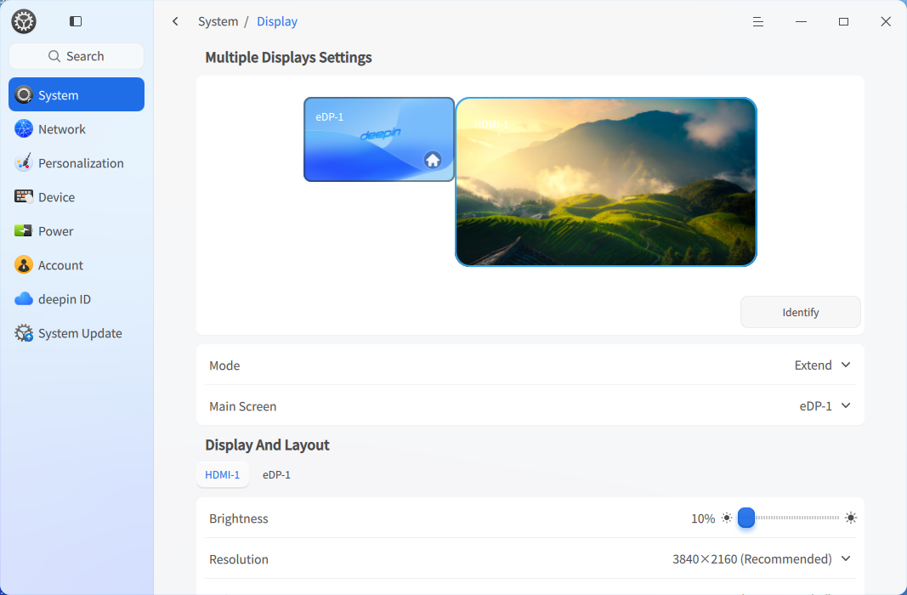
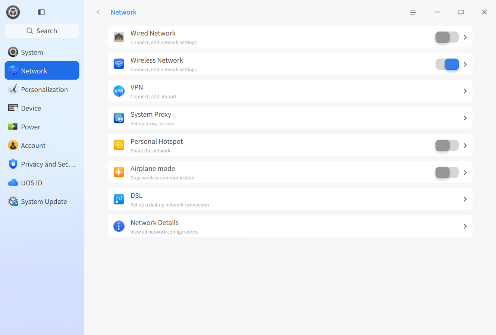
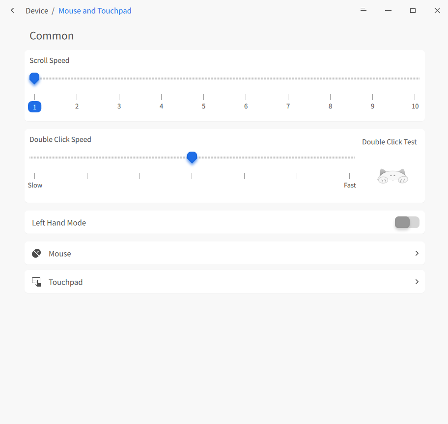
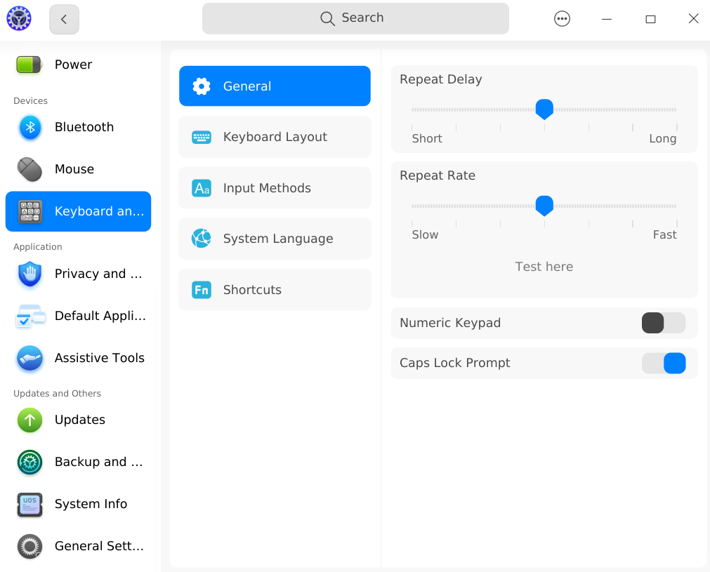
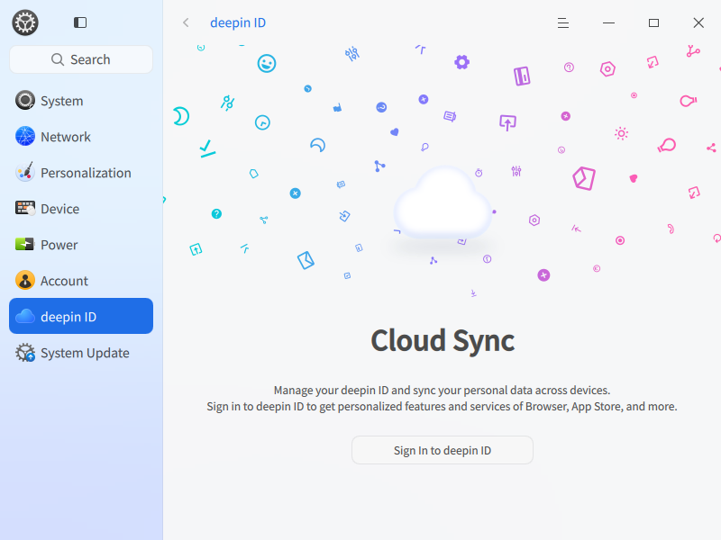
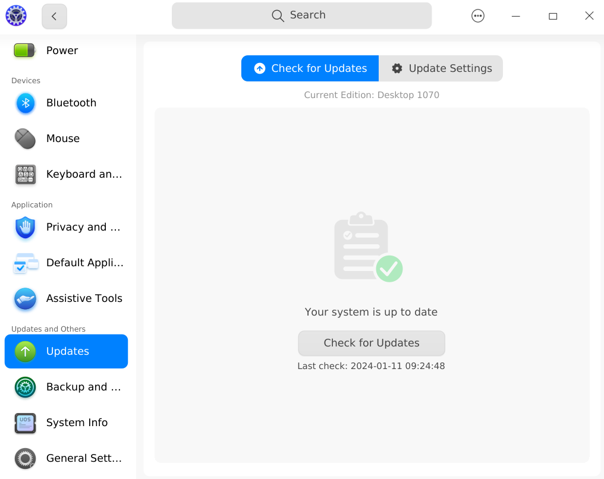
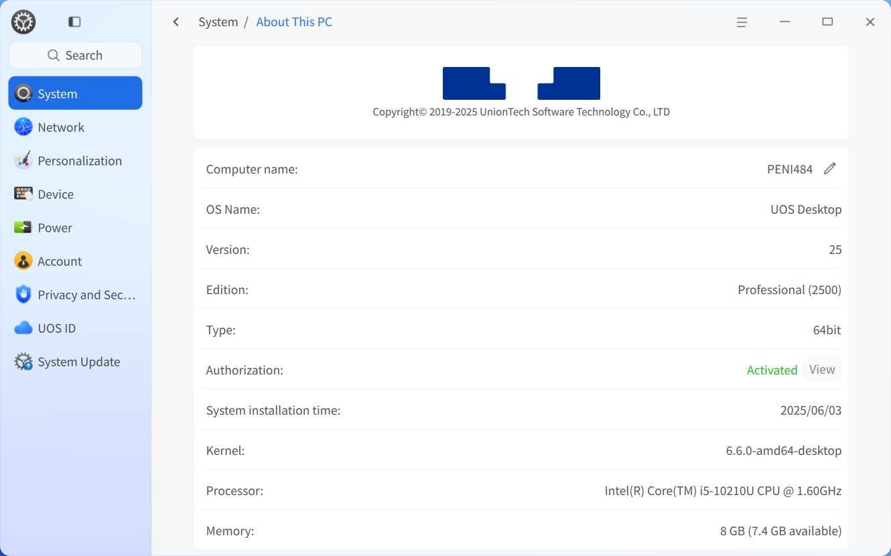

# Desktop Environment|DDE

## Overview
Deepin Operating System (deepin) is a visually appealing, user-friendly, and secure domestically developed desktop OS. It comes pre-installed with native applications like File Manager, App Store, Image Viewer, System Monitor, and more. It caters to both entertainment and daily work needs. With continuous upgrades, deepin has become one of China's most popular desktop operating systems.

### System Introduction
Upon first login, the Welcome app automatically opens. Watch videos to explore features, select desktop modes/icon themes, and learn about the system.

After successful login, experience the deepin Desktop Environment (DDE). DDE consists of the Desktop, Taskbar, Launcher, Control Center, and Window Manager, forming the foundation of your OS interaction.

## Desktop
The desktop is the main screen area after login. Here, you can create files/folders, arrange icons, open terminals, set wallpapers/screensavers, or add app shortcuts via [Send to Desktop](#Set-Shortcut).

>  Note: On touchpads, swipe down with four/five fingers to show the desktop; swipe up immediately after to hide it (equivalent to **Super** + **D**).

### Create Folder/Document
Create folders/documents on the desktop or perform file operations like in File Manager.

- Right-click desktop > **New Folder** > Name it.
- Right-click desktop > **New Document** > Select type > Name it.

Right-click a file/folder for these options:

| Function          | Description                                                                 |
|-------------------|-----------------------------------------------------------------------------|
| Open With         | Choose default or other apps to open the file.                              |
| Compress/Extract  | Compress files/folders or extract archives.                                 |
| Cut               | Move file/folder.                                                           |
| Copy              | Copy file/folder.                                                           |
| Rename            | Rename file/folder.                                                         |
| Delete            | Delete file/folder.                                                         |
| Create Link       | Create a shortcut.                                                          |
| Tag Info          | Add tags for categorized management.                                        |
| Properties        | View basic info, sharing settings, and permissions.                         |

>  Notes:
> - On touchscreens: Long-press (1s) to open the right-click menu.
> - On touchpads: Two-finger click for right-click menu.
> - Keyboard: **Alt** + **M** opens the right-click menu.

### Arrange Icons
Sort desktop icons as needed.

1. Right-click desktop.
2. Click **Sort By**:
   - **Name**: Sort by filename.
   - **Modified**: Sort by last modification date.
   - **Created**: Sort by creation date.
   - **Size**: Sort by file size.
   - **Type**: Sort by file type.

>  Tip: Enable **Auto Arrange** to auto-fill gaps when icons are deleted.

### Adjust Icon Size
1. Right-click desktop.
2. Click **Icon Size**.
3. Select a size.

>  Tip: Use **Ctrl** + **+**/**-** or mouse scroll to adjust icon size on desktop/launcher.

### Display Settings
Access display settings quickly via the desktop right-click menu.

1. Right-click desktop.
2. Click **Display Settings** to open Control Center’s display settings.

>  Note: See [Display Settings](#Display-Settings) for details.

### Clipboard
Clipboard stores text/images/files copied/cut during a session. Use it to quickly reuse content. Content clears after logout/shutdown.

Drag images/files from clipboard to desktop to save; drag text to editable fields.

1. Press **Super** + **V** to open clipboard.
2. Double-click an item to copy it (moves to top).
3. Paste to target location.
4. Hover over an item > Click **×** to delete; click **Clear All** to empty clipboard.

>  Note: On touchscreens, swipe inward from the left edge (above taskbar height) to open clipboard.

## Taskbar
The taskbar (usually at the bottom) includes Launcher, app icons, system tray, and plugins. Use it to open apps, show desktop, switch workspaces, manage apps (open/close/force quit), set input methods, adjust volume, connect networks, view calendar, or shut down.

>  Note: Customize taskbar mode/position/state in Control Center > **Personalization** > **Taskbar**.

### Taskbar Icons
Icons include Launcher, app shortcuts, tray icons, and system plugins.

| Icon                                                                  | Description                                     | Icon                                                                | Description                                       |
| --------------------------------------------------------------------- | ----------------------------------------------- | ------------------------------------------------------------------- | ------------------------------------------------- |
|                             | Launcher: View installed apps.                  |             | Global Search: Find content.                      |
|       | Multitasking View: Show workspaces.             |                  | File Manager: Browse files.                       |
|                    | UOS AI Bar: AI feature entry.                   |              | Browser: Open web pages.                          |
|                     | App Store: Install apps.                        |                   | Control Center: System settings.                  |
|                         | Music: Play music.                              |                      | Text Editor: Edit text files.                     |
|                          | Email: Manage emails.                           |                    | Terminal: Terminal emulator.                      |
|                         | Calendar: View dates/schedules.                 |                  | Calculator: Standard/scientific/programmer modes. |
|                            | Notification Center: System/app alerts.         |                                    | Onboard: Virtual keyboard.                        |
|  | Quick Settings Panel: Quick system adjustments. |  | Power: Shutdown menu.                             |

### Switch Display Mode
Taskbar has two modes: **Classic Mode** (small icons) and **Centered Mode** (large icons with activation effects).

  
*Classic Mode*

  
*Centered Mode*

To switch modes:
1. Right-click taskbar.
2. Under **Mode**, select a mode.

### Set Taskbar Position
Place taskbar on any screen edge.

1. Right-click taskbar.
2. Under **Position**, select a direction.

### Adjust Height
Drag taskbar edge to resize.

### Show/Hide Taskbar
Hide taskbar to maximize desktop space.

1. Right-click taskbar.
2. Under **Status**:
   - **Always Show**: Taskbar stays visible.
   - **Always Hide**: Taskbar hides; shows on mouse hover.
   - **Smart Hide**: Auto-hides when windows overlap it.

>  Note: On touchscreens with hidden taskbar:
> - Bottom: Swipe up from bottom edge.
> - Top: Swipe down from top edge.
> - Left: Swipe right from left edge.
> - Right: Swipe left from right edge.

### Show/Hide Plugins
1. Right-click taskbar > **Taskbar Settings** (opens Control Center).
2. Under **Plugins**, toggle **Recycle Bin**, **System Monitor**, **Power**, **Show Desktop**, **Onboard**, **Notification Center**, **Time**, **Desktop AI Assistant**, **Screenshot/Recording**, etc.

### View Notifications
System/app notifications appear at top. Click buttons to act or **×** to dismiss.

Click  on taskbar to open Notification Center.

>  Note: On touchscreens, swipe inward from right edge (above taskbar height) to open Notification Center.

### View Date/Time
- Hover over taskbar time to see date/week/time.
- Click time to open calendar plugin.

### Power Menu
Click  on taskbar or Launcher (mini mode) to open power menu.

| Function | Icon | Description |
|----------|------|-------------|
| Shutdown |  | Turn off PC. |
| Restart |  | Reboot PC. |
| Suspend |  | Low-power state. |
| Hibernate |  | Saves to disk (requires swap partition). |
| Lock |  | Lock screen (**Super** + **L**). |
| Switch User |  | Switch accounts. |
| Log Out |  | End session. |
| System Monitor |  | Launch System Monitor. |

>  Note: **Switch User** appears only with multiple accounts.

### Recycle Bin
Temporarily deleted files stay here. Restore or empty them.

#### Restore File
Restore deleted files or press **Ctrl** + **Z** to undo recent deletion.

1. Select file(s) in Recycle Bin.
2. Right-click > **Restore**.
3. Files return to original location.

>  Warning: If original folder is deleted, a new folder is created.

#### Delete File Permanently
1. Select file(s) in Recycle Bin.
2. Right-click > **Delete**.

#### Empty Recycle Bin
Click **Empty** to permanently delete all content.

## Launcher
Launcher  manages installed apps. Use categories or search to find apps quickly.

New apps show a blue dot indicator.

>  Note: On touchpads, four/five-finger click toggles Launcher (**Super** key).

### Switch Mode
Launcher has **Fullscreen** and **Mini Window** modes. Toggle via top-right icon.

Both support app search/shortcut creation. Mini mode also offers quick access to File Manager, Control Center, and Power menu.

  
*Fullscreen Mode*

  
*Mini Window Mode*

### Arrange Apps
In mini mode, default is **Free Sort** (newest apps on top, then by frequency). Switch to:
- **By Category**: Group by app type.
- **By Name**: Sort alphabetically.

### Find Apps
Scroll or use categories to browse. Type app name/initials in search bar to locate quickly.

### Set Shortcuts
Create shortcuts for quick app launches.

#### Create Shortcut
Send apps to desktop/taskbar.

1. In Launcher, right-click app icon:
   - **Send to Desktop**: Creates desktop shortcut.
   - **Send to Taskbar**: Pins to taskbar.

>  Note: Drag app icons from Launcher to taskbar. If app is running, right-click taskbar icon > **Pin to Taskbar**.

#### Delete Shortcut
Remove from desktop/taskbar/Launcher.

**From Taskbar**:
- Drag icon off taskbar.
- Right-click taskbar icon > **Unpin**.

**From Launcher**:
Right-click app icon:
- **Remove from Desktop**: Deletes desktop shortcut.
- **Remove from Taskbar**: Unpins from taskbar.

>  Note: This removes shortcuts only, not the app.

### Install Apps
Use App Store to download/install missing apps.

### Run Apps
For apps with desktop/taskbar shortcuts:
- Double-click desktop icon, or right-click > **Open**.
- Click taskbar icon, or right-click > **Open**.

In Launcher: Click app icon or right-click > **Open**.

>  Tip: Right-click app in Launcher > **Start at Login** for frequent use.

### Uninstall Apps
Remove unused apps to save space.

1. In Launcher, right-click app icon.
2. Click **Uninstall**.

>  Note: Some system apps cannot be uninstalled.

## Control Center
Manage system settings via Control Center: accounts, network, time/date, personalization, display, updates, etc. Open via  on taskbar.

>  Note: On touchpads, two-finger swipe left from right edge opens Control Center; swipe right from left edge hides it.

### Homepage
Homepage displays modules for quick access.

Switch modules via left sidebar.

#### Title Bar
Includes back button, search box, main menu, and window controls.
- : Return to previous level.
- Breadcrumb: Navigate page hierarchy.
- Search: Enter keywords to find settings.
- Main Menu: Set theme/view version/exit.

### Display Settings
Adjust brightness, resolution, orientation, and scaling for optimal viewing.

#### Single Screen Settings
Adjust brightness, resolution, refresh rate, and orientation.

##### Adjust Brightness
*Available if hardware supports.*

1. Go to **System** > **Display**.
2. Drag brightness slider.

##### Set Screen Scaling
Resize UI elements for readability.

1. Go to **System** > **Display**.
2. Select scaling factor from dropdown.
3. Log out/in to apply.

>  Notes:
> - High-DPI screens auto-adjust scaling.
> - For apps incompatible with scaling, right-click in Launcher > **Disable Scaling**.

##### Change Resolution
1. Go to **System** > **Display**.
2. Select resolution from dropdown.
3. Click **Save**.

##### Set Desktop View
*Available at non-recommended resolutions.*

1. Go to **System** > **Display**.
2. Choose display effect under **Desktop View**.

##### Set Refresh Rate
1. Go to **System** > **Display**.
2. Select refresh rate.
3. Click **Save**.

##### Change Orientation
1. Go to **System** > **Display**.
2. Select orientation.
3. Click **Save**.

##### Eye Protection Mode
*Available if hardware supports.*

1. Go to **System** > **Display**.
2. Under **Eye Protection Mode**:
   - Toggle **Eye Protection Mode** on.
   - Set schedule: **All Day**, **Sunset to Sunrise**, or **Custom**.
   - Adjust color temperature slider.

#### Multi-Screen Settings
Extend desktop across multiple displays using VGA/HDMI/DP cables.

1. Go to **System** > **Display**.
2. Under **Multi-Screen Display**, choose mode:
   - **Duplicate**: Mirror primary screen.
   - **Extend**: Expand desktop across screens.
   - **Show on [Screen] Only**: Use one screen.

In **Extend** mode:
- Click **Identify** to show screen names.
- Settings windows cluster at screen centers.

>  Note: In **Extend** mode, set taskbar behavior in **Personalization** > **Taskbar** > **Multi-Screen Display** (**Show on Primary Only** or **Follow Mouse Position**).

Press **Super** + **P** to toggle multi-screen OSD:
1. Hold **Super**, press **P** or click mode.
2. Release to confirm.

>  Note: Secondary screens support desktop icons/right-click menus.

Brightness/scaling/resolution/refresh rate/orientation settings work per screen (same as single screen).

### Touchscreen Settings
Configure connected touchscreens.

1. Go to **System** > **Touchscreen**.
2. Adjust settings > **OK**.

### Default Programs
Set default apps for file types when multiple options exist.

#### Set Default Program
1. Right-click file > **Open With** > **Set Default Program**.
2. Choose app > **OK**.
   - *App auto-added to Control Center list.*

#### Change Default Program
1. Go to **System** > **Default Programs**.
2. Select file type.
3. Choose another app.

#### Add Default Program
1. Go to **System** > **Default Programs**.
2. Select file type.
3. Click **Add** > Choose `.desktop` file (e.g., `/usr/share/applications`) or binary.
4. Select app as default.

#### Delete Default Program
*Only user-added apps can be deleted.*

1. Go to **System** > **Default Programs**.
2. Select file type.
3. Click **×** next to app.

### Personalization
Customize system theme, accent color, fonts, window effects, opacity, icons, cursors.

#### Set Window Theme
1. Go to **Personalization**.
2. Click **Theme** > Choose system theme.

#### Appearance
Set light/dark/auto mode.

1. Go to **Personalization** > **General**.
2. Under **Appearance**, choose **Light**, **Dark**, or **Auto** (switches at sunset/sunrise).

#### Desktop & Taskbar
Configure taskbar mode/position/state/plugins.

1. Go to **Personalization** > **Desktop & Taskbar**.
2. Adjust:
   - **Mode**: Classic/Centered.
   - **Size**: Drag slider.
   - **Position**: Top/Bottom/Left/Right.
   - **Status**: Always Show/Always Hide/Smart Hide.
   - **Plugins**: Toggle visibility.

In multi-screen **Extend** mode, choose taskbar display: **Follow Mouse** or **Primary Screen Only**.

#### Window Effects
*Performance depends on hardware.*

1. Go to **Personalization** > **Window Effects**.
2. Set:
   - **Interface Effects**: Best Performance (no effects)/Balanced/Best Visuals.
   - **Window Roundness**: None/Small/Medium/Large.
   - **Transparency When Moving Windows**: On/Off.
   - **Minimize Effect**: Scale/Magic Lamp.
   - **Opacity**: Adjust for taskbar/Launcher (mini mode).
   - **Scrollbar**: Show When Scrolling/Always Show.
   - **Titlebar Height**: Drag slider (preview updates live).

>  Note: Titlebar height applies only to WM-drawn titlebars.

#### Wallpaper
Personalize desktop with wallpapers.

1. Right-click desktop > **Set Wallpaper** (opens Control Center).
2. Choose from **My Pictures**, **System Wallpapers**, or **Solid Colors**.
3. Click wallpaper to apply to desktop.
4. Right-click wallpaper > **Set as Lockscreen**.

>  Tips:
> - Set auto-rotate interval under **Auto Change**.
> - Set wallpapers via Image Viewer or App Store.

#### Screensaver
Protect privacy when idle.

1. Go to **Personalization** > **Screensaver**.
2. Choose **Picture Slideshow** or **System Screensavers**.
3. Set idle time to activate.
4. For slideshow: Click **Settings** to set path/interval/random order.
5. Enable **Require password on wake** for security.

#### Color & Icons
1. Go to **Personalization** > **Color & Icons**.
2. Set:
   - **Accent Color**: Highlight color for selections.
   - **Icon Theme**: Choose preinstalled/store/custom themes.
   - **Cursor Theme**: Select cursor style.

#### Fonts & Sizes
1. Go to **Personalization** > **Fonts & Sizes**.
2. Adjust system font/size.

### Network Settings
Connect to networks for email, browsing, downloads, etc.

>  Tip: Use taskbar quick panel to check network status.

#### Wired Network
Stable wired connection via router.

1. Plug Ethernet cable into PC and router.
2. Go to **Network** > **Wired Network**.
3. Toggle **Wired Adapter** on.
4. Connection success triggers desktop notification.

*Edit/create connections in settings.*

#### Wireless Network
Flexible wireless access.

##### Connect to Wi-Fi
1. Go to **Network** > **Wireless Network**.
2. Toggle **Wireless Adapter** on.
3. Select network:
   - Open networks auto-connect.
   - Encrypted: Enter password > **Connect**.

##### Connect to Hidden Network
1. Go to **Network** > **Wireless Network**.
2. Click **Connect to Hidden Network**.
3. Enter SSID/details > **Save**.

#### Personal Hotspot
Share PC internet via Wi-Fi.

1. Go to **Network** > **Personal Hotspot**.
2. Toggle **Hotspot** on.
3. Set SSID/password > **Save**.

#### Airplane Mode
Disable Wi-Fi/hotspot/Bluetooth.

1. Go to **Network** > **Airplane Mode**.
2. Toggle on.

>  Note: Hidden if no wireless/Bluetooth hardware.

#### DSL (Dial-Up)
Connect via modem.

1. Go to **Network** > **DSL**.
2. Click **Create PPPoE Connection**.
3. Enter ISP username/password > **Save**.

#### VPN
Secure encrypted connections.

1. Go to **Network** > **VPN**.
2. Click **Add VPN** or **Import VPN**.
3. Enter details (import auto-fills) > **Save**.

>  Note: Enable **Use for corresponding resources only** to limit VPN usage.

#### System Proxy
1. Go to **Network** > **System Proxy**.
2. Toggle on.
3. Choose **Manual** (enter server/port) or **Auto** (enter config URL).
4. **Save**.

#### Application Proxy
1. Go to **Network** > **Application Proxy**.
2. Set proxy type/address/port.
3. **Save**.

>  Note: After setup, right-click app in Launcher > **Use Proxy**.

#### Network Details
View MAC/IP/gateway info.

1. Go to **Network** > **Network Details**.
2. Check wired/wireless network info.

### Notification Settings
Configure Do Not Disturb and app-specific notifications.

#### System Notifications
1. Go to **System** > **Notifications**.
2. Toggle **Do Not Disturb** on/off.
   - Set schedule if enabled.
   - Enable **Show notifications on lock screen**.

#### App Notifications
1. Go to **System** > **App Notifications**.
2. Select app > Toggle:
   - **Play sound**
   - **Show in Notifications/on Desktop**
   - **Show message preview**

### Sound Settings
Adjust input/output devices (speakers/mics).

#### Output Settings
1. Go to **System** > **Sound**.
2. Under **Output**:
   - Drag volume/balance sliders.
   - Enable **Volume Boost** (0–150% range).
   - Enable **Mono Audio** (merge channels).
   - Enable **Auto Pause on Unplug**.
   - Select output device.

#### Input Settings
1. Go to **System** > **Sound**.
2. Under **Input**:
   - Drag volume slider.
   - Enable **Noise Suppression**.
   - Select input device.

>  Tip: Test mic by speaking normally; adjust until volume bar responds clearly.

#### System Sounds
1. Go to **System** > **Sound** > **System Sounds**.
2. Toggle event sounds (e.g., login, error).

>  Tip: Click **Test** to preview.

#### Device Management
1. Go to **System** > **Sound** > **Device Management**.
2. Enable/disable input/output devices.

### Bluetooth Settings
Wirelessly connect peripherals (keyboards, mice, headphones).

>  Note: Desktops without built-in Bluetooth need a USB adapter.

#### Change Bluetooth Name
1. Go to **Hardware** > **Bluetooth**.
2. Click **Edit** next to device name > Enter new name.

>  Note: Renaming requires re-pairing on other devices.

#### Connect Device
1. Go to **Hardware** > **Bluetooth**.
2. Toggle **Bluetooth** on (auto-scans).
3. Click device > Enter PIN if prompted.
4. Connected devices appear under **My Devices**.
5. Click device > **Disconnect** or rename.

#### Send/Receive Files
*Requires paired devices.*

**From PC**:
1. Go to **Hardware** > **Bluetooth**.
2. Select paired device > **⋮** > **Send File**.
3. Choose file > **Open** > **Send**.

**From Phone (Android)**:
1. Enable Bluetooth.
2. Select paired PC.
3. Choose file > **Send via Bluetooth**.

**Receive Files**:
- Accept/decline incoming transfers.
- Files save to `~/Downloads` on accept.
- Transfers fail if receiver declines, times out, or disconnects.

### Time & Date
Set timezone or manually adjust time/date.

#### Adjust Time/Date
1. Go to **System** > **Time & Date**.
2. Disable **Auto Sync**.
3. Set time/date manually.
4. **OK**.

>  Note: Re-enable **Auto Sync** to use NTP servers.

#### Change Timezone
1. Go to **System** > **Time & Date**.
2. Click **Change System Timezone** > Select from list.

#### Add Timezone
1. Go to **System** > **Time & Date**.
2. Click **+ Add Timezone**.
3. Search/select timezone > **Add**.

#### Delete Timezone
1. Go to **System** > **Time & Date**.
2. Click **Edit** next to timezone list.
3. Click **×** to delete.

### Power Management
Optimize battery life and security.

#### Set Performance Mode
1. Go to **Power Management** > **General**.
2. Under **Performance Mode**, choose **Balanced**, **High Performance**, or **Power Saver**.

#### Configure Power Saver
1. Go to **Power Management** > **General**.
2. Select **Power Saver**.
3. Set:
   - **Enable on Low Battery** (laptops only).
   - **Low Battery Threshold**.
   - **Enable on Battery** (laptops only).
   - **Auto Dim Brightness** slider.

>  Note: Disabling **Enable on Battery** defaults to **Balanced**.

#### Wake Settings
1. Go to **Power Management** > **General**.
2. Under **Wake Settings**:
   - **Require password on suspend wake**.
   - **Require password on display wake**.

#### Shutdown Settings
1. Go to **Power Management** > **General**.
2. Under **Shutdown Settings**:
   - **Schedule Shutdown**: Set time/recurrence (daily/weekdays/custom).

#### Set Display Off Time
1. Go to **Power Management** > **On AC Power** or **On Battery**.
2. Set **Turn Off Display After**.

>  Note: Laptops can set different times for AC/battery.

#### Set Sleep Time
1. Go to **Power Management** > **On AC Power** or **On Battery**.
2. Set **Sleep After**.

>  Tip: Enable **Suspend When Lid Closed** for laptops.

#### Set Auto Lock Time
1. Go to **Power Management** > **On AC Power** or **On Battery**.
2. Set **Lock Screen After**.

#### Set Lid Close Action
1. Go to **Power Management** > **On AC Power** or **On Battery**.
2. Set **When Lid Is Closed** to **Suspend**, **Hibernate**, **Turn Off Display**, or **Do Nothing**.

>  Note: Laptops only.

#### Set Power Button Action
1. Go to **Power Management** > **On AC Power** or **On Battery**.
2. Set **When Power Button Is Pressed** to **Shut Down**, **Suspend**, **Hibernate**, **Turn Off Display**, **Show Power Menu**, or **Do Nothing**.

#### Low Battery Management
1. Go to **Power Management** > **On Battery**.
2. Under **Low Battery Management**:
   - **Low Battery Alert**: Notify at threshold (e.g., 20%).
   - **Auto Action on Low Battery**: Suspend/Hibernate.
   - **Critical Battery Level** slider.

>  Note: Laptops only.

#### Battery Info
1. Go to **Power Management** > **On Battery**.
2. Under **Battery Management**:
   - **Show Estimated Time**: Display usage/charge time on taskbar.
   - View max battery capacity.

### Accounts
Modify accounts or create new ones.

#### Create Account
1. Click **+ Add User**.
2. Select type (**Standard**/**Administrator**), set username/full name/password.
3. Click **Create**.
4. Enter current user password to authorize.

#### Change Avatar
Hover over avatar > **Edit** > Choose image.

#### Set Full Name
Click **Edit** next to full name > Enter.

#### Auto Login
Bypass login screen on boot (still requires password for lock/logout).

Toggle **Auto Login** on > Enter password.

#### Password-Free Login
Skip password on login/unlock.

Toggle **Password-Free Login** on > Enter password.

>  Tip: If both enabled, system boots directly to desktop.

#### Login Methods
**Password - Change**
1. Go to **Password**.
2. Enter current/new passwords > **Save**.

>  Note: Expired admin passwords must be reset before authorizing actions.

**Password - Validity**
1. Go to **Password**.
2. Set **Password Validity** to **Never Expire** or days.

*Calculated from last change date.*

**Biometric Authentication**
*Requires supported hardware (fingerprint/face).*

**Set Fingerprint**
1. Go to **Biometric Authentication**.
2. Click **+ Add Fingerprint**.
3. Enter password > Scan fingerprint > **Done**.

>  Note: Add multiple fingerprints; delete via **×**.

**Set Face Recognition**
1. Go to **Biometric Authentication**.
2. Click **+ Add Face**.
3. Agree to disclaimer > **Start** > Scan face > **Done**.

>  Note: Max 5 faces per account.

#### Delete Account
1. Select non-active account.
2. Click **Delete Account** > **Delete**.

>  Warning: Cannot delete logged-in account.

### Mouse & Touchpad
Customize input devices.

#### General Settings
1. Go to **Hardware** > **Mouse & Touchpad**.
2. Under **General**:
   - **Scrolling Speed**: Drag slider.
   - **Double-Click Speed**: Drag slider.
   - **Left-Handed Mode**: Swap left/right buttons.

>  Note: Left-handed mode swaps mouse/touchpad buttons.

#### Mouse Settings
1. Go to **Hardware** > **Mouse & Touchpad** > **Mouse**.
2. Adjust:
   - **Pointer Speed**.
   - **Mouse Acceleration** (improves precision).
   - **Disable Touchpad When Mouse Connected** (if available).
   - **Natural Scrolling** (reverse scroll direction).

#### Touchpad Settings

*Same settings as mouse, plus:*
- Enable **Disable While Typing** to prevent accidental touches.

#### Gestures
Configure 3-/4-finger gestures.

**3-Finger Gestures**:
- Swipe Up: Maximize window (or set to restore/left-split/right-split/disable).
- Swipe Down: Restore window (or set to maximize/left-split/right-split/disable).
- Swipe Left: Left-split window (or set to restore/maximize/right-split/disable).
- Swipe Right: Right-split window (or set to restore/maximize/left-split/disable).
- Tap: Toggle Global Search (or set to show/hide Launcher/clipboard/notifications/disable).

**4-Finger Gestures**:
- Swipe Up: Show Multitasking View (or hide/prev workspace/next workspace/show desktop/hide desktop/disable).
- Swipe Down: Hide Multitasking View (or show/prev workspace/next workspace/show desktop/hide desktop/disable).
- Swipe Left: Previous Workspace (or show/hide multitasking/next workspace/show desktop/hide desktop/disable).
- Swipe Right: Next Workspace (or show/hide multitasking/prev workspace/show desktop/hide desktop/disable).
- Tap: Toggle Launcher (or toggle search/clipboard/notifications/disable).

### Graphics Tablet
Configure pressure sensitivity for drawing tablets.

>  Note: Appears only when tablet is connected.

1. Go to **Hardware** > **Graphics Tablet**.
2. Select **Pen** mode.
3. Adjust **Pressure Sensitivity**.

### Keyboard
Set input methods, layouts, shortcuts.

#### Keyboard Properties
1. Go to **Hardware** > **Keyboard**.
2. Under **General**:
   - **Repeat Delay/Speed**: Drag sliders.
   - Test in input box.
   - Toggle **Enable NumLock**/**CapsLock Notification**.

#### Keyboard Layout
Add/remove layouts for custom key mappings.

##### Add Layout
1. Go to **Hardware** > **Keyboard** > **Keyboard Layout**.
2. Click **+ Add Layout** > Select.

##### Remove Layout
1. Go to **Hardware** > **Keyboard** > **Keyboard Layout**.
2. Click **Edit** > **×** next to layout.

#### Input Methods
Manage input sources.

##### Add Input Method
1. Go to **Hardware** > **Keyboard** > **Input Methods**.
2. Click **+ Add Input Method**:
   - **Go to Store**: Download from App Store (auto-sets as default).
   - **Select Installed**: Add from list.

>  Note: Removed (not uninstalled) input methods can be re-added.

##### Reorder Input Methods
1. Go to **Hardware** > **Keyboard** > **Input Methods**.
2. Drag input methods up/down.

##### Configure Input Method
1. Go to **Hardware** > **Keyboard** > **Input Methods**.
2. Click **⚙️** next to input method.

##### Set Switch Shortcut
1. Go to **Hardware** > **Keyboard** > **Input Methods**.
2. Under **Shortcut**, choose key combo from dropdown.

##### Advanced Settings
1. Go to **Hardware** > **Keyboard** > **Input Methods**.
2. Click **Advanced Settings** to configure global options.

#### Shortcuts
View/edit system and custom shortcuts.

##### View Shortcuts
1. Go to **Hardware** > **Keyboard** > **Shortcuts**.
2. Browse **System**, **Window**, and **Workspace** shortcuts.

##### Modify Shortcut
1. Go to **Hardware** > **Keyboard** > **Shortcuts**.
2. Click shortcut > Press new keys.

>  Tip: Press **Backspace** to disable; **Esc** to cancel; click **Restore Defaults** to reset.

##### Add Custom Shortcut
1. Go to **Hardware** > **Keyboard** > **Shortcuts**.
2. Click **+ Add Custom Shortcut**.
3. Enter name/command/keys > **Add**.

>  Tip: Edit/delete via **Edit** button in **Custom Shortcuts** section.

### Language & Region
Change system language or region formats.

#### Add System Language
1. Go to **System** > **Language & Region**.
2. Click **+ Add Language**.
3. Select language (auto-installs).

#### Set System Language
1. Go to **System** > **Language & Region**.
2. Select language > Install > Log out/in to apply.

>  Warning: Keyboard layout may change; ensure correct layout for password.

#### Region
1. Go to **System** > **Language & Region**.
2. Under **Region**:
   - **Region**: Affects input methods/layouts/formats.
   - **Formats**: Set date/currency/number styles > **Save**.
   - **Time Format**: Adjust taskbar clock display.

### deepin ID
Register/login to deepin ID for cloud sync, App Store, browser services, and password reset.

Enable **Auto Sync** to backup settings (sound/power/mouse/etc.) to cloud. Log in on another device to sync configurations.

>  Notes:
> 1. Sync requires activated system or trial period.
> 2. Toggle per-item sync when enabled.

### System Updates
Enable repository updates (**System Updates**/**Security Updates**) for auto-download/notifications.

Update alerts appear in Control Center sidebar. Click **System Updates** > **Check for Updates** to download/install.

>  Tip: Disable **Update Reminder** in settings to hide notifications.

#### Update & Upgrade
1. Go to **System Updates**.
2. Click **Check for Updates**:
   - "System is up to date" if none.
   - If updates: Select content > **Download**.
3. After download, click **Install Updates**.
4. Reboot/shutdown when prompted.

#### Update & Shutdown/Reboot
Choose during installation:
- **Update in Background**: Install without interrupting use.
- **Update & Shutdown/Reboot**: Full-screen install (system unusable during).

>  Note: Use "Update & Shutdown/Reboot" for unattended updates.

#### Update Content
View changelogs after checking updates.

>  Note: **Security Updates** mode installs only critical patches.

#### Update Settings
##### Update Types
1. Go to **System Updates** > **Update Settings**.
2. Under **Update Types**, select **Feature Updates**, **Security Updates**, and/or **Third-Party Repos**.

##### Advanced
1. Go to **System Updates** > **Update Settings**.
2. Set:
   - **Download Speed Limit**: Cap download speed (default: 10240 KB/s).
   - **Auto Download**: Schedule download times.
   - **Update Reminder**: Show notifications.
   - **Clear Package Cache**: Auto-delete downloaded packages.

#### View Update History
Click **View Update History** to see installed versions/changelogs.

### System Information
View OS version, license, hardware, and agreements.

#### About This PC
1. Go to **System** > **About This PC**.
2. View:
   - Click **Edit** to change computer name.
   - OS version, license, install date, hardware info.

#### Open Source Licenses
1. Go to **System** > **Open Source Licenses**.

#### EULA
1. Go to **System** > **End User License Agreement**.

#### Privacy Policy
1. Go to **System** > **Privacy Policy**.

### Backup & Restore
Back up app/system data to prevent data loss.

### Boot Menu
Manage boot options.

#### Configure Boot Menu
OS selection menu at startup.

>  Note: ARM systems support only GRUB verification; MIPS systems lack GRUB/background support.

##### Set Boot Delay
- **On**: 5-second wait.
- **Off**: 1-second wait.

##### Set Default OS
1. Go to **System** > **Boot Menu**.
2. Select OS > Enter password to authorize as default.

##### Boot Animation
1. Go to **System** > **Boot Menu**.
2. Set **Boot Logo Size** (Large/Small).

>  Tip: Drag/drop image to preview to change background.

##### Theme
1. Go to **System** > **Boot Menu**.
2. Toggle **Theme** on to enable themed boot screen.

#### Developer Options
Activate developer mode for unsigned apps (configure in Security Center).

##### Developer Mode
##### Debug Options
After enabling developer mode:
1. Go to **System** > **Developer Options**.
2. Under **Debug Options**, set **System Log Level** to **Debug** for verbose logs (default: Off).