# Desktop Environment|dde|

## Overview

Uniontech OS (abbreviated as "UOS") is a visually appealing, user-friendly, and secure domestically-developed desktop operating system. UOS comes pre-installed with native applications including File Manager, App Store, Image Viewer, System Monitor, and more. It delivers a rich entertainment experience while meeting all your daily work needs. With continuous feature upgrades and improvements, Uniontech OS has become one of China's most popular desktop operating systems.

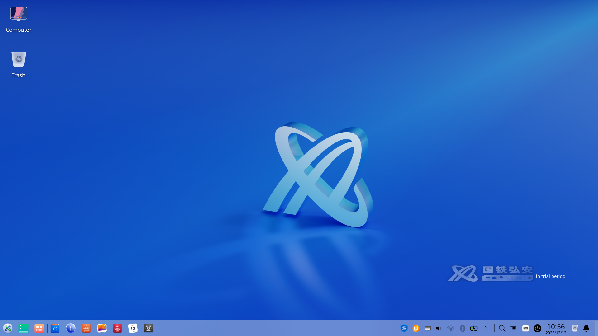

### System Introduction

Upon initial entry into the Uniontech OS , the Welcome program automatically opens. You can watch videos to learn about system features, choose desktop modes and icon themes, and further explore the system.

After successfully logging in, you can experience the UOS desktop environment. The desktop environment mainly consists of the desktop, taskbar, launcher, control center, and window manager, forming the foundation of your operating system experience.

## Desktop

The desktop is the main screen area seen after login. On the desktop, you can create new files/folders, arrange files, open terminals, set wallpapers and screensavers, and add application shortcuts to the desktop via [Send to Desktop](#create-shortcuts).

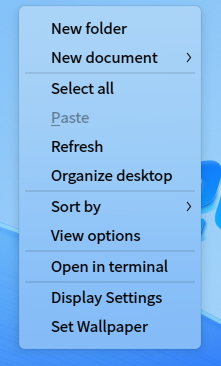

>  Note: On a touchpad, swipe down with four/five fingers to show the desktop; swipe up immediately after to hide it, corresponding to the **Super** + **D** shortcut.

### Create New Folder/Document

Create new folders or documents on the desktop, or perform routine file operations as you would in the file manager.

- On the desktop, right-click and select **New Folder**, then enter the folder name.
- On the desktop, right-click and select **New Document**, choose the document type, and enter the document name.

Right-click on a desktop file or folder to access the following functions:

| Function         | Description                                                             |
| ---------------- | ----------------------------------------------------------------------- |
| Open With        | Set the default opening method or choose other associated applications. |
| Compress/Extract | Compress files/folders or extract compressed files.                     |
| Cut              | Move files/folders.                                                     |
| Copy             | Copy files/folders.                                                     |
| Rename           | Rename files/folders.                                                   |
| Delete           | Delete files/folders.                                                   |
| Create Link      | Create a shortcut.                                                      |
| Tag Info         | Add tags for categorized file/folder management.                        |
| Properties       | View basic info, sharing methods, and permissions of files/folders.     |

>  Note:
> 
> - On touchscreen devices, press and hold for 1 second to open the right-click menu.
> - On touchpads, tap with two fingers to show the right-click menu.
> - Press **Alt** + **M** to open the right-click menu.

### Set Arrangement

Arrange desktop icons as needed.

1. Right-click on the desktop.
2. Click **Sort By**, then choose:
   - **Name**: Display files in alphabetical order.
   - **Modified Time**: Sort by most recent modification date.
   - **Created Time**: Sort by creation date.
   - **Size**: Sort by file size.
   - **Type**: Sort by file type.

>  Tip: Enable **Auto Arrange** to automatically arrange icons top-to-bottom, left-to-right. Deleted icons are replaced by subsequent ones.

### Adjust Icon Size

1. Right-click on the desktop.
2. Click **Icon Size**.
3. Select an appropriate icon size.

>  Tip: Use **Ctrl** + //mouse scroll to adjust icon size on the desktop and launcher.

### Set Display

Access display settings quickly via the desktop right-click menu to configure scaling, resolution, brightness, etc.

1. Right-click on the desktop.
2. Click **Display Settings** to enter the control center's display settings interface.

>  Note: For detailed display settings, refer to [Display Settings](#display-settings).

### Clipboard

The clipboard displays all text, images, and files copied/cut after login. Use it to quickly copy items. Content is cleared after logout/shutdown.

Drag images/files from clipboard to desktop to save; drag text to editable fields.

1. Press **Super** + **V** to open the clipboard.
2. Double-click an item to copy it instantly; the item moves to the top.
3. Paste at the target location.
4. Hover over an item and click **×** to delete it; click **Clear All** to empty the clipboard.

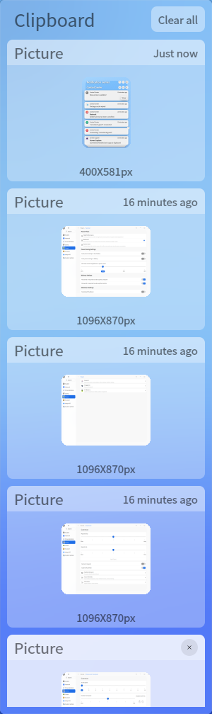

## Taskbar

The taskbar is typically a long bar at the bottom of the desktop, consisting of the launcher, app icons, system tray, and plugins. Use it to open apps, show desktop, switch workspaces, manage apps (open/close/force quit), configure input methods, adjust volume, connect networks, view calendars, and access shutdown options.

>  Note: Taskbar mode, position, and status can also be configured in **Control Center > Personalization > Taskbar**.

### Taskbar Icons

Icons include the launcher, app shortcuts, tray icons, and system plugins.

| Icon                                                                  | Description                                     | Icon                                                                | Description                                             |
| --------------------------------------------------------------------- | ----------------------------------------------- | ------------------------------------------------------------------- | ------------------------------------------------------- |
|                             | Launcher - Click to view installed apps.        |             | Global Search - Find content.                           |
|       | Multitasking View - Click to show workspaces.   |                  | File Manager - Browse files/folders.                    |
|                    | UOS AI Bar - AI entry point.                    |              | Browser - Open web pages.                               |
|                     | App Store - Search/install apps.                |                   | Control Center - System settings.                       |
|                         | Music - Play music.                             |                      | Text Editor - View/edit text files.                     |
|                          | Mail - Manage emails.                           |                    | Terminal - Terminal emulator.                           |
|                         | Calendar - View dates/schedules.                | 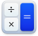                 | Calculator - Standard/scientific/programmer calculator. |
|                            | Notification Center - System/app notifications. |                                    | Onboard - Virtual keyboard.                             |
|  | Quick Settings Panel - Quick system settings.   |  | Shutdown - Access shutdown interface.                   |

### Switch Display Mode

Two modes: Classic (small icons) and Efficient (large icons with window activation effects).

To switch modes:

1. Right-click the taskbar.
2. Under **Mode**, select a display mode.

### Set Taskbar Position

Place the taskbar on any desktop edge.

1. Right-click the taskbar.
2. Under **Position**, choose a direction.

### Adjust Taskbar Height

Drag the taskbar edge to resize.

### Lock the Dock
After enabling “Lock the Dock”, the taskbar height will be locked to prevent accidental dragging from changing the taskbar size.
1. Right-click the taskbar.
2. Turn the **Lock the Dock** switch on or off.

### Show/Hide Taskbar

Hide the taskbar to maximize desktop space.

1. Right-click the taskbar.
2. Under **Status**, choose:
   - **Always Show**: Taskbar remains visible.
   - **Always Hide**: Taskbar hides; appears only when hovered.
   - **Smart Hide**: Hides automatically when overlapped.

>  Note: On touchscreens:
> 
> - Bottom taskbar: Swipe up from bottom edge to show.
> - Top taskbar: Swipe down from top edge.
> - Left taskbar: Swipe right from left edge.
> - Right taskbar: Swipe left from right edge.

### Show/Hide Plugins

1. Right-click the taskbar > **Taskbar Settings**.
2. In **Control Center > Personalization > Taskbar**, toggle plugins like **Recycle Bin**, **System Monitor**, **Shutdown**, **Show Desktop**, **Onboard**, **Notification Center**, **Time**, **Screenshot**, etc.

### View Notifications

System/app notifications appear at the top. Click buttons to act or click  to dismiss.  
Click  on the taskbar to open Notification Center.

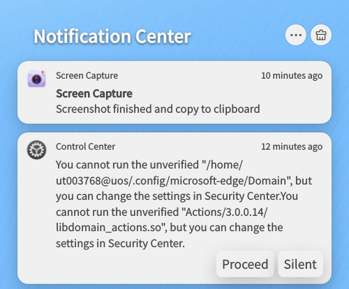

>  Note: On touchscreens, swipe from the right edge beyond taskbar height to open Notification Center.

### View Date/Time

- Hover over the taskbar time to see date/week/time.
- Click time to open the calendar plugin.

### Enter Shutdown Interface

Click  on the taskbar or launcher (mini mode) to access:

| Function       | Icon                                                          | Description                             |
| -------------- | ------------------------------------------------------------- | --------------------------------------- |
| Shutdown       |              | Turn off the computer.                  |
| Reboot         |                  | Restart the computer.                   |
| Suspend        |                | Low-power state.                        |
| Hibernate      |                      | Save to disk (requires swap partition). |
| Lock           |                      | Lock screen (**Super** + **L**).        |
| Switch User    |          | Log in as another user.                 |
| Log Out        |                  | Clear current user session.             |
| System Monitor |  | Launch System Monitor.                  |

>  Note: **Switch User** appears only if multiple accounts exist.

### Recycle Bin

Temporarily deleted files are stored here. Restore or empty them.

#### Restore Files

Restore deleted files or use **Ctrl** + **Z** to undo deletion.

1. Select files in Recycle Bin.
2. Right-click > **Restore**.
3. Files return to their original paths.

>  Warning: If the original folder is deleted, a new one will be created.

#### Delete Files

Permanently delete individual files from Recycle Bin:

1. Select files.
2. Right-click > **Delete**.

#### Empty Recycle Bin

Click **Empty** to permanently delete all content.

## Launcher

The Launcher  manages all installed apps. Use categories or search to find apps quickly.  
Newly installed apps show a blue dot indicator.

>  Note: On touchpads, tap with four fingers to show/hide the launcher (**Super** key).

### Switch Mode

Launcher has **Fullscreen** and **Mini Window** modes.Toggle via the top-right icon.  
Both support app search and shortcut creation. Mini mode also offers quick access to File Manager, Control Center, and Shutdown.

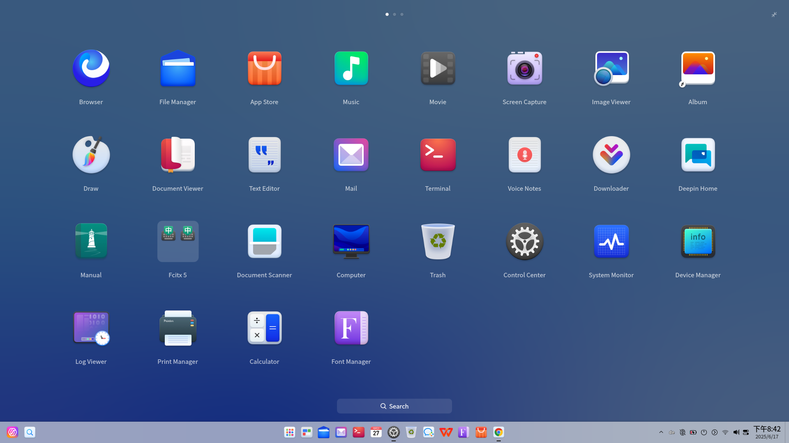

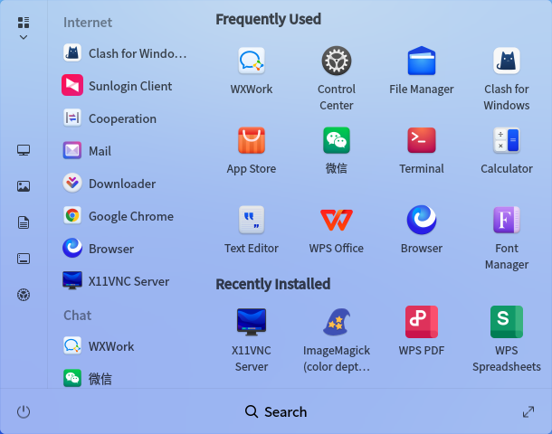

### Arrange Apps

In Mini mode, apps default to **Free Sort** (newest on top, sorted by frequency). Switch to:

- **By Category**: Group by app type.
- **By Name**: Alphabetical order.

### Find Apps

Scroll or use categories to browse. Type app name/initials in the search box.

### Set Shortcuts

Quickly launch apps from the desktop/taskbar.

#### Create Shortcuts

Send apps to desktop/taskbar.

1. In Launcher, right-click an app icon:
   - **Send to Desktop**: Creates a desktop shortcut.
   - **Send to Taskbar**: Pins to taskbar.

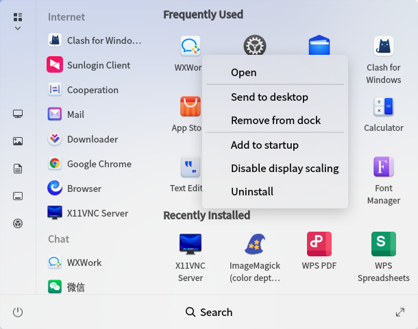

>  Note: Drag app icons from Launcher to taskbar. If app is running, right-click taskbar icon > **Pin to Taskbar**.

#### Delete Shortcuts

Remove from desktop/taskbar/Launcher.

**From Taskbar**:

- Drag the icon off the taskbar.
- Right-click taskbar icon > **Unpin**.

**From Launcher**:
Right-click app icon:

- **Remove from Desktop**: Deletes desktop shortcut.
- **Remove from Taskbar**: Unpins from taskbar.

> Note: This removes shortcuts only, not the app.

### Install Apps

Use App Store to download/install missing apps.

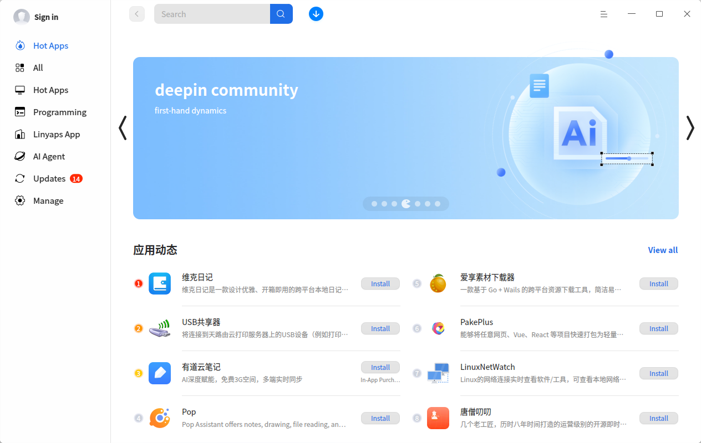

### Run Apps

Open apps via:

- Double-click desktop icons or right-click > **Open**.
- Click taskbar icons or right-click > **Open**.
- Click launcher icons or right-click > **Open**.

>  Tip: For frequently used apps, right-click in launcher > **Add to startup** to run it when the computer boots.

### Uninstall Apps

Remove unused apps to save space.

1. In Launcher, right-click the app icon.
2. Click **Uninstall**.

>  Note: Some system apps cannot be uninstalled.

## Control Center

 UOS uses the Control Center for system settings: accounts, network, time, personalization, display, updates, etc. Click  on the taskbar to open it.

### Homepage

The homepage displays settings modules for quick access.

Switch modules via the left sidebar.

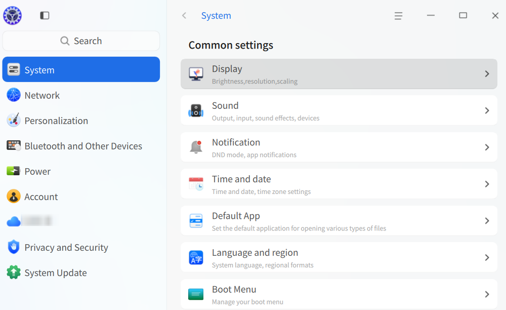

#### Title Bar

Includes back button, search box, main menu, and window controls.

- : Return to previous level.
- Breadcrumb navigation: Navigate page hierarchy.
- Search box: Enter keywords to find settings.
- Main menu: Set window theme, view version, or exit.

### System

#### Display

Adjust brightness, resolution, orientation, and scaling for optimal viewing.

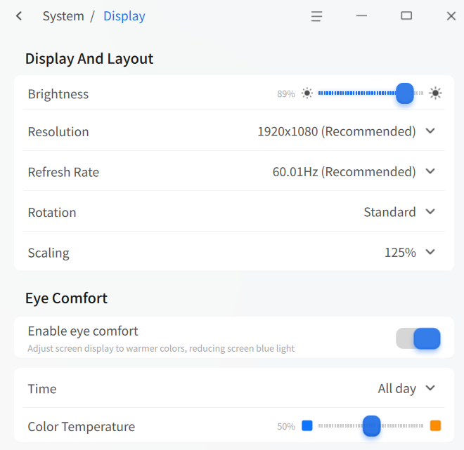

##### Single Display Settings

Adjust brightness, resolution, refresh rate, and orientation.

**Adjust Brightness**

*Available if hardware supports.*

1. Go to **Control Center > System > Display**.
2. Drag the brightness slider.

**Set Screen Scaling**

Resize oversized/undersized displays.

1. Go to **Control Center > System > Display**.
2. Select a scaling factor from the dropdown.
3. Log out/in to apply.

>  Note:
> 
> - High-DPI screens auto-adjust scaling.
> - For apps incompatible with scaling, right-click in launcher > **Disable Scaling**.

**Change Resolution**

1. Go to **Control Center > System > Display**.
2. Select a resolution from the dropdown.
3. Click **Save**.

**Set Desktop Display**

*Available at non-recommended resolutions.*

1. Go to **Control Center > System > Display**.
2. Choose a display effect under **Desktop Display**.

**Set Refresh Rate**

1. Go to **Control Center > System > Display**.
2. Select a refresh rate.
3. Click **Save**.

**Change Orientation**

1. Go to **Control Center > System > Display**.
2. Select an orientation.
3. Click **Save**.

**Set Eye Comfort Mode**

*Available if hardware supports.*

1. Go to **Control Center > System > Display**.
2. Under **Eye Comfort**:
   - Toggle **Eye Comfort Mode** on.
   - Set schedule: **All Day**, **Sunset to Sunrise**, or **Custom**.
   - Adjust color temperature slider.

##### Multi-Display Settings

Extend your workspace using VGA/HDMI/DP cables.
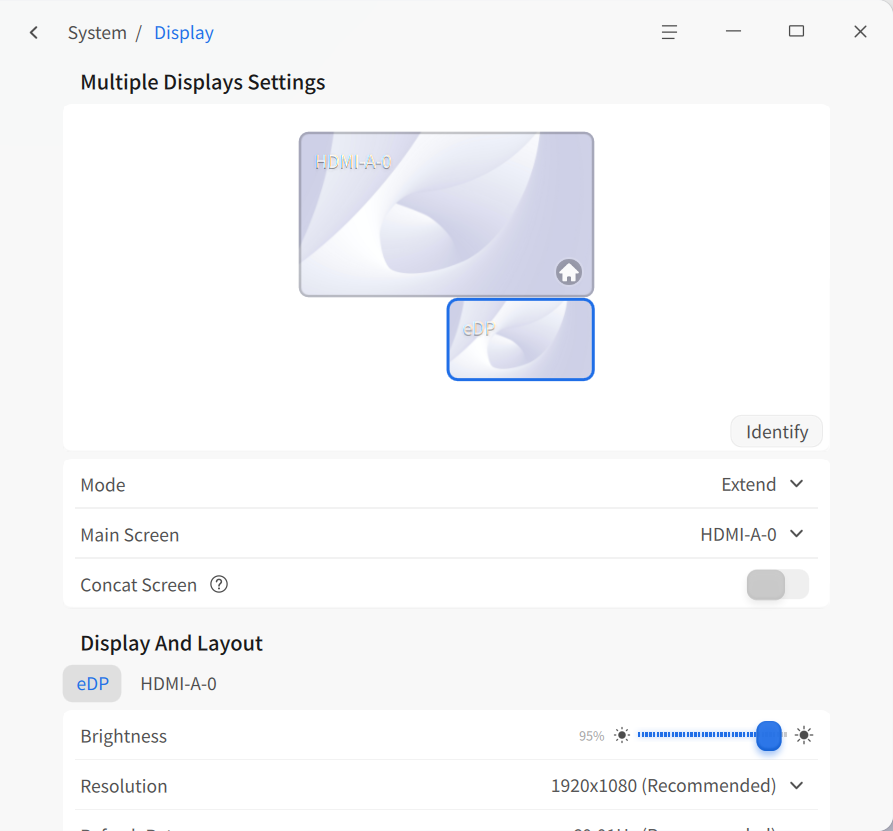

1. Go to **Control Center > System > Display**.
2. Under **Multi-Screen Display**, choose:
   - **Duplicate**: Mirror primary screen.
   - **Extend**: Expand desktop across screens.
   - **Only on [Screen]**: Display only on selected screen.

Click **Identify** to show screen names. In extended mode, settings windows group on each screen.

>  Note: In **Extend** mode, set taskbar behavior in **Personalization** > **Taskbar** > **Multi-Screen Display** (**Show on Primary Only** or **Follow Mouse Position**).

Press **Super** + **P** to toggle multi-display OSD:

1. Hold **Super**, press **P** or click a mode.
2. Release to confirm.

>  Note: Secondary screens support desktop icons and right-click menus.

Brightness, scaling, resolution, etc., settings match single-display setup. See [Single Display Settings](#single-display-settings).

#### Sound

Optimize input/output devices (speakers, microphones).

##### Output Settings

1. Go to **Control Center > System > Sound**.
2. Under **Output**:
   - Adjust volume/balance.
   - Enable **Volume Boost** (0-150% range).
   - Enable **Mono Audio** (merge channels).
   - Enable **Auto Pause on Unplug**.
   - Select output device.

##### Input Settings

1. Go to **Control Center > System > Sound**.
2. Under **Input**:
   - Adjust input volume.
   - Enable **Noise Suppression**.
   - Select input device.

>  Tip: Test microphone at normal volume; avoid distor.

##### System Sounds

1. Go to **Control Center > System > Sound**.
2. Click **System Sounds**.
3. Toggle event sounds (e.g., login, logout).

>  Tip: You can click the play button to preview sounds.

##### Device Management

1. Go to **Control Center > System > Sound**.
2. Click **Device Management**.
3. Enable/disable input/output devices.

#### Notification

Configure "Do Not Disturb" mode and app-specific notifications.

##### System Notifications

1. Go to **Control Center > System > Notifications**.
2. Toggle **Do Not Disturb** on/off.
   - Set start/end times.
   - Enable **Show Notifications on Lock Screen**.

##### App Notifications

Customize per-app alerts.

1. Go to **Control Center > System > App Notifications**.
2. Select an app and configure:
   - Play sound on notification.
   - Show in Notification Center/desktop.
   - Show message preview.

#### Time & Date

Set time zoshijine, sync automatically, or configure manually.

##### Modify Time/Date

1. Go to **Control Center > System > Time & Date**.
2. Toggle **Auto Sync** off.
3. Manually set time/date.
4. Click **OK**.

>  Note: Re-enable **Auto Sync** to use NTP servers.

##### Change Time Zone

1. Go to **Control Center > System > Time & Date**.
2. Click **Change System Time Zone**.
3. Select a time zone.

##### Add Time Zone

View multiple time zones.

1. Go to **Control Center > System > Time & Date**.
2. Under **Time Zone List**, click **Add**.
3. Search/select a time zone > **Add**.

##### Delete Time Zone

1. Go to **Control Center > System > Time & Date**.
2. Under **Time Zone List**, click **Edit**.
3. Click **Delete**.

#### Language & Region

Add/switch system languages and regional formats.

##### Add System Language

1. Go to **Control Center > System > Language & Region**.
2. Click **Add** > select language.

##### Set System Language

1. Select a language; system installs language pack.
2. Log out/in to apply.

>  Warning: Keyboard layout may change; ensure correct layout at login.

##### Region

1. Go to **Control Center > System > Language & Region**.
2. Under **Region**:
   - **Area**: Affects input methods, keyboard layouts, and formats.
   - **Region & Format**: Sets date, currency, number formats.
   - **Current Format**: Customize taskbar time/date display.

#### Default Programs

Set default apps for file types when multiple options exist.

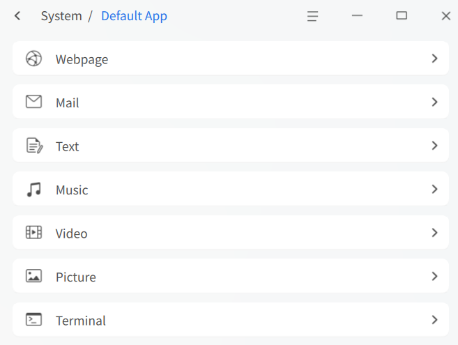

##### Set Default Program

1. Right-click file > **Open With** > **Select Default Program**.
2. Choose an app, check **Set as Default**, click **OK**.
   - *App auto-added to Control Center list.*

##### Change Default Program

1. Go to **Control Center > System > Default Programs**.
2. Select a file type.
3. Choose another app.

##### Add Default Program

1. Go to **Control Center > System > Default Programs**.
2. Select a file type.
3. Click **Add** > choose a `.desktop` file (e.g., `/usr/share/applications`) or binary.
4. Check the app to set as default.

##### Delete Default Program

Only user-added apps can be deleted. System apps require uninstallation.

1. Go to **Control Center > System > Default Programs**.
2. Select a file type.
3. Click  next to the app.

#### Boot Menu

Manage boot options and theme.

##### Set Boot Menu

Menu for selecting OS at startup.

>  Note: ARM systems support only GRUB verification; MIPS systems lack GRUB/background support.

**Set Default Boot Entry**

1. Go to **Control Center > System > Boot Menu**.
2. Select an entry > enter password to set as default.

**Set Boot Delay**

- **On**: 5-second wait.
- **Off**: 1-second wait.

**Theme**

1. Go to **Control Center > System > Boot Menu**.
2. Toggle **Theme** on to enable themed boot screen.
>  Tip: Drag image to preview to change background.

##### Boot Animation

1. Go to **Control Center > System > Boot Menu**.
2. Set **Boot Logo Size** (Large/Small).

#### Developer Options

Enable developer mode for root access and unsigned apps.

##### Developer Mode

Grants `sudo` privileges. Void warranty; use cautiously.

1. Go to **Control Center > System > Developer Options**.
2. Click **Enter Developer Mode**:
   - **Online**: Log in with UOS ID > accept disclaimer > authenticate > reboot.
   - **Offline**: Download/import certificate > authenticate > reboot.

>  Warning: Irreversible; all accounts gain root access.

##### Debug Options

1. Go to **Control Center > System > Developer Options**.
2. Under **Debug Options**, set **System Log Level** to **Debug** for verbose logs (default: Off).

#### Domain Management

Join a domain network.

1. Go to **Control Center > System > Domain Management**.
2. Toggle **Domain Management** on.
3. Set **Domain Address** and **Port**.
4. Click **OK**.

>  Note: Supported on AMD/ARM systems.

#### Backup & Restore

Back up/restore app or system data against data loss.

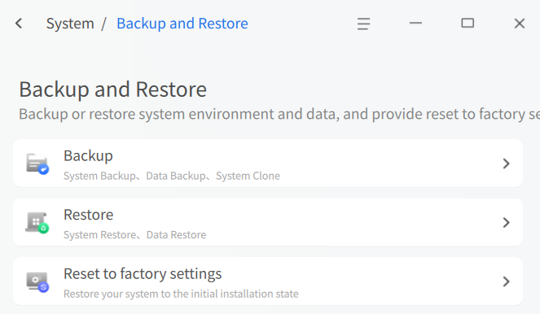

#### About This PC

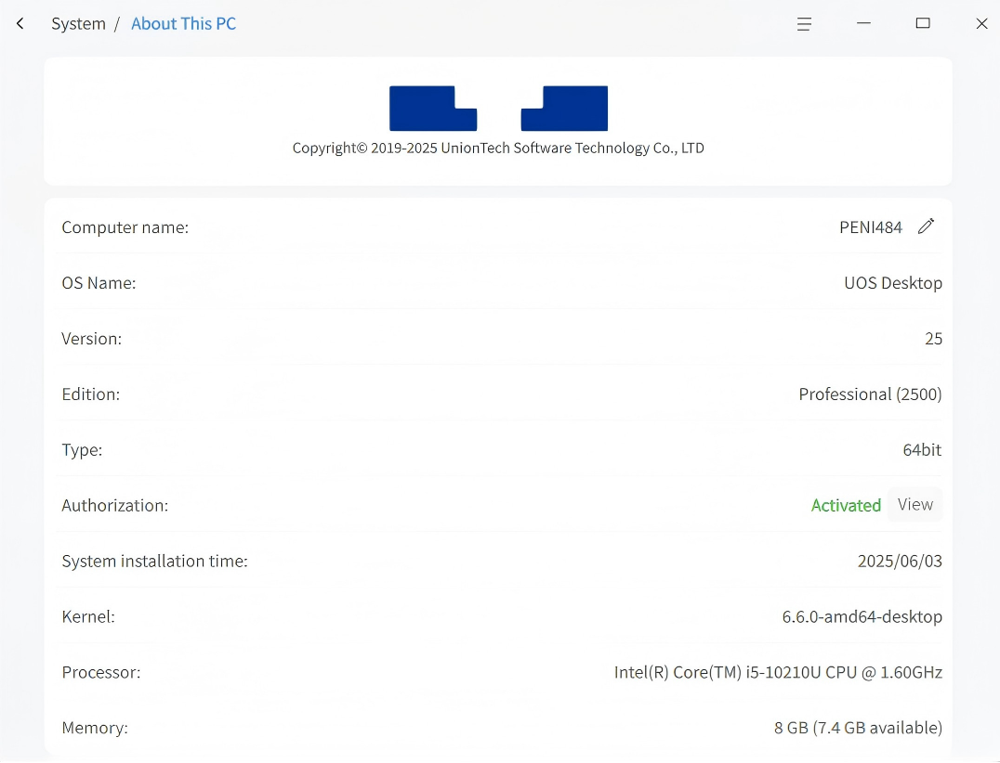

1. Go to **Control Center > System > About This PC**.
2. Click  to rename computer.
3. View OS version, license, installation date, and hardware.

##### License Activation

1. Click **Activate**.
2. Choose method:
   - **Trial Activation**: Click **Activate Now** > **OK**.
   - **Enter Serial**: Input serial > **Activate Now**.
   - **Import License File**: Select `.key` file > **Activate Now**.
3. **Offline Activation** (if no internet):
   - Scan QR code with phone.
   - Enter offline code from phone.
4. After activation:
   - View license details under **View**.
   - **Change Serial**: Only for OPEN licenses.
5. **Activation Failure**: Invalid file/serial.
6. **Server Settings**: Customize activation server via  > **Settings**.

#### Open Source Software Notice

View open-source licenses.

#### User Experience Program

Help improve UOS  by sharing usage data.

1. Go to **Control Center > System > User Experience Program**.
2. Toggle it on > check **Agree and Join** > **OK**.

#### EULA

View End User License Agreement.

#### Privacy Policy

View privacy policy.

### Network Settings

Connect to networks for email, browsing, downloads, etc.

>  Tip: Use the taskbar quick panel to view/set network status.

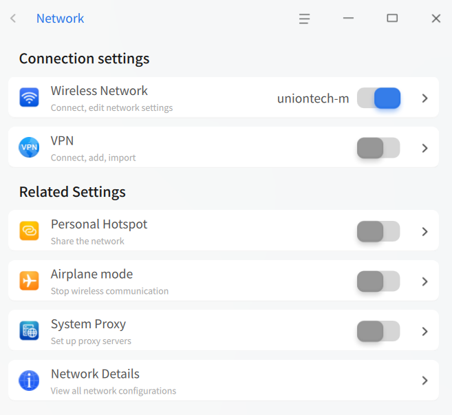

#### Wired Network

Stable wired connections via router.

1. Plug Ethernet cable into computer and router.
2. Go to **Control Center > Network > Wired Network**.
3. Toggle **Wired Network** on.
4. Connection success triggers desktop notification.

Edit or create new wired connections in settings.

#### Wireless Network

Flexible wireless connectivity.

##### Connect to Wireless

1. Go to **Control Center > Network > Wireless Network**.
2. Toggle **Wireless Network** on.
3. Select a network.
   - Open networks connect automatically.
   - Encrypted networks: Enter password > **Connect**.

##### Connect to Hidden Network

Manually add hidden networks.

1. Go to **Control Center > Network > Wireless Network**.
2. Click **Connect to Hidden Network**.
3. Enter SSID and required details.
4. Click **Save**.

#### Personal Hotspot

Share your computer's internet via Wi-Fi.

1. Go to **Control Center > Network > Personal Hotspot**.
2. Toggle **Hotspot** on.
3. Set hotspot name and password.
4. Click **Save**.

#### Airplane Mode

Disable Wi-Fi, hotspot, and Bluetooth.

1. Go to **Control Center > Network > Airplane Mode**.
2. Toggle it on/off.

>  Warning: Hidden if no wireless/Bluetooth hardware.

#### DSL (Dial-Up)

Connect via modem using ISP credentials.

1. Go to **Control Center > Network > DSL**.
2. Click **Create PPPoE Connection**.
3. Enter ISP name, username, password.
4. Click **Save**; auto-connects.

#### VPN

Secure encrypted connections for remote access.

1. Go to **Control Center > Network > VPN**.
2. Click **Add VPN** or **Import VPN**.
3. Select protocol, enter details (auto-filled if imported).
4. Click **Save**; auto-connects.
5. Export VPN settings for backup/sharing.

>  Note: Enable **Only for resources on this network** to avoid setting VPN as default route.

#### System Proxy

1. Go to **Control Center > Network > System Proxy**.
2. Toggle **System Proxy** on.
3. Choose **Manual** (enter server/port) or **Auto** (enter configuration URL).
4. Click **Save**.

#### Network Details

View MAC/IP/gateway info.

1. Go to **Control Center > Network > Network Details**.
2. Check wired/wireless network information.

### Personalization

Customize system theme, accent color, fonts, window effects, opacity, icons, cursors, and more.

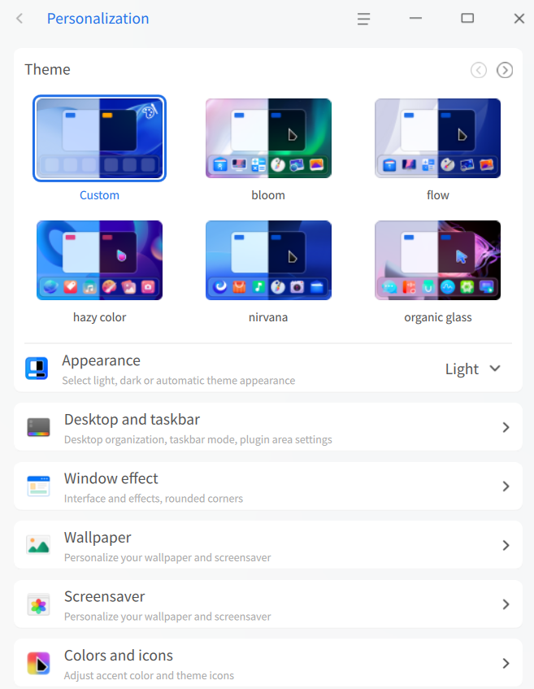

#### Set Window Theme

1. Go to **Control Center > Personalization**.
2. Click **Theme**, select a system theme.

#### Appearance

Set light/dark/auto mode.

1. Go to **Control Center > Personalization**.
2. Under **Appearance**, choose **Light**, **Dark**, or **Auto** (switches at sunset/sunrise).

#### Desktop & Taskbar

Configure taskbar mode, position, status, and plugins.

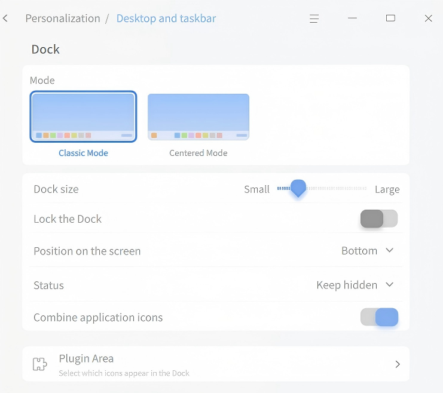

1. Go to **Control Center > Personalization > Desktop & Taskbar**.
2. Adjust:
   - **Mode**: Classic/Centered.
   - **Size**: Drag slider.
   - **Lock the Dock**：lock the taskbar height and prevent accidental dragging from changing the taskbar size.
   - **Position**: Top/Bottom/Left/Right.
   - **Status**: Always Show/Always Hide/Smart Hide.
   - **Combine app icons**：set whether multiple windows of the same app are combined into a single taskbar icon.
   - **Plugins**: Toggle visibility.

In multi-screen **Extend** mode, choose taskbar display: **Follow Mouse** or **Primary Screen Only**.

#### Window Effects

Hardware-dependent visual enhancements.

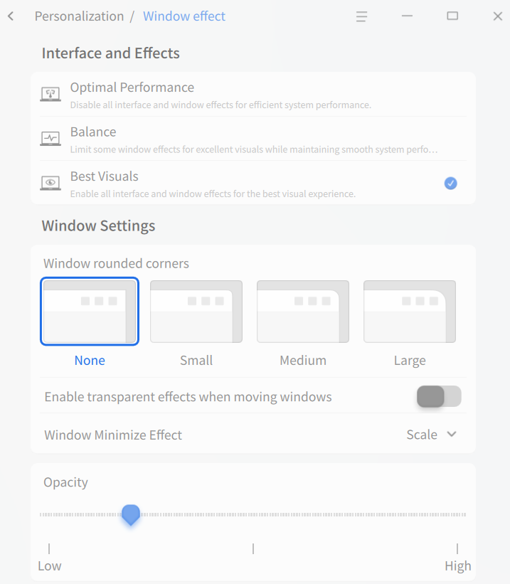

1. Go to **Control Center > Personalization > Window Effects**.
2. Configure:
   - **Interface Effect**: Best Performance (no effects), Balanced (limited effects), Best Visuals (all effects).
   - **Window Corner Radius**: None/Small/Medium/Large.
   - **Transparency When Moving**: Toggle on/off.
   - **Minimize Effect**: Scale or Magic Lamp.
   - **Opacity**: Adjust for taskbar/launcher (mini mode).
   - **Scrollbar**: Show When Scrolling or Always Show.
   - **Titlebar Height**: Drag slider.

>  Note: Titlebar height applies only to window-manager-drawn titlebars.

#### Wallpaper

Personalize your desktop.

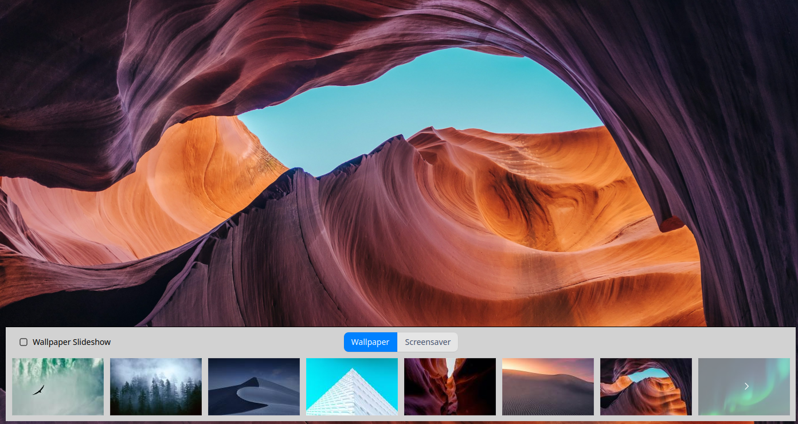

1. Right-click desktop > **Set Wallpaper**.
2. Choose from **My Pictures**, **System Wallpapers**, or **Solid Colors**.
3. Click a wallpaper to apply.
4. Right-click wallpaper > **Set as Lock Screen**.

>  Tip:
> - Set auto-rotate interval under **Auto Switch Wallpaper**.
> - Use Image Viewer or App Store to set/download wallpapers.

#### Screensaver

Protect privacy during inactivity.

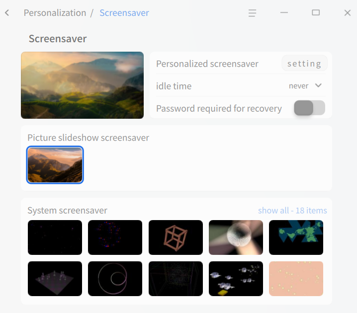

1. Go to **Control Center > Personalization > Screensaver**.
2. Choose **Picture Slideshow** or **System Screensavers**.
3. Set idle time to activate.
4. For slideshow: Click **Settings** to set path/interval/random order.
5. Enable **Require Password on Wake** for security.

#### Colors & Icons

1. Go to **Control Center > Personalization > Colors & Icons**.
2. Configure:
   - **Accent Color**: Highlight color for selections.
   - **Icon Theme**: System or custom themes.
   - **Cursor Theme**: Select cursor style.

#### Fonts & Sizes

1. Go to **Control Center > Personalization > Fonts & Sizes**.
2. Set system font and size.

### Bluetooth and Devices

#### Bluetooth

Wirelessly connect keyboards, mice, headphones, speakers.

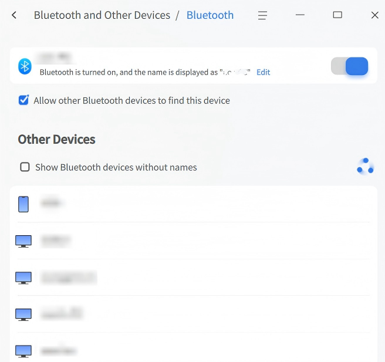

>  Note: Laptops have built-in Bluetooth; desktops require a USB adapter.

##### Rename Bluetooth Device

1. Go to **Control Center > Bluetooth and Devices > Bluetooth**.
2. Click **Edit** next to device name, enter new name.

>  Note: Renaming requires re-pairing on other devices.

##### Connect Bluetooth Device

1. Go to **Control Center > Bluetooth and Devices > Bluetooth**.
2. Toggle **Bluetooth** on; scans nearby devices.
3. Click a device; enter PIN if required.
4. Connected devices appear under **My Devices**.
5. Click a device to **Disconnect** or rename.

##### Send/Receive Files via Bluetooth

*Requires paired devices.*

**From UOS PC**:

1. Go to **Control Center > Bluetooth and Devices > Bluetooth**.
2. Select a paired device > **More** > **Send File**.
3. Choose file > **Open** > **Send**.

**From Mobile (Android)**:

1. Enable Bluetooth.
2. Select paired UOS device.
3. Choose file > **Send** > Bluetooth.

**Receive Files**:

1. Accept/decline incoming transfers.
2. Files save to `~/Downloads` on accept.
3. Transfers fail if receiver declines, times out, or disconnects.Failed transfers show in a list.

#### Mouse and Touchpad

Customize input devices for better ergonomics.

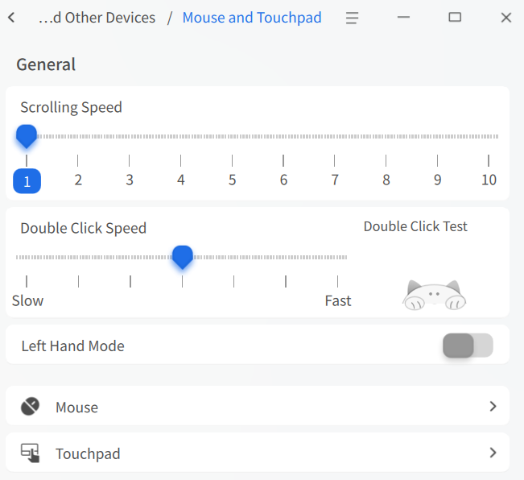

##### General Settings

1. Go to **Control Center > Bluetooth and Devices > Mouse and Touchpad**.
2. Under **General**:
   - Adjust **Scrolling Speed**.
   - Adjust **Double-Click Speed**.
   - Toggle **Left-Handed Mode** (swaps left/right buttons).

>  Note: Left-handed mode swaps mouse/touchpad buttons.

##### Mouse Settings

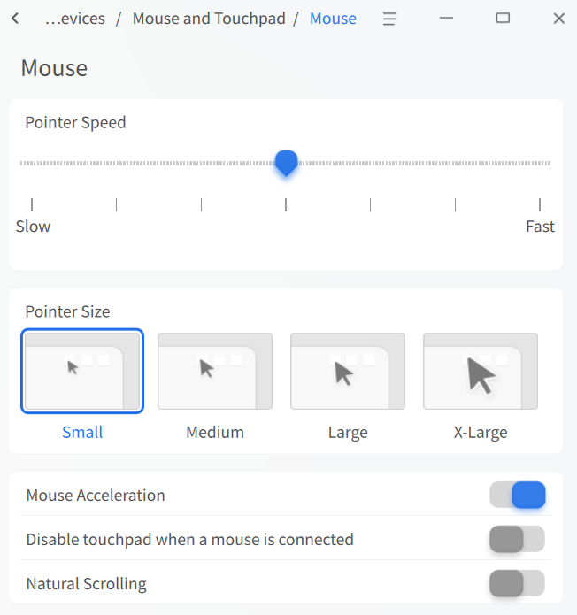

1. Go to **Control Center > Bluetooth and Devices > Mouse and Touchpad > Mouse**.
2. Adjust **Pointer Speed**.
3. In **Pointer Size** section, click to select Small / Medium / Large to adjust the cursor size.
4. Toggle **Mouse Acceleration** (improves precision at high speeds).
5. Enable **Disable Touchpad When Mouse Connected** (if available).
6. Toggle **Natural Scrolling** (reverse scroll direction).

##### Touchpad Settings

Configure pointer speed, natural scrolling, and "Disable When Typing" (laptops).

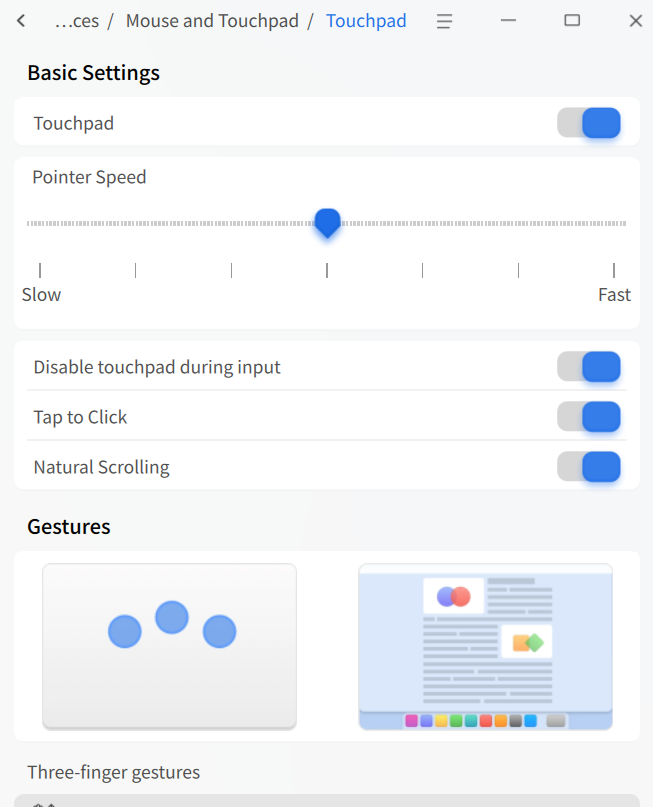

**Gesture Settings**

Assign actions to touchpad gestures.

**Three-Finger Gestures**:

- Swipe Up: Maximize window (or set to restore/left split/right split/disable).
- Swipe Down: Restore window (or set to maximize/left split/right split/disable).
- Swipe Left: Left split window (or set to restore/maximize/right split/disable).
- Swipe Right: Right split window (or set to restore/maximize/left split/disable).
- Tap: Show/hide Global Search (or set to show/hide Launcher/clipboard/notifications/disable).

**Four-Finger Gestures**:

- Swipe Up: Show Multitasking View (or hide/previous desktop/next desktop/show desktop/hide desktop/disable).
- Swipe Down: Hide Multitasking View (or show/previous desktop/next desktop/show desktop/hide desktop/disable).
- Swipe Left: Switch to previous desktop (or show/hide multitasking/next desktop/show desktop/hide desktop/disable).
- Swipe Right: Switch to next desktop (or show/hide multitasking/previous desktop/show desktop/hide desktop/disable).
- Tap: Show/hide Launcher (or global search/clipboard/notifications/disable).

#### Keyboard

Configure keyboard properties, input methods, and shortcuts.

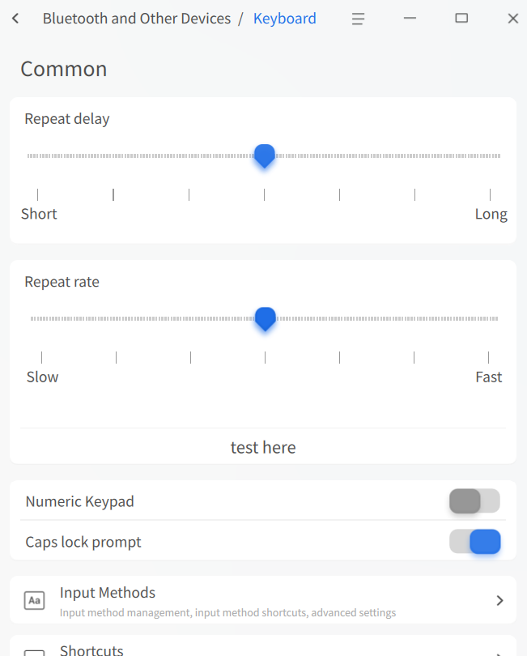

##### Keyboard Properties

1. Go to **Control Center > Bluetooth and Devices > Keyboard**.
2. Under **General**:
   - **Repeat Delay/Repeat Rate**: Drag sliders.
   - Test in input box.
   - Toggle **Enable Numeric Keypad**/**Caps Lock Prompt**.

##### Input Methods

Manage input methods and switching shortcuts.

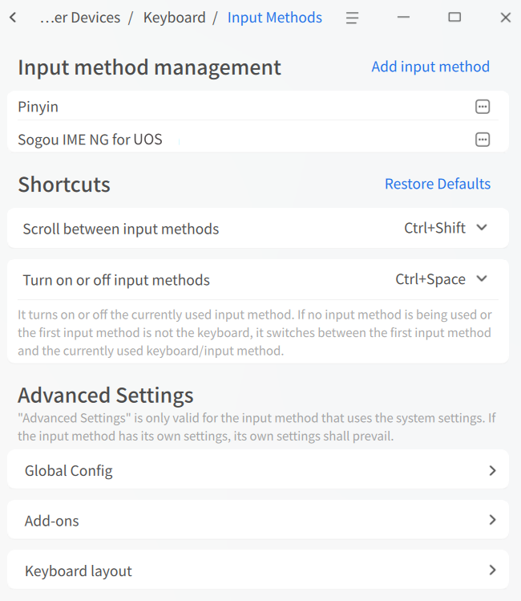

**Add Input Method**

1. Go to **Control Center > Bluetooth and Devices > Keyboard > Input Methods**.
2. Click **Add Input Method**:
   - **Find more in app store**: Download from App Store (auto-sets as default).
   - Choose from list.

>  Note: Removed input methods can be re-added.

**Reorder Input Methods**

Drag input methods up/down in the list.

**Configure Input Method**

Click **Settings**  next to an input method.

**Set Switching Shortcut**

Under **Shortcuts**, choose a key combo from the dropdown.

>  Note: More shortcuts in **Advanced Settings**.

**Advanced Settings**

Go to **Advanced Settings** for global input method configurations.

**Keyboard Layout**

Add/remove layouts for character mapping.

**Add Layout**

1. Go to **Control Center > Bluetooth and Devices > Keyboard > Keyboard Layout**.
2. Click **Add New Keyboard Layout** > select layout.

**Delete Layout**

1. Go to **Control Center > Bluetooth and Devices > Keyboard > Keyboard Layout**.
2. Click **Edit**.
3. Click **Delete**  for a layout.

##### Shortcuts

View/modify/customize system, window, and workspace shortcuts.

**View Shortcuts**

Browse or search default shortcuts.

**Modify Shortcut**

1. Click a shortcut.
2. Press new keys.
3. Use **Backspace** to disable or **Esc** to cancel.
4. Click **Restore Default** to reset.

**Custom Shortcut**

1. Click **Add Custom Shortcut**.
2. Enter name, command, and shortcut keys.
3. Click **Add**.
4. Edit/delete via **Edit** mode.

#### Touchscreen Settings

Configure connected touchscreens.

1. Go to **Control Center > Bluetooth and Devices > Touchscreen**.
2. Adjust settings and click **OK**.

#### Graphics Tablet

Configure pressure sensitivity for drawing tablets (requires hardware).

>  Note: Module appears only when connected.

1. Go to **Control Center > Bluetooth and Devices > Graphics Tablet**.
2. Select **Pen** mode.
3. Adjust **Pressure Sensitivity**.

### Power

Optimize battery usage and system security.

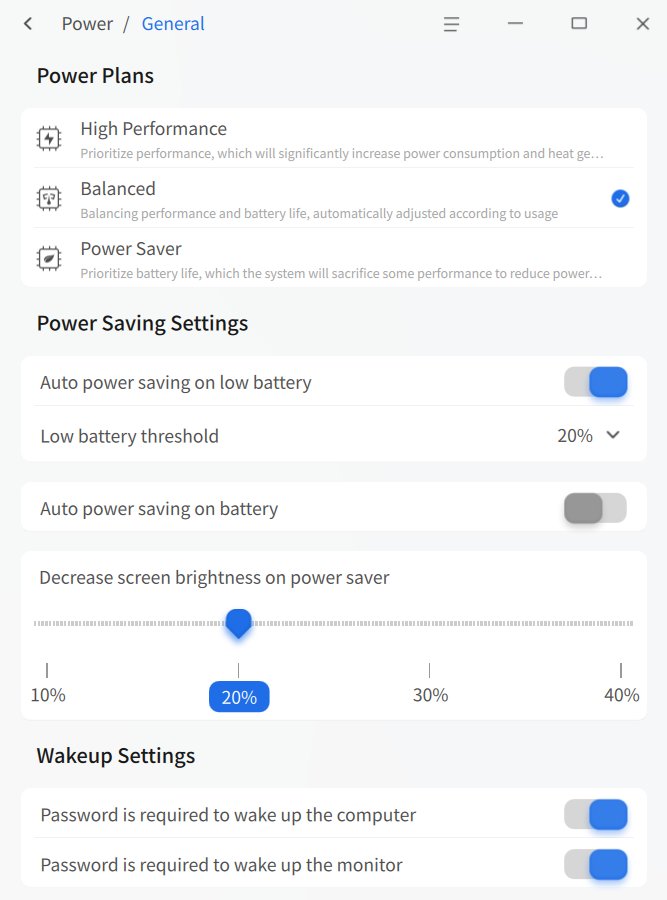

#### Adjust Performance Mode

1. Go to **Control Center > Power > General**.
2. Choose **Balanced**, **High Performance**, or **Power Saver**.

#### Power Saving Settings

1. Go to **Control Center > Power > General**.
2. Configure:
   - **Auto Power Saving on Low Battery** (laptops only).
   - Set **Low Battery Threshold**.
   - **Auto Power Saving on Battery** (laptops only).
   - Adjust **Auto Dim Brightness**.

#### Wake Settings

1. Go to **Control Center > Power > General**.
2. Under **Wake Settings**:
   - **Require password on suspend wake**.
   - **Require password on display wake**.

#### Shutdown Settings

1. Go to **Control Center > Power > General**.
2. Under **Shutdown Settings**:
   - Set **Scheduled Shutdown** time.
   - Choose frequency: Once, Weekdays, Daily, or Custom.

#### Set Monitor Off Time

1. Go to **Control Center > Power > Plugged In** or **On Battery**.
2. Set **Turn Off the Monitor After**.

>  Note: Laptops can set different times for AC/battery.

#### Set Suspend Time

1. Go to **Control Center > Power > Plugged In** or **On Battery**.
2. Set **Suspend After**.

>  Tip: Enable **Suspend When Lid Closed** for laptops.

#### Set Auto Lock Time

1. Go to **Control Center > Power > Plugged In** or **On Battery**.
2. Set **Lock Screen After**.

#### Set Lid Close Action

1. Go to **Control Center > Power > Plugged In** or **On Battery**.
2. Set **When Lid is Closed** to **Suspend**, **Hibernate**, **Turn Off the Monitor**, or **Do Nothing**.

>  Note: Laptops only.

#### Set Power Button Action

1. Go to **Control Center > Power > Plugged In** or **On Battery**.
2. Set **When Power Button Pressed** to **Shut Down**, **Suspend**, **Hibernate**, **Turn Off the Monitor**, **Show the Shutdown Interface**, or **Do Nothing**.

#### Low Battery Management

1. Go to **Control Center > Power > On Battery**.
2. Under **Low Battery Management**:
   - Enable **Low Battery Notification** (notifies below threshold).
   - Set auto-suspend/hibernate on low battery.
   - Adjust low battery threshold.

>  Note: Laptops only.

#### Battery Management

1. Go to **Control Center > Power > On Battery**.
2. Under **Battery Management**:
   - Toggle **Display Remaining Usage/Charging Time** on taskbar.
   - View maximum battery capacity.

### Accounts

Manage accounts created during installation.

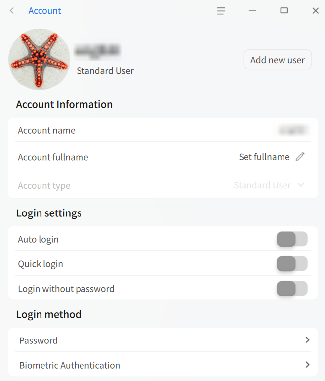

#### Create New Account

1. Click **Add User**.
2. Choose account type (Standard/Administrator), set username, full name, password, hint.
3. Click **Create**.
4. Enter current account password to authorize.

>  Tip: Standard users can be promoted to administrators.

#### Change Avatar

Hover over avatar > **Edit** > choose image or add local file.

#### Set Full Name

Displayed in account list and login screen.
Click  next to **Full Name** to edit.

#### Auto Login

Bypass login screen on startup (requires password after lock/logout).
Toggle **Auto Login** on > enter current password.

#### Password-Free Login

No password needed for login/unlock.
Toggle **Password-Free Login** on > enter current password.

>  Tip: If both **Auto Login** and **Password-Free Login** are on, system boots directly to desktop.

#### Login Methods

**Password - Change Password**

1. Go to **Password**.
2. Enter current/new password > **Save**.

>  Note: Expired admin passwords must be changed before authorization.

**Password - Password Expiry**

1. Go to **Password**.
2. Set validity: **Never Expires** or specific days (counted from last change).

**Biometric Authentication**
Use fingerprints/face recognition for login/unlock/authorization (requires supported hardware).

**Set Fingerprint**

1. Go to **Biometric Authentication > Fingerprint**.
2. Click **Add Fingerprint**.
3. Enter password > scan fingerprint > **Done**.

>  Note: Add/delete multiple fingerprints.

**Set Face Recognition**

1. Go to **Biometric Authentication > Face Recognition**.
2. Check **I have read and agree to the Disclaimer** > **Next**.
3. Click **Agree and Start Recording** > scan face > **Done**.

>  Note: Up to 5 faces per account.

#### Delete Account

1. Select a non-logged-in account.
2. Click **Delete Account** > **Delete**.

>  Warning: Logged-in accounts cannot be deleted.

### UOS ID

Register/login to UOS ID for cloud sync, App Store, browser services, and password reset.

>  Tip: Bound UOS ID can reset local account passwords.

#### Cloud Sync

Sync system settings (sound, power, mouse, updates, screensaver, etc.) across devices.

1. Go to **Control Center > UOS ID**.
2. Toggle **Auto Sync Settings** on.
3. Select items to sync.

>  Note:
> 
> 1. Requires activated system (trial or licensed).
> 2. Sync stops if toggled off.

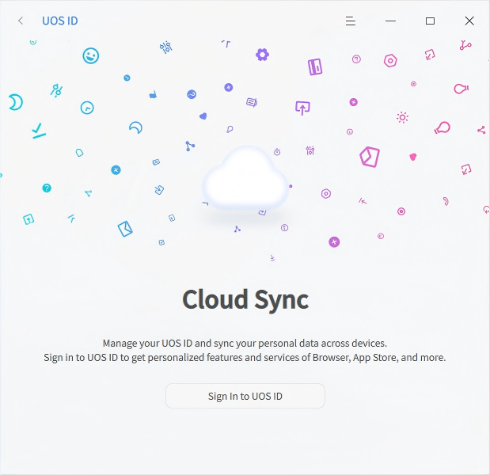

### Privacy and Security

- In the **Privacy and Security** interface, you can set permissions for applications to access the camera, files, and folders. By default, all applications can access the camera, files, and folders; For the Files and Folders modules, the system currently supports permission control for the "Pictures"  and "Documents" folders.
- When the permission is enabled, the application can access relevant permissions normally; when the permission is turned off, the application  will not be able to access the relevant permissions, and the system will prompt you to go to the Control Center - Privacy and Security modules to entable the permissions, or ignore it.

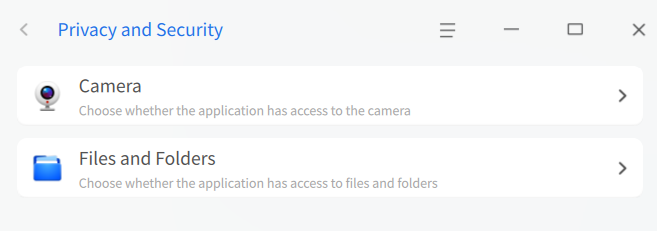

#### Camera

- Supports managing the access permission of a single application to the camera, click to close the permission, or click to reopen the permission.

#### Files and Folders

- Supports managing the access permissions of a single application to the "Pictures"  and "Documents" folders separately , click to close the permission, or click to reopen the permission.

### System Updates

Receive and install system/security updates.

>  Tip: Disable **Update Reminder** in settings to avoid prompts.

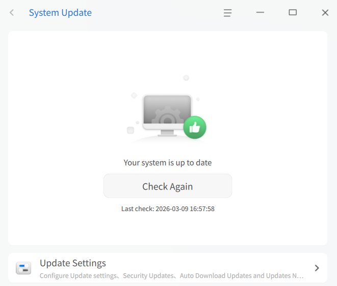

#### Update & Upgrade

1. Go to **Control Center > System Updates**.
2. Click **Check for Updates**:
   - "System is up to date" if none.
   - If updates exist: **Download** selected items > **Install** after download.
3. Choose:
   - **Update in Background**: Install without interrupting use.
   - **Update & Shutdown/Reboot**: Modal installation (system unusable during).

#### Update Content

View changelogs after checking for updates.

#### Update Settings

##### Update Types

Choose **Feature Updates**, **Security Updates**, and **Third-Party Repositories**.

##### Advanced

- **Download Speed Limit**: Set max speed (default: 10240 KB/s).
- **Auto Download**: Schedule download times.
- **Update Reminder**: Toggle notifications.
- **Clear Package Cache**: Auto-remove downloaded packages.

#### View Update History

Click **View Update History** to see installed version logs.

## Window Manager

Window Manager can display different window contents in different workspaces. With the Window Manager, you can use multiple desktops at the same time to manage desktop windows in groups.

>  Notes: this function is available only when **Window Effect** is turned on in **Control Center** > **Personalization** > **General** . 

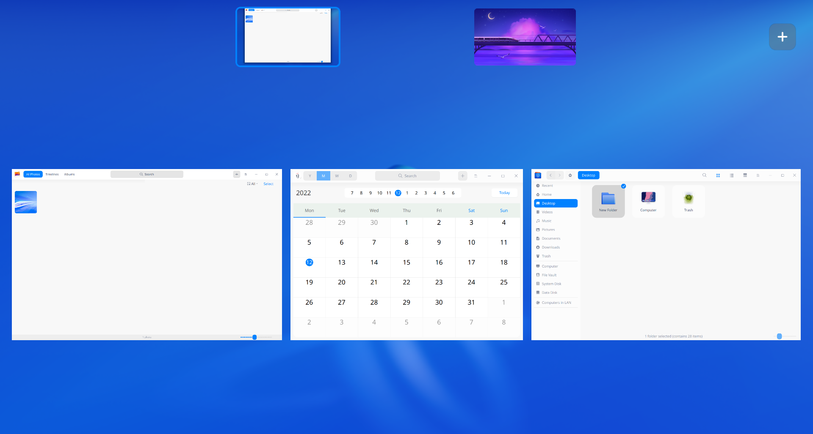

>  Notes: On the touchpad, move with four/five fingers upwards to display multi-task view, and move downwards immediately to hide multi-task view, which corresponds to the operation of **Super** + **S**. 

### Open Workspace

Workspace manages your desktop windows in different groups. Your work area could be enlarged by dividing the workspace.

On the desktop, press **Super** + **S** or click  to open the workspace interface.

>  Notes: If you are using a computer equipped with a touchscreen, slide in from the bottom of the screen exceeding the dock's height to open Workspace.

### Add Workspace

On the workspace interface, you can add workspace in the following ways:

- Click **+** in the upper right corner of workspace.
- Press **Alt** + **+** on the keyboard.

>  Notes: When the workspace number has reached its limit **six**, you cannot add more workspaces. 

### Switch Workspace

On the workspace interface and desktop, you can switch workspace in the following ways:

- On the desktop, press  **Super**+  /  to switch to Previous/Next workspace.
- On the desktop, press  **Super** + Numeric keys (one to six)  to switch to a specified workspace.
- On the workspace interface, scroll up or down to switch to Previous/Next workspace.
- On the workspace interface, click the preview window to switch to a specified workspace.

>  Notes: On the touchpad, move with four/five fingers to the left/right to switch to the previous or next workspace, which corresponds to the operation of **Super** + **Left** or **Super** + **Right**. 

>  Tips: You can adjust workspace's position by dragging in the workspace interface.

### Delete Workspace

After deleting a workspace, all windows in the workspace will be moved to a nearby workspace. You cannot delete the workspace when there is only one.

- On the workspace interface, click the  to delete a workspace.
- On the workspace interface, press **Alt** + **-** to delete a workspace.
- Drag a workspace upward outside the screen to delete it.

### Exit Workspace

After finishing the operations on the workspace interface, you can quit in the following ways:

- Press **Esc**.
- Click the blank area outside the current workspace interface.
- Press **Super** + **S** again.

#### Move Windows Among Workspaces

Move the windows to another workspace in the following ways:

- On the workspace interface, drag and drop the window to the specified workspace.
- On the desktop, press  **Super**+ **Shift** +  /  to move the current window to the Previous/Next workspace.
- On the desktop, press  **Super** + **Shift** + Numeric Keys to move the current window to the workspace in the corresponding order.
- On the desktop, press  **Alt** + **Space** or right-click the window title bar to open the window menu, and select **Always on Visible Workspace** or **Move to Workspace Left/Right** to move the current window to the specified workspace.

>  Tips: In the window menu, you can also minimize, maximize, move, resize, top or close the window.

### Switch Desktop Windows

Switch desktop windows in the current workspace as below.

#### Fast Switch Between Nearby Windows

On the desktop, press  **Alt** + **Tab** at the same time and release, to switch between the current window and the nearby window quickly;
On the desktop, press **Alt** + **Shift** + **Tab** at the same time and release, to fast switch between current window and the nearby window reversely;

#### Fast Switch Between Windows of the Same Type

On the desktop, press **Alt** +    at the same time and release, to switch between the current window and other windows of the same type quickly;
On the desktop, press  **Alt** + **Shift** +  at the same time and release, to fast switch between current window and other windows in same type reversely;

#### Switch Among All Windows

On the desktop, press and hold **Alt** and press **Tab** continually and it will show the right windows one by one; 
On the desktop, press and hold **Alt** + **Shift** and press **Tab** continually and it will show the left windows one by one.

#### Switch Among Windows of the Same Type

On the desktop, press and hold **Alt** and press  continually and it will show the same type of windows towards the right one by one; on the desktop, press and hold **Alt** + **Shift** and press  continually and it will show the same type of windows towards the left one by one.

### Split Screen

With split screen, multiple applications and tasks are displayed simultaneously, which  improves your work and learning efficiency by not only making full use of the space of the large screen, but also reducing frequent switching between multiple application windows.

#### Enter Split Screen

1. Drag the window to the left or right part of the screen until the cursor touches the screen edge and the white transparent background appears, drop the window and it will be adsorbed on the left or right half of the screen.

>  Notes: When the application supports split screen, hover the cursor on the Maximize/Restore button in the application window, and select  in the pop-up menu to enter the split screen.

2. In the screen of which the other half is unoccupied, a preview of all other windows will appear. Click one of them to display it on the this half of the screen to realize split screen browsing. You can also drag other windows to both sides of the screen to add windows on split screen.

>  Tips: To cancel split screen, just drag a window away from the screen edge.

In split screen under multiple display mode, the system supports matching split screen windows on the same screen. On the opposite, it does not support cross screen matching of split screen windows.

#### Adjust Window Positions

When browsing on split screen, once the center of the moving window crosses the center line of the split screen area, the other window will automatically switch to the position of the moving window on the split screen. Release the moving window, and it will fill the vacant position on the split screen.

#### Adjust Window Sizes

When browsing on split screen, move the cursor to the connection between the two windows in the middle of the screen and drag left and right to modify the width of both windows at the same time.

>  Notes: When you can't drag the window anymore in a certain direction, the cursor will indicate other draggable directions.

#### Exit Split Screen

- Click max or close button of any current window, it will exit split screen, and the remaining windows stay in split screen.
- When there are two windows in split screen, drag any one to the top of the screen to trigger fullscreen, and the current window exits split screen, the other one remains in split screen.
- Drag any window away from the connection between the windows.
