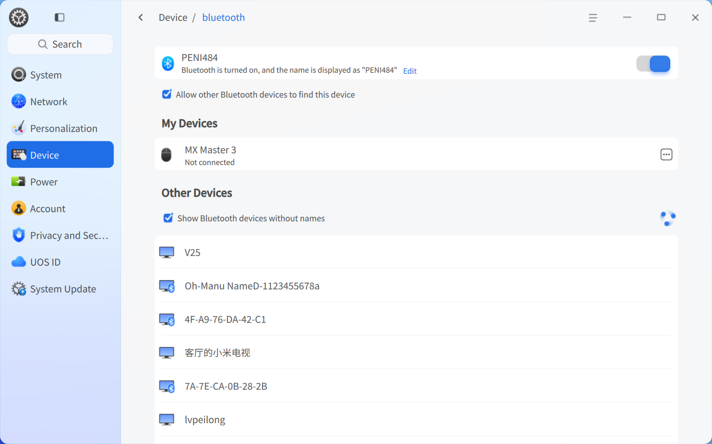
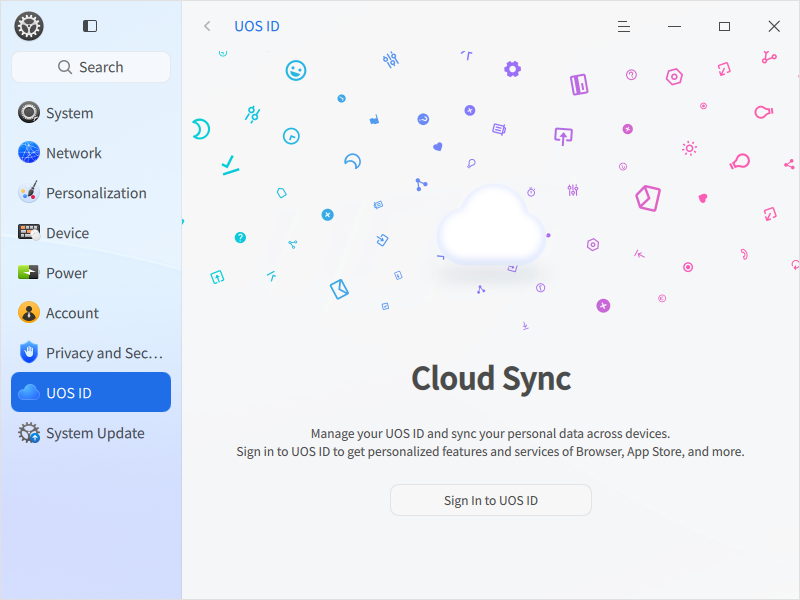
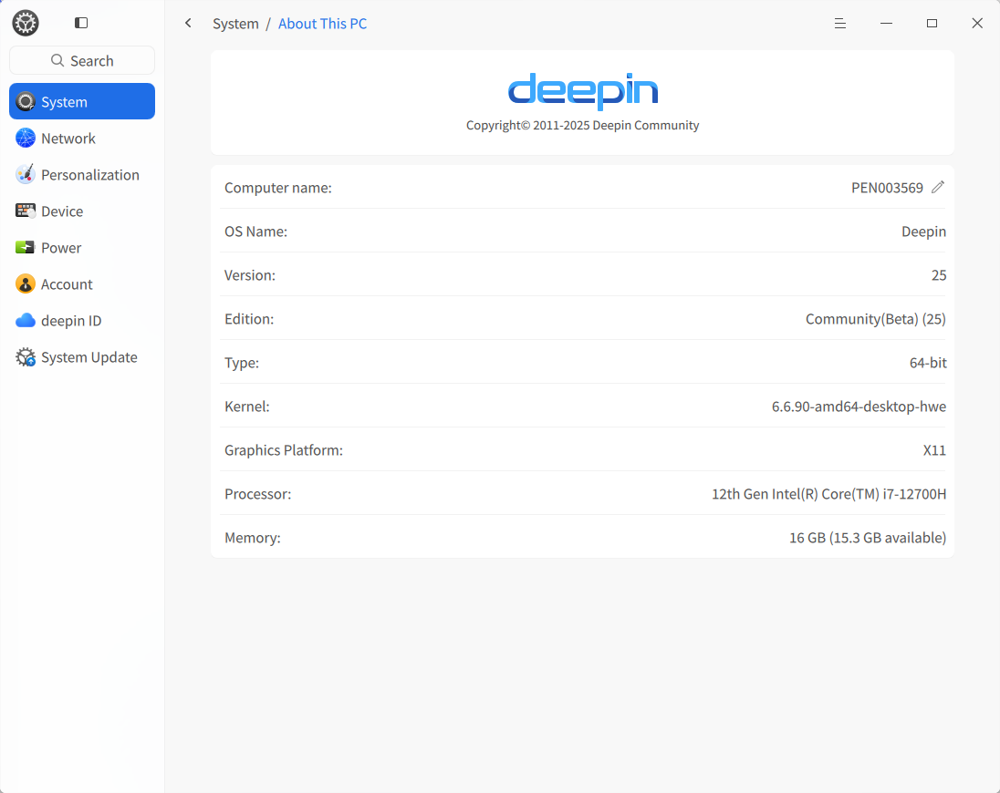

# Desktop Environment|dde|

## Overview
Deepin Operating System (deepin) is a beautiful, user-friendly, secure, and reliable domestic desktop operating system. It comes pre-installed with native applications such as file manager, app store, image viewer, system monitor, and more. It allows you to experience rich entertainment while meeting daily work needs. With continuous feature upgrades and improvements, Deepin OS has become one of China's most popular desktop operating systems.

### System Introduction
When first entering Deepin OS, the welcome program automatically launches. You can watch videos to understand system features, select desktop modes and icon themes, and learn more about the system.

After successful login, you can experience the Deepin desktop environment. The desktop environment consists mainly of the desktop, taskbar, launcher, control center, and window manager, forming the foundation for using this operating system.

## Desktop
The desktop is the main screen area seen after login. On the desktop, you can create files/folders, arrange files, open terminals, set wallpapers and screensavers, and add app shortcuts via [Send to Desktop](#Set-shortcuts).

>  Note: On touchpads, swipe down with four/five fingers to show desktop, then swipe up to hide - equivalent to **Super** + **D** shortcut.

### Create New Folder/Document
Create folders or documents on the desktop, or perform file operations same as in file manager.

- Right-click desktop > **New Folder**, enter name.
- Right-click desktop > **New Document** > select type > enter name.

Right-click files/folders for these functions:

| Function          | Description |
|-------------------|-------------|
| Open With         | Set default app or choose other associated apps |
| Compress/Extract  | Compress files/folders or extract archives |
| Cut               | Move files/folders |
| Copy              | Copy files/folders |
| Rename            | Rename files/folders |
| Delete            | Delete files/folders |
| Create Link       | Create shortcut |
| Tag Info          | Add tags for file management |
| Virus Scan        | Scan files/folders for viruses |
| Properties        | View basic info, sharing, and permissions |

>  Notes:
> - On touchscreen devices: Long-press (1 second) to open context menu
> - On touchpads: Two-finger click shows context menu
> - Keyboard: **Alt** + **M** opens context menu

### Set Arrangement
Arrange desktop icons as needed:

1. Right-click desktop
2. Click **Sort By** and select:
   - **Name**: Sort alphabetically
   - **Modified**: Sort by modification date
   - **Size**: Sort by file size
   - **Type**: Sort by file type

>  Tip: Enable **Auto Arrange** to automatically organize icons. When icons are deleted, subsequent icons will fill the space.

### Adjust Icon Size
1. Right-click desktop
2. Click **Icon Size**
3. Select appropriate size

>  Tip: Use **Ctrl** + //mouse wheel to adjust desktop/launcher icons.

### Display Settings
Access display settings quickly via desktop context menu:

1. Right-click desktop
2. Click **Display Settings** to enter control center

>  Note: See [Display Settings](#Display-Settings) for details.

### Clipboard
Shows all copied/cut text, images, and files since login. Cleared after logout/shutdown.

1. Press **Super** + **V** to open clipboard
2. Double-click item to copy and move to top
3. Paste at target location
4. Hover over item > Click  to delete

>  Note: On touchscreens, swipe from left edge to open clipboard.

## Taskbar
Located at bottom by default, contains launcher, app icons, system tray, and plugins. Used to open apps, show desktop, access workspaces, configure input methods, adjust volume, connect networks, view calendar, and power off.

>  Note: Configure in Control Center > Personalization > Taskbar

### Taskbar Icons

| Icon | Description | Icon | Description |
|------|-------------|------|-------------|
|  | Launcher - View all apps |  | Global Search |
|  | Multitasking View |  | File Manager |
| ![[../common/UosAiAssistant.png]] | UOS AI Bar |  | Browser |
|  | App Store |  | Control Center |
|  | Music |  | Text Editor |
|  | Email |  | Terminal |
|  | Calendar |  | Calculator |
|  | Notifications |  | Onscreen Keyboard |
| ![[dock-control-panel-dark.svg]] | Quick Settings | ![[shutdown-symbolic-dark.svg]] | Power Options |

### Switch Display Modes
Two modes: Classic (small icons) and Efficient (large icons)

1. Right-click taskbar
2. Select mode under **Mode**

### Set Taskbar Position
1. Right-click taskbar
2. Select direction under **Position**

### Adjust Height
Drag taskbar edge to resize

### Show/Hide Taskbar
1. Right-click taskbar
2. Under **Status**:
   - **Always Show**: Visible at all times
   - **Always Hide**: Only visible when mouse hovers
   - **Smart Hide**: Auto-hides when overlapped

>  Touchscreen gestures:
> - Bottom: Swipe up from edge
> - Top: Swipe down from edge
> - Left: Swipe right from edge
> - Right: Swipe left from edge

### Manage Plugins
1. Right-click taskbar > **Taskbar Settings**
2. Toggle plugins:
   - Recycle Bin
   - System Monitor
   - Power Options
   - Show Desktop
   - Onscreen Keyboard
   - Notification Center
   - Clock
   - Smart Assistant
   - Screenshot/Recording

### View Notifications
System/app notifications appear at top. Click actions or close.

Click  to open Notification Center.

>  Touchscreen: Swipe from right edge to open.

### View Date/Time
- Hover time to see details
- Click time to open calendar

### Power Options
Click  to open power menu:

| Option         | Icon                                                          | Description                  |
| -------------- | ------------------------------------------------------------- | ---------------------------- |
| Shutdown       |              | Power off                    |
| Restart        |                  | Reboot system                |
| Sleep          |                | Low-power state              |
| Hibernate      |                      | Save to disk (requires swap) |
| Lock           |                      | **Super** + **L**            |
| Switch User    |          | Change account               |
| Logout         |                  | Sign out                     |
| System Monitor |  | Launch monitor               |

>  User switching only available with multiple accounts.

## Recycle Bin
Temporarily stores deleted files. Restore or empty contents.

### Restore Files
1. Open Recycle Bin
2. Right-click file > **Restore**
3. File returns to original location

>  Note: Restores create new folders if originals deleted.

### Delete Files
1. Open Recycle Bin
2. Right-click file > **Delete**

### Empty Recycle Bin
Click **Empty** to permanently delete all contents.

## Launcher
 manages installed apps. Use categories or search to find apps.

>  Touchpad: Four/five-finger click toggles launcher (**Super** key).

### Switch Modes
Two modes: Fullscreen and Compact

Compact mode supports quick access to file manager, control center, and power options.

### Arrange Apps (Compact Mode)
Default: **Free Sort** (newest on top, frequency-based)
Alternatives:
- **By Category**
- **By Name**

### Find Apps
- Scroll or browse categories
- Type name/abbreviation in search box

### Create Shortcuts
Send apps to desktop or taskbar:

1. Right-click app icon
2. Select:
   - **Send to Desktop**
   - **Send to Taskbar**

>  Tip: Drag icons to taskbar. For running apps, right-click > **Pin**.

### Delete Shortcuts
**From Taskbar**:
- Drag icon off taskbar
- Right-click > **Unpin**

**From Launcher**:
- Right-click app > **Remove from Desktop**
- Right-click app > **Remove from Taskbar**

>  Note: Only removes shortcuts, not uninstall apps.

### Install Apps
Use App Store for new apps:

### Run Apps
- Double-click desktop shortcut
- Click taskbar icon
- Click launcher icon

>  Tip: Right-click app > **Startup on Boot**

### Uninstall Apps
1. Right-click app in launcher
2. Click **Uninstall**

>  Note: System apps cannot be uninstalled.

## Control Center
Manages accounts, network, time, personalization, display, updates, etc. Access via taskbar: 

>  Touchpad: Two-finger swipe right to left to open; left to right to close.

### Homepage
Overview of settings modules.
Navigation sidebar for quick switching.

#### Title Bar
- Back button 
- Breadcrumb navigation
- Search box
- Main menu (theme/version/exit)

### Display Settings
Configure brightness, resolution, orientation, scaling.

#### Single Display
##### Adjust Brightness
1. Control Center > System > Display
2. Drag brightness slider

##### Set Scaling
1. Control Center > System > Display
2. Select scaling factor
3. Log out/in to apply

>  Notes:
> - Auto-adjusts for high-resolution screens
> - For incompatible apps: Right-click > **Disable Scaling**

##### Change Resolution
1. Control Center > System > Display
2. Select resolution
3. Click **Save**

##### Desktop Display
1. Control Center > System > Display
2. Select display mode

##### Refresh Rate
1. Control Center > System > Display
2. Select refresh rate
3. Click **Save**

##### Orientation
1. Control Center > System > Display
2. Select direction
3. Click **Save**

##### Eye Comfort
1. Control Center > System > Display
2. Toggle **Eye Comfort Mode**
3. Set schedule (All day/Sunset to sunrise/Custom)
4. Adjust color temperature

##### Wireless Projection
1. Control Center > Display
2. Select device from list
3. Wait for connection

>  Click  to refresh devices.

#### Multi-Display
Connect secondary displays via VGA/HDMI/DP.

1. Control Center > System > Display
2. Select mode:
   - **Mirror**: Duplicate primary display
   - **Extend**: Expand desktop
   - **Show Only**: Single display

Press **Super** + **P** to toggle modes.

>  Taskbar settings: **Main Display Only** or **Follow Mouse**

### Touchscreen Settings
1. Control Center > System > Touchscreen
2. Configure settings
3. Click **OK**

### Default Applications
Set default apps for file types.

#### Set Default
1. Right-click file > **Open With** > **Set Default**
2. Select app > **OK**

#### Change Default
1. Control Center > System > Default Applications
2. Select file type
3. Choose different app

#### Add Default
1. Control Center > System > Default Applications
2. Click **Add**
3. Select .desktop or binary file

#### Remove Default
1. Control Center > System > Default Applications
2. Click **Edit**
3. Click  next to app

### Personalization
Customize themes, colors, fonts, effects.

#### Themes
1. Control Center > System > Personalization
2. Click **Theme**
3. Select theme

#### Appearance
1. Control Center > System > Personalization
2. Click **General**
3. Choose **Light/Dark/Auto**

>  Auto switches based on sunrise/sunset.

#### Desktop & Taskbar
1. Control Center > System > Personalization
2. Click **Desktop & Taskbar**
3. Configure:
   - Taskbar mode (Classic/Efficient)
   - Size
   - Position
   - Visibility
   - Plugins

#### Window Effects
1. Control Center > System > Personalization
2. Click **Window Effects**
3. Choose:
   - **Performance Mode** (minimal effects)
   - **Balanced**
   - **Visual Mode** (all effects)
   - Corner radius
   - Transparency during move
   - Minimize effect (Scale/Magic Lamp)
   - Taskbar/launcher opacity
   - Scrollbar behavior
   - Titlebar height

#### Wallpaper

Choose exquisite and stylish wallpapers to beautify your desktop and make your computer display stand out.

1. On the desktop, right-click and select **Set Wallpaper** to enter the Control Center and preview all wallpapers.
2. You can choose from three types of wallpapers: My Pictures, System Wallpapers, or Solid Color Wallpapers.
3. After clicking to select a wallpaper, it will take effect on the desktop immediately.
4. Right-click on the wallpaper and select **Set as Lock Screen**, and the wallpaper will be applied to the lock screen.

>  Tips:
>
> - Under the "Auto-Switch Wallpaper" option, you can set the time interval for automatic wallpaper changes. You can also enable automatic wallpaper changes "at login" and "upon wake-up".
> - You can also set your favorite image as the desktop wallpaper in the Image Viewer, or search for wallpapers in the App Store to download preferred wallpapers.

---

#### Screensaver

Originally designed to protect cathode-ray tubes, screensavers are now commonly used to prevent others from viewing your computer's private content.

1. Go to **Control Center > Personalization** and click **Screensaver** to enter the screensaver settings interface and preview all screensavers.
2. You can choose between two types: Slideshow Screensaver or System Screensaver.
3. After selecting a screensaver, set the idle time. When the computer remains idle for the specified duration, your chosen screensaver will activate.
4. If you select the Slideshow Screensaver, click **Settings** in the personalized screensaver options to open the settings window. Here, you can customize the image folder path, slideshow interval, and enable random playback.
5. You can enable **Require password on resume** to better protect your privacy.

#### Colors & Icons

1. Control Center > System > Personalization
2. Click **Colors & Icons**
3. Set:
   - Accent color
   - Icon theme
   - Cursor theme

#### Fonts
1. Control Center > System > Personalization
2. Click **Fonts**
3. Configure system fonts/sizes

### Network Settings
Connect to internet for email, browsing, downloads.

>  Check status via taskbar quick panel.

#### Wired Network
1. Plug Ethernet cable
2. Control Center > Network > Wired
3. Toggle **ON**
4. Edit/create connections

#### Wireless Network
##### Connect
1. Control Center > Network > Wireless
2. Toggle **ON**
3. Select network
4. Enter password if required

##### Hidden Network
1. Control Center > Network > Wireless
2. Click **Connect to Hidden Network**
3. Enter SSID/details
4. Click **Save**

#### Hotspot
1. Control Center > Network > Hotspot
2. Toggle **ON**
3. Configure settings
4. Click **Save**

#### Airplane Mode
Disables Wi-Fi, hotspot, Bluetooth.

1. Control Center > Network > Airplane Mode
2. Toggle **ON**

>  Not available without wireless/Bluetooth hardware.

#### Dial-up (DSL)
1. Control Center > Network > DSL
2. Click **Create PPPoE Connection**
3. Enter ISP details
4. Click **Save**

#### VPN
1. Control Center > Network > VPN
2. Click **Add** or **Import**
3. Configure settings
4. Click **Save**
5. Export for sharing

#### System Proxy
1. Control Center > Network > System Proxy
2. Toggle **ON**
3. Choose Manual/Auto configuration
4. Click **Save**

#### Application Proxy
1. Control Center > Network > Application Proxy
2. Configure settings
3. Click **Save**

>  Enable per-app via launcher context menu.

#### Network Details
1. Control Center > Network > Details
2. View MAC/IP/gateway info

### Notification Settings
Manage do-not-disturb and app notifications.

#### System Notifications
1. Control Center > System > Notifications
2. Configure do-not-disturb:
   - Schedule
   - Show when locked

#### App Notifications
1. Control Center > System > App Notifications
2. Per-app settings:
   - Notification sounds
   - Display location
   - Message previews

### Sound Settings
Configure input/output devices.

#### Output
1. Control Center > System > Sound
2. Adjust:
   - Volume balance
   - Volume boost (0-150%)
   - Mono audio
   - Auto-pause on unplug
   - Output device

#### Input
1. Control Center > System > Sound
2. Adjust:
   - Input volume
   - Noise suppression
   - Input device

>  Tip: Test microphone with normal speech volume.

#### System Sounds
1. Control Center > System > Sound
2. Click **System Sounds**
3. Enable event sounds

#### Device Management
1. Control Center > System > Sound
2. Click **Device Management**
3. Enable/disable devices

### Bluetooth Settings
Connect keyboards, mice, headphones, speakers.

>  Desktops require Bluetooth adapter.

#### Rename Device
1. Control Center > Devices > Bluetooth
2. Click **Edit** next to name
3. Enter new name

#### Connect Device
1. Toggle **Bluetooth ON**
2. Select device from list
3. Enter PIN if required
4. Manage via **My Devices**

#### Send/Receive Files
##### From PC
1. Select paired device
2. Click **Send File**
3. Choose file
4. Select receiver

##### From Mobile
1. Select paired device
2. Choose file > **Send**

##### Receive Files
Accept/decline transfer requests. Failed transfers occur when:
- Receiver declines
- Connection lost
- No response (1 minute timeout)

### Time & Date
Set time zone and manage clocks.

#### Modify Time/Date
1. Control Center > System > Time & Date
2. Disable **Auto Sync**
3. Set manually
4. Click **OK**

#### Change Time Zone
1. Control Center > System > Time & Date
2. Click **Change Time Zone**
3. Select zone

#### Add Time Zone
1. Control Center > System > Time & Date
2. Click **Add**
3. Select zone

#### Delete Time Zone
1. Control Center > System > Time & Date
2. Click **Edit**
3. Click **Delete**

### Power Management
Optimize battery usage and security.

#### Performance Mode
1. Control Center > Power Management
2. Click **General**
3. Select:
   - **Balanced**
   - **High Performance**
   - **Power Saver**

#### Power Saver Settings
1. Control Center > Power Management
2. Click **General**
3. Configure:
   - Auto-enable on low battery
   - Low battery threshold
   - Auto-enable on battery
   - Auto-dim brightness

#### Wake Settings
1. Control Center > Power Management
2. Click **General**
3. Enable:
   - Password on wake from sleep
   - Password on display wake

#### Scheduled Shutdown
1. Control Center > Power Management
2. Click **General**
3. Set time and frequency

#### Display Off
1. Control Center > Power Management
2. Select **On Power** or **On Battery**
3. Set timeout

#### Sleep Mode
1. Control Center > Power Management
2. Select **On Power** or **On Battery**
3. Set timeout

>  Enable **Sleep When Lid Closed** for laptops.

#### Auto Lock
1. Control Center > Power Management
2. Select **On Power** or **On Battery**
3. Set timeout

#### Lid Close Action
1. Control Center > Power Management
2. Select **On Power** or **On Battery**
3. Choose action:
   - Sleep
   - Hibernate
   - Turn off display
   - Do nothing

#### Power Button Action
1. Control Center > Power Management
2. Select **On Power** or **On Battery**
3. Choose action:
   - Power off
   - Sleep
   - Hibernate
   - Turn off display
   - Show power menu
   - Do nothing

#### Low Battery Management
1. Control Center > Power Management
2. Click **On Battery**
3. Configure:
   - Low battery alerts
   - Auto-sleep/hibernate
   - Threshold level

#### Battery Info
1. Control Center > Power Management
2. Click **On Battery**
3. View:
   - Estimated runtime
   - Maximum capacity

### Account

An account is created when installing the system. You can modify account settings or create a new account in the Account Settings module of Control Center.

#### Create a New Account

1. Click the **Add New User** button.
2. Select the account type, set the username, full name, password, repeat password, and password hint.
3. Click **Create**.
4. Enter the current account password in the authorization dialog box, and the new account will be added to the account list.

>  Tip: You can also set a standard user's account type to administrator.

#### Change Avatar

Hover the mouse over the account avatar, and an **Edit** option will appear. Click the avatar, select an existing one or add a local avatar, and the avatar will be replaced.

#### Set Full Name

The account full name will be displayed in the account list and system login interface. You can set it as needed.

Click  next to **Set Full Name**, and enter the account full name.

#### Auto Login

When "Auto Login" is enabled, you can directly enter the desktop the next time the system starts (restart or boot). A password is required for logging in again after screen lock or logout.

Turn on the **Auto Login** switch, enter the current account password in the authorization dialog box, and confirm to enable the auto login feature.

#### Password-Free Login

When "Password-Free Login" is enabled, you won't need a password the next time you log in to the system (restart, boot, or after logout) or unlock the screen.

Turn on the **Password-Free Login** switch, enter the current account password in the authorization dialog box, and confirm to enable password-free login.

>  Tip: 
>
> - If both "Password-Free Login" and "Auto Login" are enabled, the system will directly enter the desktop the next time it starts (restart or boot).

#### Login Methods

You can edit and configure the currently supported login methods.

**Password - Change Password**

1. Click **Password** to enter the secondary password page.
2. Enter the current password, new password, and repeat password, then click **Save**.

>  Note: After the administrator account expires, you need to change the password first to perform authorization operations.

**Password - Password Validity Period**

1. Click **Password** to enter the secondary password page.
2. Set the password validity period. You can set the password to be valid indefinitely or for a specific number of days.

> The password validity period is calculated from the date of modification.
>
> For example: User A changes the password on September 1 and sets the validity period to 30 days. In this case, the password can be used normally from September 1 to September 30.

**Biometric Authentication**

Biometric authentication, also known as biometric identification, uses the inherent physiological or behavioral characteristics of the human body for personal identification. Common biometric authentication methods include fingerprint recognition and facial recognition.

When hardware devices with biometric authentication capabilities are connected, you can register fingerprints or facial data in the system. These can be used to log in to the system, unlock the screen, authorize special operations, enhance user experience, improve system efficiency, and increase system security.

>  Note: The biometric authentication module is only displayed when hardware devices with biometric authentication capabilities are connected. Only then can you set up fingerprint or facial passwords.

**Set Fingerprint Password**

A fingerprint refers to the uneven patterns on the skin of the fingertip. Generally, each person's fingerprint is unique and can be used as a password.

1. Enter the secondary page of biometric authentication. In the fingerprint section, click **Add New Fingerprint**.
2. Enter the current account password in the authorization dialog box, then use the fingerprint device to register the fingerprint.
3. After the fingerprint is successfully added, click **Done**.

>  Note: You can add multiple fingerprint passwords or delete individual fingerprint passwords.

**Set Facial Recognition**

1. Enter the secondary page of biometric authentication. In the facial recognition section, click **Add New Face**.
2. In the pop-up dialog box for adding facial data, check **I have read and agree to the "User Disclaimer"**, and click **Next**.
3. Click **Agree and Start Recording Face**, then click **Next** to use the facial recognition device to register facial data.
4. Click **Done**.

>  Note: An account can register up to 5 facial data entries.

#### Delete Account

1. Click another account that is not logged in.
2. Click **Delete Account**.
3. Click **Delete** in the confirmation dialog box.

>  Note: A logged-in account cannot be deleted.

#### Mouse Settings
1. Control Center > Devices > Mouse & Touchpad
2. Click **Mouse**
3. Configure:
   - Pointer speed
   - Mouse acceleration
   - Disable touchpad when mouse connected
   - Natural scrolling

#### Touchpad Settings

1. Control Center > Devices > Mouse & Touchpad
2. Click **Touchpad**
3. Configure:
   - Pointer speed
   - Natural scrolling
   - Disable while typing

#### Gestures
Configure 3/4-finger gestures:
- Swipe up/down/left/right
- Tap actions

### Graphics Tablet
Configure pressure sensitivity for drawing.

>  Only visible when tablet connected.

1. Control Center > Devices > Tablet
2. Select **Pen**
3. Adjust pressure sensitivity

### Keyboard Settings
Configure input methods and shortcuts.

#### Properties
1. Control Center > Devices > Keyboard
2. Adjust:
   - Key repeat delay/speed
   - Num lock enable
   - Caps lock indicator

#### Layouts
Add/remove keyboard layouts.

##### Add Layout
1. Control Center > Devices > Keyboard
2. Click **Layouts**
3. Click **Add Layout**

##### Remove Layout
1. Control Center > Devices > Keyboard
2. Click **Layouts**
3. Click **Edit**
4. Click **Delete**

#### Input Methods
##### Add Input Method
1. Control Center > Devices > Keyboard
2. Click **Input Methods**
3. Click **Add**:
   - Install from store
   - Select from list

##### Reorder Methods
Drag to rearrange list

##### Configure Input Method
Click **Settings** next to method

##### Switching Shortcut
Select shortcut from dropdown

##### Advanced Settings
Configure global options

#### Shortcuts
View/modify system shortcuts.

##### View Shortcuts
Browse categories

##### Modify Shortcut
Click shortcut > Press new keys

>  Press **Backspace** to disable

##### Custom Shortcuts
1. Click **Add**
2. Enter name/command/shortcut
3. Click **Add**

### Language & Region
Manage system languages and formats.

#### Add Language
1. Control Center > System > Language & Region
2. Click **Add**
3. Select language

#### Set System Language
1. Control Center > System > Language & Region
2. Select language
3. Log out/in after installation

>  Keyboard layout may change after switch.

#### Region Settings
1. Control Center > System > Language & Region
2. Configure:
   - Locale
   - Date/number formats
   - Time display in taskbar

### deepin ID

To use features related to **deepin ID**, you must first register and log in with your deepin ID. If you haven’t registered yet, you can do so in the following ways:

- **Register via the UnionTech official website**: Visit the UnionTech official website to complete the registration process using various methods such as WeChat QR code scan or mobile number.
- **Register through the Control Center**:
  1. In the deepin ID section of the Control Center, click the **Log In** button to bring up the deepin ID login interface.
  2. On the login screen, click the **Register** button to open the deepin ID registration interface.
  3. On the registration interface, register using your mobile number or WeChat.

Once you’ve successfully logged in with your deepin ID, you can access cloud services related to applications such as Cloud Sync, App Store, and Browser.

> Tip: After binding your deepin ID to your local account, you can use your deepin ID to reset the login password for the local account.

After enabling the cloud sync feature, the system will automatically sync various settings (such as sound, power, mouse, updates, screen saver, etc.) to the cloud. If you want to use the same system settings on another computer, simply log in with the same deepin ID to sync the cloud configurations to the new device with one click.

> Note:
>
> 1. The automatic sync feature is only available when the system is activated or in trial mode; it cannot be used if the system is unactivated.
> 2. When the "Automatic Sync Settings" option is enabled, you can select specific items to sync; if this option is disabled, none of the items will be synced.

### System Updates

Manage OS and security updates.

#### Check/Install Updates
1. Control Center > System Update
2. Click **Check for Updates**
3. Download updates
4. Install updates
5. Reboot if required

#### Update & Shutdown/Reboot
Choose during installation:
- **Background Update** (non-disruptive)
- **Update & Shutdown/Reboot** (full-screen)

#### Update Content
View changelog after checking

#### Update Settings
##### Update Types
Select:
- Feature updates
- Security updates
- Third-party updates

##### Advanced
- Download speed limit
- Auto-download schedule
- Update notifications
- Clear package cache

#### Update History
View installed updates

### System Information
View hardware/software details.

#### About
- Edit computer name
- View OS version/license/install date/hardware info

#### Open Source Licenses
View OSS declarations

#### EULA
View end-user license agreement

#### Privacy Policy
View privacy statement

### Backup & Restore
Protect against data loss.

### Boot Menu
Configure startup options.

#### Settings
##### Boot Delay
- ON: 5-second wait
- OFF: 1-second wait

##### Default Entry
Select boot entry

##### Boot Animation
Set logo size

##### Theme
Enable/disable background

#### Developer Options
Enable developer mode (root access).

>  Void warranty and irreversible.

##### Online Activation
1. Select **Online Activation**
2. Log in with Deepin ID
3. Accept disclaimer
4. Authenticate
5. Reboot

##### Offline Activation
1. Select **Offline Activation**
2. Import certificate
3. Authenticate
4. Reboot

#### User Experience Program
Share usage data to improve system.

1. Toggle **ON**
2. Accept agreement
3. Click **OK**

#### Domain Management
For enterprise environments.

1. Toggle **ON**
2. Enter domain/port
3. Click **OK**

## Window Manager

Window Manager can display different window contents in different workspaces. With the Window Manager, you can use multiple desktops at the same time to manage desktop windows in groups.

>  Notes: this function is available only when **Window Effect** is turned on in **Control Center** > **Personalization** > **General** . 

>  Notes: On the touchpad, move with four/five fingers upwards to display multi-task view, and move downwards immediately to hide multi-task view, which corresponds to the operation of **Super** + **S**. 

### Open Workspace

Workspace manages your desktop windows in different groups. Your work area could be enlarged by dividing the workspace.

On the desktop, press **Super** + **S** or click  to open the workspace interface.

>  Notes: If you are using a computer equipped with a touchscreen, slide in from the bottom of the screen exceeding the dock's height to open Workspace.

### Add Workspace

On the workspace interface, you can add workspace in the following ways:

- Click **+** in the upper right corner of workspace.
- Press **Alt** + **+** on the keyboard.

>  Notes: When the workspace number has reached its limit **six**, you cannot add more workspaces. 

### Switch Workspace

On the workspace interface and desktop, you can switch workspace in the following ways:

- On the desktop, press  **Super**+  /  to switch to Previous/Next workspace.
- On the desktop, press  **Super** + Numeric keys (one to six)  to switch to a specified workspace.
- On the workspace interface, scroll up or down to switch to Previous/Next workspace.
- On the workspace interface, click the preview window to switch to a specified workspace.

>  Notes: On the touchpad, move with four/five fingers to the left/right to switch to the previous or next workspace, which corresponds to the operation of **Super** + **Left** or **Super** + **Right**. 

>  Tips: You can adjust workspace's position by dragging in the workspace interface.

### Delete Workspace

After deleting a workspace, all windows in the workspace will be moved to a nearby workspace. You cannot delete the workspace when there is only one.

- On the workspace interface, click the  to delete a workspace.
- On the workspace interface, press **Alt** + **-** to delete a workspace.
- Drag a workspace upward outside the screen to delete it.

### Exit Workspace

After finishing the operations on the workspace interface, you can quit in the following ways:

- Press **Esc**.
- Click the blank area outside the current workspace interface.
- Press **Super** + **S** again.

#### Move Windows Among Workspaces

Move the windows to another workspace in the following ways:

- On the workspace interface, drag and drop the window to the specified workspace.
- On the desktop, press  **Super**+ **Shift** +  /  to move the current window to the Previous/Next workspace.
- On the desktop, press  **Super** + **Shift** + Numeric Keys to move the current window to the workspace in the corresponding order.
- On the desktop, press  **Alt** + **Space** or right-click the window title bar to open the window menu, and select **Always on Visible Workspace** or **Move to Workspace Left/Right** to move the current window to the specified workspace.

>  Tips: In the window menu, you can also minimize, maximize, move, resize, top or close the window.

### Switch Desktop Windows

Switch desktop windows in the current workspace as below.

#### Fast Switch Between Nearby Windows

On the desktop, press  **Alt** + **Tab** at the same time and release, to switch between the current window and the nearby window quickly;
On the desktop, press **Alt** + **Shift** + **Tab** at the same time and release, to fast switch between current window and the nearby window reversely;

#### Fast Switch Between Windows of the Same Type

On the desktop, press **Alt** +    at the same time and release, to switch between the current window and other windows of the same type quickly;
On the desktop, press  **Alt** + **Shift** +  at the same time and release, to fast switch between current window and other windows in same type reversely;

#### Switch Among All Windows

On the desktop, press and hold **Alt** and press **Tab** continually and it will show the right windows one by one; 
On the desktop, press and hold **Alt** + **Shift** and press **Tab** continually and it will show the left windows one by one.

#### Switch Among Windows of the Same Type

On the desktop, press and hold **Alt** and press  continually and it will show the same type of windows towards the right one by one; on the desktop, press and hold **Alt** + **Shift** and press  continually and it will show the same type of windows towards the left one by one.

### Split Screen

With split screen, multiple applications and tasks are displayed simultaneously, which  improves your work and learning efficiency by not only making full use of the space of the large screen, but also reducing frequent switching between multiple application windows.

#### Enter Split Screen

1. Drag the window to the left or right part of the screen until the cursor touches the screen edge and the white transparent background appears, drop the window and it will be adsorbed on the left or right half of the screen.

>  Notes: When the application supports split screen, hover the cursor on the Maximize/Restore button in the application window, and select  in the pop-up menu to enter the split screen.

2. In the screen of which the other half is unoccupied, a preview of all other windows will appear. Click one of them to display it on the this half of the screen to realize split screen browsing. You can also drag other windows to both sides of the screen to add windows on split screen.

>  Tips: To cancel split screen, just drag a window away from the screen edge.

In split screen under multiple display mode, the system supports matching split screen windows on the same screen. On the opposite, it does not support cross screen matching of split screen windows.

#### Adjust Window Positions

When browsing on split screen, once the center of the moving window crosses the center line of the split screen area, the other window will automatically switch to the position of the moving window on the split screen. Release the moving window, and it will fill the vacant position on the split screen.

#### Adjust Window Sizes

When browsing on split screen, move the cursor to the connection between the two windows in the middle of the screen and drag left and right to modify the width of both windows at the same time.

>  Notes: When you can't drag the window anymore in a certain direction, the cursor will indicate other draggable directions.

#### Exit Split Screen

- Click max or close button of any current window, it will exit split screen, and the remaining windows stay in split screen.
- When there are two windows in split screen, drag any one to the top of the screen to trigger fullscreen, and the current window exits split screen, the other one remains in split screen.
- Drag any window away from the connection between the windows.