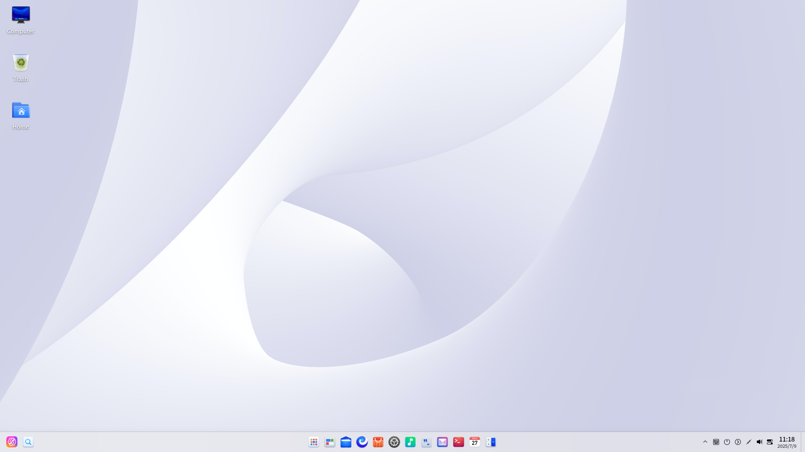
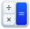
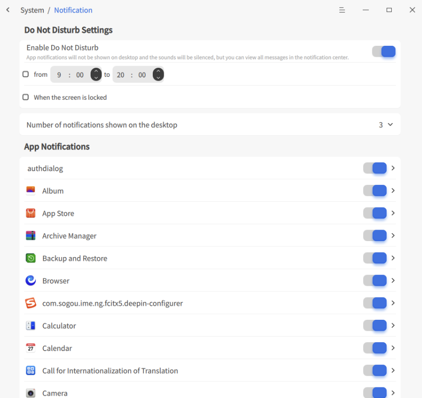
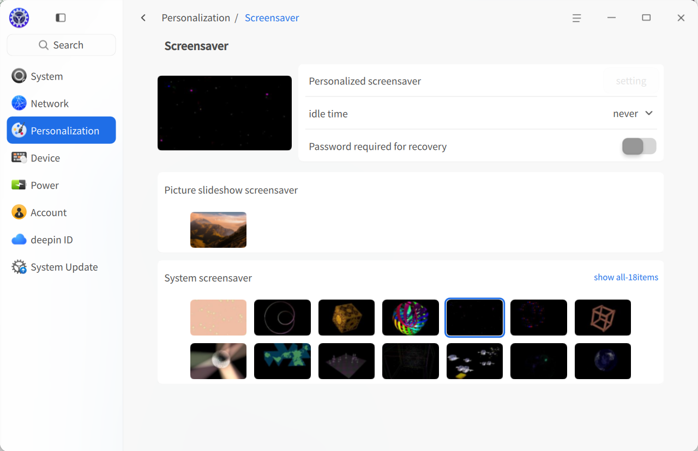
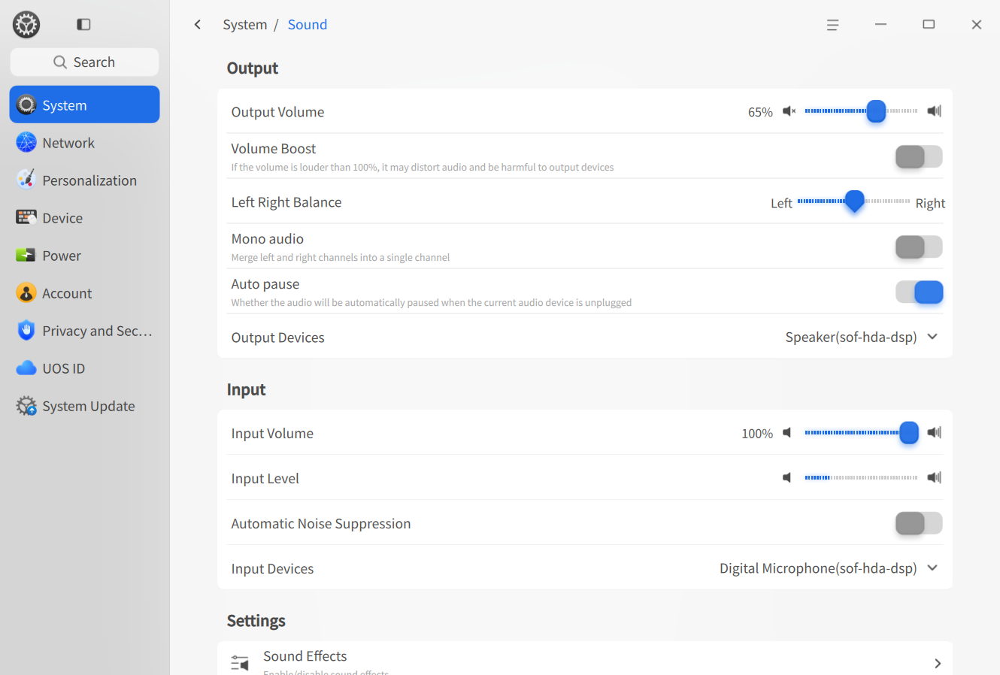
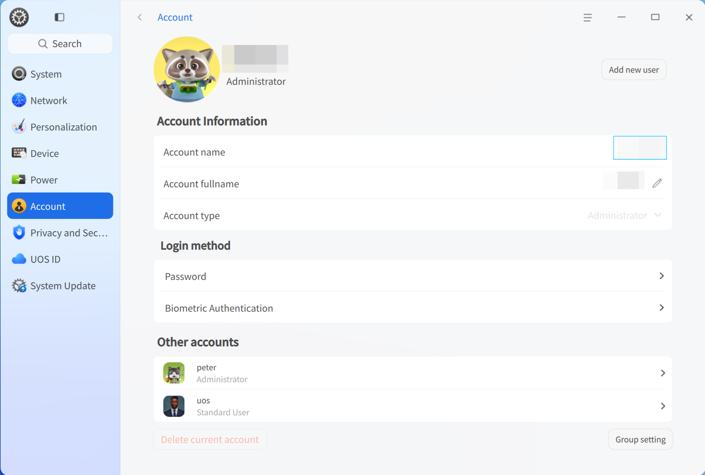

# Desktop Environment|dde|

## Overview
Uniontech OS (abbreviated as "UOS") is a visually appealing, user-friendly, and secure domestically-developed desktop operating system. UOS comes pre-installed with native applications including File Manager, App Store, Image Viewer, System Monitor, and more. It delivers a rich entertainment experience while meeting all your daily work needs. With continuous feature upgrades and improvements, Uniontech OS has become one of China's most popular desktop operating systems.

### System Introduction
Upon initial entry into the Uniontech OS , the Welcome program automatically opens. You can watch videos to learn about system features, choose desktop modes and icon themes, and further explore the system.

After successfully logging in, you can experience the UOS desktop environment. The desktop environment mainly consists of the desktop, taskbar, launcher, control center, and window manager, forming the foundation of your operating system experience.

## Desktop
The desktop is the main screen area seen after login. On the desktop, you can create new files/folders, arrange files, open terminals, set wallpapers and screensavers, and add application shortcuts to the desktop via [Send to Desktop](#create-shortcuts).

>  Note: On a touchpad, swipe down with four/five fingers to show the desktop; swipe up immediately after to hide it, corresponding to the **Super** + **D** shortcut.

### Create New Folder/Document
Create new folders or documents on the desktop, or perform routine file operations as you would in the file manager.

- On the desktop, right-click and select **New Folder**, then enter the folder name.
- On the desktop, right-click and select **New Document**, choose the document type, and enter the document name.

Right-click on a desktop file or folder to access the following functions:

| Function          | Description                                                                 |
|-------------------|-----------------------------------------------------------------------------|
| Open With         | Set the default opening method or choose other associated applications.     |
| Compress/Extract  | Compress files/folders or extract compressed files.                         |
| Cut               | Move files/folders.                                                         |
| Copy              | Copy files/folders.                                                         |
| Rename            | Rename files/folders.                                                       |
| Delete            | Delete files/folders.                                                       |
| Create Link       | Create a shortcut.                                                          |
| Tag Info          | Add tags for categorized file/folder management.                            |
| Properties        | View basic info, sharing methods, and permissions of files/folders.         |

>  Note:
> - On touchscreen devices, press and hold for 1 second to open the right-click menu.
> - On touchpads, tap with two fingers to show the right-click menu.
> - Press **Alt** + **M** to open the right-click menu.

### Set Arrangement
Arrange desktop icons as needed.

1. Right-click on the desktop.
2. Click **Sort By**, then choose:
   - **Name**: Display files in alphabetical order.
   - **Modified Time**: Sort by most recent modification date.
   - **Created Time**: Sort by creation date.
   - **Size**: Sort by file size.
   - **Type**: Sort by file type.

>  Tip: Enable **Auto Arrange** to automatically arrange icons top-to-bottom, left-to-right. Deleted icons are replaced by subsequent ones.

### Adjust Icon Size
1. Right-click on the desktop.
2. Click **Icon Size**.
3. Select an appropriate icon size.

>  Tip: Use **Ctrl** + //mouse scroll to adjust icon size on the desktop and launcher.

### Set Display
Access display settings quickly via the desktop right-click menu to configure scaling, resolution, brightness, etc.

1. Right-click on the desktop.
2. Click **Display Settings** to enter the control center's display settings interface.

>  Note: For detailed display settings, refer to [Display Settings](#display-settings).

### Clipboard
The clipboard displays all text, images, and files copied/cut after login. Use it to quickly copy items. Content is cleared after logout/shutdown.

Drag source images/files directly to the desktop or editable text areas.

1. Press **Super** + **V** to open the clipboard.
2. Double-click an item to copy it instantly; the item moves to the top.
3. Paste at the target location.
4. Hover over an item and click  to delete it; click Clear all to empty the clipboard.

>  Note: On touchscreens, swipe from the left edge beyond the taskbar height to open the clipboard.

## Taskbar
The taskbar is typically a long bar at the bottom of the desktop, consisting of the launcher, app icons, system tray, and plugins. Use it to open apps, show desktop, switch workspaces, manage apps (open/close/force quit), configure input methods, adjust volume, connect networks, view calendars, and access shutdown options.

>  Note: Taskbar mode, position, and status can also be configured in **Control Center > Personalization > Taskbar**.

### Taskbar Icons
Icons include the launcher, app shortcuts, tray icons, and system plugins.

| Icon | Description | Icon | Description |
|------|-------------|------|-------------|
|  | Launcher - Click to view installed apps. |  | Global Search - Find content. |
|  | Multitasking View - Click to show workspaces. |  | File Manager - Browse files/folders. |
|  | UOS AI Bar - AI entry point. |  | Browser - Open web pages. |
|  | App Store - Search/install apps. |  | Control Center - System settings. |
|  | Music - Play music. |  | Text Editor - View/edit text files. |
|  | Mail - Manage emails. |  | Terminal - Terminal emulator. |
|  | Calendar - View dates/schedules. |  | Calculator - Standard/scientific/programmer calculator. |
|  | Notification Center - System/app notifications. |  | Onboard - Virtual keyboard. |
|  | Quick Settings Panel - Quick system settings. |  | Shutdown - Access shutdown interface. |

### Switch Display Mode
Two modes: Classic (small icons) and Efficient (large icons with window activation effects).

To switch modes:
1. Right-click the taskbar.
2. Under **Mode**, select a display mode.

### Set Taskbar Position
Place the taskbar on any desktop edge.
1. Right-click the taskbar.
2. Under **Position**, choose a direction.

### Adjust Taskbar Height
Drag the taskbar edge to resize.

### Show/Hide Taskbar
Hide the taskbar to maximize desktop space.
1. Right-click the taskbar.
2. Under **Status**, choose:
   - **Always Show**: Taskbar remains visible.
   - **Always Hide**: Taskbar hides; appears only when hovered.
   - **Smart Hide**: Hides automatically when overlapped.

>  Note: On touchscreens:
> - Bottom taskbar: Swipe up from bottom edge to show.
> - Top taskbar: Swipe down from top edge.
> - Left taskbar: Swipe right from left edge.
> - Right taskbar: Swipe left from right edge.

### Show/Hide Plugins
1. Right-click the taskbar > **Taskbar Settings**.
2. In **Control Center > Personalization > Taskbar**, toggle plugins like **Recycle Bin**, **System Monitor**, **Shutdown**, **Show Desktop**, **Onboard**, **Notification Center**, **Time**, **Desktop Assistant**, **Screenshot**, etc.

### View Notifications
System/app notifications appear at the top. Click buttons to act or click  to dismiss.  
Click  on the taskbar to open Notification Center.

>  Note: On touchscreens, swipe from the right edge beyond taskbar height to open Notification Center.

### View Date/Time
- Hover over the taskbar time to see date/week/time.
- Click time to open the calendar plugin.

### Enter Shutdown Interface
Click  on the taskbar or launcher (mini mode) to access:

| Function | Icon | Description |
|----------|------|-------------|
| Shutdown |  | Turn off the computer. |
| Reboot |  | Restart the computer. |
| Suspend |  | Low-power state. |
| Hibernate |  | Save to disk (requires swap partition). |
| Lock |  | Lock screen (**Super** + **L**). |
| Switch User |  | Log in as another user. |
| Log Out |  | Clear current user session. |
| System Monitor |  | Launch System Monitor. |

>  Note: **Switch User** appears only if multiple accounts exist.

### Recycle Bin
Temporarily deleted files are stored here. Restore or empty them.

#### Restore Files
Restore deleted files or use **Ctrl** + **Z** to undo deletion.
1. Select files in Recycle Bin.
2. Right-click > **Restore**.
3. Files return to their original paths.

>  Warning: If the original folder is deleted, a new one will be created.

#### Delete Files
Permanently delete individual files from Recycle Bin:
1. Select files.
2. Right-click > **Delete**.

#### Empty Recycle Bin
Click **Empty** to permanently delete all content.

## Launcher
The Launcher  manages all installed apps. Use categories or search to find apps quickly.  
Newly installed apps show a blue dot indicator.

>  Note: On touchpads, tap with four/five fingers to show/hide the launcher (**Super** key).

### Switch Mode
Two modes: Fullscreen and Mini. Toggle via the top-right icon.  
Both support app search and shortcut creation. Mini mode also offers quick access to File Manager, Control Center, and Shutdown.

### Arrange Apps
In Mini mode, apps default to **Free Sort** (newest on top, sorted by frequency). Switch to:
- **By Category**: Group by app type.
- **By Name**: Alphabetical order.

### Find Apps
Scroll or use categories to browse. Type the app name/initials in the search box.

### Set Shortcuts
Quickly launch apps from the desktop/taskbar.

#### Create Shortcuts
1. In Launcher, right-click an app icon:
   - **Send to Desktop**: Creates a desktop shortcut.
   - **Send to Taskbar**: Pins to taskbar.
   

>  Note: Drag apps from the launcher to the taskbar. If an app is running, right-click its taskbar icon > **Pin** to pin it.

#### Delete Shortcuts
**From Taskbar**:
- Drag the icon off the taskbar.
- Right-click icon > **Unpin**.

**From Launcher**:
Right-click app icon:
- **Remove from Desktop**: Deletes desktop shortcut.
- **Remove from Taskbar**: Unpins from taskbar.

>  Note: These actions remove shortcuts only, not the app.

### Install Apps
Missing apps? Install them via the App Store.

### Run Apps
Open apps via:
- Double-click desktop icons or right-click > **Open**.
- Click taskbar icons or right-click > **Open**.
- Click launcher icons or right-click > **Open**.

>  Tip: For frequently used apps, right-click in launcher > **Startup at Boot**.

### Uninstall Apps
Remove unused apps to save space.
1. In Launcher, right-click the app icon.
2. Click **Uninstall**.

>  Note: Some system apps cannot be uninstalled.

## Control Center
 UOS uses the Control Center for system settings: accounts, network, time, personalization, display, updates, etc. Click  on the taskbar to open it.

>  Note: On touchpads, swipe right-to-left with two fingers to show Control Center; left-to-right to hide.

### Homepage
The homepage displays settings modules for quick access.

Switch modules via the left sidebar.

#### Title Bar
Includes back button, search box, main menu, and window controls.
- : Return to previous level.
- Breadcrumb navigation: Click to jump to page levels.
- Search box: Enter keywords to find settings.
- Main menu: Set window theme, view version, or exit.

### Display Settings
Optimize brightness, resolution, orientation, and scaling.

#### Single Display Settings
Adjust brightness, resolution, refresh rate, and orientation.

##### Adjust Brightness
1. Go to **Control Center > System > Display**.
2. Drag the brightness slider.

##### Set Screen Scaling
Resize oversized/undersized displays.
1. Go to **Control Center > System > Display**.
2. Select a scaling factor from the dropdown.
3. Log out/in to apply.

>  Note:
> - HiDPI screens auto-adjust scaling.
> - For apps incompatible with scaling, right-click in launcher > **Disable Scaling**.

##### Change Resolution
1. Go to **Control Center > System > Display**.
2. Select a resolution from the dropdown.
3. Click **Save**.

##### Set Desktop Display
When using non-recommended resolutions:
1. Go to **Control Center > System > Display**.
2. Choose a display effect under **Desktop Display**.

##### Set Refresh Rate
1. Go to **Control Center > System > Display**.
2. Select a refresh rate.
3. Click **Save**.

##### Change Orientation
1. Go to **Control Center > System > Display**.
2. Select an orientation.
3. Click **Save**.

##### Set Eye Comfort Mode
Reduce blue light emission.
1. Go to **Control Center > System > Display**.
2. Under **Eye Comfort**:
   - Toggle **Eye Comfort Mode**.
   - Set schedule: **All Day**, **Sunset to Sunrise**, or **Custom**.
   - Adjust color temperature.

#### Multi-Display Settings
Extend your workspace using VGA/HDMI/DP cables.

1. Go to **Control Center > System > Display**.
2. Under **Multi-Screen**, choose:
   - **Duplicate**: Mirror primary screen.
   - **Extend**: Expand desktop across screens.
   - **Only on [Screen]**: Display only on selected screen.

Click **Identify** to show screen names. In extended mode, settings windows group on each screen.

>  Note: In **Control Center > Personalization > Taskbar**, set taskbar display to **Only on Primary Screen** or **Follow Mouse Position**.

Press **Super** + **P** to open the multi-display OSD:
1. Hold **Super**, press **P** or click a mode.
2. Release to confirm.

>  Note: Secondary screens support desktop icons and right-click menus.

Brightness, scaling, resolution, etc., settings match single-display setup. See [Single Display Settings](#single-display-settings).

### Touchscreen Settings
Configure connected touchscreens.
1. Go to **Control Center > System > Touchscreen**.
2. Adjust settings and click **OK**.

### Default Programs
Set default apps for file types.

#### Set Default Program
1. Right-click file > **Open With > Select Default Program**.
2. Choose an app, check **Set as Default**, click **OK**.
3. The app auto-appears in Control Center's default list.

#### Change Default Program
1. Go to **Control Center > System > Default Programs**.
2. Select a file type.
3. Choose another app.

#### Add Default Program
1. Go to **Control Center > System > Default Programs**.
2. Select a file type.
3. Click **Add Default Program**, choose a `.desktop` file (e.g., `/usr/share/applications`) or binary.
4. Check the app to set as default.

#### Delete Default Program
Only user-added apps can be deleted. System apps require uninstallation.
1. Go to **Control Center > System > Default Programs**.
2. Select a file type.
3. Click  next to the app.

### Personalization
Customize system theme, accent color, fonts, window effects, opacity, icons, cursors, and more.

#### Set Window Theme
1. Go to **Control Center > Personalization**.
2. Click **Theme**, select a system theme.

#### Appearance
Set light/dark/auto mode.
1. Go to **Control Center > Personalization**.
2. Click **General**.
3. Under **Appearance**, choose **Light**, **Dark**, or **Auto** (switches at sunset/sunrise).

#### Desktop & Taskbar
Configure taskbar mode, position, status, and plugins.
1. Go to **Control Center > Personalization > Desktop & Taskbar**.
2. Adjust:
   - Mode: Classic/Efficient.
   - Size: Drag slider.
   - Position: Top/Bottom/Left/Right.
   - Status: Always Show/Hide/Smart Hide.
   - Plugins: Toggle visibility.

In extended multi-display mode, set taskbar to follow mouse or show only on primary screen.

#### Window Effects
Hardware-dependent visual enhancements.
1. Go to **Control Center > Personalization > Window Effects**.
2. Configure:
   - **Interface Effect**: Best Performance (no effects), Balanced (limited effects), Best Visuals (all effects).
   - **Window Corner Radius**: None/Small/Medium/Large.
   - **Transparency When Moving**: Toggle on/off.
   - **Minimize Effect**: Scale or Magic Lamp.
   - **Opacity**: Adjust for taskbar/launcher (mini mode).
   - **Scrollbar**: Show When Scrolling or Always Show.
   - **Titlebar Height**: Drag slider.

>  Note: Titlebar height applies only to window-manager-drawn titlebars.

#### Wallpaper
Personalize your desktop.
1. Right-click desktop > **Set Wallpaper**.
2. Choose from **My Pictures**, **System Wallpapers**, or **Solid Colors**.
3. Click a wallpaper to apply.
4. Right-click wallpaper > **Set as Lock Screen**.

>  Tip:
> - Set auto-rotate interval under **Auto Switch Wallpaper**.
> - Use Image Viewer or App Store to set/download wallpapers.

#### Screensaver
Protect privacy during inactivity.
1. Go to **Control Center > Personalization > Screensaver**.
2. Choose **Slideshow** or **System Screensavers**.
3. Set idle time to activate.
4. For slideshow: Set image path, interval, randomness.
5. Enable **Require Password on Wake** for security.

#### Colors & Icons
1. Go to **Control Center > Personalization > Colors & Icons**.
2. Configure:
   - **Accent Color**: Highlight color for selections.
   - **Icon Theme**: System or custom themes.
   - **Cursor Theme**: Select cursor style.

#### Fonts & Sizes
1. Go to **Control Center > Personalization > Fonts & Sizes**.
2. Set system font and size.

### Network Settings
Connect to networks for email, browsing, downloads, etc.

>  Tip: Use the taskbar quick panel to view/set network status.

#### Wired Network
Stable wired connections via router.
1. Plug Ethernet cable into computer and router.
2. Go to **Control Center > Network > Wired Network**.
3. Toggle **Wired Network Adapter** on.
4. "Wired Connection Connected" appears on success.

Edit or create new wired connections in settings.

#### Wireless Network
Flexible wireless connectivity.

##### Connect to Wireless
1. Go to **Control Center > Network > Wireless Network**.
2. Toggle **Wireless Network Adapter** on.
3. Select a network.
   - Open networks connect automatically.
   - Encrypted networks: Enter password > **Connect**.

##### Connect to Hidden Network
Manually add hidden networks.
1. Go to **Control Center > Network > Wireless Network**.
2. Click **Connect to Hidden Network**.
3. Enter SSID and required details.
4. Click **Save**.

#### Personal Hotspot
Share your computer's internet via Wi-Fi.
1. Go to **Control Center > Network > Personal Hotspot**.
2. Toggle **Hotspot** on.
3. Set hotspot name and password.
4. Click **Save**.

#### Airplane Mode
Disable Wi-Fi, hotspot, and Bluetooth.
1. Go to **Control Center > Network > Airplane Mode**.
2. Toggle it on/off.

>  Warning: Hidden if no Wi-Fi/Bluetooth hardware.

#### DSL (Dial-Up)
Connect via modem using ISP credentials.
1. Go to **Control Center > Network > DSL**.
2. Click **Create PPPoE Connection**.
3. Enter ISP name, username, password.
4. Click **Save**; auto-connects.

#### VPN
Secure encrypted connections for remote access.
1. Go to **Control Center > Network > VPN**.
2. Click **Add VPN** or **Import VPN**.
3. Select protocol, enter details (auto-filled if imported).
4. Click **Save**; auto-connects.
5. Export VPN settings for backup/sharing.

>  Note: Enable **Only for resources on this network** to avoid setting VPN as default route.

#### System Proxy
1. Go to **Control Center > Network > System Proxy**.
2. Toggle **System Proxy** on.
3. Choose **Manual** (enter server/port) or **Auto** (enter configuration URL).
4. Click **Save**.

#### Application Proxy
1. Go to **Control Center > Network > Application Proxy**.
2. Set proxy type, IP, port, etc.
3. Click **Save**.

>  Note: After setup, right-click app icons in launcher > **Use Proxy**.

#### Network Details
View MAC/IP/gateway info.
1. Go to **Control Center > Network > Network Details**.
2. Check wired/wireless network information.

### Notification Settings
Configure "Do Not Disturb" mode and app-specific notifications.

#### System Notifications
1. Go to **Control Center > System > Notifications**.
2. Toggle **Do Not Disturb** on/off.
   - Set start/end times.
   - Enable **Show Notifications on Lock Screen**.

#### App Notifications
Customize per-app alerts.
1. Go to **Control Center > System > App Notifications**.
2. Select an app and configure:
   - Play sound on notification.
   - Show in Notification Center/desktop.
   - Show message preview.

### Sound Settings
Optimize input/output devices (speakers, microphones).

#### Output Settings
1. Go to **Control Center > System > Sound**.
2. Under **Output**:
   - Adjust volume/balance.
   - Toggle **Volume Boost** (0-150% range).
   - Enable **Mono Audio** (merge channels).
   - Enable **Plug Management** (pause on unplug).
   - Select output device.

#### Input Settings
1. Go to **Control Center > System > Sound**.
2. Under **Input**:
   - Adjust input volume.
   - Enable **Noise Suppression**.
   - Select input device.

>  Tip: Test microphone at normal volume; avoid distortion.

#### System Sounds
1. Go to **Control Center > System > Sound**.
2. Click **System Sounds**.
3. Toggle event sounds (e.g., login, logout).

>  Tip: Click to preview sounds.

#### Device Management
1. Go to **Control Center > System > Sound**.
2. Click **Device Management**.
3. Enable/disable input/output devices.

### Bluetooth Settings
Wirelessly connect keyboards, mice, headphones, speakers.

>  Note: Laptops have built-in Bluetooth; desktops require a USB adapter.

#### Rename Bluetooth Device
1. Go to **Control Center > Devices > Bluetooth**.
2. Click **Edit** next to device name, enter new name.
3. Other devices must rediscover the renamed device.

#### Connect Bluetooth Device
1. Go to **Control Center > Devices > Bluetooth**.
2. Toggle **Bluetooth** on; scans nearby devices.
3. Click a device; enter pairing code if required.
4. Connected devices appear under **My Devices**.
5. Click a device to **Disconnect** or rename.

#### Send/Receive Files via Bluetooth
Transfer files between UOS PC and non-UOS devices.

**From UOS PC**:
1. Go to **Control Center > Devices > Bluetooth**.
2. Select a paired device > **More** > **Send File**.
3. Choose file > **Open** > **Send**.

**From Mobile (Android)**:
1. Enable Bluetooth.
2. Select paired UOS device.
3. Choose file > **Send** > Bluetooth.

**Receive Files**:
Accept/decline incoming transfers. Files save to `~/Downloads` on accept. Failed transfers show in a list.

### Time & Date
Set time zone, sync automatically, or configure manually.

#### Modify Time/Date
1. Go to **Control Center > System > Time & Date**.
2. Toggle **Auto Sync** off.
3. Manually set time/date.
4. Click **OK**.

>  Note: Re-enable **Auto Sync** to use NTP servers.

#### Change Time Zone
1. Go to **Control Center > System > Time & Date**.
2. Click **Change System Time Zone**.
3. Select a time zone.

#### Add Time Zone
View multiple time zones.
1. Go to **Control Center > System > Time & Date**.
2. Under **Time Zone List**, click **Add**.
3. Search/select a time zone > **Add**.

#### Delete Time Zone
1. Go to **Control Center > System > Time & Date**.
2. Under **Time Zone List**, click **Edit**.
3. Click **Delete**  for a time zone.

### Power Management
Optimize battery usage and system security.

#### Adjust Performance Mode
1. Go to **Control Center > Power Management > General**.
2. Choose **Balanced**, **High Performance**, or **Power Saver**.

#### Power Saver Settings
Reduce screen brightness to save power.
1. Go to **Control Center > Power Management > General**.
2. Select **Power Saver**.
3. Configure:
   - **Enable When Battery Low** (laptops only).
   - Set **Low Battery Threshold**.
   - **Enable When Using Battery** (laptops only).
   - Adjust **Auto Dim Brightness**.

>  Note: Disabling **Enable When Using Battery** defaults to **Balanced**.

#### Wake Settings
1. Go to **Control Center > Power Management > General**.
2. Under **Wake Settings**:
   - **Require Password on Wake from Sleep**.
   - **Require Password on Display Wake**.

#### Shutdown Settings
1. Go to **Control Center > Power Management > General**.
2. Under **Shutdown Settings**:
   - Set **Scheduled Shutdown** time.
   - Choose frequency: Once, Weekdays, Daily, or Custom.

#### Set Display Off Time
1. Go to **Control Center > Power Management > Plugged In** or **On Battery**.
2. Set **Turn Off Display After**.

#### Set Sleep Time
1. Go to **Control Center > Power Management > Plugged In** or **On Battery**.
2. Set **Sleep After**.

>  Tip: Enable **Sleep When Lid Closed** for laptops.

#### Set Auto Lock Time
1. Go to **Control Center > Power Management > Plugged In** or **On Battery**.
2. Set **Lock After**.

#### Set Lid Close Action
1. Go to **Control Center > Power Management > Plugged In** or **On Battery**.
2. Set **When Lid Closed** to **Sleep**, **Hibernate**, **Turn Off Display**, or **Do Nothing**.

>  Note: Laptops only.

#### Set Power Button Action
1. Go to **Control Center > Power Management > Plugged In** or **On Battery**.
2. Set **When Power Button Pressed** to **Shut Down**, **Sleep**, **Hibernate**, **Turn Off Display**, **Show Shutdown Interface**, or **Do Nothing**.

#### Low Battery Management
1. Go to **Control Center > Power Management > On Battery**.
2. Under **Low Battery Management**:
   - Enable **Low Battery Alert** (notifies below threshold).
   - Set auto-sleep/hibernate on low battery.
   - Adjust low battery threshold.

>  Note: Laptops only.

#### Battery Management
1. Go to **Control Center > Power Management > On Battery**.
2. Under **Battery Management**:
   - Toggle **Show Remaining Usage/Charging Time** on taskbar.
   - View maximum battery capacity.

### Accounts
Manage accounts created during installation.

#### Create New Account
1. Click **Add User**.
2. Choose account type (Standard/Administrator), set username, full name, password, hint.
3. Click **Create**.
4. Enter current account password to authorize.

>  Tip: Standard users can be promoted to administrators.

#### Change Avatar
Hover over avatar > **Edit** > choose image or add local file.

#### Set Full Name
Displayed in account list and login screen.
Click  next to **Full Name** to edit.

#### Auto Login
Bypass login screen on startup (requires password after lock/logout).
Toggle **Auto Login** on > enter current password.

#### Password-Free Login
No password needed for login/unlock.
Toggle **Password-Free Login** on > enter current password.

>  Tip: If both **Auto Login** and **Password-Free Login** are on, system boots directly to desktop.

#### Login Methods
**Password - Change Password**
1. Go to **Password**.
2. Enter current/new password > **Save**.

>  Note: Expired admin passwords must be changed before authorization.

**Password - Password Expiry**
1. Go to **Password**.
2. Set validity: **Never Expires** or specific days (counted from last change).

**Biometric Authentication**
Use fingerprints/face recognition for login/unlock/authorization (requires supported hardware).

**Set Fingerprint**
1. Go to **Biometric Authentication > Fingerprint**.
2. Click **Add Fingerprint**.
3. Enter password > scan fingerprint > **Done**.

>  Note: Add/delete multiple fingerprints.

**Set Face Recognition**
1. Go to **Biometric Authentication > Face Recognition**.
2. Check **I have read and agree to the Disclaimer** > **Next**.
3. Click **Agree and Start Recording** > scan face > **Done**.

>  Note: Up to 5 faces per account.

#### Delete Account
1. Select a non-logged-in account.
2. Click **Delete Account** > **Delete**.

>  Warning: Logged-in accounts cannot be deleted.

### Mouse & Touchpad
Customize input devices for better ergonomics.

#### General Settings
1. Go to **Control Center > Devices > Mouse & Touchpad**.
2. Under **General**:
   - Adjust **Scrolling Speed**.
   - Adjust **Double-Click Speed**.
   - Toggle **Left-Handed Mode** (swaps left/right buttons).

#### Mouse Settings
1. Go to **Control Center > Devices > Mouse & Touchpad > Mouse**.
2. Adjust **Pointer Speed**.
3. Toggle **Mouse Acceleration** (improves precision at high speeds).
4. Enable **Disable Touchpad When Mouse Connected** (if available).
5. Toggle **Natural Scrolling** (reverse scroll direction).

#### Touchpad Settings

Configure pointer speed, natural scrolling, and "Disable When Typing" (laptops).

#### Gesture Settings
Assign actions to touchpad gestures.

**Three-Finger Gestures**:
- Swipe Up: Maximize window (default: can set to restore, left/right split, or disable).
- Swipe Down: Restore window (default: can set to maximize, left/right split, or disable).
- Swipe Left: Left split (default: can set to restore, maximize, right split, or disable).
- Swipe Right: Right split (default: can set to restore, maximize, left split, or disable).
- Tap: Open/hide Global Search (default: can set to show/hide launcher, clipboard, notification center, or disable).

**Four-Finger Gestures**:
- Swipe Up: Show Multitasking View (default: can set to hide, switch desktops, show/hide desktop, or disable).
- Swipe Down: Hide Multitasking View (default: can set to show, switch desktops, show/hide desktop, or disable).
- Swipe Left: Switch to previous desktop (default: can set to show/hide multitasking, next desktop, show/hide desktop, or disable).
- Swipe Right: Switch to next desktop (default: can set to show/hide multitasking, previous desktop, show/hide desktop, or disable).
- Tap: Open/close Launcher (default: can set to global search, clipboard, notification center, or disable).

### Graphics Tablet
Configure pressure sensitivity for drawing tablets (requires hardware).

>  Note: Module appears only when connected.

1. Go to **Control Center > Devices > Graphics Tablet**.
2. Select **Pen** mode.
3. Adjust **Pressure Sensitivity**.

### Keyboard
Configure input methods, system language, and shortcuts.

#### Keyboard Properties
1. Go to **Control Center > Devices > Keyboard**.
2. Under **General**:
   - Adjust **Delay Before Repeat**/**Repeat Speed**.
   - Test in "Type here" field.
   - Toggle **Enable Numeric Keypad**/**Caps Lock Prompt**.

#### Keyboard Layout
Add/remove layouts for character mapping.

##### Add Layout
1. Go to **Control Center > Devices > Keyboard > Keyboard Layout**.
2. Click **Add Keyboard Layout** > select layout.

##### Delete Layout
1. Go to **Control Center > Devices > Keyboard > Keyboard Layout**.
2. Click **Edit**.
3. Click **Delete**  for a layout.

#### Input Methods
Manage input methods and switching shortcuts.

##### Add Input Method
1. Go to **Control Center > Devices > Keyboard > Input Methods**.
2. Click **Add Input Method**:
   - **Go to Store**: Download from App Store (auto-sets as default).
   - Choose from list.

>  Note: Removed input methods can be re-added.

##### Reorder Input Methods
Drag input methods up/down in the list.

##### Configure Input Method
Click **Settings**  next to an input method.

##### Set Switching Shortcut
Under **Shortcuts**, choose a key combo from the dropdown.

>  Note: More shortcuts in **Advanced Settings**.

##### Advanced Settings
Go to **Advanced Settings** for global input method configurations.

#### Shortcuts
View/modify/customize system, window, and workspace shortcuts.

##### View Shortcuts
Browse or search default shortcuts.

##### Modify Shortcut
1. Click a shortcut.
2. Press new keys.
3. Use **Backspace** to disable or **Esc** to cancel.

##### Custom Shortcut
1. Click **Add**.
2. Enter name, command, and shortcut keys.
3. Click **Add**.
4. Edit/delete via **Edit** mode.

### Language & Region
Add/switch system languages and regional formats.

##### Add System Language
1. Go to **Control Center > System > Language & Region**.
2. Click **Add** > select language.

##### Set System Language
1. Select a language; system installs language pack.
2. Log out/in to apply.

>  Warning: Keyboard layout may change; ensure correct layout at login.

##### Region
1. Go to **Control Center > System > Language & Region**.
2. Under **Region**:
   - **Area**: Affects input methods, keyboard layouts, and formats.
   - **Region & Format**: Sets date, currency, number formats.
   - **Current Format**: Customize taskbar time/date display.

### UOS ID
Register/login to UOS ID for cloud sync, App Store, browser services, and password reset.

>  Tip: Bound UOS ID can reset local account passwords.

#### Cloud Sync
Sync system settings (sound, power, mouse, updates, screensaver, etc.) across devices.
1. Go to **Control Center > UOS ID**.
2. Toggle **Auto Sync Settings** on.
3. Select items to sync.

>  Note:
> 1. Requires activated system (trial or licensed).
> 2. Sync stops if toggled off.

### System Updates
Receive and install system/security updates.

>  Tip: Disable **Update Reminder** in settings to avoid prompts.

#### Update & Upgrade
1. Go to **Control Center > System Updates**.
2. Click **Check for Updates**:
   - "System is up to date" if none.
   - If updates exist: **Download** selected items > **Install** after download.
3. Choose:
   - **Update in Background**: Install without interrupting use.
   - **Update & Shutdown/Reboot**: Modal installation (system unusable during).

#### Update Content
View changelogs after checking for updates.

#### Update Settings
##### Update Types
Choose **Feature Updates**, **Security Updates**, and **Third-Party Repositories**.

##### Advanced
- **Download Speed Limit**: Set max speed (default: 10240 KB/s).
- **Auto Download**: Schedule download times.
- **Update Reminder**: Toggle notifications.
- **Clear Package Cache**: Auto-remove downloaded packages.

#### View Update History
Click **View Update History** to see installed version logs.

### System Information
View system version, license, hardware, and agreements.

#### About This PC
1. Go to **Control Center > System > About This PC**.
2. Click  to rename computer.
3. View OS version, license, installation date, and hardware.

##### License Activation
1. Click **Activate**.
2. Choose method:
   - **Trial Activation**: Click **Activate Now** > **OK**.
   - **Enter Serial**: Input serial > **Activate Now**.
   - **Import License File**: Select `.key` file > **Activate Now**.
3. **Offline Activation** (if no internet):
   - Scan QR code with phone.
   - Enter offline code from phone.
4. After activation:
   - View license details under **View**.
   - **Change Serial**: Only for OPEN licenses.
5. **Activation Failure**: Invalid file/serial.
6. **Server Settings**: Customize activation server via  > **Settings**.

#### Open Source Statement
View open-source licenses.

#### EULA
View End User License Agreement.

#### Privacy Policy
View privacy policy.

### Backup & Restore
Back up/restore app or system data against data loss.

### Boot Menu
Manage boot options and theme.

#### Set Boot Menu
Menu for selecting OS at startup.

>  Note: ARM supports GRUB verification; MIPS doesn't support GRUB/background changes.

##### Set Boot Delay
- **On**: 5-second wait.
- **Off**: 1-second wait.

##### Set Default Boot Entry
1. Go to **Control Center > System > Boot Menu**.
2. Select an entry > enter password to set as default.

##### Boot Animation
Set logo size (Large/Small).

>  Tip: Drag image to preview to change background.

##### Theme
Toggle boot theme on/off.

#### Developer Options
Enable developer mode for root access and unsigned apps.

##### Developer Mode
Grants `sudo` privileges. Void warranty; use cautiously.
1. Go to **Control Center > System > Developer Options**.
2. Click **Enter Developer Mode**:
   - **Online**: Log in with UOS ID > accept disclaimer > authenticate > reboot.
   - **Offline**: Download/import certificate > authenticate > reboot.

>  Warning: Irreversible; all accounts gain root access.

##### Debug Options
Set **System Log Level** to Debug for detailed logs.

#### User Experience Program
Help improve UOS  by sharing usage data.
1. Go to **Control Center > System > User Experience Program**.
2. Toggle it on > check **Agree and Join** > **OK**.

#### Domain Management
Join a domain network.
1. Go to **Control Center > System > Domain Management**.
2. Toggle **Domain Management** on.
3. Set **Domain Address** and **Port**.
4. Click **OK**.

>  Note: Supported on AMD/ARM systems.