# 桌面环境|dde|

## 概述

统信操作系统(简称“统信 UOS”)是一款美观易用、安全可靠的国产桌面操作系统。统信 UOS 预装了文件管理器、应用商店、看图、系统监视器等一系列原生应用。它既能让您体验到丰富多彩的娱乐生活，也可以满足您的日常工作需要。随着功能的不断升级和完善，统信操作系统已成为国内最受欢迎的桌面操作系统之一。

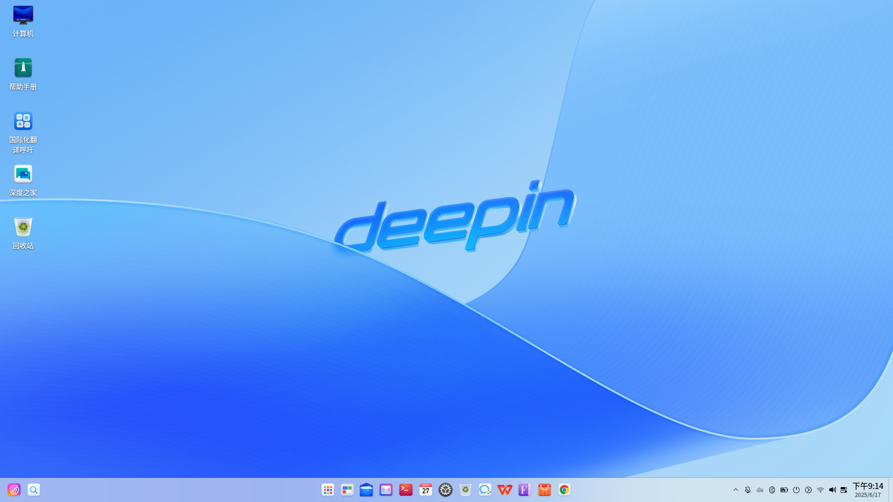

### 系统简介

初次进入统信操作系统，会自动打开欢迎程序。您可以观看视频了解系统功能，选择桌面模式和图标主题，进一步了解该系统。

成功登录系统后，即可体验UOS桌面环境。桌面环境主要由桌面、任务栏、启动器、控制中心和窗口管理器等组成，是您使用该操作系统的基础。

## 桌面

桌面是登录后看到的主屏幕区域。在桌面上可以新建文件/文件夹、排列文件、打开终端、设置壁纸和屏保等，还可以通过 [发送到桌面](#设置快捷方式) 向桌面添加应用的快捷方式。

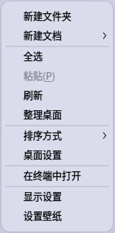

>  说明：在触控板上，四指/五指向下移动显示桌面，紧接着向上移动隐藏桌面， 对应 **Super** + **D** 快捷键。

### 新建文件夹/文档

在桌面新建文件夹或文档，也可以对文件进行常规操作，和在文件管理器中一样。

- 在桌面上，单击鼠标右键，单击 **新建文件夹**，输入新建文件夹的名称。
- 在桌面上，单击鼠标右键，单击 **新建文档**，选择新建文档的类型，输入新建文档的名称。

在桌面文件或文件夹上，单击鼠标右键，在弹出的菜单中主要包含如下功能：

| 功能    | 说明                           |
| ----- | ---------------------------- |
| 打开方式  | 选定系统默认打开方式，也可以选择其他关联应用程序来打开。 |
| 压缩/解压 | 压缩文件或文件夹，或对压缩文件进行解压。         |
| 剪切    | 移动文件或文件夹。                    |
| 复制    | 复制文件或文件夹。                    |
| 重命名   | 重命名文件或文件夹。                   |
| 删除    | 删除文件或文件夹。                    |
| 创建链接  | 创建一个快捷方式。                    |
| 标记信息  | 添加标记信息，以对文件或文件夹进行标签化管理。      |
| 属性    | 查看文件或文件夹的基本信息，共享方式及其权限。      |

>  说明：
> 
> - 当使用触屏电脑时，在触摸屏上长按1秒再抬起即打开当前对象的右键菜单。
> - 在触控板上，二指单击，显示右键菜单。
> - 在键盘上按下 **Alt** + **M** 快捷键，打开右键菜单。

### 设置排列方式

您可以对桌面上的图标按照需要进行排序。

1. 在桌面上，单击鼠标右键。
2. 单击 **排序方式**，您可以：
   - 单击 **名称**，将按文件的名称顺序显示。
   - 单击 **修改时间**，文件将按最近一次的修改日期顺序显示。
   - 单击 **创建时间**，文件将按创建日期顺序显示。
   - 单击 **大小**，将按文件的大小顺序显示。
   - 单击 **类型**，将按文件的类型顺序显示。

>  窍门：您也可以勾选 **自动排列**，桌面图标将从上往下，从左往右按照当前排序规则排列，有图标被删除时后面的图标会自动向前填充。

### 调整图标大小

1. 在桌面上，单击鼠标右键。
2. 单击 **图标大小**。
3. 选择一个合适的图标大小。

>  窍门：您也可以用 **Ctrl** + //鼠标滚动来调整桌面和启动器中的图标大小。

### 设置显示器

从桌面单击右键菜单选择“显示设置”，可以快速进入控制中心设置显示器的缩放比例、分辨率和亮度等。

1. 在桌面上，单击鼠标右键。
2. 单击 **显示设置**，快速进入控制中心的显示设置界面。

>  说明：关于显示的设置，具体操作请参考 [显示设置](#显示设置) 。

### 剪贴板

剪贴板展示当前用户登录系统后复制和剪切的所有文本、图片和文件。使用剪贴板可以快速复制其中的某项内容。注销或关机后，剪贴板会自动清空。

在剪贴板上，可以将有源图片、文件类信息直接拖曳到桌面保存，也可以将文字、字符等信息拖曳到可编辑文本中。

1. 使用快捷键 **Super** + **V** 唤出剪贴板。
2. 双击剪贴板内的某一区块，会快速复制当前内容， 且当前区块会被移动到剪贴板顶部。
3. 选择目标位置粘贴。
4. 鼠标移入剪贴板的某一区块，单击上方的 ，删除当前内容；单击顶部的 ，清空剪贴板。

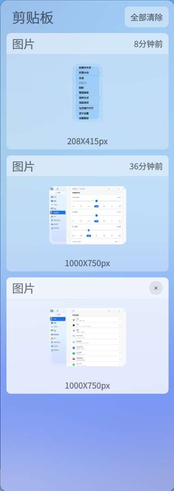

>  说明：当使用触屏电脑时，在触摸屏上从屏幕左侧边缘划入超过任务栏高度，唤出剪贴板。

## 任务栏

任务栏一般是指位于桌面底部的长条，主要由启动器、应用程序图标、托盘区、系统插件等组成。在任务栏中，可以打开启动器、显示桌面、进入工作区，对其上的应用程序进行打开、新建、关闭、强制退出等操作，还可以设置输入法，调节音量，连接网络，查看日历，进入关机界面等。

>  说明：在控制中心“个性化 > 任务栏”界面，也可以对任务栏的模式、位置、状态等进行设置。

### 认识任务栏图标

任务栏图标包括启动器图标、应用程序图标、托盘区图标、系统插件图标等。

| 图标                                                                    | 说明                         | 图标                                                                  | 说明                        |
| --------------------------------------------------------------------- |:-------------------------- | ------------------------------------------------------------------- | ------------------------- |
|                             | 启动器 - 单击查看所有已安装的应用。        |             | 全局搜索 -  - 搜索、查找内容。        |
|       | 多任务视图 - 单击显示工作区。           |                  | 文件管理器 - 单击查看磁盘中的文件、文件夹。   |
|                    | UOS AI Bar  - AI 功能场景响应入口。 |              | 浏览器 - 单击打开网页。             |
|                     | 应用商店 - 搜索安装应用软件。           |                   | 控制中心 - 单击进入系统设置。          |
|                         | 音乐 - 播放音乐应用软件。             |                      | 文本编辑器 - 查看和编辑文本文件应用软件。    |
|                          | 邮件 - 编辑、管理和发送电子邮件应用软件。     |                    | 终端 - 终端模拟器。               |
|                         | 日历 - 查看日期、管理日程应用软件。        |                  | 计算器 - 标准、科学型和程序员型桌面计算器工具。 |
|                            | 通知中心 - 显示所有系统和应用的通知。       |                                    | 屏幕键盘 - 单击使用虚拟键盘。          |
|  | 快捷设置面板-快捷设置系统功能。           |  | 关机 - 单击进入关机界面。            |

### 切换显示模式

任务栏提供两种显示模式：经典模式和居中模式，显示不同的图标大小和应用窗口激活效果。

&nbsp;&nbsp;&nbsp;&nbsp;&nbsp;&nbsp;&nbsp;&nbsp;&nbsp;&nbsp;&nbsp;&nbsp;&nbsp;

您可以通过以下操作来切换显示模式：

1. 右键单击任务栏。
2. 在 **模式** 子菜单中选择一种显示模式。

### 设置任务栏位置

您可以将任务栏放置在桌面的任意方向。

1. 右键单击任务栏。
2. 在 **位置** 子菜单中选择一个方向。

### 调整任务栏高度

鼠标拖动任务栏边缘，改变任务栏高度。

### 显示/隐藏任务栏

任务栏可以隐藏，以便最大程度的扩展桌面的可操作区域。

1. 右键单击任务栏。
2. 在 **状态** 子菜单中您可以：
   - 选择 **一直显示**，任务栏将会一直显示在桌面上。
   - 选择 **一直隐藏**，任务栏将会隐藏起来，只有在鼠标移至任务栏区域时才会显示。
   - 选择 **智能隐藏**，当占用任务栏区域时，任务栏自动隐藏。

>  说明：在触摸屏电脑上，当任务栏设置为“智能隐藏”或“一直隐藏”时：
> 
> - 如果任务栏在底部，在屏幕边缘从下往上划入，唤出任务栏；
> - 如果任务栏在顶部，在屏幕边缘从上往下划入，唤出任务栏；
> - 如果任务栏在左侧，在屏幕边缘从左往右划入，唤出任务栏；
> - 如果任务栏在右侧，在屏幕边缘从右往左划入，唤出任务栏。

### 显示/隐藏插件

1. 右键单击任务栏。
2. 单击 **任务栏设置** 进入控制中心“个性化 > 任务栏”界面。
3. 在插件区域勾选或取消勾选 **回收站**、**系统监视器**、**关机**、**显示桌面**、**屏幕键盘**、**通知中心**、**时间**、**桌面智能助手**、**截图录屏**等插件，可以设置这些插件在任务栏上的显示或隐藏效果。

### 查看通知消息

当有系统或应用通知时，桌面上方会弹出通知消息。若有按钮，单击按钮执行对应操作；若无按钮，单击关闭此消息。

此外，还可以单击任务栏上的 ， 打开通知中心，查看所有通知。
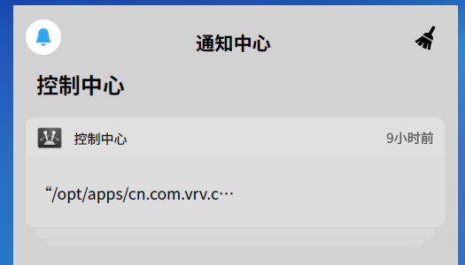
&nbsp;&nbsp;&nbsp;&nbsp;&nbsp;&nbsp;&nbsp;&nbsp;&nbsp;&nbsp;&nbsp;&nbsp;&nbsp;

>  说明：当使用触屏电脑时，手指从屏幕右侧边缘划入超过任务栏高度，唤出通知中心。

### 查看日期时间

- 鼠标指针悬停在任务栏的时间上，查看当前日期、星期和时间。
- 单击时间，打开日历插件。

### 进入关机界面

单击任务栏上的  进入关机界面，或在启动器的小窗口模式中单击  进入关机界面。

| 功能                                                                 | 说明                                   |
| ------------------------------------------------------------------ | ------------------------------------ |
| 关机                | 关闭电脑。                                |
| 重启                    | 关机后再次重新运行您的电脑。                       |
| 待机                  | 整个系统将处于低能耗运转的状态。                     |
| 休眠                        | 没有 swap 分区不显示此项。有 swap 分区的机器休眠挂载到硬盘。 |
| 锁定                        | 锁定电脑，按下快捷键 **Super** + **L** 锁定。     |
| 切换用户          | 选择另一个用户账户登录。                         |
| 注销                    | 清除当前登录用户的信息。                         |
| 系统监视器 | 快速启动系统监视器。                           |

&nbsp;&nbsp;&nbsp;&nbsp;&nbsp;&nbsp;&nbsp;&nbsp;&nbsp;&nbsp;&nbsp;&nbsp;&nbsp;

>  说明：当系统存在多个账户时才显示 **切换使用者** 。

### 回收站

在回收站中，可以找到电脑中临时被删除的文件，也可以选择还原或清空这些文件。

#### 还原文件

临时被删除的文件，可以在回收站进行还原，或使用快捷键 **Ctrl** + **Z** 还原刚删除的文件。

1. 在回收站中，选择要恢复的文件。
2. 单击鼠标右键，选择 **还原**。
3. 还原文件到原来的存储路径下。

>  注意：如果原来所在的文件夹已经删除，还原文件时会自动新建文件夹。

#### 删除文件

回收站中可以单独清除某一文件。

1. 在回收站中，选择要删除的文件。
2. 单击鼠标右键，选择 **删除**，即可删除回收站的文件。

#### 清空回收站

在回收站中，单击 **清空**，将彻底删除回收站的所有内容。

## 启动器

启动器  可以管理系统中所有已安装的应用，在启动器中使用分类导航或搜索功能可以快速找到需要的应用程序。

在启动器中可以查看新安装的应用，新安装应用的旁边会出现一个小蓝点提示。

>  说明：在触控板上，四指/五指单击，显示/隐藏启动器， 对应 **Super** 快捷键。

### 切换模式

启动器有全屏和小窗口两种模式。单击启动器界面右上角的图标来切换模式。

两种模式均支持搜索应用、设置快捷方式等操作。

小窗口模式还支持快速打开文件管理器、控制中心和进入关机界面等功能。

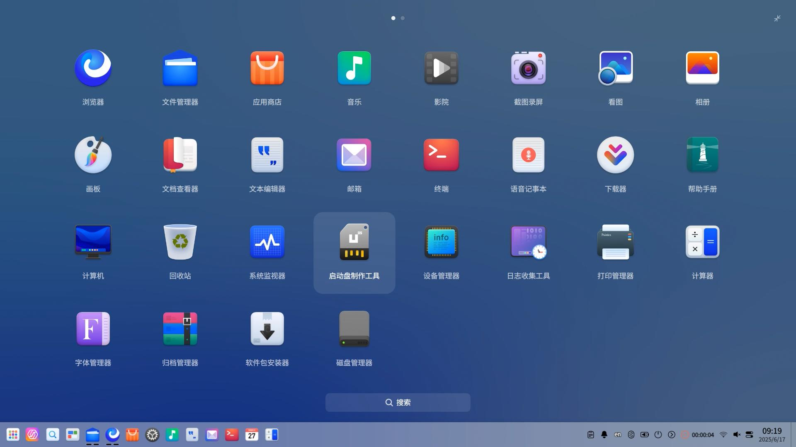

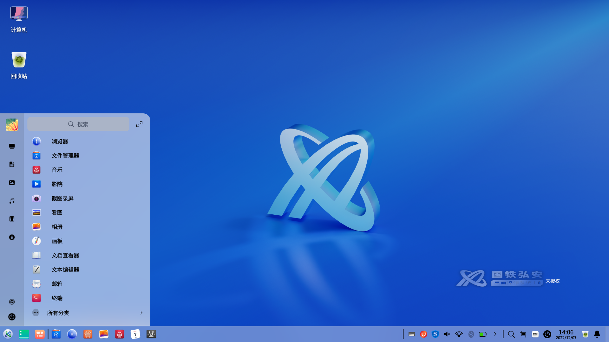

### 排列应用

在小窗口模式下，系统默认 **自由排序** 安装最新的应用置顶，并按照使用频率排序。同时可支持切换以下排序方式：

- **按分类** 应用类型排序。
- **按名称**  应用名称首字母排序。

&nbsp;&nbsp;&nbsp;&nbsp;&nbsp;&nbsp;&nbsp;&nbsp;&nbsp;&nbsp;&nbsp;&nbsp;&nbsp;

### 查找应用

在启动器中，您可以滚动鼠标滚轮或切换分类导航查找应用。

如果知道应用名称，直接在搜索框中输入关键字或首字母缩写，快速定位到需要的应用。

### 设置快捷方式

快捷方式提供了一种简单快捷地启动应用的方法。

#### 创建快捷方式

将应用发送到桌面或任务栏上，方便您的后续操作。

在启动器中，右键单击应用图标，您可以：

- 单击 **发送到桌面**，在桌面创建快捷方式。

- 单击 **发送到任务栏**，将应用固定到任务栏。

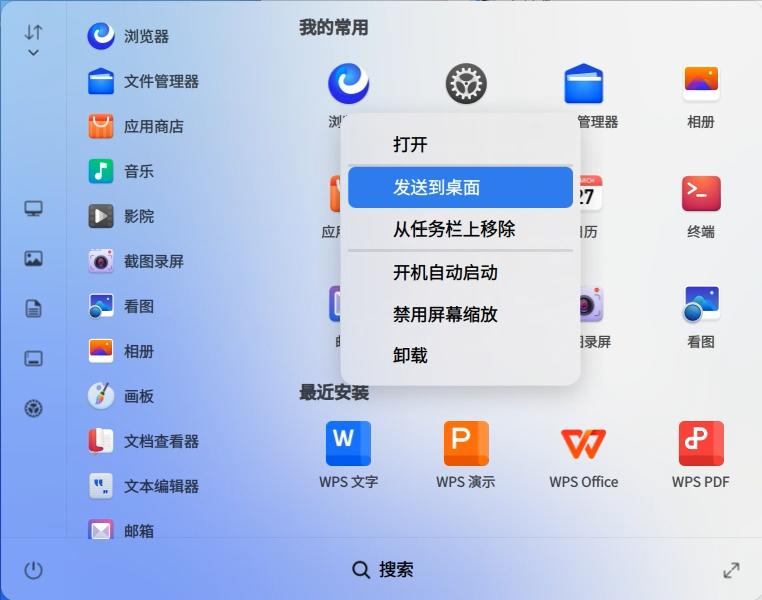

>  说明：您还可以从启动器拖曳应用图标到任务栏上放置。但是当应用处于运行状态时您将无法拖曳固定，此时您可以右键单击任务栏上的应用图标，选择 **驻留** 将应用固定到任务栏，以便下次使用时从任务栏上快速打开。

#### 删除快捷方式

您既可以在桌面直接删除应用的快捷方式，也可以在任务栏和启动器中删除。

**从任务栏上删除**

- 在任务栏上，按住鼠标左键不放，将应用图标拖曳到任务栏以外的区域移除快捷方式。
- 右键单击任务栏上的应用图标，选择 **移除驻留** 将应用从任务栏上移除。

**从启动器中删除**

在启动器中，右键单击应用图标，您可以：

- 单击 **从桌面上移除**，删除桌面快捷方式。
- 单击 **从任务栏上移除**，将固定到任务栏上的应用移除。

>  说明：以上操作，只能删除应用的快捷方式，而不会卸载应用。

### 安装应用

如果启动器中没有您需要的应用，可以在应用商店一键下载安装。

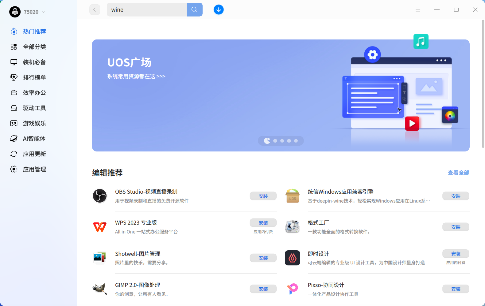

### 运行应用

对于已经创建了桌面快捷方式或固定到任务栏上的应用，您可以通过以下途径来打开应用。

- 双击桌面图标，或右键单击桌面图标选择 **打开**。
- 直接单击任务栏上的应用图标，或右键单击任务栏上的应用图标选择 **打开**。

在启动器中，直接单击应用图标打开，或右键单击应用图标选择 **打开**。

>  窍门：对于经常使用的应用，您可以在启动器中，右键单击应用图标选择 **开机自动启动**。

### 卸载应用

对于不再使用的应用，您可以选择将其卸载，以节省硬盘空间。

1. 在启动器中，右键单击应用图标。
2. 单击 **卸载**。

>  说明：部分系统应用不能被卸载。

## 控制中心

统信操作系统通过控制中心来管理系统的基本设置，包括账户管理、网络设置、时间日期设置、个性化设置、显示设置、系统升级等。当您进入桌面环境后，单击任务栏上的  即可打开控制中心窗口。

>  说明：在触控板上，二指从触控板右边缘向左滑动，显示控制中心；二指从触控板左边缘向右滑动，隐藏控制中心。

### 首页介绍

控制中心首页主要展示各个设置模块，方便日常查看和快速设置。

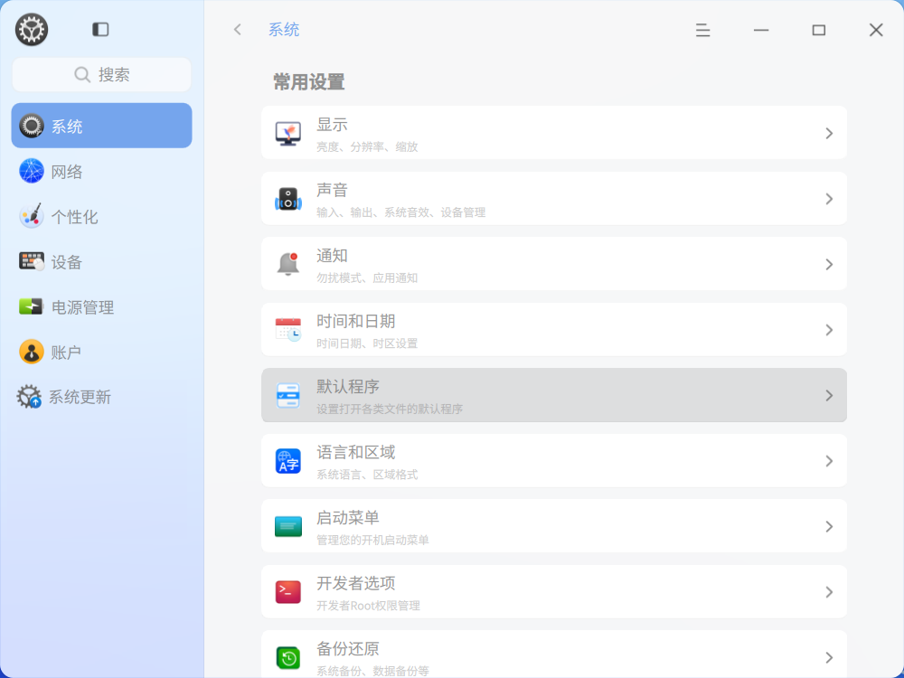

&nbsp;&nbsp;&nbsp;&nbsp;&nbsp;&nbsp;&nbsp;&nbsp;&nbsp;&nbsp;&nbsp;&nbsp;&nbsp;

打开控制中心的某一设置模块后，可以通过左侧导航栏快速切换到另一设置模块。

#### 标题栏

标题栏包含返回按钮、搜索框、主菜单及窗口按钮。

- 返回按钮 ：单击即可返回上一层级。
- 面包屑导航：点击返回对应页面层级。
- 搜索框：输入关键字，回车，搜索相应设置。
- 主菜单：单击打开主菜单。在主菜单中，可以设置窗口主题、查看版本或退出控制中心。

### 显示设置

设置显示器的亮度、分辨率、屏幕方向以及缩放倍数等，让您的电脑显示达到最佳状态。

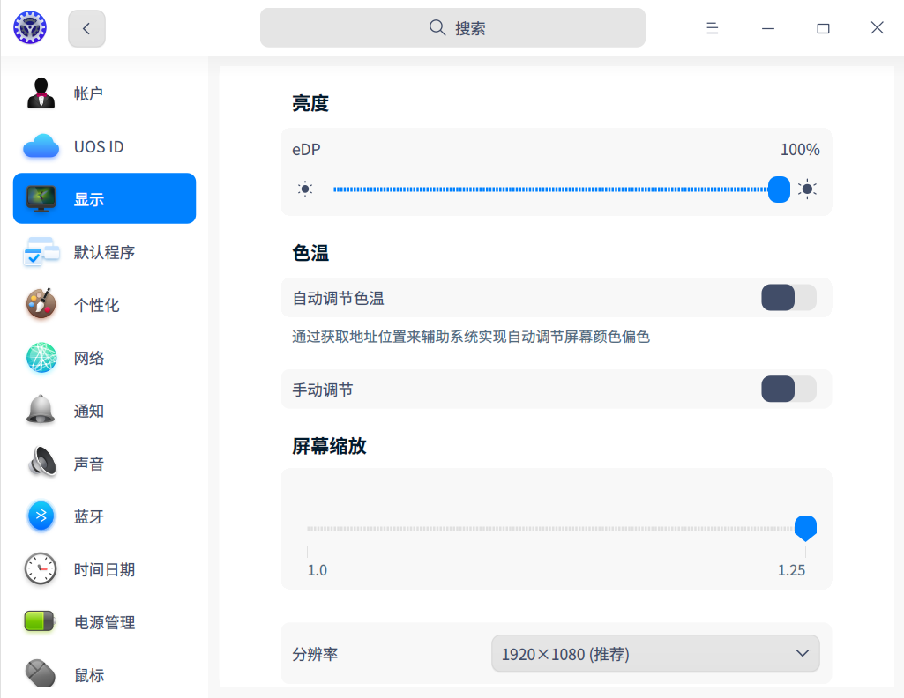

#### 单屏设置

当显示屏为单屏时，可以调节显示屏亮度、分辨率、刷新率、显示方向等。

##### 调节亮度

当设备或配置支持亮度调节功能时，才显示亮度模块，您可以进行如下操作。

1. 在控制中心侧边栏选择 **系统**，单击 **显示**。
2. 在亮度区域，拖动亮度条滑块，调节屏幕亮度。

##### 设置屏幕缩放

当桌面和窗口显示过大或过小时，您可能需要调节屏幕缩放，以便正常显示。

1. 在控制中心侧边栏选择 **系统**，单击 **显示**。
2. 单击选择下拉框，在下拉框中选择调整缩放倍数。
3. 注销后重新登录系统屏幕缩放操作即可生效。

>  说明：
> 
> - 当检测到屏幕为高分屏时，会自动调整缩放倍数。
> - 部分应用不支持屏幕缩放，您可以在启动器中右键单击该应用，选择 **禁用屏幕缩放**，以获得更好的显示效果。

##### 更改分辨率

1. 在控制中心侧边栏选择 **系统**，单击 **显示**。
2. 在分辨率区域的下拉列表中，选择合适的分辨率参数。
3. 单击 **保存**。

##### 设置桌面显示

当显卡支持桌面显示功能且分辨率设置为非推荐分辨率时，您可以进行如下操作。

1. 在控制中心侧边栏选择 **系统**，单击 **显示**。
2. 在桌面显示区域的下拉列表中，选择一种合适的桌面显示效果。

##### 设置屏幕刷新率

1. 在控制中心侧边栏选择 **系统**，单击 **显示**。
2. 在刷新率区域的下拉列表中，选择一个合适的刷新率。
3. 单击 **保存**。

##### 改变屏幕方向

1. 在控制中心侧边栏选择 **系统**，单击 **显示**。
2. 在方向区域的下拉列表中，选择一个合适的方向参数，改变屏幕方向。
3. 单击 **保存**。

##### 设置护眼模式

当设备或配置支持护眼功能时，才显示护眼模块，您可以进行如下操作。

1. 在控制中心侧边栏选择 **系统**，单击 **显示**。
2. 在 **护眼模式** 区域，可以：
   - 打开 **护眼模式** 开关，进入护眼模式。
   - 设置护眼模式生效时间，在时间区域，可以在下拉菜单中选择生效时间，包括“全天”、“日落到日出”、“自定义”，默认为“全天”。
   - 设置护眼色温值，在色温区域，可以手动拖动色温条滑块调节屏幕色温。

#### 多屏设置

多屏显示可以让屏幕的视野无限延伸，使用 VGA、HDMI、DP 等线缆将电脑和另一台显示器、投影仪等连接起来，电脑上的内容即可同时在多个屏幕中显示。当电脑设备连接上另一台显示设备，多屏显示模式设置模块才会出现。

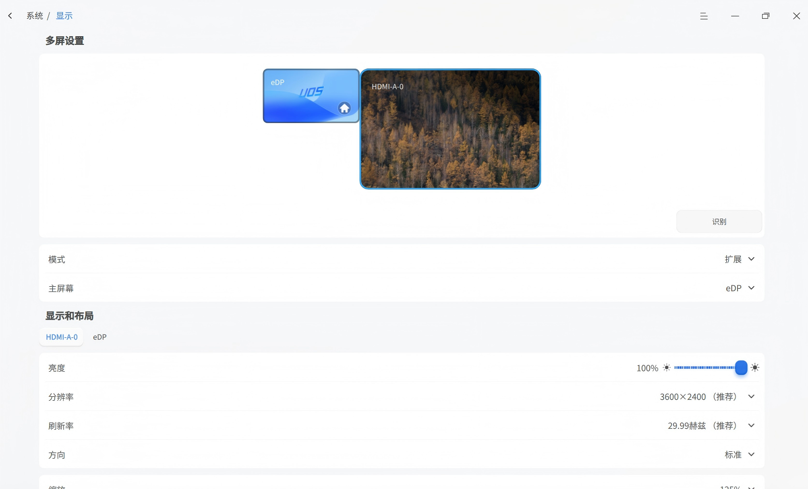

1. 在控制中心侧边栏选择 **系统**，单击 **显示**。
2. 在多屏设置区域，**模式** 下拉框中选择屏幕显示样式。
   - **复制** 将主屏的显示内容复制到其他屏幕。
   - **扩展** 将主屏的显示内容扩展到其他屏幕，扩大桌面区域。
   - **仅在xxx显示** 只在某个屏幕显示内容。

多屏复制或扩展模式时，单击识别后，多个屏幕中央出现屏幕名称。

多屏扩展模式时，集合窗口将其他屏幕的设置窗口集合到该屏幕中心位置展示。

- 主屏集合窗口，主屏设置窗口置于底层，副屏窗口在其上面。
- 副屏集合窗口，当前副屏设置窗口置于顶层，主屏设置窗口在底层。

>  说明：多屏扩展模式时，在控制中心 “个性化 > 任务栏”界面，多屏显示设置区域，任务栏设置包含 **仅主屏显示**、**跟随鼠标位置显示** 两个互斥选项。

在多屏环境下，按下快捷键 **Super** + **P** 调出多屏显示模式的 OSD。
详细操作方法如下。

1. 按住 **Super** 不放，再按下 **P** 或鼠标单击来进行模式选择。
2. 松开按键，确认选择，模式生效。

>  说明：当多屏显示时，副屏也支持桌面图标显示、右键菜单操作等功能。

多屏屏幕亮度、色温、屏幕缩放、分辨率、刷新率、方向等的设置方式与单屏设置方式相同，详细操作方法请参考 [单屏设置](#单屏设置)。

### 触控屏设置

当接入触控屏时，您可以设置所在屏幕，并对其进行调整。

1. 在控制中心侧边栏选择 **系统**，单击 **触控屏**。
2. 对屏幕进行设置后，单击 **确定**。

### 默认程序设置

当安装有多个功能相似的应用程序时，可以通过右键菜单或控制中心为某种类型的文件指定某个应用作为打开文件的默认程序。

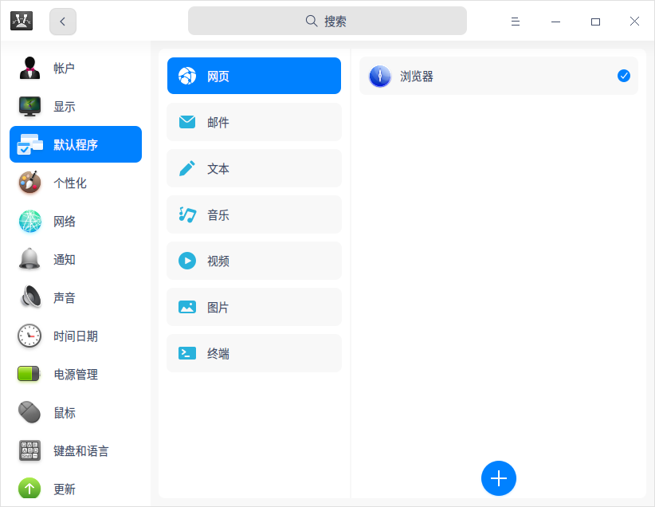

#### 设置默认程序

1. 右键单击文件，选择 **打开方式** > **选择默认程序**。
2. 选择一个应用，自动勾选"设为默认"，单击 **确定**。
3. 该应用将自动添加到控制中心的默认程序列表。

#### 更改默认程序

1. 在控制中心侧边栏选择 **系统**，单击 **默认程序**。
2. 选择一个文件类型进入默认程序列表。
3. 在列表中选择另一个应用程序。

#### 添加默认程序

1. 在控制中心侧边栏选择 **系统**，单击 **默认程序**。
2. 选择文件类型进入默认程序列表。
3. 单击列表下的 **添加默认程序** 按钮 **添加**，选择 desktop 文件（一般在/usr/share/applications)，或特定的二进制文件。
4. 将程序添加到程序列表并勾选该程序，则可设置为默认程序。

#### 删除默认程序

在默认程序列表中，您只能删除自己添加的应用程序，不能删除系统已经安装的应用。要删除系统已经安装的应用，只能卸载应用。卸载后该应用将自动从默认程序列表中删除。

可用以下方法删除自己添加的默认程序。

1. 在控制中心侧边栏选择 **系统**，单击 **默认程序**。
2. 选择文件类型进入默认程序列表。
3. 单击程序后面的 ，删除默认程序。

### 个性化设置

在控制中心个性化设置模块可以进行一些通用的个性化设置，包括系统主题、活动用色、字体、窗口特效和不透明度，改变桌面和窗口的外观。除此之外还可设置图标主题、光标主题和字体。

#### 设置窗口主题

1. 在控制中心侧边栏选择 **个性化**。
2. 单击 **主题**，选择一种系统主题。
3. 该主题即为系统主题。

#### 外观

外观调整主题的浅色、深色模式。

1. 在控制中心侧边栏选择 **个性化** 。
2. 单击 **外观** 选择框选择模式，可选择 **浅色、深色**及**自动**，选择自动模式，更具日出、日落时间切换深浅外观。

>  说明：自动外观表示根据当前时区的时间，根据日出日落的时间自动更换窗口主题。日出后是浅色，日落后是深色。

#### 桌面和任务栏设置

在"个性化 > 桌面和任务栏"设置界面，可以对任务栏的模式、位置、状态等进行设置。

1. 在控制中心侧边栏选择 **个性化**  。
2. 单击 **桌面和任务栏**，进入桌面和任务栏设置界面，您可以：
   - 选择任务栏模式为经典模式或居中模式。
   - 通过拖曳任务栏大小滑块改变任务栏大小。
   - 设置位置为上、下、左或右。
   - 设置显示状态为一直显示、一直隐藏或智能隐藏。
   - 插件区域：勾选或取消勾选插件区域的插件，设置其在任务栏上的显示和隐藏效果。

多屏扩展模式时，任务栏位置可以设置为跟随鼠标位置显示，或仅主屏显示。

#### 窗口效果

窗口效果的表现依赖硬件性能，您可以切换不同的窗口效果，选择操作体验最佳的模式。

1. 在控制中心侧边栏选择 **个性化**  。
2. 单击 **窗口效果**，进入窗口设置界面，您可以：
   - **界面效果** 选择 **最佳性能**，可关闭所有界面和窗口特效，保障系统高效运行。
   - **界面效果**选择 **均衡**，可限制部分窗口特效，保障出色的视觉效果，同时维持系统流畅运行。
   - **界面效果** 选择 **最佳视觉**，可启用所有界面和窗口特效，体验最佳视觉效果。
   - 窗口圆角 可选择 无、小、中、大。
   - 窗口移动时启用透明特效，开启或关闭。开启时，移动窗口触发透明特效。
   - 窗口最小化时效果，可以切换使用 **缩放** 效果 或 **魔灯** 效果  。
   - 设置任务栏、启动器（小窗口模式）的不透明度。滑块越靠左越透明，越靠右越不透明。
   - 修改滚动条显示方式，可选择滚动时显示或一直显示。
   - 设置标题栏高度，拖动 **标题栏高度** 的滑块，调节标题栏高度，可实时预览高度效果。

>  说明：此功能仅适用于窗口管理器绘制的应用标题栏。

#### 壁纸

选择一些精美、时尚的壁纸来美化桌面，让您的电脑显示与众不同。

1. 在桌面上，单击鼠标右键，单击 **设置壁纸**，进入控制中心预览所有壁纸。
2. 您可以选择我的图片、系统壁纸或纯色壁纸3种壁纸类型。
3. 单击选择某一壁纸后，壁纸就会在桌面中生效。
4. 在壁纸上右键单击 **设置锁屏** ，壁纸会在锁屏中生效。

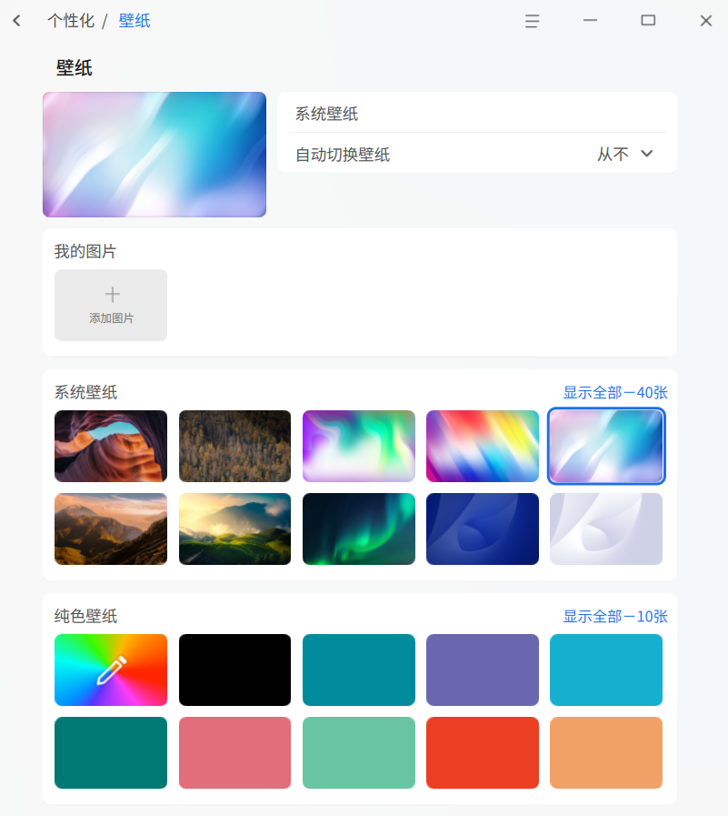

>  窍门：
> 
> - 您可以在自动切换壁纸选项中设置自动更换壁纸的时间间隔，您还可以设置在“登录时”和“唤醒时”自动更换壁纸。
> - 您还可以在图片查看器中设置您喜欢的图片为桌面壁纸，或前往应用商店搜索壁纸下载您喜欢的壁纸。

#### 屏幕保护

屏幕保护程序原本是为了保护显像管，现在一般用来防范他人偷窥您电脑上的一些隐私。

1. 在 控制中心>个性化 中，单击 **屏幕保护** 进入屏保设置界面，预览所有屏保。
2. 您可以选择图片轮播屏保或系统屏保2种屏保类型。
3. 选中一个屏保后，设置闲置时间，待电脑空闲至指定时间后，将启动您选择的屏幕保护程序。
4. 选择图片轮播屏保后，在个性化屏保选项中单击 **设置** 打开设置窗口，可以自定义选择图片路径、轮播间隔、设置随机轮播。
5. 您可以开启 **恢复时需要密码**，以便更好地保护您的隐私。

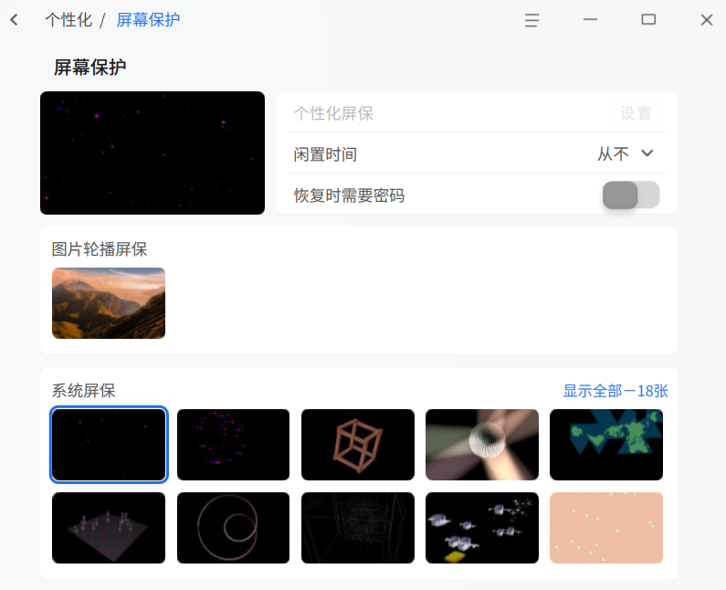

#### 颜色和图标

1. 在控制中心侧边栏选择 **个性化**  。
2. 单击 **颜色和图标**，进入颜色和图标设置界面，您可以：
   - 活动用色 可选择颜色实时查看效果，调整选中某一选项时的强调色。
   - 图标主题 可选择图标主题，可调整选择系统提供的图标主题，也可通过商店下载及自定义导入的图标主题在此进行切换。 
   - 单击 **光标主题**，选择一款光标样式。

#### 字体和字号

1. 在控制中心侧边栏选择 **个性化**  。
2. 单击 **字体和字号**，进入设置字体界面。
3. 设置系统字号和字体。

### 网络设置

登录系统后，您需要连接网络，才能接收邮件、浏览新闻、下载文件、聊天、网上购物等。

>  窍门：您可以单击任务栏的快捷面板，设置、查看当前网络状态。

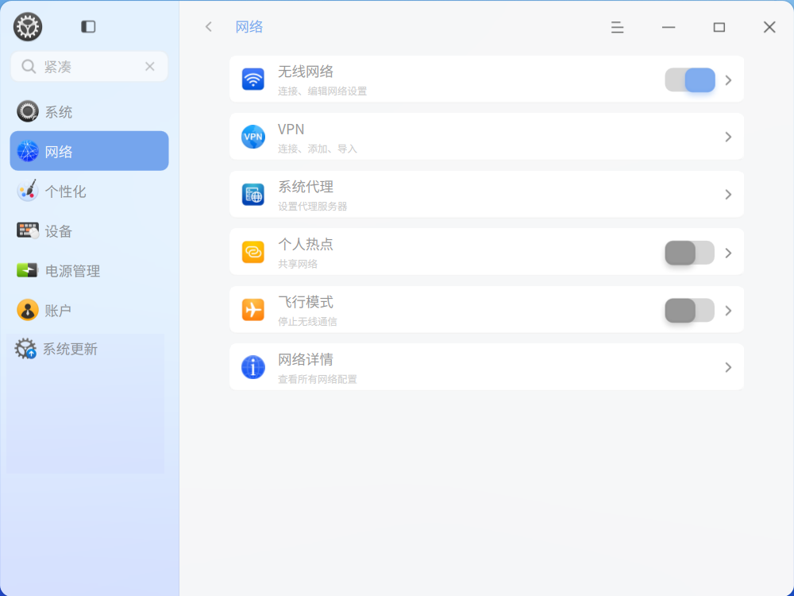

#### 有线网络

有线网络安全快速稳定，是最常见的网络连接方式。当您设置好路由器后，把网线两端分别插入电脑和路由器，即可连接有线网络。

1. 将网线插入电脑上的网络插孔。
2. 将网线的另一端插入路由器或网络端口。
3. 在控制中心侧边栏选择 **网络**。
4. 单击 **有线网络**，进入有线网络设置界面。
5. 打开 **有线网卡**，开启有线网络连接功能。
6. 当网络连接成功后，桌面上方将弹出“已连接有线连接”的提示信息。

您还可以在有线网络的设置界面，编辑或新建有线网络设置。

#### 无线网络

无线网络帮助您摆脱线缆的束缚，上网形式更加灵活，支持更多设备使用。

##### 连接无线网络

1. 在控制中心侧边栏选择 **网络** 。
2. 单击 **无线网络**，进入无线网络设置界面。
3. 打开 **无线网卡**，开启无线网络连接功能。
4. 电脑会自动搜索并显示附近可用的无线网络。
5. 选择需要连接的无线网络。
   - 如果该网络是开放的，将自动连接到此网络。
   - 如果该网络是加密的，请根据提示输入密码，单击 **连接**，然后将自动完成连接。

##### 连接隐藏网络

为了防止他人扫描到自己的无线网络，进而破解无线网络 密码连接您的网络，您可以在路由器设置界面隐藏无线网络。设置后，您需要手动连接隐藏网络才能上网。

1. 在控制中心侧边栏选择 **网络** 。
2. 单击 **无线网络**，进入无线网络设置界面。
3. 单击 **连接到隐藏网络**。
4. 输入网络名称SSID和其他必填选项。
5. 单击 **保存** 。

#### 个人热点

通过个人热点将计算机网络信号转换为无线网络热点，以供一定距离内的其他设备无线连接。要开启无线热点，计算机必须装有支持热点功能的无线网卡。

1. 在控制中心侧边栏选择 **网络**。
2. 单击 **个人热点**。
3. 打开 **热点** 开关，设置热点信息。
4. 单击 **保存** 。

#### 飞行模式

开启飞行模式可以禁用无线网络、个人热点和蓝牙。除了在控制中心，您也可以在任务栏快捷面板中单击飞行模式开关来开启或者关闭飞行模式。

1. 在控制中心侧边栏选择 **网络** 。
2. 单击**飞行模式**。
3. 打开开关开启飞行模式。

> 注意：如果您的电脑没有无线网卡，也没有蓝牙模块，系统将不会展示飞行模式相关界面。

#### 拨号网络

拨号上网（DSL）是指通过本地电话拨号连接到网络的连接方式。配置好调制解调器，通过网线连接调制解调器的网口和电脑的网口后，创建宽带拨号连接，输入运营商提供的用户名和密码，即可拨号连接到 Internet 上。

##### 新建拨号连接

1. 在控制中心侧边栏选择 **网络** 。
2. 单击 **DSL**，并单击 **创建PPPoE连接** 按钮 。
3. 输入宽带名称、账户、密码。
4. 单击 **保存**，系统自动创建宽带连接并尝试连接。

#### VPN

VPN 即虚拟专用网络，其主要功能是在公用网络上建立专用网络，进行加密通讯。无论您是在外地出差还是在家中办公，只要能上网就能利用 VPN 访问企业的内网资源。您还可以使用 VPN 加速访问其他国家的网站。

1. 在控制中心侧边栏选择 **网络** 。
2. 单击 **VPN**，选择 **添加 VPN** 按钮   或 **导入 VPN** 按钮。
3. 选择 VPN 协议类型，并输入名称、网关、用户名、密码等信息。（导入 VPN 会自动填充信息）
4. 单击 **保存**，系统自动尝试连接 VPN 网络。
5. 您可以将 VPN 设置导出，备用或共享给其他用户。

>  说明：打开 **仅用于相对应的网络上的资源** 开关，可以不将 VPN 设置为默认路由，只在特定的网络资源上生效。

#### 系统代理

1. 在控制中心侧边栏选择 **网络** 。
2. 单击 **系统代理**，进入系统代理界面。
3. 开启系统代理，在代理类型后的下拉框中选择 **手动** 或 **自动**。
   - 选择 **手动**，需要配置代理服务器的地址和端口等信息。
   - 选择 **自动**，需要配置 URL，系统将自动配置代理服务器的信息。
4. 单击 保存。

#### 应用代理

1. 在控制中心侧边栏选择 **网络** 。
2. 单击 **应用代理**。
3. 设置代理类型、IP 地址、端口等应用代理参数。
4. 单击 **保存**。

>  说明：应用代理设置成功后，打开启动器，右键单击应用图标，可以选择 **使用代理**。

#### 网络详情

在网络详情界面，您可以查看 MAC 地址、IP 地址、网关和其他网络信息。

1. 在控制中心侧边栏选择 **网络** 。
2. 单击 **网络详情**，进入网络信息界面。
3. 查看当前有线网络或无线网络的信息。

### 通知设置

设置通知勿扰模式，开启或关闭某些应用的通知显示。

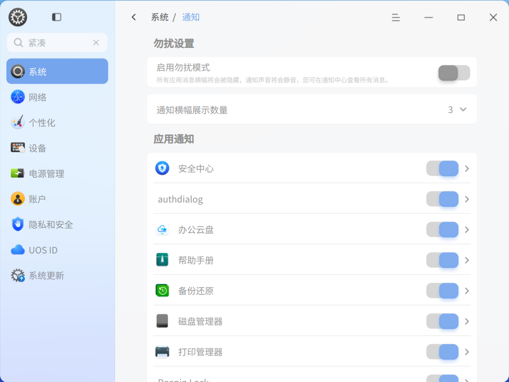

#### 设置系统通知

设置系统通知的勿扰模式。

1. 在控制中心侧边栏选择 **系统** 。

2. 单击 **通知**，进入系统通知界面。
   
   - 开启或关闭勿扰模式。
      当开启勿扰模式后，可以设置勿扰模式的开启时间、结束时间；也可以设置 **在屏幕锁屏时** 显示通知。开启勿扰模式可以使所有通知静音，但您可以在通知中心查看所有消息。

#### 设置应用通知

自定义设置个性化的应用通知显示。

1. 在控制中心侧边栏选择 **系统**，单击 **应用通知**。
2. 在应用通知区域选择一个应用，开启后，您可以选择：
   - 开启、关闭通知时提示声音
   - 在通知中心或在桌面显示
   - 是否显示消息预览

### 声音设置

输入输出设备声音的设置（如设置扬声器和麦克风），让您听得更舒适，录音更清晰。

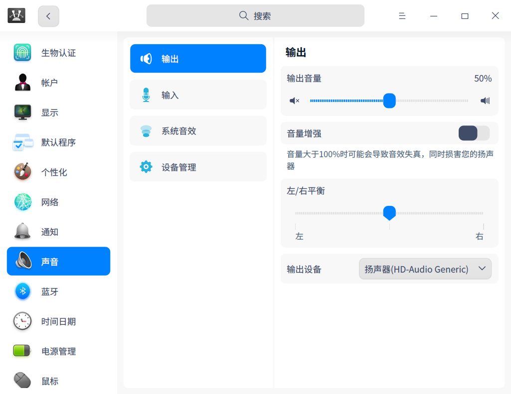

#### 输出设置

1. 在控制中心侧边栏选择 **系统**，单击 **声音**。
2. 进入声音设备配置界面，您可以进行输出设置 ：
   - 通过拖曳滑块调节输出音量和左/右声道平衡。
   - 打开 **音量增强**，音量的可调节区间由0~100% 转变为0~150%。
   - 打开 **单声道音频**，输出声音将左、右声道合并为一个声道。
   - 打开 **插拔管理**，外设拔出时音频输出将自动暂停。
   - 在输出设备后面的下拉框中选择输出设备类型。

#### 输入设置

1. 在控制中心侧边栏选择 **系统**，单击 **声音**。
2. 进入声音设备配置界面，您可以进行输入设置 ：
   - 通过拖曳音量滑块调节输入音量。
   - 打开启用开关，还可以设置 **噪音抑制** 功能。
   - 在输入设备后面的下拉框中选择输入设备类型。

>  窍门：通常，需要调大输入音量，确保能够听到声源的声音，但是音量不宜过大，因为这会导致声音失真。可以对着输入设备如麦克风以正常说话的音量讲话，并观察反馈音量的变化，变化较明显，则说明输入音量合适。

#### 系统音效

1. 在控制中心侧边栏选择 **系统**，单击 **声音**。
2. 单击 **系统音效**，勾选选项，开启某一事件发生时的声音效果。

>  窍门：您可以单击试听音效。

#### 设备管理

1. 在控制中心侧边栏选择 **系统**，单击 **声音**。
2. 单击 **设备管理**，开启/禁用输入设备、输出设备。

### 蓝牙设置

蓝牙能够实现短距离的无线通信。通过蓝牙无需网络或连接线就可以与附近的其它蓝牙设备连接。常见的蓝牙设备包括：蓝牙键盘、蓝牙鼠标、蓝牙耳机、蓝牙音响等。

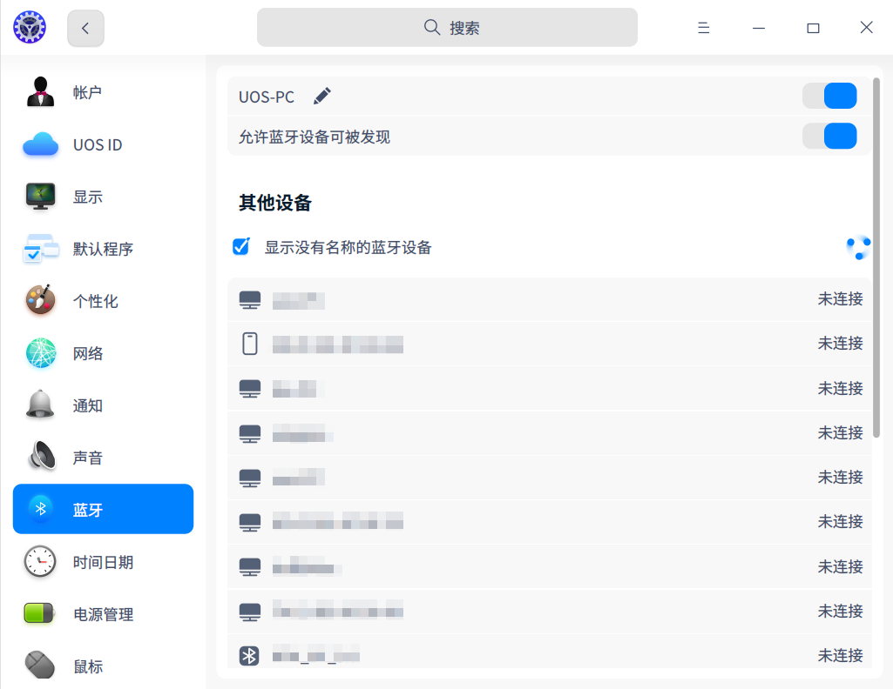

&nbsp;&nbsp;&nbsp;&nbsp;&nbsp;&nbsp;&nbsp;&nbsp;&nbsp;&nbsp;&nbsp;&nbsp;&nbsp;

>  说明：当笔记本电脑配备了蓝牙时，您可以直接开启蓝牙开关；当台式电脑没有配备蓝牙时，您可以购买蓝牙适配器，插入到电脑的USB端口中，再使用蓝牙。

#### 修改蓝牙名称

1. 在控制中心侧边栏选择 **设备**，单击 **蓝牙**。
2. 单击蓝牙名称旁的 **修改** 按钮，输入本机新的蓝牙名称。

>  说明：修改蓝牙名称后，将自动对外广播蓝牙设备的新名字，需要其他设备重新进行搜索。

#### 连接蓝牙设备

1. 在控制中心侧边栏选择 **设备**，单击 **蓝牙**。
2. 开启 **蓝牙**，系统将自动扫描附近的蓝牙设备，并显示在 **其他设备** 列表。
3. 单击想连接的蓝牙设备，在该设备上输入蓝牙配对码（若需要），配对成功后将自动连接。
4. 连接成功后，蓝牙设备会添加到 **我的设备** 列表中。
5. 在我的设备列表中单击该设备，您可以 **断开连接**，或修改设备名称。

#### 使用蓝牙传送/接收文件

 UOS PC 与非 UOS PC 或者UOS PC 与移动设备（手机/平板）之间通过蓝牙设备传送/接收文件。

前提条件：发送端蓝牙设备与接收端蓝牙设备已配对并连接成功。

**使用UOS PC端蓝牙传送文件**

场景：发送端通过蓝牙向接收端传送文件。

1. 在控制中心侧边栏选择 **设备**，单击 **蓝牙**。
2. 开启 **蓝牙**，系统将自动扫描附近的蓝牙设备。
3. 进入“我的设备”选择已配对连接的蓝牙设备，单击已连接设备的 更多 按钮进入详情，单击 **发送文件** 按钮（仅 PC/手机/平板的蓝牙设备有该按钮)，在弹出的文件管理器窗口中选择要发送的文件，单击 **打开**。
4. 在弹出的 “蓝牙文件传输” 窗口中，选择接收此文件的蓝牙设备，单击 **发送**，发送传输文件请求。

**使用手机端蓝牙传送文件**

场景：发送端（以安卓手机为例）通过蓝牙向接收端传送文件。

1. 开启 **蓝牙**，系统将自动扫描附近的蓝牙设备。
2. 选择已配对并连接成功的蓝牙设备。
3. 在手机中选择文件，单击 **发送**，通过蓝牙发送文件。

**使用蓝牙接收文件**

发送端发送文件后，接收端弹出提示窗口，用户可以单击 **接受** 或 **拒绝** 文件。

- 如果接收端蓝牙设备同意接收，则发送端开始传输文件并显示发送文件窗口，文件传输完成后，接收端会弹出提示信息，用户可以查看接收成功的文件。
- 如果接收端为如下情况，发送端部分文件传输失败，会显示在传输失败列表。
  - 接收端蓝牙设备选择拒绝，则结束传输，显示传输失败。
  - 接收端蓝牙设备超时未操作或超出传输范围，则显示传输失败（蓝牙设备连接失败）。
  - 接收端既不单击接收也不单击拒绝，默认1分钟后则结束传输，显示传输失败。

### 时间和日期

选择正确的所在时区，即可在电脑上显示所在地的时间和日期，也可以手动修改时间和日期。

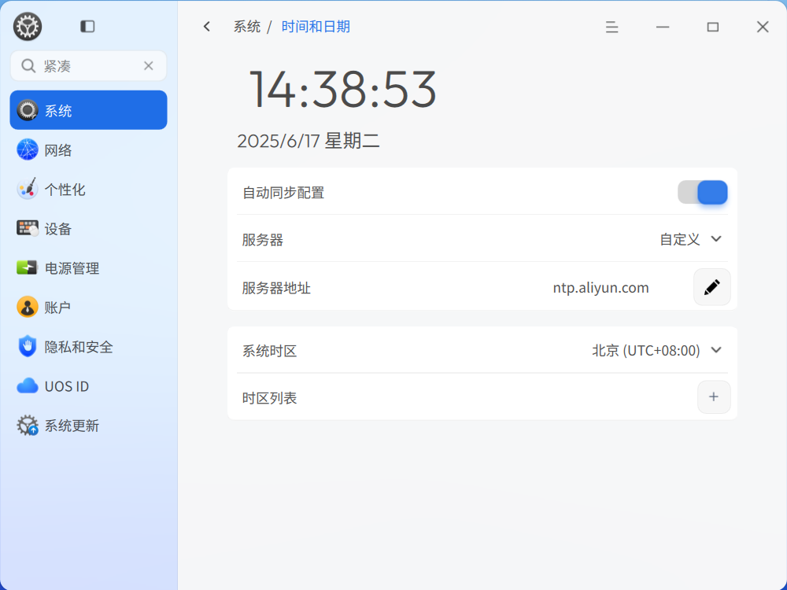

#### 修改时间和日期

默认情况下，系统通过网络自动同步该时区的本地时间和日期。您也可以关闭自动同步配置，手动修改时间和日期。

1. 在控制中心侧边栏选择 **系统**，单击 **时间和日期**。
2. 关闭 **自动同步配置**。
3. 手动设置正确的时间和日期。
4. 单击 **确定**。

>  说明：您还可以打开 **自动同步配置**、设置服务器同步参数。也可填加其他时区服务器地址，进行自动同步。

#### 修改时区

在您安装系统时，已选择了系统时区。若要修改系统时区，请按如下步骤设置。

1. 在控制中心侧边栏选择 **系统**，单击 **时间和日期**。
2. 单击 **修改系统时区**， 通过搜下拉框选择时区。

#### 添加时区

您可以同时使用多个时区，以便查看另一时区的时间。

1. 在控制中心侧边栏选择 **系统**，单击 **时间和日期**。
2. 单击时区列表中 **添加** 按钮 ，通过搜索或单击地图选择时区。
3. 单击 **添加**。

#### 删除时区

1. 在控制中心侧边栏选择 **系统**，单击 **时间和日期**。
2. 单击 **时区列表**。
3. 单击时区列表后面的 **编辑**。
4. 单击 **删除** 按钮 ，删除已添加的时区。

### 电源管理

对系统电源进行一些设置，让笔记本电池更耐用，让系统更安全。

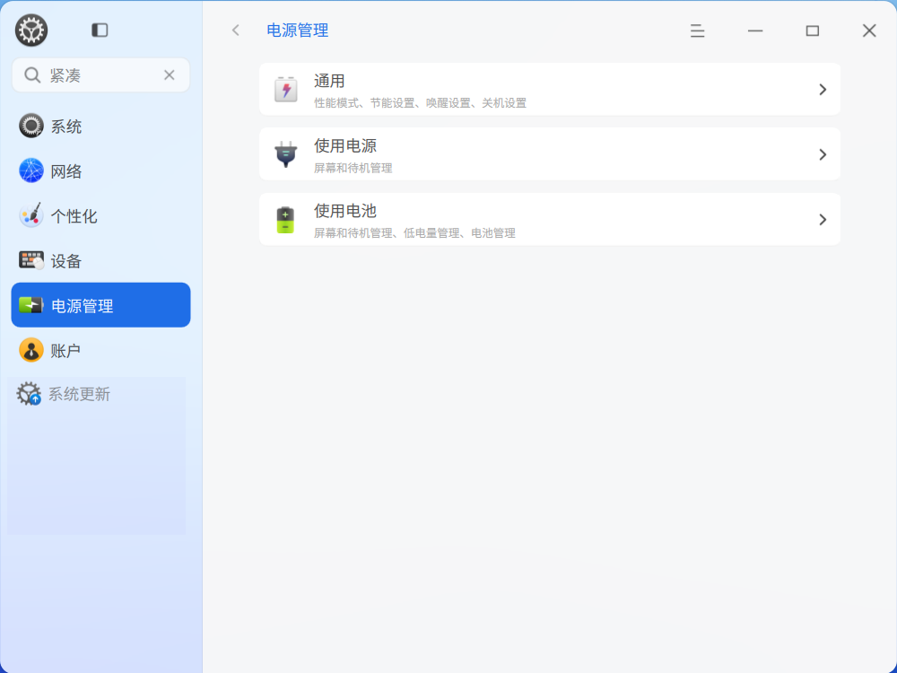

&nbsp;&nbsp;&nbsp;&nbsp;&nbsp;&nbsp;&nbsp;&nbsp;&nbsp;&nbsp;&nbsp;&nbsp;&nbsp;

#### 调整性能模式

1. 在控制中心侧边栏选择 **电源管理**。
2. 单击 **通用**。
3. 在性能模式区域，选择 **平衡模式**、**高性能模式** 或 **节能模式**。

#### 设置节能模式

为降低电脑的耗电量，您可以对节能模式进行设置，降低屏幕亮度。

1. 在控制中心侧边栏选择 **电源管理**。
2. 单击 **通用**。
3. 选择 **节能模式**。
4. 在节能设置下：
   - 打开 **低电量时自动开启** 节能模式（仅笔记本电脑支持）。
   - 设置 **低电量阈值** 下拉选项中选择电量到达所设置的阈值后自动进入节能模式。
   - 打开 **使用电池时自动开启** 节能模式（仅笔记本电脑支持）。
   - 拖动 **自动降低亮度** 条滑块，调节节能模式开启时屏幕亮度。

>  说明：当关闭 **使用电池时自动开启** 节能模式时，则直接进入 **平衡模式**。

#### 唤醒设置

1. 在控制中心侧边栏选择 **电源管理**。
2. 单击 **通用**。
3. 在 唤醒设置 区域设置：
   - 打开 **待机恢复时需要密码**，开启待机唤醒时需重新登录设置。
   - 打开**唤醒显示器时需要密码**，开启唤醒时需重新登录设置。

#### 关机设置

1. 在控制中心侧边栏选择 **电源管理**。
2. 单击 **通用**。
3. 在 **关机设置** 区域设置：
   - 设置 **定时关机时间**，可输入时间或通过控件调整默认关机时间。
   - 设置 **重复频次**，可设定单次、工作日重复、每天重复或自定义

#### 设置显示器关闭时间

1. 在控制中心侧边栏选择 **电源管理**。
2. 单击 **使用电源** 或 **使用电池**。
3. 选择关闭显示器的时间。

>  说明：笔记本电脑用户可以在“使用电源”和“使用电池”下对同一设置项分别设置不同的时间。

#### 设置电脑待机时间

1. 在控制中心侧边栏选择 **电源管理**。
2. 单击 **使用电源** 或 **使用电池**。
3. 选择电脑开始待机的时间。

>  窍门：笔记本电脑用户还可以开启 **合上笔记本时待机**，以便在使用电源时合盖待机。

#### 设置自动锁屏时间

1. 在控制中心侧边栏选择 **电源管理**。
2. 单击 **使用电源** 或 **使用电池**。
3. 选择自动锁屏的时间。

#### 设置合盖显示状态

1. 在控制中心侧边栏选择 **电源管理**。
2. 单击 **使用电源** 或 **使用电池**。
3. 设置 **笔记本合盖时** 为 **待机**、**休眠**、**关闭显示器** 或 **无任何操作**。

>  说明：仅笔记本电脑支持设置合盖显示状态。

#### 设置按电源按钮时显示状态

1. 在控制中心侧边栏选择 **电源管理**。
2. 单击 **使用电源** 或 **使用电池**。
3. 选择按电源按钮时的显示状态 **关机**、**待机**、**休眠**、**关闭显示器** 、**进入关机界面**或 **无任何操作**，更改按电源按钮时的设置。

#### 低电量管理

1. 在控制中心侧边栏选择 **电源管理**。
2. 单击 **使用电池**。
3. 设置 低电量管理 ：
   - 打开 **低电量提醒**，当电池剩余电量低于设置的阈值（例如，20%）时，系统会发出低电量通知。
   - 低电量自动进入状态设置，可设置为自动待机或自动休眠。
   - 设置低电量阈值，可通过下拉框设置进入低电量阈值的电池量阈值。

>  说明：仅笔记本电脑支持设置低电量通知。

#### 电池管理

1. 在控制中心侧边栏选择 **电源管理**。
2. 单击 **使用电池**。
3. 在 **电池管理** 区域：
   - 可设置打开 **显示剩余使用时间及剩余充电时间** 开关，调整任务栏显示电量信息。
   - 显示最大电池容量信息。

### 账户

在安装系统时会创建一个账户，在控制中心的账户设置模块可以修改账户设置或创建一个新账户。

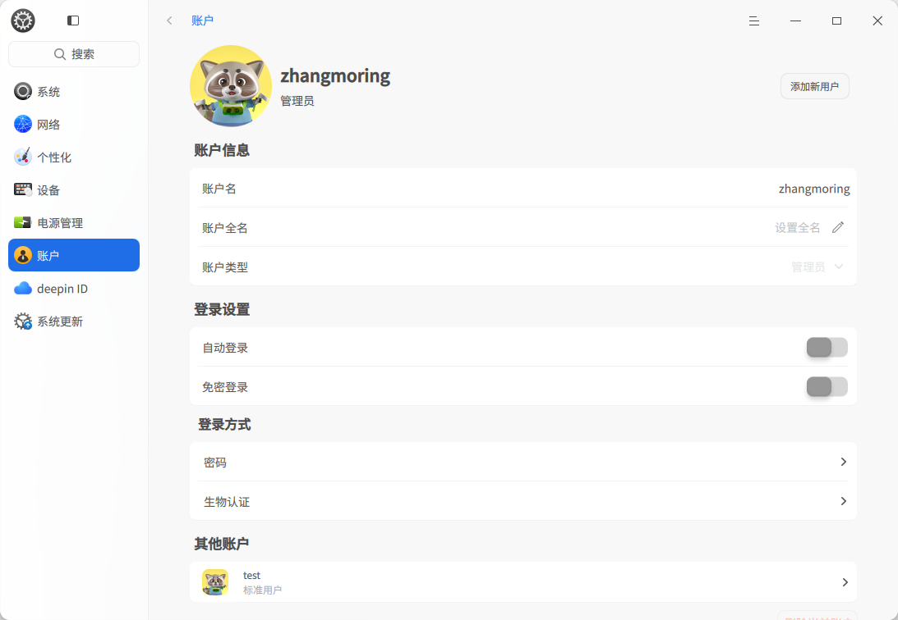

#### 创建新账户

1. 单击 **添加新用户** 按钮。
2. 选择账户类型，设置用户名、全名、密码、重复密码、密码提示信息。
3. 单击 **创建**。
4. 在授权对话框输入当前账户的密码，新账户就会添加到账户列表中。

>  窍门：您还可以将标准用户的账户类型设置为管理员。

#### 更改头像

鼠标移动至账户头像，会出现 **编辑**，点击头像，选择一个头像或添加本地头像，头像就替换完成了。

#### 设置全名

账户全名会显示在账户列表和系统登录界面，可根据需要设置。

单击 **设置全名** 后的 ，输入账户全名。

#### 自动登录

开启“自动登录”后， 下次启动系统时（重启、开机）可直接进入桌面。在锁屏和注销后再次登录需要密码。

打开 **自动登录** 开关，在弹出的授权对话框中输入当前账户密码并确定后，开启自动登录功能。

#### 免密登录

开启“免密登录”后，下次登录系统（重启，开机，和在注销后再次登录）和解锁时，不需要密码。

打开 **免密登录** 开关，在弹出的授权对话框中输入当前账户密码并确定后，开启无密码登录系统。

>  窍门： 
> 
> - 若“免密登录”和“自动登录”同时打开，下次启动系统（重启、开机）则直接进入桌面。

#### 登录方式

可对当前支持的登录方式进行编辑和配置。

**密码-修改密码**

1. 单击 **密码**，进入密码二级页面。
2. 输入当前密码、新密码和重复密码，单击 **保存**。

>  说明：管理员帐号过期之后需要先修改密码才能进行授权操作。

**密码-密码有效期**

1. 单击 **密码**，进入密码二级页面。
2. 设置密码有效天数，可以设置密码长期有效或具体的有效天数。

> 密码有效期自修改之日起开始计算。
> 
> 例如：用户A在9月1日修改了密码后，将密码有效期更改为30天。在这种情况下，密码可以在9月1日至9月30日这期间的30天正常使用。

**生物认证**

生物认证又称生物识别，是通过电脑利用人体所固有的生理特征或行为特征来进行个人身份鉴定。常用的生物认证有指纹识别、人脸识别。

当接入具备生物认证的硬件设备后，在系统中录入指纹、人脸信息，可以用来登录系统、解锁屏幕、授权特殊操作，还可以增强用户体验、提升系统使用效率、提高系统安全性。

>  说明：只有接入具备生物认证的硬件设备后才显示生物认证模块，才可以进行指纹、人脸密码设置。

**设置指纹密码**

指纹是指手指末端正面皮肤上凸凹不平的纹路。一般来讲，每个人的指纹是不同的，亦可设置为密码。

1. 进入生物认证的二级页面，在指纹板块，单击 **添加新的指纹** 。
2. 在授权对话框输入当前账户的密码后，使用指纹设备录入指纹。
3. 待指纹添加成功后单击 **完成**。

>  说明：您可以添加多个指纹密码；也可以删除一个个指纹密码。

**设置人脸识别**

1. 进入生物认证的二级页面，在人脸板块，单击 **添加新的人脸** 。
2. 在弹出的添加人脸数据对话框中，勾选 **我已阅读并同意《用户免责声明》**，并单击 **下一步**。
3. 单击 **同意并开始录入人脸**，单击 **下一步** 使用人脸识别设备录入人脸数据。
4. 单击 **完成**。

>  说明：一个帐号最多可录入5个人脸。

#### 删除账户

1. 单击其他未登录的账户。
2. 单击 **删除账户** 。
3. 在弹出的确认界面中单击 **删除**。

>  注意: 已登录的账户无法被删除。

### 鼠标和触控板

鼠标和触控板是电脑常用的输入设备。使用鼠标，可以使操作更加简便快捷。对于笔记本电脑用户，当没有鼠标时，也可以使用触控板代替鼠标进行操作。部分设备还支持指点杆，使用指点杆不需要将手指从基准键上移开便能操纵鼠标。在控制中心鼠标设置模块，用户可以对鼠标、触控板和指点杆进行设置，从而让设备使用体验更加符合自己的使用习惯。

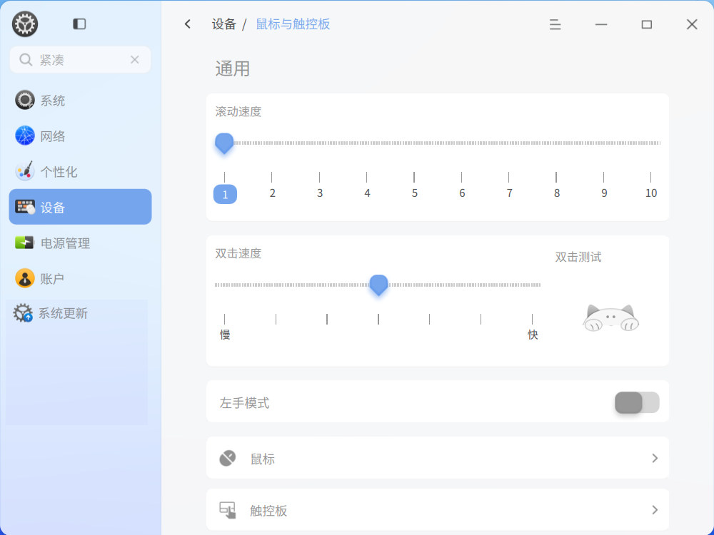

#### 通用设置

1. 在控制中心侧边栏选择 **设备**，单击 **鼠标与触控板**。

2. 在 **通用** 区域设置：
   
   - **滚动速度** 调节，拖动滑块调整数值越高滚动速度越快。
   
   - **双击速度** 条件，拖动滑块调整数值。
   
   - 开启 **左手模式**，适用于左手操作。
     
     >  说明：开启左手模式后，鼠标和触控板的左右键功能互换。

#### 鼠标设置

插入或连接鼠标后，在控制中心进行相关设置，让其更符合您的使用习惯。

>  说明：当没有触控板时，不会显示 “插入鼠标时禁用触控板”。

1. 在控制中心侧边栏选择 **设备**，单击 **鼠标与触控板**。
2. 单击 **鼠标**。
3. 调节 **指针速度**， 控制鼠标移动时指针移动的速度。
4. 开启 **鼠标加速**，调整鼠标移动响应速度。
5. 开启 插入鼠标时禁用触控板，在接入鼠标后触控板处于禁用状态。
6. 单击 **自然滚动** 开关，开启相应功能。

>  说明：
> 
> - 开启鼠标加速，提高了指针精确度，鼠标指针在屏幕上的移动距离会根据移动速度的加快而增加。可以根据使用情况开启或关闭。
> - 自然滚动开启后，鼠标滚轮向下滚动，内容会向下滚动；鼠标滚轮向上滚动，内容会向上滚动。

#### 触控板设置

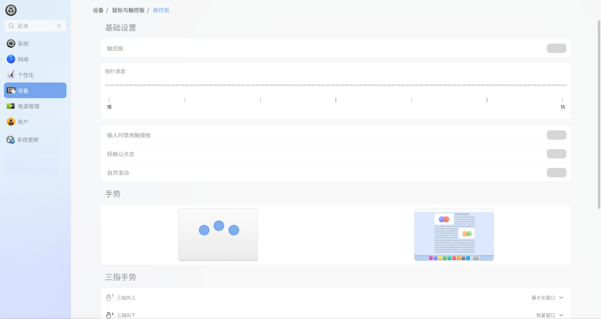

&nbsp;&nbsp;&nbsp;&nbsp;&nbsp;&nbsp;&nbsp;&nbsp;&nbsp;&nbsp;&nbsp;&nbsp;&nbsp;

若您使用的是笔记本电脑，可以在 **鼠标与触控板 > 鼠标** 界面开启 **输入时禁用触控板**，以避免误触触控板。

您还可以调节触控板的 **指针速度**，控制手指移动时指针移动的速度；开启自然滚动，变更滚动方向。

#### 手势设置

手势设置，可通过触控板手势快速响应桌面功能，主要可设置三指手势和四指手势。

**三指手势**，可设置以下功能：

1. 三指向上：默认为最大化窗口，可调整设置为恢复窗口、当前窗口左分屏、当前窗口右分屏或禁用。
2. 三指向下：默认为恢复窗口，可调整设置为最大化窗口、当前窗口左分屏、当前窗口右分屏或禁用。
3. 三指向左：默认为当前窗口左分屏，可调整设置为恢复窗口、最大化窗口、当前窗口右分屏或禁用。
4. 三指向右：默认为当前窗口右分屏，可调整设置为恢复窗口、最大化窗口、当前窗口左分屏或禁用。
5. 三指点击：默认为打开/隐藏全局搜索，可调整设置为显示、隐藏启动器、打开/隐藏剪贴板、打开/隐藏消息中心或禁用

**四指手势**，可设置以下功能：

1. 四指向上：默认为显示多任务视图，可调整设置为隐藏多任务视图、切换至前一个桌面、切换至后一个桌面、显示桌面、隐藏桌面或禁用。
2. 四指向下：默认为隐藏多任务视图，可调整设置为显示多任务视图、切换至前一个桌面、切换至后一个桌面、显示桌面、隐藏桌面或禁用。
3. 四指向左：默认为切换至前一个桌面，可调整设置为显示多任务视图、隐藏多任务视图、切换至后一个桌面、显示桌面、隐藏桌面或禁用。
4. 四指向右：默认为切换至后一个桌面，可调整设置为显示多任务视、图隐藏多任务视图、切换至前一个桌面、显示桌面、隐藏桌面或禁用。
5. 四指点击：默认为打开/关闭启动器，可调整设置为打开/关闭全局搜索、打开/关闭剪贴板、打开/关闭通知中心或禁用。

### 数位板

数位板，又名绘图板、绘画板、手绘板等，主要用作绘画创作，是电脑的一种输入设备。
连接到电脑后，可以设置数位板的压感力度，即笔尖和橡皮擦的压力感应值。

>  说明： 连接数位板设备后，该模块才会显示。

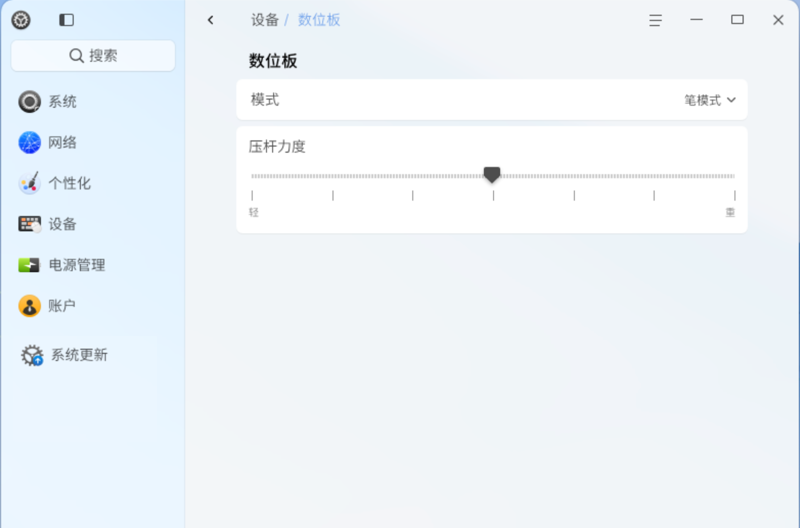

&nbsp;&nbsp;&nbsp;&nbsp;&nbsp;&nbsp;&nbsp;&nbsp;&nbsp;&nbsp;&nbsp;&nbsp;&nbsp;

1. 在控制中心侧边栏选择 **设备**，单击 **数位板** 。
2. 选择 **笔** 模式。
3. 调节 **压感力度**。

### 键盘

在此模块可以设置键盘属性，以便符合个人的输入习惯，设置输入法、系统语言，以及自定义快捷键。

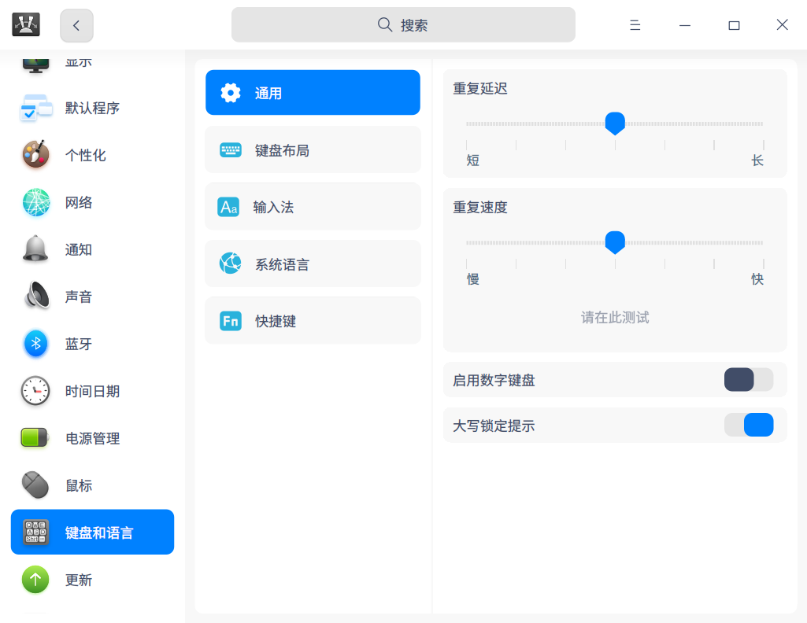

#### 键盘属性

1. 在控制中心边栏选择 **设备**，单击 **快捷键** 。
2. 在 **通用** 区域设置。
3. 调节 **重复延迟**/**重复速度**。
4. 单击“请在此测试”，按下键盘上的任意字符不松开，查看调节效果。
5. 单击 **启用数字键盘**/**大写锁定提示** 开关，开启相应功能。

#### 键盘布局

键盘布局可以为当前语言设置自定义键盘。完成键盘布局设置后，按下键盘上的按键，屏幕上会按照键盘布局设置好的字符进行显示。更改键盘布局后，屏幕上的字符可能与键盘按键上的字符不相符。

一般在安装系统时就已经设置了键盘布局，可以根据需求添加或删除其他的键盘布局。

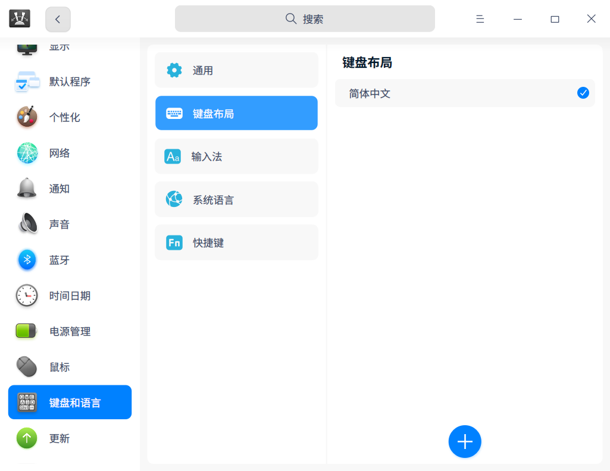

##### 添加键盘布局

1. 在控制中心侧边栏选择 **设备**，单击 **键盘** 。
2. 单击 **键盘布局**，进入键盘布局界面。
3. 单击 **添加键盘布局** 按钮 ，单击某一键盘布局即可添加到列表。

##### 删除键盘布局

1. 在控制中心侧边栏选择 **设备**，单击 **键盘** 。
2. 单击 **键盘布局**，进入键盘布局界面。
3. 单击“键盘布局”后的 **编辑**。
4. 单击 **删除** 按钮 ，删除该键盘布局。

#### 输入法

对输入法进行设置，可以为系统提供更丰富的输入方式。在输入法界面可以添加多个输入法，设置输入法切换的快捷键，以便用户选择符合个人打字习惯的输入方式。

##### 添加输入法

您可以添加多个输入法到输入法管理列表，以便切换输入法。

1. 在控制中心侧边栏选择 **设备**，单击 **键盘** 。
2. 单击 **输入法**，进入输入法界面。
3. 单击 **添加输入法** 按钮  ，您可以：
   - 单击 **前往商店下载**，在应用商店下载输入法，当该输入法下载完成后，系统自动设置其为默认输入法。
   - 进入添加输入法界面，选择输入法，将该输入法添加到输入法管理列表。

>  说明：在输入法管理界面，单击 **编辑** 后，单击 **删除** 按钮即可移除某输入法。对于被移除（非卸载）的输入法，可以在添加输入法界面进行添加。

##### 设置输入法排序

1. 在控制中心侧边栏选择 **设备**，单击 **键盘** 。
2. 单击 **输入法**，进入输入法界面。
3. 在输入法管理区域，上下拖动输入法进行排序。

##### 设置输入法配置项

1. 在控制中心侧边栏选择 **设备**，单击 **键盘** 。
2. 单击 **输入法**，进入输入法界面。
3. 在输入法管理区域，单击输入法后面的 **设置** 按钮 ，设置输入法自身的配置项。

##### 设置输入法切换快捷键

1. 在控制中心侧边栏选择 **设备**，单击 **键盘** 。
2. 单击 **输入法**，进入输入法界面。
3. 在快捷键区域，切换输入法下拉框中，选择输入法切换的快捷键。

>  说明：在输入法高级设置界面中，还可以设置更多快捷键。

##### 高级设置

1. 在控制中心侧边栏选择 **设备**，单击 **键盘** 。
2. 单击 **输入法**，进入输入法界面。
3. 单击 **高级设置**，对输入法进行全局配置如更多快捷键、程序、输出和外观设置，并附加组件。

#### 快捷键

快捷键列表显示了系统所有的快捷键，在这里查看、修改和自定义快捷键。

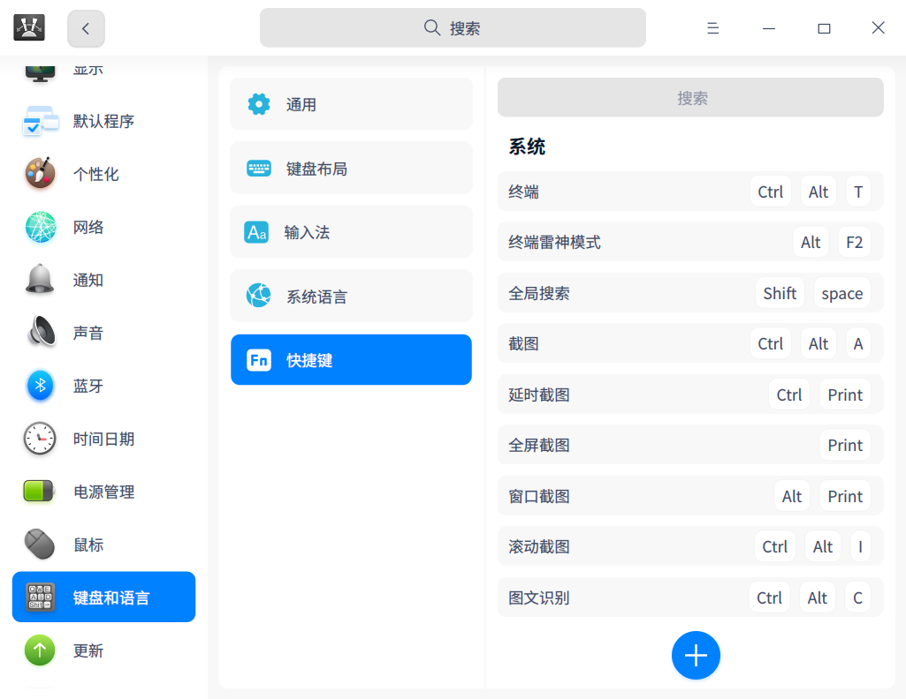

##### 查看快捷键

1. 在控制中心侧边栏选择 **设备**，单击 **键盘** 。
2. 单击 **快捷键**，进入快捷键设置界面。
3. 搜索或查看默认的系统快捷键、窗口快捷键和工作区快捷键。

##### 修改快捷键

1. 在控制中心侧边栏选择 **设备**，单击 **键盘** 。
2. 单击 **快捷键**，进入快捷键设置界面。
3. 单击需要修改的快捷键。
4. 使用键盘输入新的快捷键。

>  窍门：若要禁用快捷键，请按下键盘上的 **Backspace**  键。若要取消修改快捷键，按下 **Esc** 键， 或单击下方的“恢复默认”按钮。

##### 自定义快捷键

您可以为常用的应用自定义一个快捷键。

1. 在控制中心侧边栏选择 **设备**，单击 **键盘** 。
2. 单击 **快捷键**。
3. 单击 **添加** 按钮 ，进入添加自定义快捷键界面。
4. 输入快捷键名称、命令和快捷键。
5. 单击 **添加**。
6. 添加成功后，单击“自定义快捷键”后的 **编辑**。
7. 单击某个快捷键后的删除按钮 ， 删除自定义的快捷键。

>  窍门：若要修改快捷键，单击输入新的快捷键即可。若要修改自定义快捷键的名称和命令，单击“自定义快捷键”后的 **编辑** ，单击快捷键名称后的 ，进入修改页面。

### 语言和区域

系统语言默认为安装系统时所选择的语言，可以随时进行更改。在系统语言列表可以添加多个语言，以便切换系统语言。

##### 添加系统语言

您可以添加多个语言到系统语言列表，以便切换系统语言。

1. 在控制中心侧边栏选择 **系统**。
2. 单击 **语言和区域**，进入系统语言界面。
3. 单击 **添加** 按钮  进入语言列表。
4. 选择语言，该语言将自动添加到系统语言列表。

##### 设置系统语言

1. 在控制中心侧边栏选择 **系统**。
2. 单击 **语言和区域**，进入系统语言界面。
3. 选择要切换的语言，系统将自动开始安装语言包。
4. 语言包安装完成后，需要注销后重新登录，以便设置生效。

>  注意：更改系统语言后，键盘布局可能也会发生改变。重新登录时，请确保使用正确的键盘布局来输入密码。

##### 区域

1. 在控制中心侧边栏选择 **系统**。
2. 单击 **语言和区域**，进入区域设置界面。
3. **地区** 初始化设置后，可调整区域设置，根据区域设置提供输入法、键盘布局和格式设置推荐。通过下拉框切地区。
4. **区域和格式** 设置，可在初始化设置后进行调整，根据选择的地区，提供对应的习惯格式，如日期显示、货币符合及数字格式。选择区域和格式后，选择 **保存** 按钮，保持切换区域。
5. 当前 **格式** 显示设置，可通过设置时间、日期格式，调整系统任务栏显示时间格式。

### UOS ID

要使用 UOS ID 相关的功能，您需要先成功注册并登录 UOS ID。如果您尚未注册 UOS ID，可以通过以下方式进行注册：

- **通过统信官方网站注册**：进入统信官方网站（支持微信扫码、手机号码等多种注册方式），完成注册流程。
- **通过控制中心注册**：
  1. 在控制中心的 UOS ID 界面中，单击 **登录** 按钮，系统将弹出 UOS ID 登录界面。
  2. 在登录界面中，单击 **注册** 按钮，系统将弹出 UOS ID 注册界面。
  3. 在注册界面中，使用手机号码或微信完成注册操作。

成功登录 UOS ID 后，您还可以使用云同步、应用商店、浏览器等应用程序的相关云服务功能。

>   窍门：当 UOS ID 与本地账户绑定后，您可以使用 UOS ID 重置本地账户的登录密码。

开启云同步功能后，系统会自动将各种配置（如声音、电源、鼠标、更新、屏幕保护等）同步到云端。如果您希望在另一台电脑上使用相同的系统配置，只需登录同一个 UOS ID 账户，即可一键将云端配置同步到新设备。

>    说明：
> 
> 1. 自动同步配置功能仅在系统已激活或处于试用期状态下可用；未激活状态下无法使用该功能。
> 2. 当开启“自动同步配置”选项时，您可以选择要同步的具体项目；关闭该选项时，所有项目均无法同步。

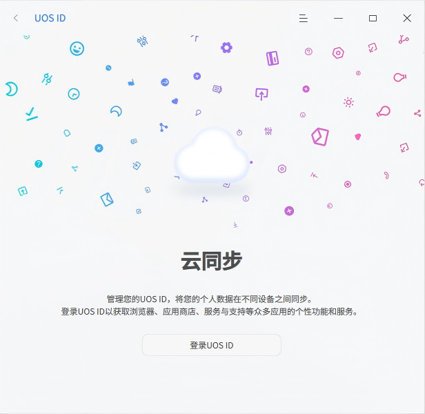

### 系统更新

在更新设置页面开启可从仓库更新类型中的“系统更新”、或“安全更新”后，自动下载、更新提醒才能正常操作。

系统存在更新时会在控制中心侧边栏进行提示，单击 **系统更新**  进入 **检查更新** 页面，单击 **检查更新**，检查完毕后，即可下载和安装更新。除此之外，在更新设置模块中还可以设置自动下载更新。

>  窍门：如果不需要自动检查更新，不想收到系统或应用的更新提示，可在“更新设置”中关闭“更新提醒”。

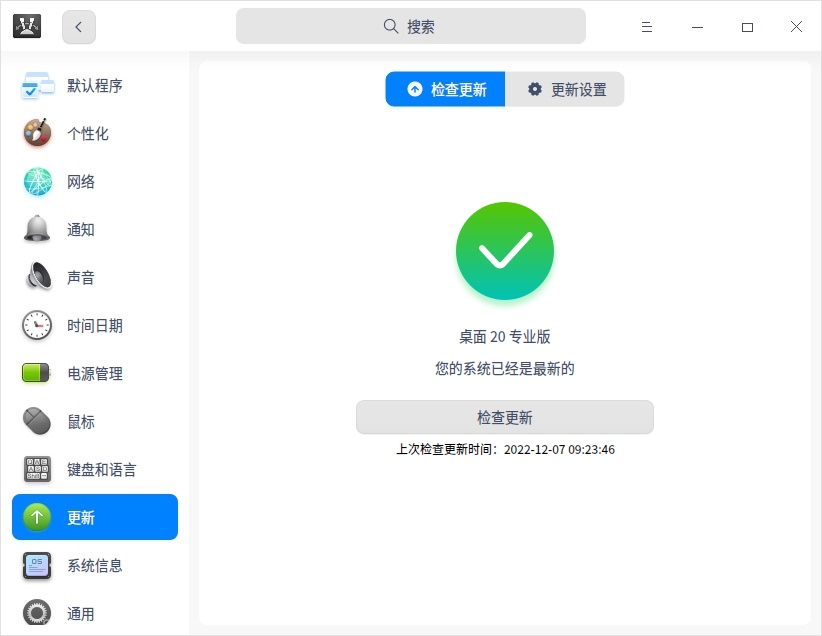

#### 更新和升级

1. 在控制中心侧边栏选择 **系统更新**。
2. 单击 **检查更新/重新检查更新**，进入检查系统更新界面。
   - 如果系统没有更新将会提示“您的系统已经是最新的”。
   - 如果系统存在更新，将显示 **下载** 按钮、**更新内容勾选**、下载数据大小和更新详情。您可以继续执行步骤3和步骤4。
3. 单击 **下载** 按钮，系统将自动开始下载已经勾选的更新内容。
4. 在下载完成后，系统将通知您可以进行更新，您可以在控制中心-更新模块点击**安装更新**开始安装更新文件。
5. 更新完成后，会出现”更新成功”提示。您可以根据实际需要执行重启、关机或取消操作。

#### 更新并关机/重启

在您选择开始安装更新后，可以选择**后台更新、更新并关机、更新并重启**

- 后台更新：安装更新的过程在后台完成，不影响当前系统的正常使用
- 更新并关机/重启：安装更新的过程呈现模态界面展示安装进度，这段时间内系统将无法使用，在安装更新完成后，系统会自动关机/重启

> 说明：更新并关机/重启适合在无人值守的时候使用（例如下班的时候)，相较于后台更新也会更加稳定。

#### 更新内容

1. 在控制中心侧边栏选择 **系统更新**。
2. 检查更新后，自动显示可更新内容及版本更新日志。

>  说明：当只开启“安全更新”时，系统只会进行安全漏洞和兼容性相关的更新。

#### 更新设置

##### 更新类型

1. 在控制中心侧边栏选择 **系统更新**。
2. 单击 **更新设置**。
3. 在**更新类型**区域设置，检查更新的类型，可选择功能更新、安全更新和第三方仓库更新。

##### 高级设置

1. 在控制中心侧边栏选择 **系统更新**。
2. 单击 **更新设置**。
3. 打开 **下载限速**。 在开启下载限速后，您可以设置数据下载的速度上限。默认下载速度上限为10240 KB/s。
4. 打开 **自动下载**。 在开启自动下载后，您可以设置自动下载的时间段。当系统存在更新时，将自动下载数据系统会在规定的时间段内自动下载数据。
5. 打开 更新提醒。在收到更新通知消息提醒您有最新更新。
6. 打开 清除软件包缓存。可自动清理已下载更新完成的软件包。

>  窍门：打开 **清除软件包缓存** 开关，系统会定期自动清理下载软件包导致的缓存。

#### 查看历史更新

您可以单击 **查看历史更新**，查看所有已安装的系统版本日志。

### 系统信息

查看系统版本、版本授权和电脑硬件等信息，以及该系统的一些协议。

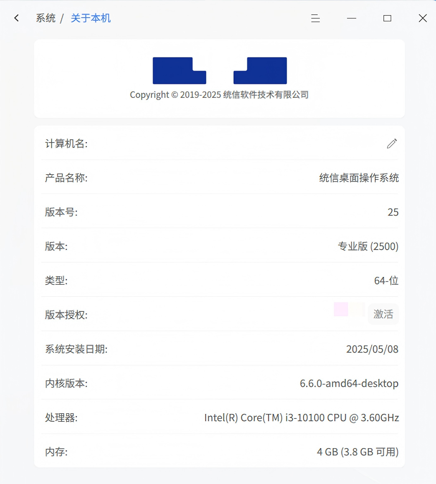

#### 关于本机

1. 在控制中心侧边栏选择 **系统**。

2. 在 **关于本机** 下，您可以：
   
   - 单击  修改计算机名。
   
   - 查看当前系统版本、版本授权、系统安装时间及电脑硬件信息。
     
     ##### 版本授权

3. 点击**激活**进入激活页面
   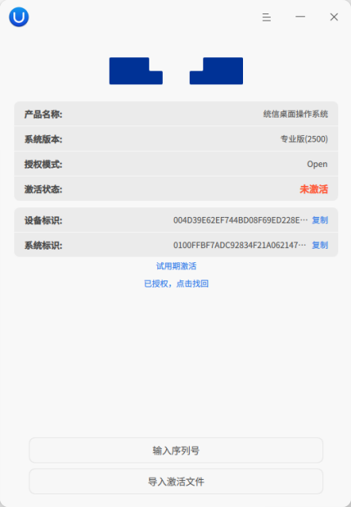

4. **激活方式**分在线激活（试用期激活、输入序列号激活、导入激活文件激活）和离线激活。
   
   1. 试用期激活
      - 点击 **试用期激活**，跳转到激活界面。
      - 单击 **立即激活**，弹出二次确认框，单击 **确定**，弹出试用期激活成功界面。
      - 系统成功激活后，可以查看激活状态、试用到期时间等信息。
   2. 输入序列号激活
      - 单击 **输入序列号**，输入或复制正确的序列号，单击 **立即激活**。
        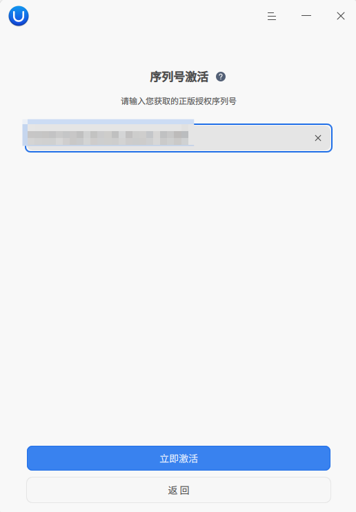
   3. 导入激活文件激活
      - 单击 **导入激活文件**，弹出文件管理器，选择 .key 格式的激活文件。
      - 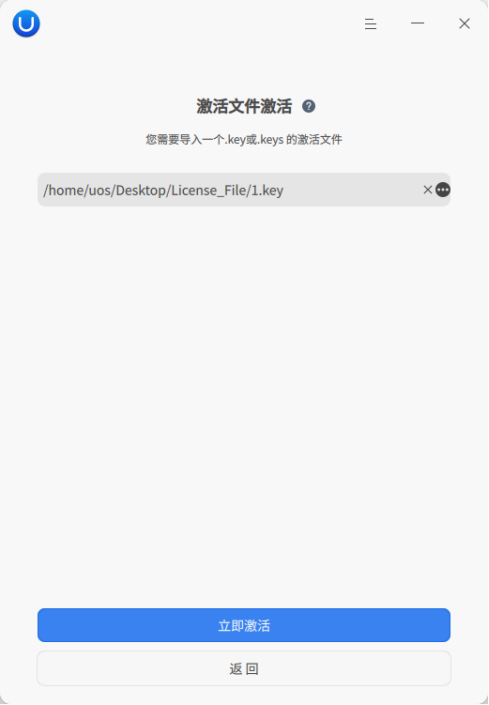
      - 选择正确的文件，单击 **立即激活**。
      - 在弹出二次确认框中，单击 **确定**，弹出激活成功界面。

5. **离线激活**
   
   - 网络连接异常时，可使用离线激活。
   - 选择输入序列号或导入授权文件激活时，系统检测网络连接异常，则跳转到离线激活界面。
   - 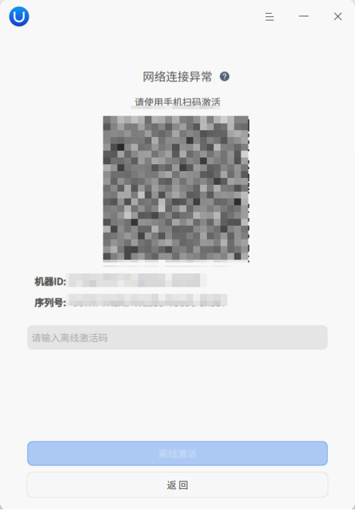
   - 使用手机扫描二维码，手机端弹出激活界面，界面显示当前机器ID及序列号。
   - 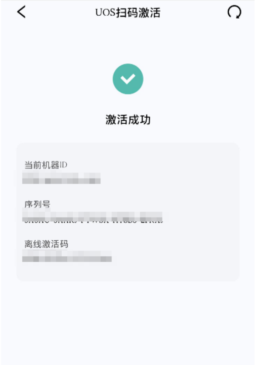
   - 手动将手机端的离线激活码输入电脑端的离线激活码输入框。
   - 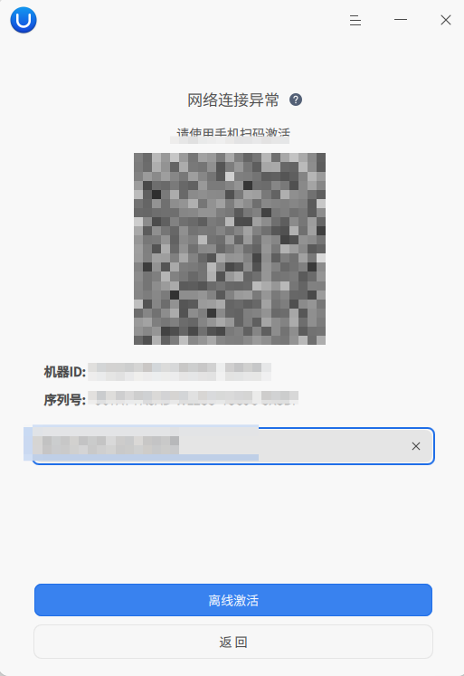
   - 单击 **离线激活**，跳转到激活成功界面。

6. **激活成功**
   
   - 系统激活成功后，右下角托盘不再显示授权管理图标，在“控制中心 > 系统信息 > 关于本机”中，单击 **查看** 可以查看授权管理信息。  
   - 激活成功界面包含产品名称、版本和激活状态等信息，也可以单击 **查看详情** 查看更多信息。
   - 主要信息如下所示：
       • 产品名称：操作系统的名称。        
       • 版本：操作系统的版本。        
       • 激活状态：分为未激活、过期未激活、已激活等。        
       • 授权状态：分为试用期、未授权、已过期、已授权等。        
       • 激活方式：根据实际激活方式体现。        
       • 到期时间：到期时间前 10 天开始，每次开机进入系统，会弹出系统授权即将到期的提示信息。
       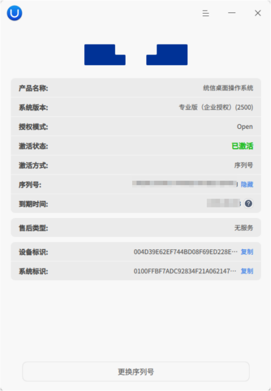

7. **更换序列号** 
   
   - 当系统激活成功后，由于某些原因需要变更序列号。
   - 有且仅当满足如下条件时，支持更换序列号。
     - 仅授权状态为已激活时，支持序列号更换。
     - 仅授权模式为 OPEN 时，支持序列号更换。
   - 更换序列号操作步骤如下：
       1. 在激活详情界面，单击 **更换序列号**。
       2. 弹出更换序列号提示框，单击 **更换**。
       3. 进入序列号激活界面，输入新的序列号。
       4. 单击 **立即激活** 即可更换序列号。

8. **激活失败**
   
   - 若激活文件已使用或已失效，则会弹出激活失败界面。

9. **激活服务器设置**
   
   - 如果当前激活服务器出现异常或崩溃了，通过授权管理界面，单击主菜单中的设置，可以自定义新的激活服务器。

#### 开源软件声明

1. 在控制中心侧边栏选择 **系统**。
2. 在 **开源软件声明** 下，查看开源软件声明。

#### 最终用户许可协议

1. 在控制中心侧边栏选择 **系统**。
2. 在 **最终用户许可协议** 下，查看最终用户许可协议。

#### 隐私政策

1. 在控制中心侧边栏选择 **系统**。
2. 在 **隐私政策** 下，查看隐私政策。

### 备份还原

为避免因软件缺陷、硬件损毁、人为操作不当等因素造成数据缺失或损坏，可以进行应用数据或系统数据的备份还原，以保障系统的正常运行。

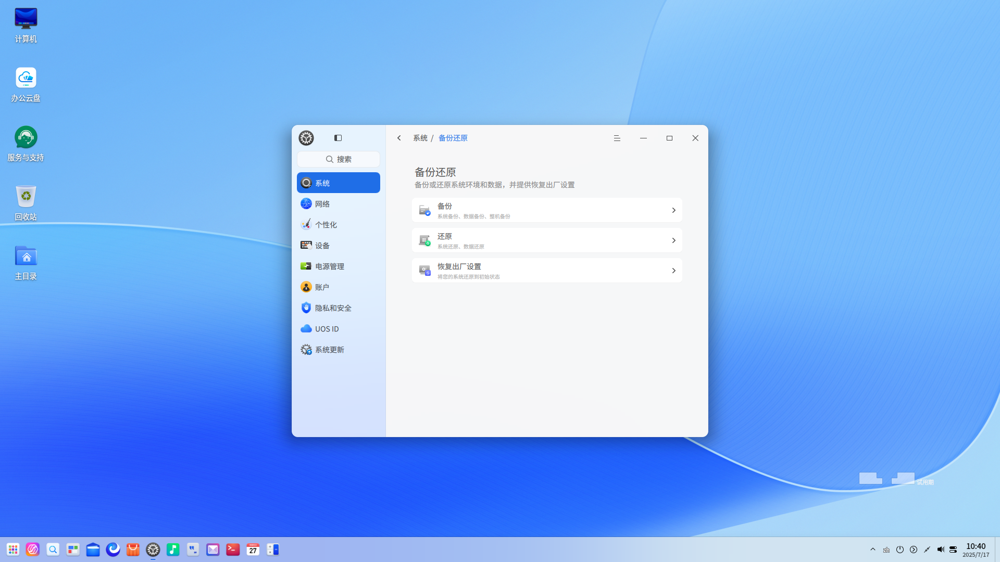

### 启动菜单

启动菜单模块管理开机启动功能设置。

#### 设置启动菜单

启动菜单，指的是开机后选择操作系统的菜单。选择某一系统后，电脑就会引导进入该操作系统。

>  说明：arm 架构系统仅支持 grub 验证，mips 架构系统暂不支持 grub 验证、不支持更换启动菜单背景图。

##### 设置启动延时

“启动延时”为开启状态时，开机后在启动菜单等待5秒钟，以便您选择启动其它操作系统。
“启动延时”为关闭状态时，开机后在启动菜单等待1秒钟。

##### 修改默认启动项

1. 在控制中心侧边栏选择 **系统**。
2. 单击 **启动菜单**，进入启动菜单界面。
3. 单击选中某一菜单项后，弹出授权认证窗口，请输入密码授权该项，该项将成为默认启动项。

##### 启动动画

1. 在控制中心侧边栏选择 **系统**。
2. 单击 **启动菜单**，进入启动菜单界面。
3. 可选择启动界面logo动画尺寸 为大尺寸/小尺寸。

>  窍门：您也可以把图片拖曳到预览窗口，来更换启动菜单的背景。

##### 主题

1. 在控制中心侧边栏选择 **系统**。
2. 单击 **启动菜单**，进入启动菜单界面。
3. 开启主题后，可在开机时看到主题背景。

#### 开发者选项

您可以在此激活开发者模式，如需安装和运行未签名应用，请前往安全中心进行设置。

##### 开发者模式

进入开发者模式您可以使用 root 权限，执行 sudo 操作。系统默认未进入开发者模式。

>  注意： 进入开发者模式后的行为可能存在风险，且将不再享有官方保修服务，请谨慎操作。

在控制中心侧边栏选择 **系统**。选择 **开发者选项**，单击 **进入开发者模式** 按钮，进入开发者模式窗口，您可以：

- 在线激活
  1. 选择 **在线激活**，单击 **下一步**，在弹出的 UOS ID 登录窗口中，输入登录信息。
  2. 弹出免责声明窗口，仔细阅读开发者模式免责声明，了解注意事项后，勾选 **同意并进入开发者模式**，单击 **确定**。
  3. 在弹出的授权认证窗口中输入认证信息。
  4. 认证通过，在弹出的是否重启对话框中单击 **现在重启**， 重启系统后开发者模式生效。
- 离线激活
  1. 选择 **离线激活**，根据提示下载证书，并导入证书。
  2. 在弹出的授权认证窗口中输入认证信息。
  3. 认证通过，在弹出的是否重启对话框中单击 **现在重启**， 重启系统后开发者模式生效。

>  注意： 进入开发者模式后不可退出或撤销。系统所有帐号都将拥有 root 权限。

##### 开发调试选项

进入开发者调试选项后，您可以更改 **系统日志记录级别** 配置。

在控制中心侧边栏选择 **系统**。选择 **开发者选项**，在 **开发调试选项** 区域，您可以更改 **系统日志记录级别** 选项为调试，获得更详细的日志记录，默认选项为关闭。

#### 域管理

1. 在控制中心侧边栏选择 **系统**。
2. 单击 **域管理**，进入域管理界面。
3. 开启 **域管理**，设置 **域地址**、**端口** 信息。
4. 单击 **确定**。

>  说明：amd、arm 架构系统支持域管理设置功能。
