# 桌面環境|dde|

## 概述

深度操作系統（deepin）是一款美觀易用、安全可靠的國產桌面操作系統。deepin 預裝了檔案管理員、應用商店、看圖、系統監視器等一系列原生應用。既能讓您體驗豐富多彩的娛樂生活，亦能滿足日常工作需求。隨着功能不斷升級完善，深度操作系統已成為國內最受歡迎的桌面操作系統之一。

### 系統簡介

初次進入深度操作系統，會自動開啟歡迎程式。您可以觀看影片了解系統功能，選擇桌面模式和圖示主題，進一步了解該系統。

成功登入系統後，即可體驗 deepin 桌面環境。桌面環境主要由桌面、工作列、啟動器、控制中心和視窗管理器等組成，是您使用該操作系統的基礎。

## 桌面

桌面是登入後看到的主螢幕區域。在桌面上可建立檔案/資料夾、排列檔案、開啟終端、設定桌布和螢幕保護等，亦可透過 [傳送到桌面](#设置快捷方式) 向桌面新增應用捷徑。

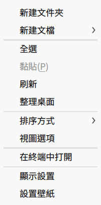

>  說明：在觸控板上，四指/五指向下移動顯示桌面，緊接着向上移動隱藏桌面，對應 **Super** + **D** 快捷鍵。

### 建立新資料夾/文件

在桌面建立資料夾或文件，亦可對檔案進行常規操作，與檔案管理員相同。

- 在桌面上，右鍵點擊，點擊 **新增資料夾**，輸入新增資料夾的名稱。
- 在桌面上，右鍵點擊，點擊 **新增文件**，選擇新增文件的類型，輸入新增文件的名稱。

在桌面檔案或資料夾上，右鍵點擊，在彈出的選單中主要包含如下功能：

| 功能     | 說明                           |
| ------ | ---------------------------- |
| 開啟方式   | 設定系統預設開啟方式，也可以選擇其他關聯應用程式來開啟。 |
| 壓縮/解壓縮 | 壓縮檔案或資料夾，或對壓縮檔案進行解壓縮。        |
| 剪下     | 移動檔案或資料夾。                    |
| 複製     | 複製檔案或資料夾。                    |
| 重新命名   | 重新命名檔案或資料夾。                  |
| 刪除     | 刪除檔案或資料夾。                    |
| 建立連結   | 建立一個捷徑。                      |
| 標記資訊   | 添加標記資訊，以對檔案或資料夾進行標籤化管理。      |
| 內容     | 查看檔案或資料夾的基本資訊、共享方式及其權限。      |

>  說明：
> 
> - 當使用觸控螢幕電腦時，在觸控螢幕上長按 1 秒再抬起即打開目前物件的右鍵選單。
> - 在觸控板上，二指點擊，顯示右鍵選單。
> - 在鍵盤上按下 **Alt** + **M** 快捷鍵，打開右鍵選單。

### 設定排列方式

您可以對桌面上的圖示按需要進行排序。

1. 在桌面上，右鍵點擊。
2. 點擊 **排序方式**，您可以：
   - 點擊 **名稱**，將按檔案的名稱順序顯示。
   - 點擊 **修改時間**，檔案將按最近一次的修改日期順序顯示。
   - 點擊 **創建時間**，檔案將按創建日期順序顯示。
   - 點擊 **大小**，將按檔案的大小順序顯示。
   - 點擊 **類型**，將按檔案的類型順序顯示。

>  提示：您亦可勾選 **自動排列**，桌面圖示將由上至下、由左至右按目前排序規則排列。刪除圖示時，後面的圖示會自動向前填充。

### 調整圖示大小

1. 在桌面上，右鍵點擊。
2. 點擊 **圖示大小**。
3. 選擇合適的圖示大小。

>  提示：您亦可使用 **Ctrl** + //滑鼠滾動 來調整桌面和啟動器中的圖示大小。

### 顯示設定

在桌面右鍵選單選擇「顯示設定」，可快速進入控制中心設定顯示器的縮放比例、解析度和亮度等。

1. 在桌面上，右鍵點擊。
2. 點擊 **顯示設定**，快速進入控制中心的顯示設定介面。

>  說明：關於顯示的設定，具體操作請參考 [顯示設定](#显示设置) 。

### 剪貼簿

剪貼簿會顯示目前使用者登入系統後複製和剪下的所有文字、圖片和檔案。使用剪貼簿可快速複製其中某項內容。登出或關機後，剪貼簿會自動清空。

在剪貼簿中，可將圖片、檔案類資訊直接拖曳到桌面儲存，亦可將文字、字元等資訊拖曳到可編輯文字中。

1. 使用快捷鍵 **Super** + **V** 開啟剪貼簿。
2. 雙擊剪貼簿內的某一區塊，會快速複製目前內容，且該區塊會被移動到剪貼簿頂部。
3. 選擇目標位置貼上。
4. 滑鼠移入剪貼簿的某一區塊，點擊上方的 ，刪除目前內容；點擊頂部的 全部清除，清空剪貼簿。

## 工作列

工作列一般指位於桌面底部的長條，主要由啟動器、應用程式圖示、系統匣、系統外掛等組成。在工作列中，可開啟啟動器、顯示桌面、進入工作區，並對其上的應用程式進行開啟、新建、關閉、強制結束等操作；亦可設定輸入法、調節音量、連接網路、查看日曆、進入關機介面等。

>  說明：在控制中心「個人化 > 工作列」介面，也可以對工作列的模式、位置、狀態等進行設定。

### 認識工作列圖示

工作列圖示包括啟動器圖示、應用程式圖示、系統匣圖示、系統外掛圖示等。

| 圖示                                                                    | 說明                         | 圖示                                                                  | 說明                          |
| --------------------------------------------------------------------- |:-------------------------- | ------------------------------------------------------------------- | --------------------------- |
|                             | 啟動器 - 點擊查看所有已安裝的應用。        |             | 全域搜尋 -  - 搜尋、查找內容。          |
|       | 多工作檢視 - 點擊顯示工作區。           |                  | 檔案管理員 - 點擊查看磁碟中的檔案、資料夾。     |
|                    | UOS AI Bar  - AI 功能場景響應入口。 |              | 瀏覽器 - 點擊開啟網頁。               |
|                     | 應用商店 - 搜尋安裝應用軟體。           |                   | 控制中心 - 點擊進入系統設定。            |
|                         | 音樂 - 播放音樂應用軟體。             |                      | 文字編輯器 - 查看和編輯文字檔案應用軟體。      |
|                          | 郵件 - 編輯、管理和發送電子郵件應用軟體。     |                    | 終端機 - 終端模擬器。                |
|                         | 日曆 - 查看日期、管理日程應用軟體。        |                  | 計算機 - 標準、科學型和程式設計師型桌面計算機工具。 |
|                            | 通知中心 - 顯示所有系統和應用的通知。       |                                    | 螢幕小鍵盤 - 點擊使用虛擬鍵盤。           |
|  | 快速設定面板-快速設定系統功能。           |  | 電源選項 - 點擊進入關機介面。            |

### 切換顯示模式

工作列提供兩種顯示模式：傳統模式和高效模式，顯示不同的圖示大小和應用視窗啟動效果。

您可以透過以下操作切換顯示模式：

1. 右鍵點擊工作列。
2. 在 **模式** 子選單中選擇一種顯示模式。

### 設定工作列位置

您可以將工作列放置在桌面的任意方向。

1. 右鍵點擊工作列。
2. 在 **位置** 子選單中選擇一個方向。

### 調整工作列高度

拖曳工作列邊緣，改變工作列高度。

### 禁用自由調節
開啟「禁用自由調節」後，可鎖定工作列高度，避免誤拖曳而改變工作列大小。
1. 右鍵工作列
2. 開啟或關閉 **禁用自由調節** 開關。

### 顯示/隱藏工作列

工作列可隱藏，以便最大程度擴展桌面的可操作區域。

1. 右鍵點擊工作列。
2. 在 **狀態** 子選單中，您可以：
   - 選擇 **一直顯示**，工作列將一直顯示在桌面上。
   - 選擇 **一直隱藏**，工作列將被隱藏，只有在滑鼠移至工作列區域時才會顯示。
   - 選擇 **智慧隱藏**，當佔用工作列區域時，工作列自動隱藏。

>  說明：在觸控螢幕電腦上，當工作列設定為「智慧隱藏」或「一直隱藏」時：
> 
> - 如果工作列在底部，在螢幕邊緣從下往上滑入，喚出工作列；
> - 如果工作列在頂部，在螢幕邊緣從上往下滑入，喚出工作列；
> - 如果工作列在左側，在螢幕邊緣從左往右滑入，喚出工作列；
> - 如果工作列在右側，在螢幕邊緣從右往左滑入，喚出工作列。

### 顯示/隱藏外掛程式

1. 右鍵點擊工作列。
2. 點擊 **工作列設定** 進入控制中心「個人化 > 工作列」介面。
3. 在外掛區域勾選或取消勾選 **回收站**、**系統監視器**、**關機**、**顯示桌面**、**螢幕小鍵盤**、**通知中心**、**時間**、**螢幕擷取/錄影**等外掛，可設定這些外掛在工作列上的顯示或隱藏效果。

### 查看通知訊息

當有系統或應用通知時，桌面上方會彈出通知訊息。若有按鈕，點擊按鈕執行對應操作；若無按鈕，點擊即可關閉此訊息。

此外，亦可點擊工作列上的 ， 打開通知中心，查看所有通知。

&nbsp;&nbsp;&nbsp;&nbsp;&nbsp;&nbsp;&nbsp;&nbsp;&nbsp;&nbsp;&nbsp;&nbsp;&nbsp;

>  說明：當使用觸控螢幕電腦時，手指從螢幕右側邊緣滑入超過工作列高度，喚出通知中心。

### 查看日期/時間

- 滑鼠指標懸停在工作列時間上，可查看目前日期、星期和時間。
- 點擊時間，打開日曆外掛。

### 進入關機介面

點擊工作列上的  進入關機介面，或在啟動器的小視窗模式中點擊  進入關機介面。

| 功能                                                                 | 說明                                     |
| ------------------------------------------------------------------ | -------------------------------------- |
| 關機                | 關閉電腦。                                  |
| 重新開機                  | 關機後再次重新運行您的電腦。                         |
| 睡眠                  | 整個系統將處於低能耗運轉的狀態。                       |
| 休眠                        | 沒有 swap 分割區不顯示此項。有 swap 分割區的機器休眠掛載到硬碟。 |
| 鎖定                        | 鎖定電腦，按下快捷鍵 **Super** + **L** 鎖定。       |
| 切換使用者         | 選擇另一個使用者帳戶登入。                          |
| 登出                    | 清除目前登入使用者的資訊。                          |
| 系統監視器 | 快速啟動系統監視器。                             |

&nbsp;&nbsp;&nbsp;&nbsp;&nbsp;&nbsp;&nbsp;&nbsp;&nbsp;&nbsp;&nbsp;&nbsp;&nbsp;

>  說明：當系統存在多個帳戶時才顯示 **切換使用者** 。

### 回收站

在回收站中，可找到電腦中臨時被刪除的檔案，亦可選擇還原或清空這些檔案。

#### 還原檔案

臨時被刪除的檔案可在回收站還原，或使用快捷鍵 **Ctrl** + **Z** 還原剛刪除的檔案。

1. 在回收站中，選擇要恢復的檔案。
2. 右鍵點擊，選擇 **還原**。
3. 將檔案還原到原來的儲存路徑。

>  注意：如果原來所在的資料夾已刪除，還原檔案時會自動建立新資料夾。

#### 刪除檔案

回收站中可單獨清除某一檔案。

1. 在回收站中，選擇要刪除的檔案。
2. 右鍵點擊，選擇 **刪除**，即可刪除回收站的檔案。

#### 清空回收站

在回收站中，點擊 **清空**，將徹底刪除回收站的所有內容。

## 啟動器

啟動器  可管理系統中所有已安裝的應用，在啟動器中使用分類導覽或搜尋功能可快速找到需要的應用程式。

在啟動器中可查看新安裝的應用，新安裝應用旁邊會出現一個小藍點提示。

>  說明：在觸控板上，四指點擊，顯示/隱藏啟動器，對應 **Super** 快捷鍵。

### 切換模式

啟動器有全螢幕和小視窗兩種模式。點擊啟動器介面右上角的圖示切換模式。

兩種模式均支援搜尋應用、設定捷徑等操作。

小視窗模式亦支援快速開啟檔案管理員、控制中心和進入關機介面等功能。

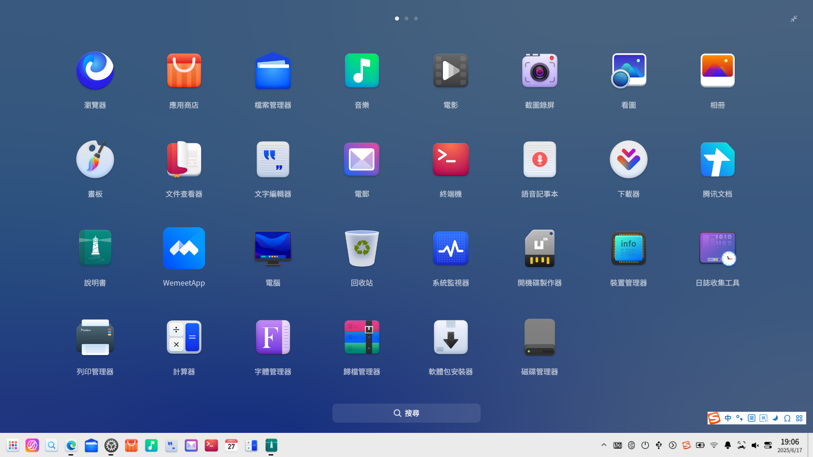

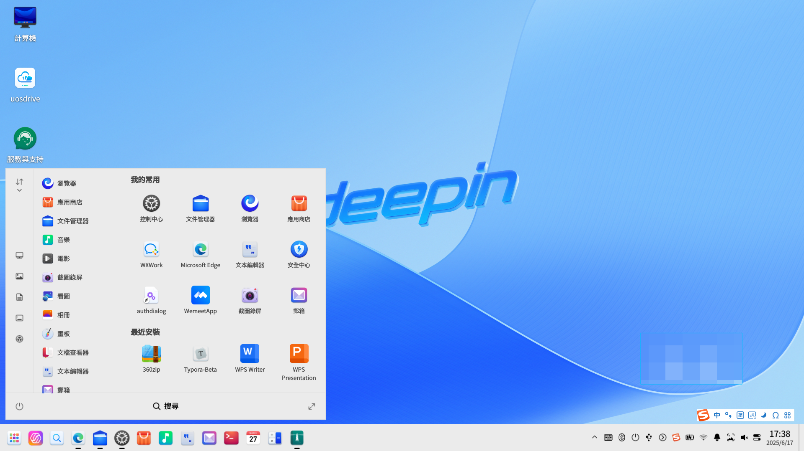

### 排列應用

在小視窗模式下，系統預設 **自由排序**，最新安裝的應用置頂，並按使用頻率排序。同時支援切換以下排序方式：

- **按分類**：按應用類型排序。
- **按名稱**：按應用名稱首字母排序。

### 尋找應用

在啟動器中，您可滾動滑鼠滾輪或切換分類導覽尋找應用。

如果知道應用名稱，可直接在搜尋框中輸入關鍵字或首字母縮寫，快速定位到需要的應用。

### 設定捷徑

捷徑提供一種簡單快捷的啟動方式。

#### 建立捷徑

將應用傳送到桌面或工作列，方便後續操作。

在啟動器中，右鍵點擊應用圖示，您可以：

- 點擊 **傳送到桌面**，在桌面建立捷徑。

- 點擊 **傳送到工作列**，將應用固定到工作列。

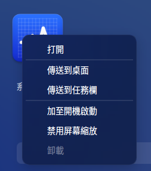

>  說明：您亦可從啟動器拖曳應用圖示到工作列放置。但當應用處於執行狀態時將無法拖曳固定；此時可右鍵點擊工作列上的應用圖示，選擇 **釘選** 將應用固定到工作列，以便下次從工作列快速開啟。

#### 刪除捷徑

您既可在桌面直接刪除應用捷徑，亦可在工作列和啟動器中刪除。

**從工作列刪除**

- 在工作列上，按住滑鼠左鍵不放，將應用圖示拖曳到工作列以外區域移除捷徑。
- 右鍵點擊工作列上的應用圖示，選擇 **取消釘選** 將應用從工作列移除。

**從啟動器中刪除**

在啟動器中，右鍵點擊應用圖示，您可以：

- 點擊 **從桌面上移除**，刪除桌面捷徑。
- 點擊 **從工作列上移除**，移除已固定到工作列的應用。

>  說明：以上操作僅能刪除應用捷徑，不會解除安裝應用。

### 安裝應用

若啟動器中沒有您需要的應用，可透過應用商店一鍵下載安裝。

### 執行應用

對於已建立桌面捷徑或固定到工作列的應用，您可透過以下方式開啟：

- 雙擊桌面圖示，或右鍵點擊桌面圖示選擇 **開啟**。
- 直接點擊工作列上的應用圖示，或右鍵點擊工作列上的應用圖示選擇 **開啟**。

在啟動器中，可直接點擊應用圖示開啟，或右鍵點擊應用圖示選擇 **開啟**。

>  提示：對於經常使用的應用，您可在啟動器中右鍵點擊應用圖示，選擇 **開機啟動**。

### 解除安裝應用

對於不再使用的應用，您可選擇解除安裝，以節省硬碟空間。

1. 在啟動器中，右鍵點擊應用圖示。
2. 點擊 **解除安裝**。

>  說明：部分系統應用不能解除安裝。

## 控制中心

深度操作系統透過控制中心管理系統的基本設定，包括帳戶管理、網路設定、時間日期設定、個人化設定、顯示設定、系統升級等。進入桌面環境後，點擊工作列上的  即可打開控制中心視窗。

### 首頁介紹

控制中心首頁主要展示各個設定模組，方便日常查看和快速設定。

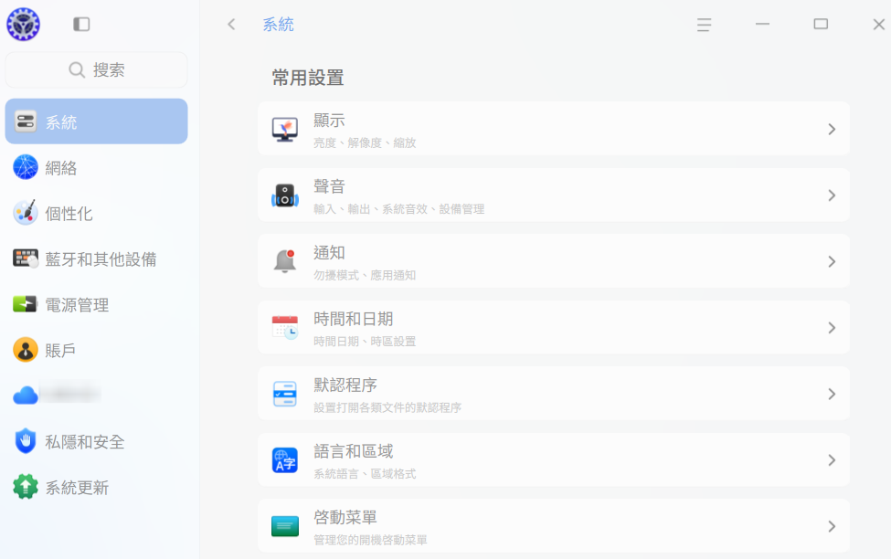

打開控制中心的某一設定模組後，可透過左側導覽列快速切換到另一設定模組。

#### 標題列

標題列包含返回按鈕、搜尋框、主選單及視窗按鈕。

- 返回按鈕 ：點擊即可返回上一層級。
- 麵包屑導覽：點擊返回對應頁面層級。
- 搜尋框：輸入關鍵字，Enter，搜尋相應設定。
- 主選單：點擊打開主選單。在主選單中，可設定視窗主題、查看版本或退出控制中心。

### 系統

#### 顯示

設定顯示器的亮度、解析度、螢幕方向以及縮放倍數等，讓您的電腦顯示達到最佳狀態。

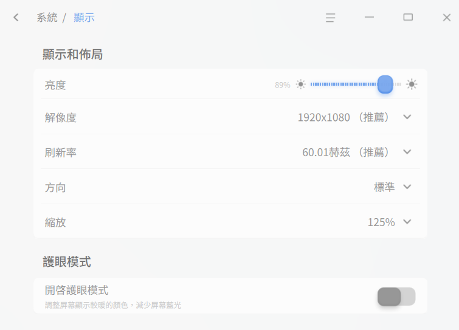

##### 單螢幕設定

當顯示器為單螢幕時，可調整亮度、解析度、更新率、顯示方向等。

**調整亮度**

當設備或配置支援亮度調整功能時，才會顯示亮度模組，您可以進行如下操作。

1. 在控制中心側邊欄選擇 **系統**，點擊 **顯示**。
2. 在亮度區域，拖曳亮度滑桿，調整螢幕亮度。

**設定縮放**

當桌面和視窗顯示過大或過小時，您可能需要調整縮放，以便正常顯示。

1. 在控制中心側邊欄選擇 **系統**，點擊 **顯示**。
2. 點擊下拉框，在下拉框中選擇縮放倍數。
3. 登出後重新登入系統，縮放設定即可生效。

>  說明：
> 
> - 當檢測到螢幕為高解析度螢幕時，會自動調整縮放倍數。
> - 部分應用不支援縮放，您可在啟動器中右鍵點擊該應用，選擇 **停用縮放**，以獲得更好的顯示效果。

**變更解析度**

1. 在控制中心側邊欄選擇 **系統**，點擊 **顯示**。
2. 在解析度區域的下拉清單中，選擇合適的解析度參數。
3. 點擊 **保存**。

**桌面顯示**

當顯示卡支援桌面顯示功能且解析度設定為非推薦解析度時，您可進行如下操作。

1. 在控制中心側邊欄選擇 **系統**，點擊 **顯示**。
2. 在桌面顯示區域的下拉清單中，選擇合適的桌面顯示效果。

**設定更新率**

1. 在控制中心側邊欄選擇 **系統**，點擊 **顯示**。
2. 在更新率區域的下拉清單中，選擇合適的更新率。
3. 點擊 **保存**。

**改變螢幕方向**

1. 在控制中心側邊欄選擇 **系統**，點擊 **顯示**。
2. 在方向區域的下拉清單中，選擇合適的方向參數。
3. 點擊 **保存**。

**護眼模式**

當設備或配置支援護眼功能時，才會顯示護眼模組，您可進行如下操作。

1. 在控制中心側邊欄選擇 **系統**，點擊 **顯示**。
2. 在 **護眼模式** 區域，您可以：
   - 開啟 **護眼模式** 開關，進入護眼模式。
   - 設定護眼模式生效時間；在時間區域，可在下拉選單中選擇生效時間，包括「全天」、「日落到日出」、「自訂」，預設為「全天」。
   - 設定護眼色溫值；在色溫區域，可手動拖曳色溫滑桿調整螢幕色溫。

##### 多螢幕設定

多螢幕顯示可讓視野延伸。使用 VGA、HDMI、DP 等線纜將電腦與另一台顯示器、投影機等連接後，電腦內容即可在多個螢幕同時顯示。當電腦連接上另一台顯示設備，多螢幕顯示模式設定模組才會出現。

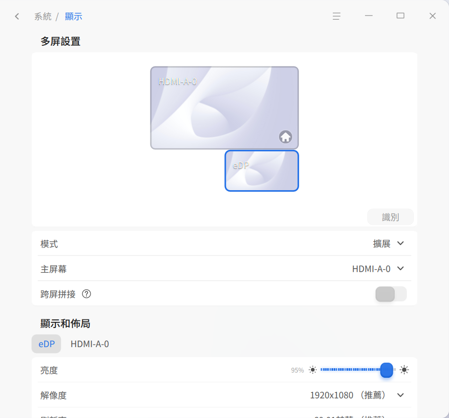

1. 在控制中心側邊欄選擇 **系統**，點擊 **顯示**。
2. 在多螢幕設定區域，於 **模式** 下拉框中選擇顯示樣式。
   - **複製**：將主螢幕的顯示內容複製到其他螢幕。
   - **延伸**：將主螢幕的顯示內容延伸到其他螢幕，擴大桌面區域。
   - **僅在xxx顯示**：只在某個螢幕顯示內容。

多螢幕複製或延伸模式時，點擊識別後，多個螢幕中央會顯示螢幕名稱。

多螢幕延伸模式時，集合視窗會將其他螢幕的設定視窗集合至該螢幕中心位置顯示。

- 主螢幕集合視窗：主螢幕設定視窗置於底層，副螢幕視窗在其上方。
- 副螢幕集合視窗：目前副螢幕設定視窗置於頂層，主螢幕設定視窗在底層。

>  說明：多螢幕延伸模式時，在控制中心「個人化 > 工作列」介面，多螢幕顯示設定區域的工作列設定包含 **僅主螢幕顯示**、**跟隨滑鼠位置顯示** 兩個互斥選項。

在多螢幕環境下，按下快捷鍵 **Super** + **P** 可調出多螢幕顯示模式的 OSD。
操作如下：

1. 按住 **Super** 不放，再按下 **P** 或滑鼠點擊進行模式選擇。
2. 鬆開按鍵，確認選擇後模式生效。

>  說明：多螢幕顯示時，副螢幕亦支援桌面圖示顯示、右鍵選單操作等功能。

多螢幕的亮度、色溫、縮放、解析度、更新率、方向等設定方式與單螢幕相同，詳細操作請參考 [單螢幕設定](#单屏设置)。

#### 音效

輸入/輸出設備音效設定（如設定喇叭和麥克風），讓您聽得更舒適、錄音更清晰。

##### 輸出設定

1. 在控制中心側邊欄選擇 **系統**，點擊 **聲音**。
2. 進入音效設備配置介面後，您可進行輸出設定：
   - 透過拖曳滑塊調整輸出音量及左/右聲道平衡。
   - 開啟 **音量增強**，音量可調節範圍由 0~100% 變為 0~150%。
   - 開啟 **單聲道音訊**，輸出聲音將左、右聲道合併為一個聲道。
   - 開啟 **插拔管理**，外設拔出時音訊輸出將自動暫停。
   - 在輸出設備後方的下拉框中選擇輸出設備類型。

##### 輸入設定

1. 在控制中心側邊欄選擇 **系統**，點擊 **聲音**。
2. 進入音效設備配置介面後，您可進行輸入設定：
   - 透過拖曳音量滑塊調整輸入音量。
   - 開啟啟用開關，亦可設定 **噪音抑制** 功能。
   - 在輸入設備後方的下拉框中選擇輸入設備類型。

>  提示：通常需要調高輸入音量以確保可聽到聲源，但音量不宜過大，以免失真。可對着輸入設備（如麥克風）以正常說話音量講話，並觀察回饋音量變化；變化明顯則表示輸入音量合適。

##### 系統音效

1. 在控制中心側邊欄選擇 **系統**，點擊 **聲音**。
2. 點擊 **系統音效**，勾選選項以啟用某事件發生時的音效。

>  提示：您可以單擊播放按鈕試聽音效。

##### 設備管理

1. 在控制中心側邊欄選擇 **系統**，點擊 **聲音**。
2. 點擊 **設備管理**，啟用/停用輸入設備、輸出設備。

#### 通知

設定通知勿擾模式，啟用或關閉某些應用的通知顯示。

##### 設定系統通知

設定系統通知的勿擾模式。

1. 在控制中心側邊欄選擇 **系統** 。

2. 點擊 **通知**，進入系統通知介面。
   
   - 啟用或關閉勿擾模式。
     當啟用勿擾模式後，可設定勿擾模式的開始時間、結束時間；亦可設定 **在螢幕鎖定時** 顯示通知。啟用勿擾模式可令所有通知靜音，但您仍可在通知中心查看所有訊息。

##### 設定應用通知

自訂應用通知顯示。

1. 在控制中心側邊欄選擇 **系統**，點擊 **應用通知**。
2. 在應用通知區域選擇一個應用，啟用後，您可以選擇：
   - 開啟/關閉通知提示音
   - 在通知中心或桌面顯示
   - 是否顯示訊息預覽 

#### 時間和日期

選擇正確的所在時區，即可在電腦上顯示所在地的時間和日期，亦可手動修改時間和日期。

##### 修改時間和日期

預設情況下，系統會透過網路自動同步該時區的本地時間和日期。您亦可關閉自動同步配置，手動修改時間和日期。

1. 在控制中心側邊欄選擇 **系統**，點擊 **時間和日期**。
2. 關閉 **自動同步配置**。
3. 手動設定正確的時間和日期。
4. 點擊 **確定**。

>  說明：您亦可開啟 **自動同步配置**、設定伺服器同步參數；亦可添加其他時區伺服器地址以自動同步。

##### 修改時區

安裝系統時已選擇系統時區。若要修改系統時區，請按以下步驟操作。

1. 在控制中心側邊欄選擇 **系統**，點擊 **時間和日期**。
2. 點擊 **修改系統時區**，透過下拉框選擇時區。

##### 添加時區

您可同時使用多個時區，以便查看其他時區時間。

1. 在控制中心側邊欄選擇 **系統**，點擊 **時間和日期**。
2. 點擊時區清單中的 **添加** 按鈕，透過搜尋選擇時區。
3. 點擊 **添加**。

##### 刪除時區

1. 在控制中心側邊欄選擇 **系統**，點擊 **時間和日期**。
2. 點擊時區清單後方的 **刪除** 按鈕，刪除已添加的時區。

#### 語言和區域

系統語言預設為安裝時所選語言，可隨時更改。系統語言清單可添加多種語言以便切換。

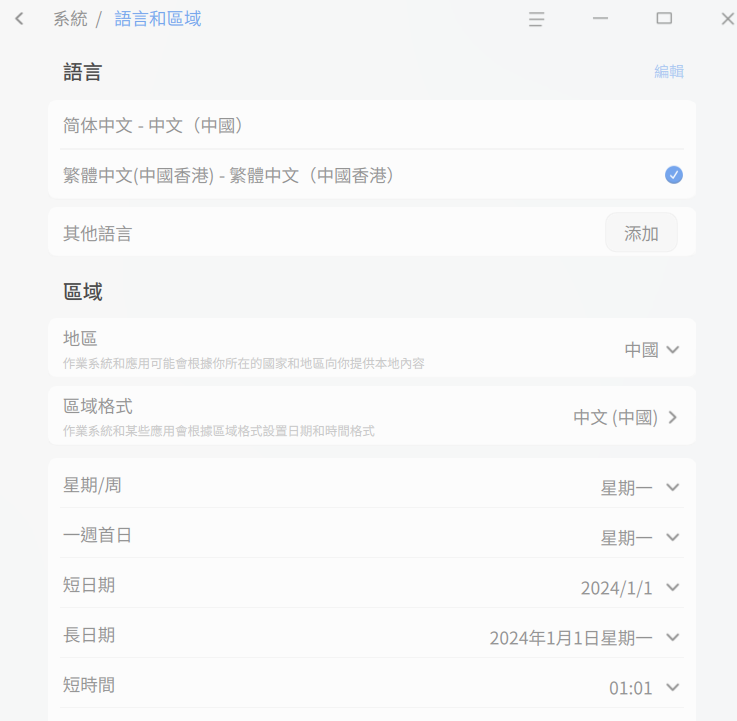

##### 添加系統語言

您可添加多種語言至系統語言清單，以便切換系統語言。

1. 在控制中心側邊欄選擇 **系統**。
2. 點擊 **語言和區域**，進入系統語言介面。
3. 點擊 **添加** 按鈕進入語言清單。
4. 選擇語言，該語言將自動添加至系統語言清單。

##### 設定系統語言

1. 在控制中心側邊欄選擇 **系統**。
2. 點擊 **語言和區域**，進入系統語言介面。
3. 選擇要切換的語言，系統將自動開始安裝語言包。
4. 語言包安裝完成後，需要登出後重新登入以使設定生效。

>  注意：變更系統語言後，鍵盤佈局可能亦會改變。重新登入時，請確保使用正確的鍵盤佈局輸入密碼。

##### 區域

1. 在控制中心側邊欄選擇 **系統**。
2. 點擊 **語言和區域**，進入區域設定介面。
3. **地區** 初始化設定後，可調整區域設定；系統會根據區域提供輸入法、鍵盤佈局及格式設定建議。可透過下拉框切換地區。
4. **區域和格式** 設定可在初始化後調整；系統會根據所選地區提供對應習慣格式（如日期顯示、貨幣符號及數字格式）。選擇後點擊 **保存** 保留切換。
5. 目前 **格式** 顯示設定可透過設定時間、日期格式，調整工作列顯示時間格式。

#### 預設應用程式

當安裝多個功能相近的應用程式時，可透過右鍵選單或控制中心為某類檔案指定預設開啟程式。

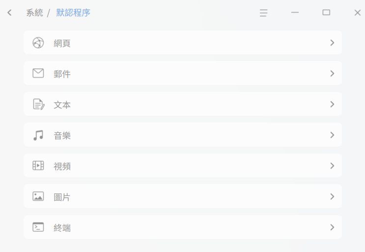

##### 設定預設應用程式

1. 右鍵點擊檔案，選擇 **開啟方式** > **選擇預設應用程式**。
2. 選擇一個應用，系統會自動勾選「設為預設」，點擊 **確定**。
3. 該應用將自動添加至控制中心的預設應用程式清單。

##### 變更預設應用程式

1. 在控制中心側邊欄選擇 **系統**，點擊 **預設應用程式**。
2. 選擇一個檔案類型進入預設應用程式清單。
3. 在清單中選擇另一個應用程式。

##### 新增預設應用程式

1. 在控制中心側邊欄選擇 **系統**，點擊 **預設應用程式**。
2. 選擇檔案類型進入預設應用程式清單。
3. 點擊清單下的 **新增預設應用程式** 按鈕 **新增**，選擇 desktop 檔案（一般在/usr/share/applications)，或特定的二進位檔案。
4. 將程式添加到程式清單並勾選該程式，即可設為預設應用程式。

##### 刪除預設應用程式

在預設應用程式清單中，您只能刪除自己新增的應用程式，不能刪除系統已安裝的應用。要刪除系統已安裝的應用，只能解除安裝；解除安裝後該應用將自動從預設應用程式清單移除。

可使用以下方法刪除自己新增的預設應用程式：

1. 在控制中心側邊欄選擇 **系統**，點擊 **預設應用程式**。
2. 選擇檔案類型進入預設應用程式清單。
3. 點擊程式後方的 ，刪除預設應用程式。

#### 啟動菜單

啟動菜單模組管理開機啟動功能設定。

##### 設定啟動菜單

開機選單是指開機後選擇操作系統的選單。選擇某一系統後，電腦會引導進入該操作系統。

>  說明：arm 架構系統僅支援 grub 驗證；mips 架構系統暫不支援 grub 驗證，亦不支援更換開機選單背景圖。

**修改預設啟動項**

1. 在控制中心側邊欄選擇 **系統**。
2. 點擊 **啟動菜單**，進入開機選單介面。
3. 點擊選中某一選單項後，彈出授權認證視窗，請輸入密碼授權；該項將成為預設啟動項。

**設定啟動延時**

「開機延遲」為開啟狀態時，開機後會在開機選單等待 5 秒，以便您選擇啟動其他操作系統。
「開機延遲」為關閉狀態時，開機後會在開機選單等待 1 秒。

**主題**

1. 在控制中心側邊欄選擇 **系統**。
2. 點擊 **啟動菜單**，進入開機選單介面。
3. 啟用主題後，可在開機時看到主題背景。

>  提示：您亦可將圖片拖曳到預覽視窗，以更換開機選單背景。

##### 啟動動畫

1. 在控制中心側邊欄選擇 **系統**。
2. 點擊 **啟動菜單**，進入開機選單介面。
3. 可選擇開機介面 logo 動畫尺寸為大尺寸/小尺寸。

#### 開發者選項

##### 開發調試選項

進入開發者模式後，您可更改 **系統日誌記錄級別** 配置。

在控制中心側邊欄選擇 **系統**，選擇 **開發者選項**，在 **開發調試選項** 區域，您可將 **系統日誌記錄級別** 設為調試以獲得更詳細的日誌；預設為關閉。

#### 備份還原

為避免因軟體缺陷、硬體損毀、人為操作不當等因素造成資料缺失或損壞，可進行應用資料或系統資料的備份還原，以保障系統正常運行。

#### 關於本機

1. 在控制中心側邊欄選擇 **系統**。

2. 在 **關於本機** 下，您可以：
   
   - 點擊  修改電腦名稱。
   
   - 查看目前系統版本、版本授權、系統安裝時間及電腦硬體資訊。

#### 開源軟體聲明

1. 在控制中心側邊欄選擇 **系統**。

2. 在 **開源軟體聲明** 下，查看開源軟體聲明。

#### 最終用戶授權協議

1. 在控制中心側邊欄選擇 **系統**。
2. 在 **最終用戶授權協議** 下，查看最終用戶授權協議。

#### 私隱政策

1. 在控制中心側邊欄選擇 **系統**。
2. 在 **私隱政策** 下，查看私隱政策。

### 網路

登入系統後，您需要連接網路，才能接收郵件、瀏覽新聞、下載檔案、聊天、網上購物等。

>  提示：您可點擊工作列的快速面板，設定、查看目前網路狀態。

#### 有線網路

有線網路安全、快速、穩定，是最常見的網路連接方式。當您設定好路由器後，把網線兩端分別插入電腦和路由器，即可連接有線網路。

1. 將網線插入電腦上的網路插孔。
2. 將網線的另一端插入路由器或網路埠。
3. 在控制中心側邊欄選擇 **網路**。
4. 點擊 **有線網路**，進入有線網路設定介面。
5. 開啟 **有線網卡**，啟用有線網路連接功能。
6. 網路連接成功後，桌面上方會彈出「已連接有線連接」的提示資訊。

您亦可在有線網路設定介面編輯或建立有線網路設定。

#### 無線網路

無線網路可讓您擺脫線纜束縛，上網更靈活，亦支援更多設備使用。

##### 連接無線網路

1. 在控制中心側邊欄選擇 **網路** 。
2. 點擊 **無線網路**，進入無線網路設定介面。
3. 開啟 **無線網卡**，啟用無線網路連接功能。
4. 電腦會自動搜尋並顯示附近可用的無線網路。
5. 選擇要連接的無線網路。
   - 若該網路為開放網路，將自動連接。
   - 若該網路為加密網路，請按提示輸入密碼，點擊 **連接**，系統將自動完成連接。

##### 連接隱藏網路

為防止他人掃描到您的無線網路並嘗試破解密碼，您可在路由器設定介面隱藏無線網路。設定後，需要手動連接隱藏網路才能上網。

1. 在控制中心側邊欄選擇 **網路** 。
2. 點擊 **無線網路**，進入無線網路設定介面。
3. 點擊 **連接到隱藏網路**。
4. 輸入網路名稱 SSID 和其他必填選項。
5. 點擊 **保存** 。

#### 個人熱點

透過個人熱點將電腦網路訊號轉換為無線網路熱點，供一定距離內的其他設備無線連接。要啟用無線熱點，電腦必須配備支援熱點功能的無線網卡。

1. 在控制中心側邊欄選擇 **網路**。
2. 點擊 **個人熱點**。
3. 開啟 **熱點** 開關，設定熱點資訊。
4. 點擊 **保存** 。

#### 飛航模式

啟用飛航模式可停用無線網路、個人熱點和藍牙。除控制中心外，亦可在工作列快速面板中點擊飛航模式開關以啟用或關閉。

1. 在控制中心側邊欄選擇 **網路** 。
2. 點擊 **飛航模式**。
3. 開啟開關以啟用飛航模式。

> 注意：若您的電腦沒有無線網卡且沒有藍牙模組，系統將不會顯示飛航模式相關介面。

#### 撥號網路

撥號上網（DSL）是指透過本地電話撥號連接網路的方式。配置好數據機後，用網線連接數據機的網口與電腦網口，建立寬頻撥號連接並輸入營運商提供的使用者名稱和密碼，即可撥號連接到 Internet。

##### 新增撥號連接

1. 在控制中心側邊欄選擇 **網路** 。
2. 點擊 **DSL**，並點擊 **建立PPPoE連接** 按鈕 。
3. 輸入寬頻名稱、帳戶、密碼。
4. 點擊 **保存**，系統將自動建立寬頻連接並嘗試連接。

#### VPN

VPN（虛擬專用網路）的主要功能是在公用網路上建立專用網路並進行加密通訊。無論您在外地出差或在家辦公，只要可上網，即可透過 VPN 訪問企業內網資源；亦可用 VPN 加速訪問其他國家的網站。

1. 在控制中心側邊欄選擇 **網路** 。
2. 點擊 **VPN**，選擇 **新增 VPN** 按鈕或 **匯入 VPN** 按鈕。
3. 選擇 VPN 協議類型，並輸入名稱、閘道、使用者名稱、密碼等資訊。（匯入 VPN 會自動填充資訊）
4. 點擊 **保存**，系統將自動嘗試連接 VPN 網路。
5. 您可匯出 VPN 設定，以備用或分享給其他使用者。

>  說明：開啟 **僅用於相對應的網路上的資源** 開關，可不將 VPN 設為預設路由，只在特定網路資源上生效。

#### 系統代理

1. 在控制中心側邊欄選擇 **網路** 。
2. 點擊 **系統代理**，進入系統代理介面。
3. 開啟系統代理，在代理類型後的下拉框中選擇 **手動** 或 **自動**。
   - 選擇 **手動**：需配置代理伺服器位址、埠等資訊。
   - 選擇 **自動**：需配置 URL，系統將自動配置代理伺服器資訊。
4. 點擊 保存。

#### 網路詳細資料

在網路詳細資料介面，您可查看 MAC 位址、IP 位址、閘道及其他網路資訊。

1. 在控制中心側邊欄選擇 **網路** 。
2. 點擊 **網路詳細資料**，進入網路資訊介面。
3. 查看目前有線網路或無線網路資訊。 

### 個人化

在控制中心個人化設定模組中，可進行通用的個人化設定，包括系統主題、強調色、字型、視窗特效和不透明度，以改變桌面和視窗外觀；亦可設定圖示主題、游標主題和字型。

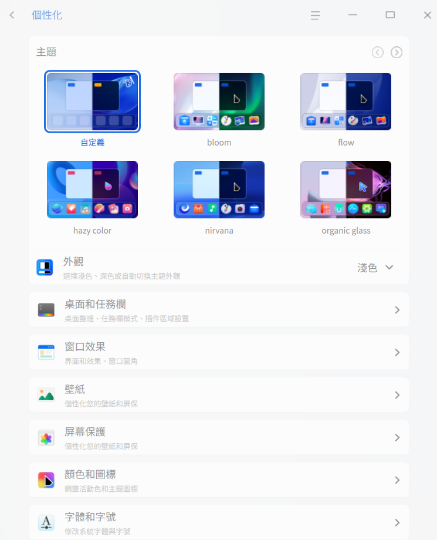

#### 設定視窗主題

1. 在控制中心側邊欄選擇  **個人化**。
2. 點擊 **主題**，選擇一種系統主題。
3. 該主題即為系統主題。

#### 外觀

外觀用於調整主題的淺色、深色模式。

1. 在控制中心側邊欄選擇  **個人化** 。
2. 點擊 **一般**。
3. 點擊 **外觀** 選擇框選擇模式，可選擇 **淺色、深色** 及 **自動**。選擇自動模式後，會根據日出、日落時間切換深淺外觀。

>  說明：自動外觀表示根據目前時區時間，按日出日落時間自動切換視窗主題；日出後為淺色，日落後為深色。

#### 桌面和工作列設定

在「個人化 > 桌面和工作列」設定介面中，可對工作列的模式、位置、狀態等進行設定。

1. 在控制中心側邊欄選擇 **個人化**  。
2. 點擊 **桌面和工作列**，進入設定介面後，您可以：
   - 選擇工作列模式為傳統模式或高效模式。
   - 透過拖曳工作列大小滑塊調整工作列大小。
   - 開啟或關閉 **禁用自由調節**，鎖定工作列高度，避免誤拖曳改變工作列大小。
   - 設定位置為上、下、左或右。
   - 設定顯示狀態為一直顯示、一直隱藏或智慧隱藏。
   - 開啟或關閉 **合併應用程式圖示**，設定同一應用程式的多個視窗是否合併為一個工作列圖示顯示。
   - 外掛區域：勾選或取消勾選外掛區域的外掛，設定其在工作列上的顯示和隱藏效果。

多螢幕延伸模式時，工作列位置可設定為跟隨滑鼠位置顯示，或僅主螢幕顯示。

#### 視窗效果

視窗效果表現依賴硬體性能。您可切換不同的視窗效果，選擇操作體驗最佳的模式。

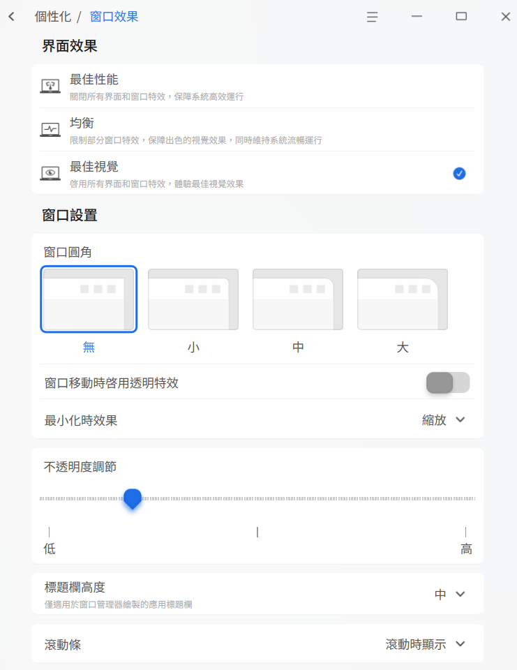

1. 在控制中心側邊欄選擇  **個人化**  。
2. 點擊 **視窗效果**，進入設定介面後，您可以：
   - **介面效果** 選擇 **效能模式**，可關閉所有介面和視窗特效，保障系統高效運行。
   - **介面效果** 選擇 **平衡模式**，可限制部分視窗特效，兼顧視覺效果與流暢度。
   - **介面效果** 選擇 **視覺模式**，可啟用所有介面和視窗特效，獲得最佳視覺效果。
   - 視窗圓角可選擇 無、小、中、大。
   - 視窗移動時啟用透明特效：可開啟或關閉；開啟後移動視窗會觸發透明特效。
   - 視窗最小化效果：可切換 **縮放** 或 **魔燈** 效果。
   - 設定工作列、啟動器（小視窗模式）的不透明度：滑塊越靠左越透明，越靠右越不透明。
   - 修改捲動條顯示方式：可選擇捲動時顯示或一直顯示。
   - 設定標題列高度：拖曳 **標題列高度** 滑塊調整，並可即時預覽。

>  說明：此功能僅適用於視窗管理器繪製的應用標題列。

#### 桌布

選擇精美、時尚的桌布來美化桌面，讓您的電腦顯示與眾不同。

1. 在桌面上，右鍵點擊，點擊 **設定桌布**，進入控制中心預覽所有桌布。
2. 您可選擇我的圖片、系統桌布或純色桌布 3 種桌布類型。
3. 點擊選擇桌布後，桌布會立即在桌面生效。
4. 在桌布上右鍵點擊 **設定鎖屏** ，桌布會在鎖屏中生效。

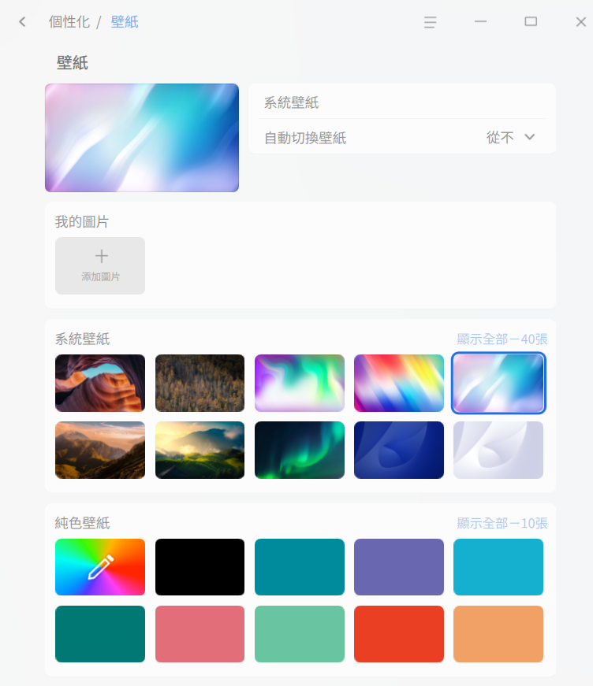

>  提示：
> 
> - 您可在自動切換桌布選項中設定自動更換桌布的時間間隔，亦可設定在「登入時」和「喚醒時」自動更換桌布。
> - 您亦可在圖片檢視器中將喜愛的圖片設為桌面桌布，或前往應用商店搜尋桌布以下載喜愛的桌布。

#### 螢幕保護程式

螢幕保護程式最初用於保護顯像管，現時一般用於防止他人偷窺電腦上的私隱內容。

1. 在 控制中心>個人化 中，點擊 **螢幕保護程式** 進入設定介面，預覽所有螢幕保護程式。
2. 您可選擇圖片輪播螢幕保護程式或系統螢幕保護程式 2 種類型。
3. 選中螢幕保護程式後，設定閒置時間；電腦閒置至指定時間後將啟動所選螢幕保護程式。
4. 選擇圖片輪播螢幕保護程式後，在個人化螢幕保護程式選項中點擊 **設定** 打開設定視窗，可自訂圖片路徑、輪播間隔及啟用隨機輪播。
5. 您可開啟 **恢復時需要密碼**，以更好保護私隱。

#### 色彩與圖示

1. 在控制中心側邊欄選擇  **個人化**  。
2. 點擊 **色彩與圖示**，進入設定介面後，您可以：
   - 強調色：可即時預覽並調整選中項目的強調色。
   - 圖示主題：可切換系統提供、商店下載或自訂匯入的圖示主題。
   - 點擊 **游標主題**，選擇游標樣式。

#### 字型

1. 在控制中心側邊欄選擇 **個人化**  。
2. 點擊 **字型**，進入字型設定介面。
3. 設定系統字型大小和字型。

### 藍牙和其他設備

#### 藍牙

藍牙可實現短距離無線通訊。透過藍牙無需網路或連接線即可與附近的藍牙設備連接。常見藍牙設備包括：藍牙鍵盤、藍牙滑鼠、藍牙耳機、藍牙音響等。

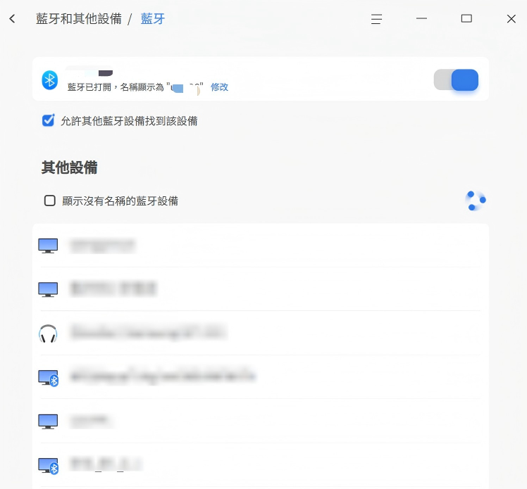

&nbsp;&nbsp;&nbsp;&nbsp;&nbsp;&nbsp;&nbsp;&nbsp;&nbsp;&nbsp;&nbsp;&nbsp;&nbsp;

>  說明：當筆記型電腦配備藍牙時，可直接開啟藍牙開關；若桌上型電腦未配備藍牙，可購買藍牙適配器並插入電腦的 USB 連接埠後再使用藍牙。

##### 修改藍牙名稱

1. 在控制中心側邊欄選擇 **藍牙和其他設備**，點擊 **藍牙**。
2. 點擊藍牙名稱旁的 **修改** 按鈕，輸入本機新的藍牙名稱。

>  說明：修改藍牙名稱後，將自動對外廣播藍牙設備的新名稱，需要其他設備重新搜尋。

##### 連接藍牙設備

1. 在控制中心側邊欄選擇 **藍牙和其他設備**，點擊 **藍牙**。
2. 開啟 **藍牙**，系統將自動掃描附近藍牙設備，並顯示在 **其他設備** 清單。
3. 雙擊要連接的藍牙設備，或點擊 **連接**；如需要，請在設備上輸入配對碼。配對成功後將自動連接。
4. 連接成功後，藍牙設備會添加到 **我的設備** 清單中。
5. 在我的設備清單中點擊該設備，您可 **斷開連接** 或修改設備名稱。

##### 使用藍牙傳送/接收檔案

deepin PC 與非 deepin PC，或 deepin PC 與流動設備（手機/平板）之間可透過藍牙傳送/接收檔案。

前提條件：發送端藍牙設備與接收端藍牙設備已配對並成功連接。

**使用 deepin PC 端藍牙傳送檔案**

場景：發送端透過藍牙向接收端傳送檔案。

1. 在控制中心側邊欄選擇 **藍牙和其他設備**，點擊 **藍牙**。
2. 開啟 **藍牙**，系統將自動掃描附近藍牙設備。
3. 進入「我的設備」選擇已配對並連接的藍牙設備，點擊已連接設備的 更多 按鈕進入詳情，點擊 **傳送檔案** 按鈕（僅 PC/手機/平板的藍牙設備提供該按鈕），在彈出的檔案管理員視窗中選擇要傳送的檔案，點擊 **打開**。
4. 在彈出的「藍牙檔案傳輸」視窗中，選擇接收該檔案的藍牙設備，點擊 **傳送**，發送傳輸請求。

**使用手機端藍牙傳送檔案**

場景：發送端（以 Android 手機為例）透過藍牙向接收端傳送檔案。

1. 開啟 **藍牙**，系統將自動掃描附近藍牙設備。
2. 選擇已配對並成功連接的藍牙設備。
3. 在手機中選擇檔案，點擊 **傳送**，透過藍牙發送檔案。

**使用藍牙接收檔案**

發送端發送檔案後，接收端會彈出提示視窗，使用者可點擊 **接受** 或 **拒絕** 檔案。

- 若接收端同意接收，發送端將開始傳輸並顯示發送視窗；傳輸完成後，接收端會彈出提示資訊，使用者可查看接收成功的檔案。
- 若接收端出現以下情況，發送端部分檔案傳輸失敗，會顯示在傳輸失敗清單：
  - 接收端選擇拒絕：結束傳輸，顯示傳輸失敗。
  - 接收端逾時未操作或超出傳輸範圍：顯示傳輸失敗（藍牙設備連接失敗）。
  - 接收端未點擊接收或拒絕：預設 1 分鐘後結束傳輸，顯示傳輸失敗。

#### 滑鼠與觸控板

滑鼠與觸控板是常用輸入設備。使用滑鼠可讓操作更簡便快捷；對筆記型電腦使用者而言，沒有滑鼠時亦可用觸控板代替。部分設備亦支援指點杆，使用指點杆時無需把手指從基準鍵移開即可操控滑鼠。在控制中心的滑鼠設定模組中，使用者可對滑鼠、觸控板及指點杆進行設定，以更符合個人使用習慣。

##### 一般設定

1. 在控制中心側邊欄選擇 **藍牙和其他設備**，點擊 **滑鼠與觸控板**。

2. 在 **一般** 區域設定：
   
   - **捲動速度**：拖曳滑塊，數值越高捲動越快。
   
   - **雙擊速度**：拖曳滑塊調整。
   
   - 開啟 **左手模式**：適用於左手操作。
     
     >  說明：開啟左手模式後，滑鼠與觸控板的左右鍵功能會互換。

##### 滑鼠設定

插入或連接滑鼠後，可在控制中心進行相關設定，使其更符合您的使用習慣。

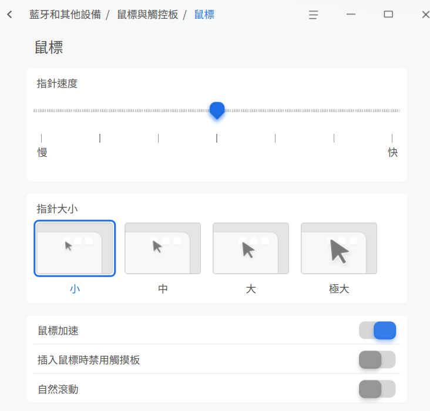

1. 在控制中心側邊欄選擇 **藍牙和其他設備**，點擊 **滑鼠與觸控板**。
2. 點擊 **滑鼠**。
3. 調整 **指標速度**，控制滑鼠移動時指標移動速度。
4. 在 **指針大小** 區域，點選 小／中／大，調整游標大小。
5. 開啟 **滑鼠加速**，調整滑鼠移動響應速度。
6. 開啟 **插入滑鼠時禁用觸控板**，接入滑鼠後觸控板將停用。
7. 點擊 **自然捲動** 開關，啟用相應功能。

>  說明：
> 
> - 開啟滑鼠加速可提高指標精確度；指標在螢幕上的移動距離會隨移動速度增加而增加，可按需要開啟或關閉。
> - 當沒有觸控板時，不會顯示「插入滑鼠時禁用觸控板」。
> - 啟用自然捲動後，滑鼠滾輪向下捲動內容會向下捲動；向上捲動內容會向上捲動。

##### 觸控板設定

若您使用的是筆記型電腦，可在 **滑鼠與觸控板 > 滑鼠** 介面開啟 **輸入時禁用觸控板**，以避免誤觸。

您亦可調整觸控板的 **指標速度**，控制手指移動時指標移動速度；並可啟用自然捲動以變更捲動方向。

##### 手勢設定

手勢設定可透過觸控板手勢快速響應桌面功能，主要可設定三指手勢與四指手勢。

**三指手勢** 可設定以下功能：

1. 三指向上：預設為最大化視窗，可調整為恢復視窗、目前視窗左分屏、目前視窗右分屏或停用。
2. 三指向下：預設為恢復視窗，可調整為最大化視窗、目前視窗左分屏、目前視窗右分屏或停用。
3. 三指向左：預設為目前視窗左分屏，可調整為恢復視窗、最大化視窗、目前視窗右分屏或停用。
4. 三指向右：預設為目前視窗右分屏，可調整為恢復視窗、最大化視窗、目前視窗左分屏或停用。
5. 三指點擊：預設為打開/隱藏全域搜尋，可調整為顯示/隱藏啟動器、打開/隱藏剪貼簿、打開/隱藏通知中心或停用。

**四指手勢** 可設定以下功能：

1. 四指向上：預設為顯示多工作檢視，可調整為隱藏多工作檢視、切換至前一個桌面、切換至後一個桌面、顯示桌面、隱藏桌面或停用。
2. 四指向下：預設為隱藏多工作檢視，可調整為顯示多工作檢視、切換至前一個桌面、切換至後一個桌面、顯示桌面、隱藏桌面或停用。
3. 四指向左：預設為切換至前一個桌面，可調整為顯示多工作檢視、隱藏多工作檢視、切換至後一個桌面、顯示桌面、隱藏桌面或停用。
4. 四指向右：預設為切換至後一個桌面，可調整為顯示多工作檢視、隱藏多工作檢視、切換至前一個桌面、顯示桌面、隱藏桌面或停用。
5. 四指點擊：預設為打開/關閉啟動器，可調整為打開/關閉全域搜尋、打開/關閉剪貼簿、打開/關閉通知中心或停用。

#### 鍵盤

在此模組可設定鍵盤屬性以符合個人輸入習慣，並設定輸入法及自訂快捷鍵。

##### 鍵盤屬性

1. 在控制中心側邊欄選擇 **藍牙和其他設備**，點擊 **鍵盤**。
2. 在 **一般** 區域設定。
3. 調整 **重複延遲**/**重複速度**。
4. 點擊「請在此測試」，按住鍵盤上的任意字元不放，查看調整效果。
5. 點擊 **啟用數字鍵盤**/**大寫鎖定提示** 開關，啟用相應功能。

##### 輸入法

設定輸入法可為系統提供更豐富的輸入方式。於輸入法介面可添加多個輸入法並設定切換快捷鍵，以便使用者選擇符合個人打字習慣的輸入方式。

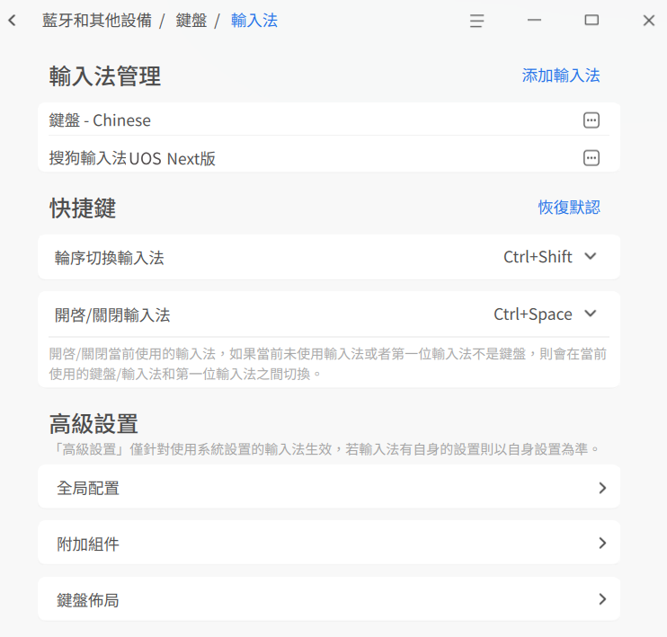

**新增輸入法**

您可添加多個輸入法至輸入法管理清單，以便切換。

1. 在控制中心側邊欄選擇 **藍牙和其他設備**，點擊 **鍵盤**。
2. 點擊 **輸入法**，進入輸入法介面。
3. 點擊 **新增輸入法** 按鈕，您可以：
   - 點擊 **前往商店下載**，在應用商店下載輸入法；下載完成後系統會自動設為預設輸入法。
   - 進入新增輸入法介面，選擇輸入法並添加至管理清單。

>  說明：在輸入法管理介面點擊 **編輯** 後，點擊 **刪除** 可移除某輸入法。被移除（非解除安裝）的輸入法可在新增輸入法介面重新添加。

**設定輸入法排序**

1. 在控制中心側邊欄選擇 **藍牙和其他設備**，點擊 **鍵盤**。
2. 點擊 **輸入法**，進入輸入法介面。
3. 在輸入法管理區域，上下拖曳輸入法以排序。

**設定輸入法配置項**

1. 在控制中心側邊欄選擇 **藍牙和其他設備**，點擊 **鍵盤**。
2. 點擊 **輸入法**，進入輸入法介面。
3. 在輸入法管理區域，點擊輸入法後方的 **設定** 按鈕，設定輸入法自身配置。

**設定輸入法切換快捷鍵**

1. 在控制中心側邊欄選擇 **藍牙和其他設備**，點擊 **鍵盤**。
2. 點擊 **輸入法**，進入輸入法介面。
3. 在快捷鍵區域的下拉框中，選擇輸入法切換快捷鍵。

>  說明：在輸入法進階設定介面中，亦可設定更多快捷鍵。

**進階設定**

1. 在控制中心側邊欄選擇 **藍牙和其他設備**，點擊 **鍵盤**。
2. 點擊 **輸入法**，進入輸入法介面。
3. 點擊 **進階設定**，對輸入法進行全域配置（如更多快捷鍵、程式、輸出和外觀設定），並附加元件。

**鍵盤佈局**

鍵盤佈局可為目前語言設定自訂鍵盤。完成佈局設定後，按下鍵盤按鍵時，螢幕將按佈局設定顯示字元。更改佈局後，螢幕字元可能與鍵盤按鍵字元不一致。

一般在安裝系統時已設定鍵盤佈局，亦可按需要新增或刪除其他佈局。

**新增鍵盤佈局**

1. 在控制中心側邊欄選擇 **藍牙和其他設備**，點擊 **鍵盤**。
2. 點擊 **鍵盤佈局**，進入鍵盤佈局介面。
3. 點擊 **新增鍵盤佈局** 按鈕，點擊某一佈局即可新增至清單。

**刪除鍵盤佈局**

1. 在控制中心側邊欄選擇 **藍牙和其他設備**，點擊 **鍵盤**。
2. 點擊 **鍵盤佈局**，進入鍵盤佈局介面。
3. 點擊「鍵盤佈局」後的 **編輯**。
4. 點擊 **刪除** 按鈕，刪除該佈局。

##### 快捷鍵

快捷鍵清單顯示系統所有快捷鍵，您可在此查看、修改和自訂快捷鍵。

**查看快捷鍵**

1. 在控制中心側邊欄選擇 **藍牙和其他設備**，點擊 **鍵盤**。
2. 點擊 **快捷鍵**，進入快捷鍵設定介面。
3. 搜尋或查看預設的系統快捷鍵、視窗快捷鍵和工作區快捷鍵。

**修改快捷鍵**

1. 在控制中心側邊欄選擇 **藍牙和其他設備**，點擊 **鍵盤**。
2. 點擊 **快捷鍵**，進入快捷鍵設定介面。
3. 點擊要修改的快捷鍵。
4. 使用鍵盤輸入新的快捷鍵。

>  提示：若要停用快捷鍵，請按下鍵盤上的 **Backspace**  鍵。若要取消修改，按下 **Esc** 鍵，或點擊下方的「恢復預設」按鈕。

**自訂快捷鍵**

您可為常用應用自訂快捷鍵。

1. 在控制中心側邊欄選擇 **藍牙和其他設備**，點擊 **鍵盤**。
2. 點擊 **快捷鍵**。
3. 點擊 **新增** 按鈕，進入新增自訂快捷鍵介面。
4. 輸入快捷鍵名稱、命令和快捷鍵。
5. 點擊 **新增**。
6. 新增成功後，點擊「自訂快捷鍵」後的 **編輯**。
7. 點擊某個快捷鍵後方的刪除按鈕，刪除自訂快捷鍵。

>  提示：若要修改快捷鍵，點擊後輸入新的快捷鍵即可。若要修改自訂快捷鍵名稱和命令，點擊「自訂快捷鍵」後的 **編輯**，再點擊快捷鍵名稱後的  進入修改頁面。

#### 觸控螢幕設定

接入觸控螢幕後，您可設定所在螢幕並進行調整。

1. 在控制中心側邊欄選擇 **藍牙和其他設備**，點擊 **觸控螢幕**。
2. 完成設定後，點擊 **確定**。

#### 數位板

數位板（亦稱繪圖板/繪畫板/手繪板等）主要用於繪畫創作，是電腦的一種輸入設備。連接電腦後，可設定數位板壓力靈敏度，即筆尖與橡皮擦的壓力感應值。

>  說明：連接數位板設備後，該模組才會顯示。

1. 在控制中心側邊欄選擇 **藍牙和其他設備**，點擊 **數位板**。
2. 選擇 **筆** 模式。
3. 調整 **壓感力度**。

### 電源管理

對系統電源進行設定，讓筆記型電腦電池更耐用，系統更安全。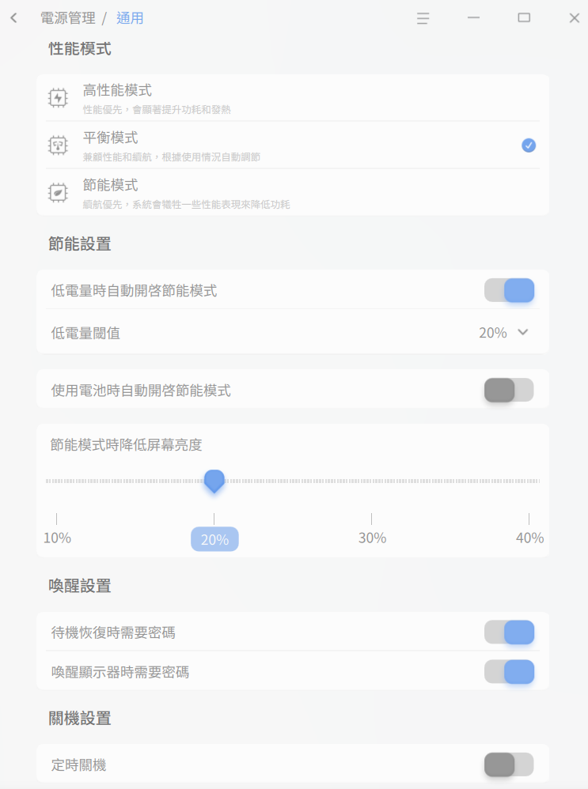

#### 調整效能模式

1. 在控制中心側邊欄選擇 **電源管理**。
2. 點擊 **一般**。
3. 在效能模式區域，選擇 **平衡模式**、**高效能模式** 或 **省電模式**。

#### 設定省電模式

為降低耗電量，您可設定省電模式以降低螢幕亮度。

1. 在控制中心側邊欄選擇 **電源管理**。
2. 點擊 **一般**。
3. 在省電設定下：
   - 開啟 **低電量時自動啟用** 省電模式（僅筆記型電腦支援）。
   - 設定 **低電量閾值**：在下拉選項中選擇電量達到閾值後自動進入省電模式。
   - 開啟 **使用電池時自動啟用** 省電模式（僅筆記型電腦支援）。
   - 拖曳 **自動調暗亮度** 滑塊，調整省電模式啟用時螢幕亮度。

> 

#### 喚醒設定

1. 在控制中心側邊欄選擇 **電源管理**。
2. 點擊 **一般**。
3. 在 喚醒設定 區域設定：
   - 開啟 **睡眠恢復時需要密碼**，啟用睡眠喚醒需重新登入。
   - 開啟 **喚醒顯示器時需要密碼**，啟用喚醒需重新登入。

#### 排程關機

1. 在控制中心側邊欄選擇 **電源管理**。
2. 點擊 **一般**。
3. 在 **排程關機** 區域設定：
   - 設定 **排程關機時間**，可輸入時間或透過控件調整預設關機時間。
   - 設定 **重複頻次**，可設定單次、工作日重複、每天重複或自訂。

#### 設定螢幕關閉時間

1. 在控制中心側邊欄選擇 **電源管理**。
2. 點擊 **使用電源** 或 **使用電池**。
3. 選擇關閉螢幕的時間。

>  說明：筆記型電腦使用者可在「使用電源」和「使用電池」下，為同一設定項分別設定不同時間。

#### 設定電腦睡眠時間

1. 在控制中心側邊欄選擇 **電源管理**。
2. 點擊 **使用電源** 或 **使用電池**。
3. 選擇電腦開始睡眠的時間。

>  提示：筆記型電腦使用者亦可啟用 **闔上筆記本時睡眠**，以便在使用電源時闔蓋睡眠。

#### 設定自動鎖定時間

1. 在控制中心側邊欄選擇 **電源管理**。
2. 點擊 **使用電源** 或 **使用電池**。
3. 選擇自動鎖定時間。

#### 設定闔蓋動作

1. 在控制中心側邊欄選擇 **電源管理**。
2. 點擊 **使用電源** 或 **使用電池**。
3. 將 **筆記本闔蓋時** 設為 **睡眠**、**休眠**、**關閉螢幕** 或 **無動作**。

>  說明：僅筆記型電腦支援設定闔蓋動作。

#### 設定電源按鈕動作

1. 在控制中心側邊欄選擇 **電源管理**。
2. 點擊 **使用電源** 或 **使用電池**。
3. 選擇電源按鈕動作 **關機**、**睡眠**、**休眠**、**關閉螢幕**、**顯示電源選單** 或 **無動作**。

#### 低電量管理

1. 在控制中心側邊欄選擇 **電源管理**。
2. 點擊 **使用電池**。
3. 設定低電量管理：
   - 開啟 **低電量通知**：當電池剩餘電量低於閾值（例如 20%）時，系統會發出低電量通知。
   - 設定低電量自動進入狀態：可設為自動睡眠或自動休眠。
   - 設定低電量閾值：可透過下拉框選擇進入低電量狀態的電量閾值。

>  說明：僅筆記型電腦支援低電量通知設定。

#### 電池資訊

1. 在控制中心側邊欄選擇 **電源管理**。
2. 點擊 **使用電池**。
3. 在 **電池資訊** 區域：
   - 可設定開啟 **顯示剩餘使用時間及剩餘充電時間**，調整工作列顯示電量資訊。
   - 顯示最大電池容量資訊。

### 帳戶

安裝系統時會建立一個帳戶。在控制中心的帳戶設定模組中，可修改帳戶設定或建立新帳戶。

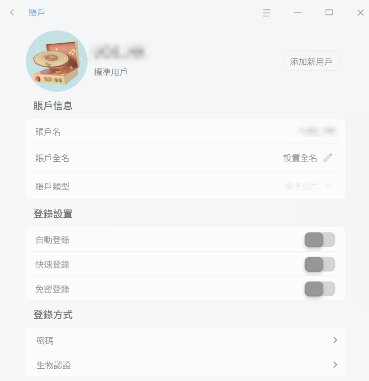

#### 建立新帳戶

1. 點擊 **新增使用者** 按鈕。
2. 選擇帳戶類型，設定使用者名稱、全名、密碼、重複密碼、密碼提示資訊。
3. 點擊 **建立**。
4. 在授權對話框輸入目前帳戶密碼，新帳戶會添加到帳戶清單中。

>  提示：您亦可將標準使用者的帳戶類型設定為管理員。

#### 更改頭像

滑鼠移至帳戶頭像會顯示 **編輯**。點擊頭像，選擇頭像或添加本機頭像，即可完成更換。

#### 設定全名

帳戶全名會顯示在帳戶清單和系統登入介面，可按需要設定。

點擊 **設定全名** 後的 ，輸入帳戶全名。

#### 自動登入

啟用「自動登入」後，下次啟動系統（重新啟動/開機）可直接進入桌面；在鎖屏和登出後再次登入仍需要密碼。

開啟 **自動登入** 開關，在彈出的授權對話框輸入目前帳戶密碼並確定後，即可啟用自動登入。

#### 免密登入

啟用「免密登入」後，下次登入系統（重新啟動/開機，以及登出後再次登入）和解鎖時將不需要密碼。

開啟 **免密登入** 開關，在彈出的授權對話框輸入目前帳戶密碼並確定後，即可啟用免密登入。

>  提示：若「免密登入」與「自動登入」同時開啟，下次啟動系統（重新啟動/開機）將直接進入桌面。

#### 登入方式

可對目前支援的登入方式進行編輯與配置。

**密碼-修改密碼**

1. 點擊 **密碼**，進入密碼二級頁面。
2. 輸入目前密碼、新密碼與重複密碼，點擊 **保存**。

>  說明：管理員帳號過期後需先修改密碼才能進行授權操作。

**密碼-密碼有效期**

1. 點擊 **密碼**，進入密碼二級頁面。
2. 設定密碼有效天數，可設為永久有效或指定天數。

> 密碼有效期自修改之日起開始計算。
> 
> 例如：使用者 A 於 9 月 1 日修改密碼後，將有效期設為 30 天。此情況下，密碼可在 9 月 1 日至 9 月 30 日的 30 天內正常使用。

**生物認證**

生物認證（生物識別）是透過電腦利用人體固有的生理特徵或行為特徵進行身份鑒定。常見生物認證包括指紋識別、人臉識別。

當接入具備生物認證的硬體設備後，在系統中錄入指紋、人臉資訊，可用於登入系統、解鎖螢幕、授權特殊操作，並可提升使用體驗與系統安全性。

>  說明：只有接入具備生物認證的硬體設備後才會顯示生物認證模組，才可設定指紋/人臉密碼。

**設定指紋密碼**

指紋是指手指末端正面皮膚上凹凸不平的紋路。一般來說，每個人的指紋不同，亦可設定為密碼。

1. 進入生物認證二級頁面，在指紋區域點擊 **新增指紋**。
2. 在授權對話框輸入目前帳戶密碼後，使用指紋設備錄入指紋。
3. 指紋新增成功後點擊 **完成**。

>  說明：您可新增多個指紋密碼，亦可逐一刪除。

**設定人臉識別**

1. 進入生物認證二級頁面，在人臉區域點擊 **新增人臉**。
2. 在彈出的新增人臉數據對話框中勾選 **我已閱讀並同意《用戶免責聲明》**，並點擊 **下一步**。
3. 點擊 **同意並開始錄入人臉**，點擊 **下一步** 使用人臉識別設備錄入人臉數據。
4. 點擊 **完成**。

>  說明：每個帳號最多可錄入 5 個人臉。

#### 刪除帳戶

1. 點擊其他未登入的帳戶。
2. 點擊 **刪除帳戶**。
3. 在彈出的確認介面點擊 **刪除**。

>  注意：已登入的帳戶無法刪除。

### deepin ID

要使用 deepin ID 相關功能，您需先成功註冊並登入 deepin ID。若尚未註冊，可透過以下方式註冊：

- **透過統信官方網站註冊**：進入統信官方網站（支援微信掃碼、手機號碼等多種註冊方式），完成註冊流程。
- **透過控制中心註冊**：
  1. 在控制中心的 deepin ID 介面中，點擊 **登入** 按鈕，系統將彈出 deepin ID 登入介面。
  2. 在登入介面中，點擊 **註冊** 按鈕，系統將彈出 deepin ID 註冊介面。
  3. 在註冊介面中，使用手機號碼或微信完成註冊操作。

成功登入 deepin ID 後，您亦可使用雲同步、應用商店、瀏覽器等應用程式的雲服務功能。

>   提示：當 deepin ID 與本機帳戶綁定後，您可使用 deepin ID 重設本機帳戶的登入密碼。

啟用雲同步功能後，系統會自動將各種配置（如音效、電源、滑鼠、更新、螢幕保護等）同步到雲端。若您希望在另一台電腦使用相同系統配置，只需登入同一個 deepin ID 帳戶，即可一鍵將雲端配置同步至新設備。

>    說明：
> 
> 1. 自動同步配置功能僅在系統已啟動或處於試用期狀態下可用；未啟動狀態下無法使用該功能。
> 2. 當啟用「自動同步配置」選項時，您可選擇要同步的具體項目；關閉該選項時，所有項目均無法同步。

### 私隱和安全

- 在私隱和安全界面，您可以設置應用訪問鏡頭、文件和文件夾的權限。系統默認情況下，所有應用都可以訪問鏡頭、文件和文件夾；針對文件和文件夾模塊，系統目前支持對“圖片”文件夾和“文檔”文件夾的權限管控。
  
- 當權限開啟時，應用可以正常訪問相關權限；當權限關閉時，應用將無法訪問相關權限，系統會提示您前往控制中心-私隱和安全模塊開啟權限，或者不予處理。

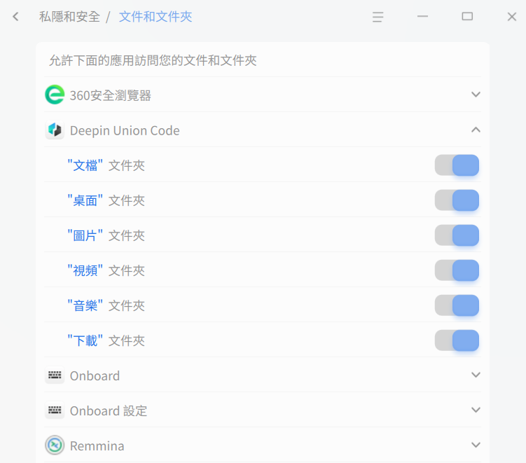

#### 鏡頭

- 支持管理單個應用對鏡頭的訪問權限，單擊關閉權限，或者單擊重新開啟權限。

#### 文件和文件夾

- 支持分别管理单个应用对“图片”文件夹和“文档”文件夹的访问权限，单單個應用權限開關：支持分別管理單個應用對“圖片”文件夾和“文檔”文件夾的訪問權限，單擊關閉權限，或者單擊重新開啟權限。

### 系統更新

在更新設定頁面啟用倉庫更新類型中的「系統更新」或「安全更新」後，自動下載與更新提醒才可正常運作。

系統有更新時，控制中心側邊欄會顯示提示。點擊 **系統更新** 進入 **檢查更新** 頁面，點擊 **檢查更新**；檢查完成後即可下載並安裝更新。此外，更新設定模組亦可設定自動下載更新。

>  提示：若不需要自動檢查更新且不想收到更新提示，可在「更新設定」中關閉「更新提醒」。

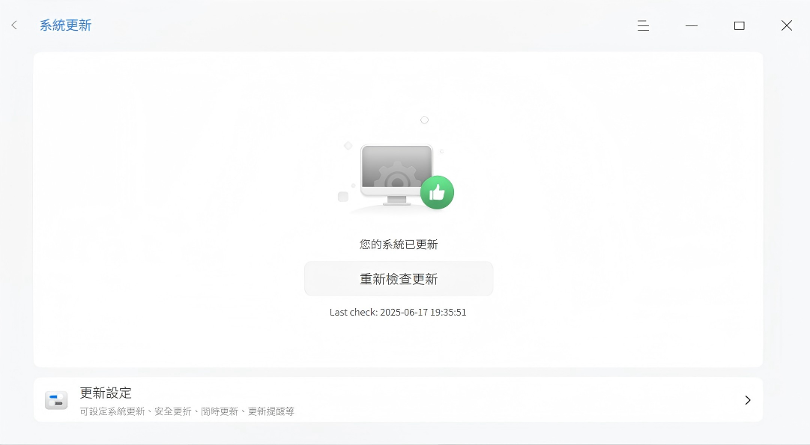

#### 更新和升級

1. 在控制中心側邊欄選擇 **系統更新**。
2. 點擊 **檢查更新/重新檢查更新**，進入檢查系統更新介面。
   - 如無更新，將提示「您的系統已經是最新的」。
   - 如有更新，將顯示 **下載** 按鈕、**更新內容勾選**、下載資料大小及更新詳情。您可繼續執行步驟 3 和步驟 4。
3. 點擊 **下載** 按鈕，系統將自動開始下載已勾選的更新內容。
4. 下載完成後，系統會通知您可進行更新；您可在控制中心的更新模組點擊 **安裝更新** 開始安裝更新檔案。
5. 更新完成後會出現「更新成功」提示。您可按需要選擇重新啟動、關機或取消。

#### 更新並關機/重新開機

選擇開始安裝更新後，可選擇 **背景更新、更新並關機、更新並重新開機**。

- 背景更新：更新安裝過程在背景完成，不影響目前系統使用。
- 更新並關機/重新開機：更新安裝過程以模態介面顯示進度，此期間系統不可使用；安裝完成後系統會自動關機/重新啟動。

> 說明：更新並關機/重新開機適合無人值守時使用（例如下班時），相較背景更新亦更穩定。

#### 更新內容

1. 在控制中心側邊欄選擇 **系統更新**。
2. 檢查更新後，系統會自動顯示可更新內容及版本更新日誌。

>  說明：當只啟用「安全更新」時，系統只會進行安全漏洞及相容性相關更新。

#### 更新設定

##### 更新類型

1. 在控制中心側邊欄選擇 **系統更新**。
2. 點擊 **更新設定**。
3. 在 **更新類型** 區域設定檢查更新的類型，可選擇功能更新、安全更新和第三方倉庫更新。

##### 進階設定

1. 在控制中心側邊欄選擇 **系統更新**。
2. 點擊 **更新設定**。
3. 開啟 **下載限速**。啟用後可設定下載速度上限；預設上限為 10240 KB/s。
4. 開啟 **自動下載**。啟用後可設定自動下載時間段；系統有更新時會在指定時段內自動下載資料。
5. 開啟 更新提醒。收到更新通知以提示有最新更新。
6. 開啟 清除套件快取。可自動清理已下載並完成更新的套件。

>  提示：啟用 **清除套件快取** 後，系統會定期自動清理因下載套件造成的快取。

#### 查看歷史更新

您可點擊 **查看歷史更新**，查看所有已安裝的系統版本日誌。

## 視窗管理器

視窗管理器可以在不同的工作區內展示不同的視窗內容。透過視窗管理器您可以同時使用多個桌面，以便對桌面視窗進行分組管理。

>  說明：只有在控制中心 > 個性化 > 一般介面，開啟了視窗特效功能後，才支援執行視窗管理器功能。

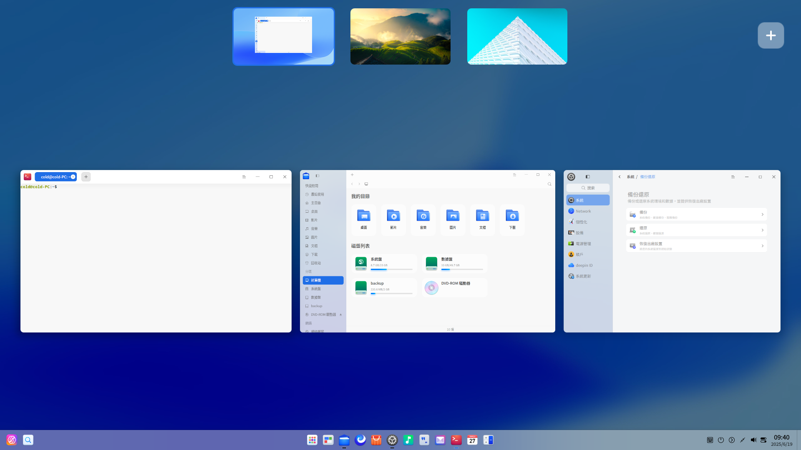

>  說明：在觸控板上，四指/五指向上移動顯示多任務檢視，緊接著向下移動隱藏多任務檢視， 對應 **Super** + **S** 快捷鍵。

### 打開工作區

工作區將您的桌面視窗進行分組管理，透過劃分工作區可以增大您的工作區域。

按下 **Super** + **S** 組合鍵，或單擊  打開工作區介面。

>  說明：當使用觸控螢幕電腦時，手指從螢幕底部劃入超過任務欄高度，打開工作區。

### 添加工作區

在工作區介面，您可以透過以下方式添加工作區。

- 單擊工作區右上角的 **+**。

- 按下鍵盤上的 **Alt** + **+**。

>  說明：當您添加的工作區達到最大值 **6** 時，將不能再添加工作區。

### 切換工作區

在桌面和工作區介面，您可以透過以下方式切換工作區。

- 在桌面，按下鍵盤上的 **Super** +  /  組合鍵，切換到上一個/下一個工作區。
- 在桌面，按下鍵盤上的 **Super** + 數字鍵（1-6）， 切換到指定順序的工作區。
- 在工作區介面，滾動滑鼠滾輪切換到上一個/下一個工作區。
- 在工作區介面，單擊對應的預覽視窗來切換到指定工作區。

>  說明：在觸控板上，四指/五指向左或向右移動，切換到前一個或後一個工作區，對應 **Super** + **Left** 或 **Super** + **Right** 快捷鍵。

>  竅門：在工作區介面，透過拖曳可以調整工作區位置。

### 刪除工作區

當您執行刪除工作區操作後，該工作區中的所有視窗將自動轉移到相鄰的工作區中顯示，當桌面環境中只存在一個工作區時，將不能執行刪除工作區的操作。

- 在工作區介面，單擊  刪除工作區。
- 在工作區介面，按下鍵盤上的 **Alt** + **-**。
- 滑鼠將某個工作區向上拖曳出螢幕，刪除目前工作區。

### 退出工作區

當您在工作區介面完成相關操作後，可以透過以下方式退出工作區。

- 按下鍵盤上的 **Esc** 鍵。
- 單擊目前工作區介面區域外的任意位置。
- 再次按下鍵盤上的 **Super** + **S** 組合鍵。

### 移動工作區視窗

您可以透過以下方式移動視窗到另一工作區。

- 在工作區介面，拖曳視窗到指定的工作區。
- 在桌面，按下鍵盤上的 **Super** + **Shift** +  /  鍵，將目前視窗移動到上一個/下一個工作區。
- 在桌面，按下鍵盤上的 **Super** + **Shift** + 數字鍵，將目前視窗移動到對應順序的工作區。
- 在桌面，按下鍵盤上的 **Alt** + **Space** 或在視窗標題欄上單擊右鍵，打開視窗快捷操作選單，選擇 **永遠在可見工作區**，或 **移至右方工作區** 或 **移至左方工作區**，將目前視窗移動到指定的工作區。

>  竅門：在視窗快捷操作選單，您還可以選擇最小化、最大化、移動、變更大小、永遠置頂和關閉視窗。

### 切換桌面視窗

您可以透過以下方式切換目前工作區的桌面視窗。

#### 快速切換相鄰視窗

同時按下 **Alt** + **Tab** 並快速釋放，快速切換目前視窗和相鄰程式視窗；

同時按下 **Alt** + **Shift** + **Tab** 並快速釋放，快速反向切換目前視窗和相鄰程式視窗。

#### 快速切換同類型視窗

同時按下 **Alt** +  並快速釋放，快速切換目前同類型視窗；

同時按下 **Alt** + **Shift** +  並快速釋放，快速反向切換目前同類型視窗。

#### 切換所有視窗

按住鍵盤上的 **Alt** 鍵不放，連續按下鍵盤上的 **Tab** 鍵，所有視窗依次向右切換顯示；

按住鍵盤上的 **Alt** + **Shift** 鍵不放，連續按下鍵盤上的 **Tab** 鍵，所有視窗依次向左切換顯示。

#### 切換同類型視窗

按住鍵盤上的 **Alt** 鍵不放，連續按下鍵盤上的  鍵，目前同類型視窗依次向右切換顯示；按住鍵盤上的 **Alt** + **Shift** 鍵不放，連續按下鍵盤上的  鍵，視窗依次向左切換顯示。

### 視窗分屏

使用視窗分屏，讓多個應用程式和任務視窗同時顯示在大螢幕上，既充分利用了大螢幕的空間，又能減少在多個應用程式視窗之間頻繁切換，提高您的工作學習效率。

#### 進入分屏

1. 拖曳視窗到螢幕左側或右側，當游標接觸到螢幕左右側邊緣時，會出現分屏提⽰動效，動效顏色與活動色一致，釋放視窗，視窗將吸附在螢幕左半邊或右半邊。
   
   >  說明：當應用支持分屏時，將光標懸浮於應用窗口的最大/還原按鈕上，在彈出的菜單中選擇 ，即可進入分屏。

2. 在另一半未被占據的螢幕中，會出現其他所有視窗的預覽，單擊其中一個使其顯示在另一半螢幕中，實現分屏瀏覽。也可以把其他視窗拖曳到螢幕兩邊，疊加分屏視窗。
   
   >  竅門：要取消視窗分屏，只需將視窗從螢幕一側拖離即可。

多屏分屏模式下，支援在同一塊螢幕配對分屏視窗，不支援跨屏配對分屏視窗。

#### 調整視窗位置

分屏瀏覽時，移動視窗的1/2位置越過分屏區域中線，另一視窗自動切換到移動視窗分屏位置，釋放移動視窗，移動視窗補位到空缺的分屏位置。

#### 調整視窗大小

分屏瀏覽時，將游標移動到螢幕中間兩個視窗的連接處進行左右拖曳，可以同時修改兩個視窗的寬度。

>  說明：當視窗不能繼續向某一方向拖曳時，游標會指示其他可拖曳方向。

#### 退出分屏

- 單擊目前任意視窗的最大化按鈕或關閉按鈕，僅該視窗退出分屏，剩餘視窗不退出分屏。
- 兩個視窗分屏時，拖曳其中一個視窗到螢幕頂部可觸發一分屏，目前操作的視窗退出分屏，剩餘視窗不退出分屏。
- 拖曳視窗遠離分屏視窗拼接方向，退出分屏。
