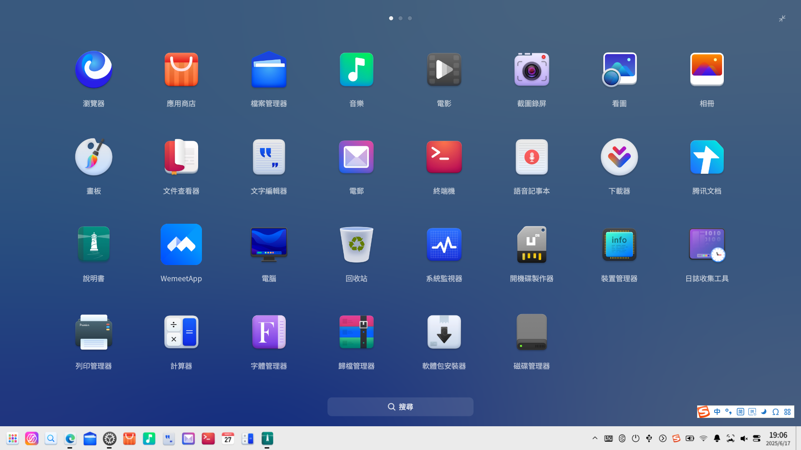
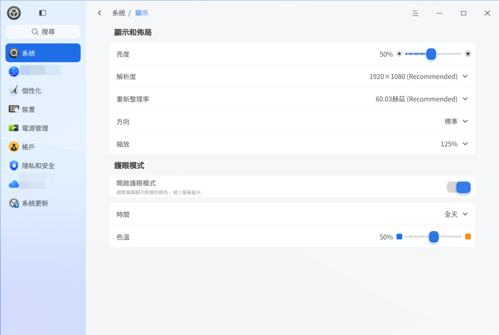
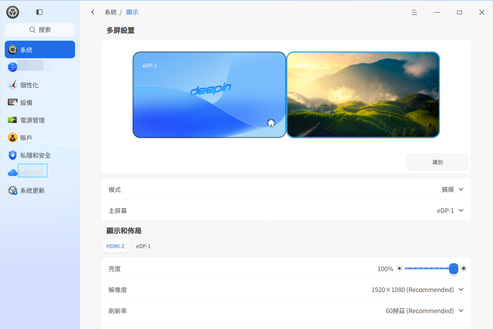
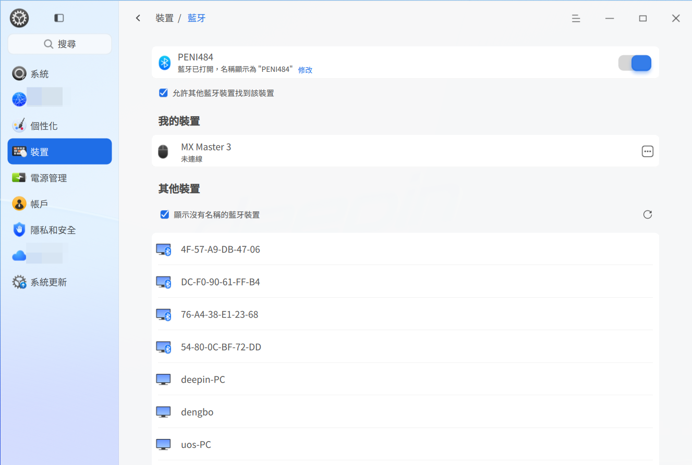
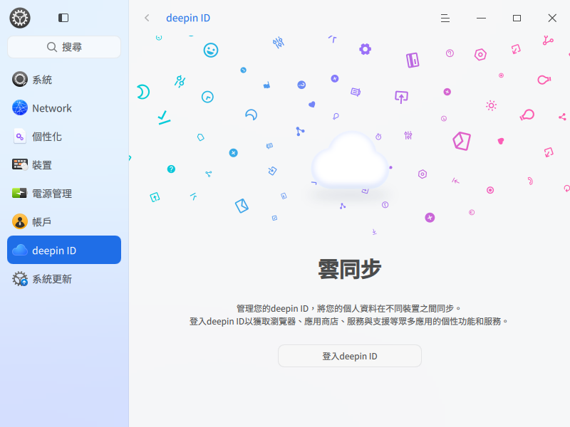
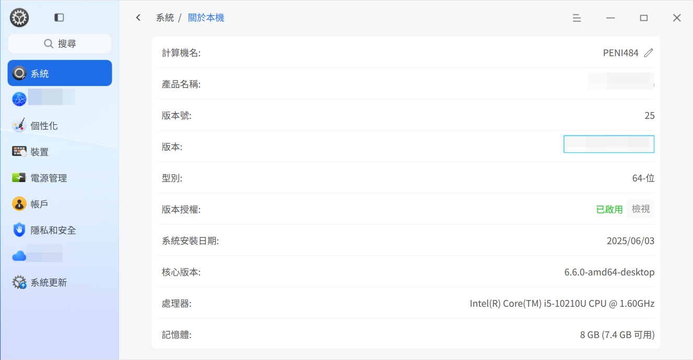

# 桌面環境|DDE|

## 概述
深度操作系統 (deepin) 是一款美觀易用、安全可靠的國產桌面操作系統。預裝檔案管理員、應用商店、看圖、系統監視器等原生應用。既能體驗豐富娛樂生活，亦能滿足日常工作需求。隨着功能不斷升級完善，已成為國內最受歡迎的桌面操作系統之一。

### 系統簡介
初次進入深度操作系統，會自動開啟歡迎程式。可觀看影片了解系統功能，選擇桌面模式和圖示主題，進一步了解該系統。

成功登入系統後，即可體驗 deepin 桌面環境。桌面環境主要由桌面、工作列、啟動器、控制中心和視窗管理器組成，是使用該操作系統的基礎。

## 桌面
桌面是登入後看到的主屏幕區域。在桌面上可建立檔案/資料夾、排列檔案、開啟終端、設定桌布和螢幕保護等，亦可透過 [傳送到桌面](#設定捷徑) 新增應用捷徑。

>  說明：觸控板上，四指/五指向下滑動顯示桌面，緊接上滑隱藏桌面，對應 **Super** + **D** 快捷鍵。

### 建立新資料夾/文件
在桌面建立資料夾或文件，操作方式與檔案管理員相同。

- 右鍵桌面 > **新增資料夾**，輸入名稱
- 右鍵桌面 > **新增文件** > 選擇類型 > 輸入名稱

檔案/資料夾右鍵功能：

| 功能          | 說明 |
|--------------|------|
| 開啟方式      | 設定預設程式或選擇關聯應用 |
| 壓縮/解壓縮   | 壓縮檔案/夾或解壓檔案 |
| 剪下          | 移動檔案/夾 |
| 複製          | 複製檔案/夾 |
| 重新命名      | 重新命名檔案/夾 |
| 刪除          | 刪除檔案/夾 |
| 建立連結      | 建立捷徑 |
| 標記資訊      | 添加標籤管理檔案 |
| 內容          | 檢視基本資訊與權限 |

>  說明：
> - 觸控裝置：長按 1 秒開啟右鍵選單
> - 觸控板：雙指點擊顯示右鍵選單
> - 鍵盤：**Alt** + **M** 開啟右鍵選單

### 設定排列方式
按需要排列桌面圖示：

1. 右鍵桌面
2. 點擊 **排序方式** 並選擇：
   - **名稱**：按字母排序
   - **修改時間**：按修改日期排序
   - **創建時間**：按創建日期排序
   - **大小**：按檔案大小排序
   - **類型**：按檔案類型排序

>  提示：啟用 **自動排列** 可自動整理圖示。刪除圖示時，後續圖示會自動填補空間。

### 調整圖示大小
1. 右鍵桌面
2. 點擊 **圖示大小**
3. 選擇合適尺寸

>  提示：使用 **Ctrl** + //滑鼠滾輪調整桌面/啟動器圖示

### 顯示設定
透過桌面右鍵選單快速進入：

1. 右鍵桌面
2. 點擊 **顯示設定** 進入控制中心

>  詳見 [顯示設定](#顯示設定)

### 剪貼簿
顯示登入後複製/剪下的文字、圖片和檔案。登出/關機後自動清除。

1. 按 **Super** + **V** 開啟剪貼簿
2. 雙擊項目複製並移至頂部
3. 在目標位置貼上
4. 懸停項目 > 點擊  刪除

>  觸控裝置：從左邊緣滑入開啟剪貼簿

## 工作列
預設位於底部，包含啟動器、應用圖示、系統匣和外掛程式。用於開啟應用、顯示桌面、管理工作區、設定輸入法、調整音量、連接網路、檢視日曆和電源選項。

>  在控制中心 > 個人化 > 工作列 設定

### 工作列圖示

| 圖示 | 說明 | 圖示 | 說明 |
|------|------|------|------|
|  | 啟動器 |  | 全域搜尋 |
|  | 多工作檢視 |  | 檔案管理員 |
| ![[../common/UosAiAssistant.png]] | UOS AI Bar |  | 瀏覽器 |
|  | 應用商店 |  | 控制中心 |
|  | 音樂 |  | 文字編輯器 |
|  | 郵件 |  | 終端機 |
|  | 日曆 |  | 計算機 |
|  | 通知 |  | 螢幕小鍵盤 |
| ![[dock-control-panel-dark.svg]] | 快速設定 | ![[shutdown-symbolic-dark.svg]] | 電源選項 |

### 切換顯示模式
兩種模式：傳統模式 (小圖示) 和高效模式 (大圖示)

1. 右鍵工作列
2. 在 **模式** 下選擇

### 設定工作列位置
1. 右鍵工作列
2. 在 **位置** 下選擇方向

### 調整高度
拖曳工作列邊緣調整大小

### 顯示/隱藏工作列
1. 右鍵工作列
2. 在 **狀態** 下：
   - **一直顯示**：常駐顯示
   - **一直隱藏**：僅滑鼠懸停時顯示
   - **智慧隱藏**：被覆蓋時自動隱藏

>  觸控手勢：
> - 底部：從邊緣向上滑動
> - 頂部：從邊緣向下滑動
> - 左側：從邊緣向右滑動
> - 右側：從邊緣向左滑動

### 管理外掛程式
1. 右鍵工作列 > **工作列設定**
2. 切換外掛：
   - 資源回收筒
   - 系統監視器
   - 電源選項
   - 顯示桌面
   - 螢幕小鍵盤
   - 通知中心
   - 時鐘
   - 智慧助理
   - 螢幕擷取/錄影

### 檢視通知
系統/應用通知顯示在頂部。點擊操作或關閉。

點擊  開啟通知中心。

>  觸控裝置：從右邊緣滑入開啟

### 檢視日期/時間
- 懸停時間檢視詳細資料
- 點擊時間開啟日曆

### 電源選項
點擊  開啟電源選單：

| 選項       | 圖示 | 說明 |
|------------|------|------|
| 關機       |  | 關閉電源 |
| 重新開機   |  | 重新啟動系統 |
| 睡眠       |  | 低功耗狀態 |
| 休眠       |  | 儲存至硬碟 (需交換區) |
| 鎖定       |  | **Super** + **L** |
| 切換使用者 |  | 變更帳戶 |
| 登出       |  | 登出系統 |
| 系統監視器 |  | 開啟監視器 |

>  多帳戶時才顯示使用者切換

## 資源回收筒
暫存刪除的檔案。還原或清空回收筒內容。

### 還原檔案
1. 開啟資源回收筒
2. 右鍵檔案 > **還原**
3. 檔案返回原始位置

>  原始資料夾刪除時會建立新資料夾

### 刪除檔案
1. 開啟資源回收筒
2. 右鍵檔案 > **刪除**

### 清空資源回收筒
點擊 **清空** 永久刪除所有內容

## 啟動器
 管理已安裝應用。使用分類或搜尋尋找應用。

>  觸控板：四指/五指點擊切換啟動器 (**Super** 鍵)

### 切換模式
兩種模式：全螢幕和精簡

精簡模式支援快速開啟檔案管理員、控制中心和電源選項。

### 排列應用 (精簡模式)
預設：**自由排序** (最新置頂，頻率排序)
其他：
- **按分類**
- **按名稱**

### 尋找應用
- 滾動或瀏覽分類
- 在搜尋框輸入名稱/縮寫

### 建立捷徑
傳送應用至桌面或工作列：

1. 右鍵應用圖示
2. 選擇：
   - **傳送到桌面**
   - **傳送到工作列**

>  提示：拖曳圖示至工作列。執行中應用需右鍵 > **釘選**

### 刪除捷徑
**從工作列**：
- 將圖示拖離工作列
- 右鍵 > **取消釘選**

**從啟動器**：
- 右鍵應用 > **從桌面移除**
- 右鍵應用 > **從工作列移除**

>  僅移除捷徑，不解除安裝應用

### 安裝應用
使用應用商店安裝新應用：

### 執行應用
- 雙擊桌面捷徑
- 點擊工作列圖示
- 點擊啟動器圖示

>  提示：右鍵應用 > **開機啟動**

### 解除安裝應用
1. 在啟動器中右鍵應用
2. 點擊 **解除安裝**

>  系統應用無法解除安裝

## 控制中心
管理帳戶、網路、時間、個人化、顯示、更新等。透過工作列進入：

>  觸控板：雙指向右滑動開啟；向左滑動關閉

### 首頁
設定模組概覽。

側邊欄導航快速切換。

#### 標題列
- 返回按鈕 
- 導覽路徑
- 搜尋框
- 主選單 (主題/版本/結束)

### 顯示設定
設定亮度、解析度、方向、縮放。

#### 單一顯示器
##### 調整亮度
1. 控制中心 > 系統 > 顯示
2. 拖曳亮度滑桿

##### 設定縮放
1. 控制中心 > 系統 > 顯示
2. 選擇縮放比例
3. 登出/登入套用

>  註：
> - 高解析度螢幕自動調整
> - 不相容應用：右鍵 > **停用縮放**

##### 變更解析度
1. 控制中心 > 系統 > 顯示
2. 選擇解析度
3. 點擊 **儲存**

##### 桌面顯示
1. 控制中心 > 系統 > 顯示
2. 選擇顯示模式

##### 更新率
1. 控制中心 > 系統 > 顯示
2. 選擇更新率
3. 點擊 **儲存**

##### 方向
1. 控制中心 > 系統 > 顯示
2. 選擇方向
3. 點擊 **儲存**

##### 護眼模式
1. 控制中心 > 系統 > 顯示
2. 切換 **護眼模式**
3. 設定時段 (全天/日落至日出/自訂)
4. 調整色溫

##### 無線投影
1. 控制中心 > 顯示
2. 從清單選擇裝置
3. 等待連接

>  點擊  重新整理裝置

#### 多重顯示器
透過 VGA/HDMI/DP 連接次要顯示器。

1. 控制中心 > 系統 > 顯示
2. 選擇模式：
   - **複製**：複製主顯示器
   - **延伸**：擴充桌面
   - **僅顯示**：單一顯示器

按 **Super** + **P** 切換模式。

>  工作列設定：**僅主顯示器** 或 **跟隨滑鼠**

### 觸控螢幕設定
1. 控制中心 > 系統 > 觸控螢幕
2. 設定配置
3. 點擊 **確定**

### 預設應用程式
設定檔案類型的預設應用。

#### 設定預設
1. 右鍵檔案 > **開啟方式** > **設為預設**
2. 選擇應用 > **確定**

#### 變更預設
1. 控制中心 > 系統 > 預設應用程式
2. 選擇檔案類型
3. 選擇不同應用

#### 新增預設
1. 控制中心 > 系統 > 預設應用程式
2. 點擊 **新增**
3. 選擇 .desktop 或執行檔

#### 移除預設
1. 控制中心 > 系統 > 預設應用程式
2. 點擊 **編輯**
3. 點擊  移除應用

### 個人化
自訂主題、色彩、字型、效果。

#### 主題
1. 控制中心 > 系統 > 個人化
2. 點擊 **主題**
3. 選擇主題

#### 外觀
1. 控制中心 > 系統 > 個人化
2. 點擊 **一般**
3. 選擇 **淺色/深色/自動**

>  自動根據日出日落切換

#### 桌面與工作列
1. 控制中心 > 系統 > 個人化
2. 點擊 **桌面與工作列**
3. 設定：
   - 工作列模式 (傳統/高效)
   - 大小
   - 位置
   - 可見性
   - 外掛程式

#### 視窗效果
1. 控制中心 > 系統 > 個人化
2. 點擊 **視窗效果**
3. 選擇：
   - **效能模式** (最少效果)
   - **平衡模式**
   - **視覺模式** (全部效果)
   - 圓角半徑
   - 移動時透明
   - 最小化效果 (縮放/魔燈)
   - 工作列/啟動器透明度
   - 捲軸行為
   - 標題列高度

#### 壁紙

選擇精美、時尚的壁紙來美化桌面，讓您的電腦顯示與眾不同。

1. 在桌面上，按滑鼠右鍵，點擊 **設定壁紙**，進入控制中心預覽所有壁紙。
2. 您可以選擇「我的圖片」、「系統壁紙」或「純色壁紙」三種壁紙類型。
3. 點擊選擇壁紙後，該壁紙將立即在桌面生效。
4. 在壁紙上按右鍵選擇 **設定為鎖定畫面**，該壁紙將應用於鎖定畫面。

>  提示：
>
> - 您可以在「自動切換壁紙」選項中設定自動更換壁紙的時間間隔，亦可設定在「登入時」和「喚醒時」自動更換壁紙。
> - 您亦可在圖片檢視器中將喜愛的圖片設定為桌面壁紙，或前往應用商店搜尋壁紙以下載喜愛的壁紙。

---

#### 螢幕保護程式

螢幕保護程式最初用於保護顯像管，現時一般用於防止他人偷窺電腦上的私隱內容。

1. 前往 **控制中心 > 個人化**，點擊 **螢幕保護程式** 進入設定介面預覽所有螢幕保護程式。
2. 可選擇「圖片輪播螢幕保護程式」或「系統螢幕保護程式」兩種類型。
3. 選中螢幕保護程式後，設定閒置時間。當電腦閒置至指定時間後，將啟動所選的螢幕保護程式。
4. 若選擇圖片輪播螢幕保護程式，可在「個人化螢幕保護程式」選項中點擊 **設定** 開啟設定視窗，自訂圖片路徑、輪播間隔及啟用隨機播放。
5. 可開啟 **恢復時需要密碼** 以更好地保護私隱。

#### 色彩與圖示

1. 控制中心 > 系統 > 個人化
2. 點擊 **色彩與圖示**
3. 設定：
   - 強調色
   - 圖示主題
   - 游標主題

#### 字型
1. 控制中心 > 系統 > 個人化
2. 點擊 **字型**
3. 設定系統字型/大小

### 網路設定
連接網路以使用郵件、瀏覽、下載等功能。

>  透過工作列快速面板檢查狀態

#### 有線網路
1. 連接乙太網路線
2. 控制中心 > 網路 > 有線
3. 切換 **開啟**
4. 編輯/建立連線

#### 無線網路
##### 連線
1. 控制中心 > 網路 > 無線
2. 切換 **開啟**
3. 選擇網路
4. 需要時輸入密碼

##### 隱藏網路
1. 控制中心 > 網路 > 無線
2. 點擊 **連線到隱藏網路**
3. 輸入 SSID/詳細資料
4. 點擊 **儲存**

#### 個人熱點
1. 控制中心 > 網路 > 個人熱點
2. 切換 **開啟**
3. 設定配置
4. 點擊 **儲存**

#### 飛航模式
停用 Wi-Fi、熱點、藍牙。

1. 控制中心 > 網路 > 飛航模式
2. 切換 **開啟**

>  無無線/藍牙硬體時不顯示

#### 撥號連線 (DSL)
1. 控制中心 > 網路 > DSL
2. 點擊 **建立 PPPoE 連線**
3. 輸入 ISP 資料
4. 點擊 **儲存**

#### VPN
1. 控制中心 > 網路 > VPN
2. 點擊 **新增** 或 **匯入**
3. 設定配置
4. 點擊 **儲存**
5. 匯出分享

#### 系統代理
1. 控制中心 > 網路 > 系統代理
2. 切換 **開啟**
3. 選擇手動/自動設定
4. 點擊 **儲存**

#### 應用程式代理
1. 控制中心 > 網路 > 應用程式代理
2. 設定配置
3. 點擊 **儲存**

>  透過啟動器右鍵選單啟用單一應用

#### 網路詳細資料
1. 控制中心 > 網路 > 詳細資料
2. 檢視 MAC/IP/閘道器資訊

### 通知設定
管理勿擾模式和應用通知。

#### 系統通知
1. 控制中心 > 系統 > 通知
2. 設定勿擾模式：
   - 排程
   - 鎖定時顯示

#### 應用通知
1. 控制中心 > 系統 > 應用通知
2. 單一應用設定：
   - 通知音效
   - 顯示位置
   - 訊息預覽

### 音效設定
設定輸入/輸出裝置。

#### 輸出
1. 控制中心 > 系統 > 音效
2. 調整：
   - 音量平衡
   - 音量增強 (0-150%)
   - 單聲道音訊
   - 拔除時自動暫停
   - 輸出裝置

#### 輸入
1. 控制中心 > 系統 > 音效
2. 調整：
   - 輸入音量
   - 噪音抑制
   - 輸入裝置

>  提示：以正常語音量測試麥克風

#### 系統音效
1. 控制中心 > 系統 > 音效
2. 點擊 **系統音效**
3. 啟用事件音效

#### 裝置管理
1. 控制中心 > 系統 > 音效
2. 點擊 **裝置管理**
3. 啟用/停用裝置

### 藍牙設定
連接鍵盤、滑鼠、耳機、喇叭。

>  桌面電腦需藍牙適配器

#### 重新命名裝置
1. 控制中心 > 裝置 > 藍牙
2. 點擊名稱旁的 **編輯**
3. 輸入新名稱

#### 連線裝置
1. 切換 **藍牙開啟**
2. 從清單選擇裝置
3. 需要時輸入 PIN
4. 透過 **我的裝置** 管理

#### 傳送/接收檔案
##### 從電腦
1. 選擇配對裝置
2. 點擊 **傳送檔案**
3. 選擇檔案
4. 選擇接收者

##### 從手機
1. 選擇配對裝置
2. 選擇檔案 > **傳送**

##### 接收檔案
接受/拒絕傳輸請求。失敗情況：
- 接收者拒絕
- 連線中斷
- 無回應 (1分鐘逾時)

### 時間與日期
設定時區和管理時鐘。

#### 修改時間/日期
1. 控制中心 > 系統 > 時間與日期
2. 停用 **自動同步**
3. 手動設定
4. 點擊 **確定**

#### 變更時區
1. 控制中心 > 系統 > 時間與日期
2. 點擊 **變更時區**
3. 選擇時區

#### 新增時區
1. 控制中心 > 系統 > 時間與日期
2. 點擊 **新增**
3. 選擇時區

#### 刪除時區
1. 控制中心 > 系統 > 時間與日期
2. 點擊 **編輯**
3. 點擊 **刪除**

### 電源管理
優化電池使用和安全性。

#### 效能模式
1. 控制中心 > 電源管理
2. 點擊 **一般**
3. 選擇：
   - **平衡模式**
   - **高效能模式**
   - **省電模式**

#### 省電設定
1. 控制中心 > 電源管理
2. 點擊 **一般**
3. 設定：
   - 低電量時自動啟用
   - 低電量閾值
   - 使用電池時自動啟用
   - 自動調暗亮度

#### 喚醒設定
1. 控制中心 > 電源管理
2. 點擊 **一般**
3. 啟用：
   - 睡眠喚醒需密碼
   - 螢幕喚醒需密碼

#### 排程關機
1. 控制中心 > 電源管理
2. 點擊 **一般**
3. 設定時間和頻率

#### 關閉螢幕
1. 控制中心 > 電源管理
2. 選擇 **使用電源** 或 **使用電池**
3. 設定逾時

#### 睡眠模式
1. 控制中心 > 電源管理
2. 選擇 **使用電源** 或 **使用電池**
3. 設定逾時

>  筆記型電腦啟用 **闔上時睡眠**

#### 自動鎖定
1. 控制中心 > 電源管理
2. 選擇 **使用電源** 或 **使用電池**
3. 設定逾時

#### 闔上動作
1. 控制中心 > 電源管理
2. 選擇 **使用電源** 或 **使用電池**
3. 選擇動作：
   - 睡眠
   - 休眠
   - 關閉螢幕
   - 無動作

#### 電源按鈕動作
1. 控制中心 > 電源管理
2. 選擇 **使用電源** 或 **使用電池**
3. 選擇動作：
   - 關機
   - 睡眠
   - 休眠
   - 關閉螢幕
   - 顯示電源選單
   - 無動作

#### 低電量管理
1. 控制中心 > 電源管理
2. 點擊 **使用電池**
3. 設定：
   - 低電量通知
   - 自動睡眠/休眠
   - 閾值水平

#### 電池資訊
1. 控制中心 > 電源管理
2. 點擊 **使用電池**
3. 檢視：
   - 預計使用時間
   - 最大容量

### 賬戶

安裝系統時會創建一個賬戶，在控制中心的賬戶設置模塊可以修改賬戶設置或創建一個新賬戶。

#### 創建新賬戶

1. 單擊 **添加新用戶** 按鈕。
2. 選擇賬戶類型，設置用戶名、全名、密碼、重複密碼、密碼提示信息。
3. 單擊 **創建**。
4. 在授權對話框輸入當前賬戶的密碼，新賬戶就會添加到賬戶列表中。

>  貼士：您還可以將標準用戶的賬戶類型設置為管理員。

#### 更改頭像

鼠標移動至賬戶頭像，會出現 **編輯**，點擊頭像，選擇一個頭像或添加本地頭像，頭像就替換完成了。

#### 設置全名

賬戶全名會顯示在賬戶列表和系統登錄界面，可根據需要設置。

單擊 **設置全名** 後的 ，輸入賬戶全名。

#### 自動登錄

開啟「自動登錄」後，下次啟動系統時（重啟、開機）可直接進入桌面。在鎖屏和註銷後再次登錄需要密碼。

打開 **自動登錄** 開關，在彈出的授權對話框中輸入當前賬戶密碼並確定後，開啟自動登錄功能。

#### 免密登錄

開啟「免密登錄」後，下次登錄系統（重啟，開機，和在註銷後再次登錄）和解鎖時，不需要密碼。

打開 **免密登錄** 開關，在彈出的授權對話框中輸入當前賬戶密碼並確定後，開啟無密碼登錄系統。

>  貼士： 
>
> - 若「免密登錄」和「自動登錄」同時打開，下次啟動系統（重啟、開機）則直接進入桌面。

#### 登錄方式

可對當前支持的登錄方式進行編輯和配置。

**密碼-修改密碼**

1. 單擊 **密碼**，進入密碼二級頁面。
2. 輸入當前密碼、新密碼和重複密碼，單擊 **保存**。

>  說明：管理員賬號過期之後需要先修改密碼才能進行授權操作。

**密碼-密碼有效期**

1. 單擊 **密碼**，進入密碼二級頁面。
2. 設置密碼有效天數，可以設置密碼長期有效或具體的有效天數。

> 密碼有效期自修改之日起開始計算。
>
> 例如：用戶A在9月1日修改了密碼後，將密碼有效期更改為30天。在這種情況下，密碼可以在9月1日至9月30日這期間的30天正常使用。

**生物認證**

生物認證又稱生物識別，是通過電腦利用人體所固有的生理特徵或行為特徵來進行個人身份鑑定。常用的生物認證有指紋識別和人臉識別。

當接入具備生物認證的硬件設備後，在系統中錄入指紋、人臉信息，可以用來登錄系統、解鎖屏幕、授權特殊操作，還可以增強用戶體驗、提升系統使用效率、提高系統安全性。

>  說明：只有接入具備生物認證的硬件設備後才顯示生物認證模塊，才可以進行指紋、人臉密碼設置。

**設置指紋密碼**

指紋是指手指末端正面皮膚上凸凹不平的紋路。一般來講，每個人的指紋是不同的，亦可設置為密碼。

1. 進入生物認證的二級頁面，在指紋板塊，單擊 **添加新的指紋** 。
2. 在授權對話框輸入當前賬戶的密碼後，使用指紋設備錄入指紋。
3. 待指紋添加成功後單擊 **完成**。

>  說明：您可以添加多個指紋密碼；也可以刪除一個個指紋密碼。

**設置人臉識別**

1. 進入生物認證的二級頁面，在人臉板塊，單擊 **添加新的人臉** 。
2. 在彈出的添加人臉數據對話框中，勾選 **我已閱讀並同意《用戶免責聲明》**，並單擊 **下一步**。
3. 單擊 **同意並開始錄入人臉**，單擊 **下一步** 使用人臉識別設備錄入人臉數據。
4. 單擊 **完成**。

>  說明：一個賬號最多可錄入5個人臉。

#### 刪除賬戶

1. 單擊其他未登錄的賬戶。
2. 單擊 **刪除賬戶** 。
3. 在彈出的確認界面中單擊 **刪除**。

>  注意: 已登錄的賬戶無法被刪除。

### 滑鼠與觸控板
設定輸入裝置。

#### 一般
1. 控制中心 > 裝置 > 滑鼠與觸控板
2. 調整：
   - 捲動速度
   - 雙擊速度
   - 左手模式

>  左手模式交換滑鼠按鍵

#### 滑鼠設定
1. 控制中心 > 裝置 > 滑鼠與觸控板
2. 點擊 **滑鼠**
3. 設定：
   - 指標速度
   - 滑鼠加速
   - 連接滑鼠時停用觸控板
   - 自然捲動

#### 觸控板設定

1. 控制中心 > 裝置 > 滑鼠與觸控板
2. 點擊 **觸控板**
3. 設定：
   - 指標速度
   - 自然捲動
   - 輸入時停用

#### 手勢
設定 3/4 指手勢：
- 上下左右滑動
- 點擊動作

### 繪圖板
設定繪圖壓力靈敏度。

>  連接繪圖板時顯示

1. 控制中心 > 裝置 > 繪圖板
2. 選擇 **筆**
3. 調整壓力靈敏度

### 鍵盤設定
設定輸入法和快捷鍵。

#### 屬性
1. 控制中心 > 裝置 > 鍵盤
2. 調整：
   - 按鍵重複延遲/速度
   - 數字鍵啟用
   - 大寫鎖定指示

#### 鍵盤佈局
新增/移除鍵盤佈局。

##### 新增佈局
1. 控制中心 > 裝置 > 鍵盤
2. 點擊 **鍵盤佈局**
3. 點擊 **新增佈局**

##### 移除佈局
1. 控制中心 > 裝置 > 鍵盤
2. 點擊 **鍵盤佈局**
3. 點擊 **編輯**
4. 點擊 **刪除**

#### 輸入法
##### 新增輸入法
1. 控制中心 > 裝置 > 鍵盤
2. 點擊 **輸入法**
3. 點擊 **新增**：
   - 從商店安裝
   - 從清單選擇

##### 重新排序
拖曳重新排列清單

##### 設定輸入法
點擊輸入法旁的 **設定**

##### 切換捷徑
從下拉選單選擇捷徑

##### 進階設定
設定全域選項

#### 捷徑鍵
檢視/修改系統捷徑鍵。

##### 檢視捷徑鍵
瀏覽分類

##### 修改捷徑鍵
點擊捷徑鍵 > 輸入新按鍵

>  按 **Backspace** 停用

##### 自訂捷徑鍵
1. 點擊 **新增**
2. 輸入名稱/指令/捷徑鍵
3. 點擊 **新增**

### 語言與地區
管理系統語言和格式。

#### 新增語言
1. 控制中心 > 系統 > 語言與地區
2. 點擊 **新增**
3. 選擇語言

#### 設定系統語言
1. 控制中心 > 系統 > 語言與地區
2. 選擇語言
3. 安裝後登出/登入

>  變更後鍵盤佈局可能改變

#### 地區設定
1. 控制中心 > 系統 > 語言與地區
2. 設定：
   - 地區
   - 日期/數字格式
   - 工作列時間顯示

### deepin ID

要使用 deepin ID 相關的功能，您需要先成功註冊並登錄 deepin ID。如果您尚未註冊 deepin ID，可以通過以下方式進行註冊：

- **通過統信官方網站註冊**：進入統信官方網站（支持微信掃碼、手機號碼等多種註冊方式），完成註冊流程。
- **通過控制中心註冊**：
  1. 在控制中心的 deepin ID 界面中，單擊 **登錄** 按鈕，系統將彈出 deepin ID 登錄界面。
  2. 在登錄界面中，單擊 **註冊** 按鈕，系統將彈出 deepin ID 註冊界面。
  3. 在註冊界面中，使用手機號碼或微信完成註冊操作。

成功登錄 deepin ID 後，您還可以使用雲同步、應用商店、瀏覽器等應用程式的相關雲服務功能。

>   竅門：當 deepin ID 與本地賬戶綁定後，您可以使用 deepin ID 重置本地賬戶的登錄密碼。

開啟雲同步功能後，系統會自動將各種配置（如聲音、電源、鼠標、更新、螢幕保護等）同步到雲端。如果您希望在另一台電腦上使用相同的系統配置，只需登錄同一個 deepin ID 賬戶，即可一鍵將雲端配置同步到新設備。

>    說明：
>
>   1. 自動同步配置功能僅在系統已啟動或處於試用期狀態下可用；未啟動狀態下無法使用該功能。
>   2. 當開啟“自動同步配置”選項時，您可以選擇要同步的具體項目；關閉該選項時，所有項目均無法同步。

### 系統更新
管理作業系統和保安更新。

#### 檢查/安裝更新
1. 控制中心 > 系統更新
2. 點擊 **檢查更新**
3. 下載更新
4. 安裝更新
5. 需要時重新開機

#### 更新並關機/重新開機
安裝時選擇：
- **背景更新** (非干擾式)
- **更新並關機/重新開機** (全螢幕)

#### 更新內容
檢查後檢視更新日誌

#### 更新設定
##### 更新類型
選擇：
- 功能更新
- 保安更新
- 第三方更新

##### 進階
- 下載速度限制
- 自動下載排程
- 更新通知
- 清除套件快取

#### 更新記錄
檢視已安裝更新

### 系統資訊
檢視硬體/軟體詳細資料。

#### 關於
- 編輯電腦名稱
- 檢視作業系統版本/授權/安裝日期/硬體資訊

#### 開源授權
檢視開源聲明

#### 最終用戶授權協議
檢視 EULA

#### 私隱政策
檢視私隱聲明

### 備份與還原
防止資料遺失。

### 開機選單
設定開機選項。

#### 設定
##### 開機延遲
- 開啟：等候 5 秒
- 關閉：等候 1 秒

##### 預設項目
選擇開機項目

##### 開機動畫
設定標誌大小

##### 主題
啟用/停用背景

#### 開發者選項
##### 離線啟用
1. 選擇 **離線啟用**
2. 匯入憑證
3. 認證
4. 重新開機

#### 用戶體驗計劃
分享使用數據改善系統。

1. 切換 **開啟**
2. 接受協議
3. 點擊 **確定**

#### 網域管理
企業環境使用。

1. 切換 **開啟**
2. 輸入網域/連接埠
3. 點擊 **確定**