# 桌面環境|dde|

## 概述
統信操作系統（簡稱「統信 UOS」）是一款美觀易用、安全可靠的國產桌面操作系統。統信 UOS 預載了文件管理器、應用商店、看圖、系統監視器等一系列原生應用程式。它既能讓您體驗豐富多彩的娛樂生活，亦能滿足日常工作需求。隨着功能不斷升級完善，統信操作系統已成為國內最受歡迎的桌面操作系統之一。

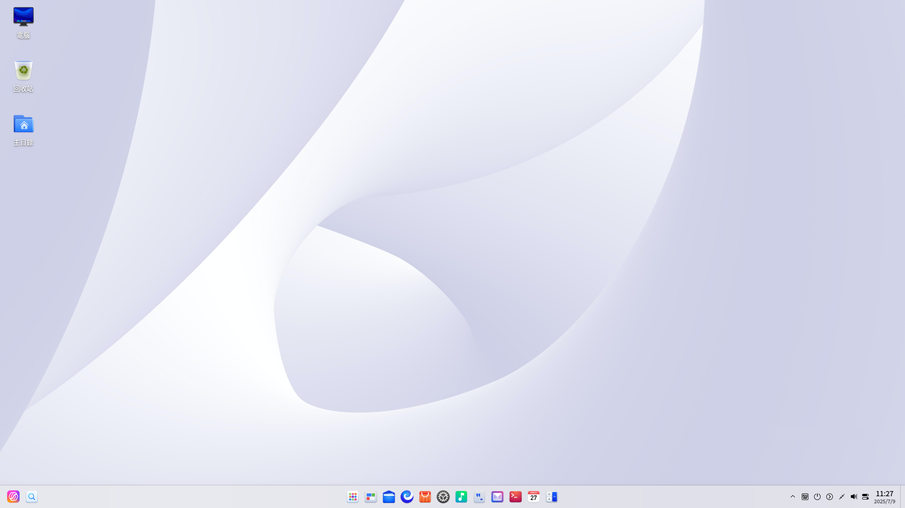

### 系統簡介
初次進入統信度操作系統，會自動打開歡迎程式。您可以觀看影片了解系統功能，選擇桌面模式和圖示主題，進一步了解該系統。

成功登入系統後，即可體驗 UOS桌面環境。桌面環境主要由桌面、工作列、啟動器、控制中心和視窗管理器等組成，是您使用該操作系統的基礎。

## 桌面
桌面是登入後看到的主螢幕區域。在桌面上可以新建檔案/資料夾、排列檔案、打開終端、設定桌布和螢幕保護等，還可以通過 [傳送到桌面](#建立捷徑) 向桌面添加應用的捷徑。

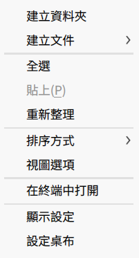

>  說明：在觸控板上，四指/五指向下移動顯示桌面，緊接著向上移動隱藏桌面，對應 **Super** + **D** 快捷鍵。

### 新建資料夾/文件
在桌面新建資料夾或文件，也可以對檔案進行常規操作，和在檔案管理器中一樣。

- 在桌面上，按滑鼠右鍵，按 **新建資料夾**，輸入新建資料夾的名稱。
- 在桌面上，按滑鼠右鍵，按 **新建文件**，選擇新建文件的類型，輸入新建文件的名稱。

在桌面檔案或資料夾上，按滑鼠右鍵，在彈出的功能表中主要包含如下功能：

| 功能          | 說明                                                                 |
|---------------|----------------------------------------------------------------------|
| 開啟方式      | 選定系統預設開啟方式，也可以選擇其他關聯應用程式來開啟。             |
| 壓縮/解壓縮   | 壓縮檔案或資料夾，或對壓縮檔案進行解壓縮。                           |
| 剪下          | 移動檔案或資料夾。                                                   |
| 複製          | 複製檔案或資料夾。                                                   |
| 重新命名      | 重新命名檔案或資料夾。                                               |
| 刪除          | 刪除檔案或資料夾。                                                   |
| 建立連結      | 建立一個捷徑。                                                       |
| 標記資訊      | 添加標記資訊，以對檔案或資料夾進行標籤化管理。                       |
| 內容          | 查看檔案或資料夾的基本資訊、共享方式及其權限。                       |

>  說明：
> - 當使用觸屏電腦時，在觸控螢幕上長按 1 秒再抬起即打開目前物件的右鍵功能表。
> - 在觸控板上，二指按一下，顯示右鍵功能表。
> - 在鍵盤上按下 **Alt** + **M** 快捷鍵，打開右鍵功能表。

### 設定排列方式
您可以對桌面上的圖示按照需要進行排序。

1. 在桌面上，按滑鼠右鍵。
2. 按 **排序方式**，您可以：
   - 按 **名稱**，將按檔案的名稱順序顯示。
   - 按 **修改時間**，檔案將按最近一次的修改日期順序顯示。
   - 按 **建立時間**，檔案將按建立日期順序顯示。
   - 按 **大小**，將按檔案的大小順序顯示。
   - 按 **類型**，將按檔案的類型順序顯示。

>  竅門：您也可以勾選 **自動排列**，桌面圖示將從上往下，從左往右按照目前排序規則排列，有圖示被刪除時後面的圖示會自動向前填充。

### 調整圖示大小
1. 在桌面上，按滑鼠右鍵。
2. 按 **圖示大小**。
3. 選擇一個合適的圖示大小。

>  竅門：您也可以用 **Ctrl** + //滑鼠滾動來調整桌面和啟動器中的圖示大小。

### 設定顯示器
從桌面按右鍵功能表選擇「顯示設定」，可以快速進入控制中心設定顯示器的縮放比例、解析度和亮度等。

1. 在桌面上，按滑鼠右鍵。
2. 按 **顯示設定**，快速進入控制中心的顯示設定介面。

>  說明：關於顯示的設定，具體操作請參考 [顯示設定](#顯示設定)。

### 剪貼簿
剪貼簿展示目前用戶登入系統後複製和剪下的所有文字、圖片和檔案。使用剪貼簿可以快速複製其中的某項內容。登出或關機後，剪貼簿會自動清空。

在剪貼簿上，可以將有源圖片、檔案類資訊直接拖曳到桌面儲存，也可以將文字、字元等資訊拖曳到可編輯文字中。

1. 使用快捷鍵 **Super** + **V** 喚出剪貼簿。
2. 按兩下剪貼簿內的某一區塊，會快速複製目前內容，且該區塊會被移動到剪貼簿頂部。
3. 選擇目標位置貼上。
4. 滑鼠移入剪貼簿的某一區塊，按一下上方的 ，刪除目前內容；按一下頂部的 全部清空，清空剪貼簿。

>  說明：當使用觸屏電腦時，在觸控螢幕上從螢幕左側邊緣劃入超過工作列高度，喚出剪貼簿。

## 工作列
工作列一般是指位於桌面底部的長條，主要由啟動器、應用程式圖示、系統匣、系統外掛等組成。在工作列中，可以打開啟動器、顯示桌面、進入工作區，對其上的應用程式進行打開、新建、關閉、強制結束等操作，還可以設定輸入法，調節音量，連接網路，查看日曆，進入關機介面等。

>  說明：在控制中心「個人化 > 工作列」介面，也可以對工作列的模式、位置、狀態等進行設定。

### 認識工作列圖示
工作列圖示包括啟動器圖示、應用程式圖示、系統匣圖示、系統外掛圖示等。

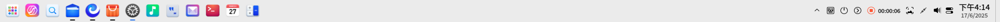

| 圖示 | 說明 | 圖示 | 說明 |
|------|------|------|------|
|  | 啟動器 - 按一下查看所有已安裝的應用。 |  | 全域搜尋 - 搜尋、查找內容。 |
|  | 多工檢視 - 按一下顯示工作區。 |  | 檔案管理器 - 按一下查看磁碟中的檔案、資料夾。 |
|  | UOS AI Bar - AI 功能場景響應入口。 |  | 瀏覽器 - 按一下打開網頁。 |
|  | 應用商店 - 搜尋安裝應用軟體。 |  | 控制中心 - 按一下進入系統設定。 |
|  | 音樂 - 播放音樂應用軟體。 |  | 文字編輯器 - 查看和編輯文字檔案應用軟體。 |
|  | 郵件 - 編輯、管理和傳送電子郵件應用軟體。 |  | 終端 - 終端模擬器。 |
|  | 日曆 - 查看日期、管理日程應用軟體。 |  | 計算機 - 標準、科學型和程式設計師型桌面計算機工具。 |
|  | 通知中心 - 顯示所有系統和應用的通知。 |  | 螢幕鍵盤 - 按一下使用虛擬鍵盤。 |
|  | 快速設定面板-快速設定系統功能。 |  | 關機 - 按一下進入關機介面。 |

### 切換顯示模式
工作列提供兩種顯示模式：經典模式和置中模式，顯示不同的圖示大小和應用視窗啟動效果。

您可以通過以下操作來切換顯示模式：

1. 在工作列上按滑鼠右鍵。
2. 在 **模式** 子功能表中選擇一種顯示模式。

### 設定工作列位置
您可以將工作列放置在桌面的任意方向。

1. 在工作列上按滑鼠右鍵。
2. 在 **位置** 子功能表中選擇一個方向。

### 調整工作列高度
滑鼠拖動工作列邊緣，改變工作列高度。

### 顯示/隱藏工作列
工作列可以隱藏，以便最大程度地擴展桌面的可操作區域。

1. 在工作列上按滑鼠右鍵。
2. 在 **狀態** 子功能表中您可以：
   - 選擇 **一直顯示**，工作列將會一直顯示在桌面上。
   - 選擇 **一直隱藏**，工作列將會隱藏起來，只有在滑鼠移至工作列區域時才會顯示。
   - 選擇 **智能隱藏**，當佔用工作列區域時，工作列自動隱藏。

>  說明：在觸控螢幕電腦上，當工作列設定為「智能隱藏」或「一直隱藏」時：
> - 如果工作列在底部，在螢幕邊緣從下往上劃入，喚出工作列；
> - 如果工作列在頂部，在螢幕邊緣從上往下劃入，喚出工作列；
> - 如果工作列在左側，在螢幕邊緣從左往右劃入，喚出工作列；
> - 如果工作列在右側，在螢幕邊緣從右往左劃入，喚出工作列。

### 顯示/隱藏外掛

1. 在工作列上按滑鼠右鍵。
2. 按 **工作列設定** 進入控制中心「個人化 > 工作列」介面。
3. 在外掛區域勾選或取消勾選 **回收站**、**系統監視器**、**關機**、**顯示桌面**、**螢幕鍵盤**、**通知中心**、**時間**、**桌面智能助手**、**截圖錄屏**等外掛，可以設定這些外掛在工作列上的顯示或隱藏效果。

### 查看通知訊息
當有系統或應用通知時，桌面上方會彈出通知訊息。若有按鈕，按一下按鈕執行對應操作；若無按鈕，按一下關閉此訊息。

此外，還可以按一下工作列上的 ，打開通知中心，查看所有通知。
![[fig/message.png]]

>  說明：當使用觸屏電腦時，手指從螢幕右側邊緣劃入超過工作列高度，喚出通知中心。

### 查看日期時間
- 滑鼠指針懸停在工作列的時間上，查看目前日期、星期和時間。
- 按一下時間，打開日曆外掛。

### 進入關機介面
按一下工作列上的  進入關機介面，或在啟動器的小視窗模式中按一下  進入關機介面。

| 功能 | 圖示 | 說明 |
|------|------|------|
| 關機 |  | 關閉電腦。 |
| 重啟 |  | 關機後再次重新運行您的電腦。 |
| 待機 |  | 整個系統將處於低能耗運轉的狀態。 |
| 休眠 |  | 沒有 swap 分割區不顯示此項。有 swap 分割區的機器休眠掛載到硬碟。 |
| 鎖定 |  | 鎖定電腦，按下快捷鍵 **Super** + **L** 鎖定。 |
| 切換用戶 |  | 選擇另一個用戶賬戶登入。 |
| 登出 |  | 清除目前登入用戶的資訊。 |
| 系統監視器 |  | 快速啟動系統監視器。 |

>  說明：當系統存在多個賬戶時才顯示 **切換使用者** 。

### 回收站
在回收站中，可以找到電腦中臨時被刪除的檔案，也可以選擇還原或清空這些檔案。

#### 還原檔案
臨時被刪除的檔案，可以在回收站進行還原，或使用快捷鍵 **Ctrl** + **Z** 還原剛刪除的檔案。

1. 在回收站中，選擇要恢復的檔案。
2. 按滑鼠右鍵，選擇 **還原**。
3. 還原檔案到原來的儲存路徑下。

>  注意：如果原來所在的資料夾已經刪除，還原檔案時會自動新建資料夾。

#### 刪除檔案
回收站中可以單獨清除某一檔案。

1. 在回收站中，選擇要刪除的檔案。
2. 按滑鼠右鍵，選擇 **刪除**，即可刪除回收站的檔案。

#### 清空回收站
在回收站中，按一下 **清空**，將徹底刪除回收站的所有內容。

## 啟動器
啟動器  可以管理系統中所有已安裝的應用，在啟動器中使用分類導航或搜尋功能可以快速找到需要的應用程式。

在啟動器中可以查看新安裝的應用，新安裝應用的旁邊會出現一個小藍點提示。

>  說明：在觸控板上，四指/五指按一下，顯示/隱藏啟動器，對應 **Super** 快捷鍵。

### 切換模式
啟動器有全螢幕和小視窗兩種模式。按一下啟動器介面右上角的圖示來切換模式。

兩種模式均支援搜尋應用、設定捷徑等操作。

小視窗模式還支援快速打開檔案管理器、控制中心和進入關機介面等功能。

### 排列應用
在小視窗模式下，系統預設 **自由排序** 安裝最新的應用置頂，並按照使用頻率排序。同時可支援切換以下排序方式：
- **按分類** 應用類型排序。
- **按名稱** 應用名稱首字母排序。

### 查找應用
在啟動器中，您可以滾動滑鼠滾輪或切換分類導航查找應用。

如果知道應用名稱，直接在搜尋框中輸入關鍵字或首字母縮寫，快速定位到需要的應用。

### 設定捷徑
捷徑提供了一種簡單快捷地啟動應用的方法。

#### 建立捷徑
將應用傳送到桌面或工作列上，方便您的後續操作。

在啟動器中，按滑鼠右鍵按一下應用圖示，您可以：
- 按一下 **傳送到桌面**，在桌面建立捷徑。
- 按一下 **傳送到工作列**，將應用固定到工作列。

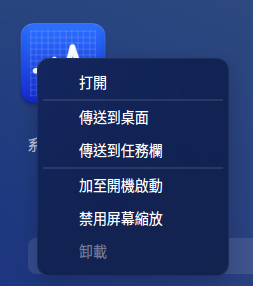

>  說明：您還可以從啟動器拖曳應用圖示到工作列上放置。但是當應用處於運行狀態時您將無法拖曳固定，此時您可以按滑鼠右鍵按一下工作列上的應用圖示，選擇 **駐留** 將應用固定到工作列，以便下次使用時從工作列上快速打開。

#### 刪除捷徑
您既可以在桌面直接刪除應用的捷徑，也可以在工作列和啟動器中刪除。

**從工作列上刪除**
- 在工作列上，按住滑鼠左鍵不放，將應用圖示拖曳到工作列以外的區域移除捷徑。
- 按滑鼠右鍵按一下工作列上的應用圖示，選擇 **移除駐留** 將應用從工作列上移除。

**從啟動器中刪除**
在啟動器中，按滑鼠右鍵按一下應用圖示，您可以：
- 按一下 **從桌面上移除**，刪除桌面捷徑。
- 按一下 **從工作列上移除**，將固定到工作列上的應用移除。

>  說明：以上操作，只能刪除應用的捷徑，而不會解除安裝應用。

### 安裝應用
如果啟動器中沒有您需要的應用，可以在應用商店一鍵下載安裝。

### 運行應用
對於已經建立了桌面捷徑或固定到工作列上的應用，您可以通過以下途徑來打開應用。

- 按兩下桌面圖示，或按滑鼠右鍵按一下桌面圖示選擇 **打開**。
- 直接按一下工作列上的應用圖示，或按滑鼠右鍵按一下工作列上的應用圖示選擇 **打開**。

在啟動器中，直接按一下應用圖示打開，或按滑鼠右鍵按一下應用圖示選擇 **打開**。

>  竅門：對於經常使用的應用，您可以在啟動器中，按滑鼠右鍵按一下應用圖示選擇 **開機自動啟動**。

### 解除安裝應用
對於不再使用的應用，您可以選擇將其解除安裝，以節省硬碟空間。

1. 在啟動器中，按滑鼠右鍵按一下應用圖示。
2. 按一下 **解除安裝**。

>  說明：部分系統應用不能被解除安裝。

## 控制中心
統信操作系統通過控制中心來管理系統的基本設定，包括賬戶管理、網路設定、時間日期設定、個人化設定、顯示設定、系統升級等。當您進入桌面環境後，按一下工作列上的  即可打開控制中心視窗。

>  說明：在觸控板上，二指從觸控板右邊緣向左滑動，顯示控制中心；二指從觸控板左邊緣向右滑動，隱藏控制中心。

### 首頁介紹
控制中心首頁主要展示各個設定模組，方便日常查看和快速設定。

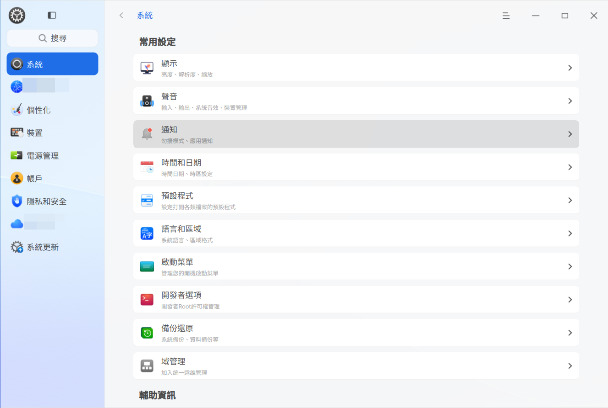

打開控制中心的某一設定模組後，可以通過左側導覽列快速切換到另一設定模組。

#### 標題列
標題列包含返回按鈕、搜尋框、主功能表及視窗按鈕。
- 返回按鈕 ：按一下即可返回上一層級。
- 麵包屑導覽：按一下返回對應頁面層級。
- 搜尋框：輸入關鍵字，Enter，搜尋相應設定。
- 主功能表：按一下打開主功能表。在主功能表中，可以設定視窗主題、查看版本或退出控制中心。

### 顯示設定
設定顯示器的亮度、解析度、螢幕方向以及縮放倍數等，讓您的電腦顯示達到最佳狀態。

#### 單螢幕設定
當顯示器為單螢幕時，可以調節顯示器亮度、解析度、重新整理率、顯示方向等。

##### 調節亮度
當設備或配置支援亮度調節功能時，才顯示亮度模組，您可以進行如下操作。
1. 在控制中心側邊欄選擇 **系統**，按一下 **顯示**。
2. 在亮度區域，拖動亮度條滑塊，調節螢幕亮度。

##### 設定螢幕縮放
當桌面和視窗顯示過大或過小時，您可能需要調節螢幕縮放，以便正常顯示。
1. 在控制中心側邊欄選擇 **系統**，按一下 **顯示**。
2. 按一下選擇下拉框，在下拉框中選擇調整縮放倍數。
3. 登出後重新登入系統螢幕縮放操作即可生效。

>  說明：
> - 當檢測到螢幕為高分屏時，會自動調整縮放倍數。
> - 部分應用不支援螢幕縮放，您可以在啟動器中按滑鼠右鍵按一下該應用，選擇 **禁用螢幕縮放**，以獲得更好的顯示效果。

##### 變更解析度
1. 在控制中心側邊欄選擇**系統**，按一下  **顯示**。
2. 在解析度區域的下拉清單中，選擇合適的解析度參數。
3. 按一下 **保存**。

##### 設定桌面顯示
當顯卡支援桌面顯示功能且解析度設定為非推薦解析度時，您可以進行如下操作。
1. 在控制中心側邊欄選擇**系統**，按一下  **顯示**。
2. 在桌面顯示區域的下拉清單中，選擇一種合適的桌面顯示效果。

##### 設定螢幕重新整理率
1. 在控制中心側邊欄選擇**系統**，按一下  **顯示**。
2. 在重新整理率區域的下拉清單中，選擇一個合適的重新整理率。
3. 按一下 **保存**。

##### 改變螢幕方向
1. 在控制中心側邊欄選擇**系統**，按一下  **顯示**。
2. 在方向區域的下拉清單中，選擇一個合適的方向參數，改變螢幕方向。
3. 按一下 **保存**。

##### 設定護眼模式
當設備或配置支援護眼功能時，才顯示護眼模組，您可以進行如下操作。
1. 在控制中心側邊欄選擇**系統**，按一下  **顯示**。
2. 在 **護眼模式** 區域，可以：
   - 打開 **護眼模式** 開關，進入護眼模式。
   - 設定護眼模式生效時間，在時間區域，可以在下拉功能表中選擇生效時間，包括「全天」、「日落到日出」、「自訂」，預設為「全天」。
   - 設定護眼色溫值，在色溫區域，可以手動拖動色溫條滑塊調節螢幕色溫。

#### 多螢幕設定
多螢幕顯示可以讓螢幕的視野無限延伸，使用 VGA、HDMI、DP 等線纜將電腦和另一台顯示器、投影機等連接起來，電腦上的內容即可同時在多個螢幕中顯示。當電腦設備連接上另一台顯示設備，多螢幕顯示模式設定模組才會出現。

1. 在控制中心側邊欄選擇**系統**，按一下  **顯示**。
2. 在多螢幕設定區域，**模式** 下拉框中選擇螢幕顯示樣式。
   - **複製** 將主螢幕的顯示內容複製到其他螢幕。
   - **擴展** 將主螢幕的顯示內容擴展到其他螢幕，擴大桌面區域。
   - **僅在xxx顯示** 只在某個螢幕顯示內容。

多螢幕複製或擴展模式時，按一下識別後，多個螢幕中央出現螢幕名稱。

多螢幕擴展模式時，集合視窗將其他螢幕的設定視窗集合到該螢幕中心位置展示。
   - 主螢幕集合視窗，主螢幕設定視窗置於底層，副螢幕視窗在其上面。
   - 副螢幕集合視窗，目前副螢幕設定視窗置於頂層，主螢幕設定視窗在底層。

>  說明：多螢幕擴展模式時，在控制中心「個人化 > 工作列」介面，多螢幕顯示設定區域，工作列設定包含 **僅主螢幕顯示**、**跟隨滑鼠位置顯示** 兩個互斥選項。

在多螢幕環境下，按下快捷鍵 **Super** + **P** 調出多螢幕顯示模式的 OSD。
詳細操作方法如下。
1. 按住 **Super** 不放，再按下 **P** 或滑鼠按一下來進行模式選擇。
2. 鬆開按鍵，確認選擇，模式生效。

>  說明：當多螢幕顯示時，副螢幕也支援桌面圖示顯示、右鍵功能表操作等功能。

多螢幕螢幕亮度、色溫、螢幕縮放、解析度、重新整理率、方向等的設定方式與單螢幕設定方式相同，詳細操作方法請參考 [單螢幕設定](#單螢幕設定)。

### 觸控螢幕設定
當接入觸控螢幕時，您可以設定所在螢幕，並對其進行調整。

1. 在控制中心側邊欄選擇 **系統**，按一下 **觸控螢幕**。
2. 對螢幕進行設定後，按一下 **確定**。

### 預設程式設定
當安裝有多個功能相似的應用程式時，可以通過右鍵功能表或控制中心為某種類型的檔案指定某個應用作為打開檔案的預設程式。

#### 設定預設程式
1. 按滑鼠右鍵按一下檔案，選擇 **開啟方式** > **選擇預設程式**。
2. 選擇一個應用，自動勾選「設為預設」，按一下 **確定**。
3. 該應用將自動添加到控制中心的預設程式清單。

#### 變更預設程式
1. 在控制中心側邊欄選擇 **系統**，按一下 **預設程式**。
2. 選擇一個檔案類型進入預設程式清單。
3. 在清單中選擇另一個應用程式。

#### 添加預設程式
1. 在控制中心側邊欄選擇 **系統**，按一下 **預設程式**。
2. 選擇檔案類型進入預設程式清單。
3. 按一下清單下的 **添加預設程式** 按鈕 **添加**，選擇 desktop 檔案（一般在 /usr/share/applications)，或特定的二進位檔案。
4. 將程式添加到程式清單並勾選該程式，則可設定為預設程式。

#### 刪除預設程式
在預設程式清單中，您只能刪除自己添加的應用程式，不能刪除系統已經安裝的應用。要刪除系統已經安裝的應用，只能解除安裝應用。解除安裝後該應用將自動從預設程式清單中刪除。

可用以下方法刪除自己添加的預設程式。
1. 在控制中心側邊欄選擇 **系統**，按一下 **預設程式**。
2. 選擇檔案類型進入預設程式清單。
3. 按一下程式後面的 ，刪除預設程式。

### 個人化設定
在控制中心個人化設定模組可以進行一些通用的個人化設定，包括系統主題、活動用色、字型、視窗特效和不透明度，改變桌面和視窗的外觀。除此之外還可設定圖示主題、游標主題和字型。

#### 設定視窗主題
1. 在控制中心側邊欄選擇  **個人化**。
2. 按一下 **主題**，選擇一種系統主題。
3. 該主題即為系統主題。

#### 外觀
外觀調整主題的淺色、深色模式。

1. 在控制中心側邊欄選擇 **個人化**。
2. 按一下 **外觀** 選擇框選擇模式，可選擇 **淺色、深色**及**自動**，選擇自動模式，更具日出、日落時間切換深淺外觀。

>  說明：自動外觀表示根據目前時區的時間，根據日出日落的時間自動更換視窗主題。日出後是淺色，日落後是深色。

#### 桌面和工作列設定
在「個人化 > 桌面和工作列」設定介面，可以對工作列的模式、位置、狀態等進行設定。

1. 在控制中心側邊欄選擇 **個人化**。
2. 按一下 **桌面和工作列**，進入桌面和工作列設定介面，您可以：
   - 選擇工作列模式為經典模式或置中模式。
   - 通過拖曳工作列大小滑塊改變工作列大小。
   - 設定位置為上、下、左或右。
   - 設定顯示狀態為一直顯示、一直隱藏或智能隱藏。
   - 外掛區域：勾選或取消勾選外掛區域的外掛，設定其在工作列上的顯示和隱藏效果。

多螢幕擴展模式時，工作列位置可以設定為跟隨滑鼠位置顯示，或僅主螢幕顯示。

#### 視窗效果
視窗效果的表現依賴硬體性能，您可以切換不同的視窗效果，選擇操作體驗最佳的模式。

1. 在控制中心側邊欄選擇 **個人化**。
2. 按一下 **視窗效果**，進入視窗設定介面，您可以：
   - **介面效果** 選擇 **最佳性能**，可關閉所有介面和視窗特效，保障系統高效運行。
   - **介面效果**選擇 **均衡**，可限制部分視窗特效，保障出色的視覺效果，同時維持系統流暢運行。
   - **介面效果** 選擇 **最佳視覺**，可啟用所有介面和視窗特效，體驗最佳視覺效果。
   - 視窗圓角 可選擇 無、小、中、大。
   - 視窗移動時啟用透明特效，開啟或關閉。開啟時，移動視窗觸發透明特效。
   - 視窗最小化時效果，可以切換使用 **縮放** 效果 或 **魔燈** 效果。
   - 設定工作列、啟動器（小視窗模式）的不透明度。滑塊越靠左越透明，越靠右越不透明。
   - 修改捲軸顯示方式，可選擇捲動時顯示或一直顯示。
   - 設定標題列高度，拖動 **標題列高度** 的滑塊，調節標題列高度，可即時預覽高度效果。

>  說明：此功能僅適用於視窗管理器繪製的應用標題列。

#### 桌布
選擇一些精美、時尚的桌布來美化桌面，讓您的電腦顯示與眾不同。

1. 在桌面上，按滑鼠右鍵，按一下 **設定桌布**，進入控制中心預覽所有桌布。
2. 您可以選擇我的圖片、系統桌布或純色桌布 3 種桌布類型。
3. 按一下選擇某一桌布後，桌布就會在桌面中生效。
4. 在桌布上按滑鼠右鍵按一下 **設定鎖屏**，桌布會在鎖屏中生效。

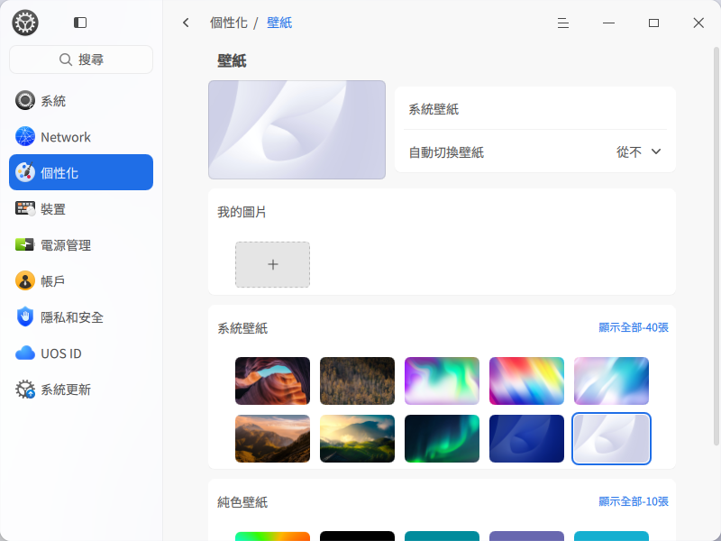

>  竅門：
> - 您可以在自動切換桌布選項中設定自動更換桌布的時間間隔，您還可以設定在「登入時」和「喚醒時」自動更換桌布。
> - 您還可以在圖片檢視器中設定您喜歡的圖片為桌面桌布，或前往應用商店搜尋桌布下載您喜歡的桌布。

#### 螢幕保護
螢幕保護程式原本是為了保護顯像管，現在一般用來防範他人偷窺您電腦上的一些隱私。

1. 在控制中心 > 個人化 中，按一下 **螢幕保護** 進入螢幕保護設定介面，預覽所有螢幕保護。
2. 您可以選擇圖片輪播螢幕保護或系統螢幕保護 2 種螢幕保護類型。
3. 選中一個螢幕保護後，設定閒置時間，待電腦閒置至指定時間後，將啟動您選擇的螢幕保護程式。
4. 選擇圖片輪播螢幕保護後，在個人化螢幕保護選項中按一下 **設定** 打開設定視窗，可以自訂選擇圖片路徑、輪播間隔、設定隨機輪播。
5. 您可以開啟 **恢復時需要密碼**，以便更好地保護您的隱私。

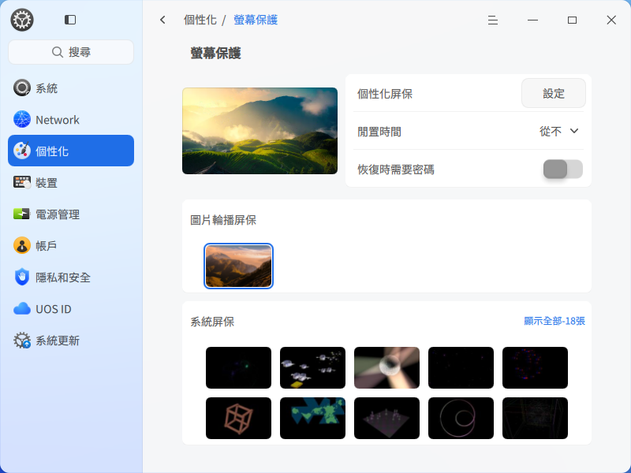

#### 顏色和圖示
1. 在控制中心側邊欄選擇 **個人化**。
2. 按一下 **顏色和圖示**，進入顏色和圖示設定介面，您可以：
   - 活動用色 可選擇顏色即時查看效果，調整選中某一選項時的強調色。
   - 圖示主題 可選擇圖示主題，可調整選擇系統提供的圖示主題，也可通過商店下載及自訂匯入的圖示主題在此進行切換。
   - 按一下 **游標主題**，選擇一款游標樣式。

#### 字型和字型大小
1. 在控制中心側邊欄選擇 **個人化**。
2. 按一下 **字型和字型大小**，進入設定字型介面。
3. 設定系統字型大小和字型。

### 網路設定
登入系統後，您需要連接網路，才能接收郵件、瀏覽新聞、下載檔案、聊天、網上購物等。

>  竅門：您可以按一下工作列的快速面板，設定、查看目前網路狀態。
#### 有線網路
有線網路安全快速穩定，是最常見的網路連接方式。當您設定好路由器後，把網線兩端分別插入電腦和路由器，即可連接有線網路。

1. 將網線插入電腦上的網路插孔。
2. 將網線的另一端插入路由器或網路埠。
3. 在控制中心側邊欄選擇 **網路**。
4. 按一下 **有線網路**，進入有線網路設定介面。
5. 打開 **有線網卡**，開啟有線網路連接功能。
6. 當網路連接成功後，桌面上方將彈出「已連接有線連接」的提示資訊。

您還可以在有線網路的設定介面，編輯或新建有線網路設定。

#### 無線網路
無線網路幫助您擺脫線纜的束縛，上網形式更加靈活，支援更多設備使用。

##### 連接無線網路
1. 在控制中心側邊欄選擇 **網路**。
2. 按一下 **無線網路**，進入無線網路設定介面。
3. 打開 **無線網卡**，開啟無線網路連接功能。
4. 電腦會自動搜尋並顯示附近可用的無線網路。
5. 選擇需要連接的無線網路。
   - 如果該網路是開放的，將自動連接到此網路。
   - 如果該網路是加密的，請根據提示輸入密碼，按一下 **連接**，然後將自動完成連接。

##### 連接隱藏網路
為了防止他人掃描到自己的無線網路，進而破解無線網路密碼連接您的網路，您可以在路由器設定介面隱藏無線網路。設定後，您需要手動連接隱藏網路才能上網。

1. 在控制中心側邊欄選擇 **網路**。
2. 按一下 **無線網路**，進入無線網路設定介面。
3. 按一下 **連接到隱藏網路**。
4. 輸入網路名稱 SSID 和其他必填選項。
5. 按一下 **保存**。

#### 個人熱點
通過個人熱點將電腦網路信號轉換為無線網路熱點，以供一定距離內的其他設備無線連接。要開啟無線熱點，電腦必須裝有支援熱點功能的無線網卡。

1. 在控制中心側邊欄選擇 **網路**。
2. 按一下 **個人熱點**。
3. 打開 **熱點** 開關，設定熱點資訊。
4. 按一下 **保存**。

#### 飛航模式
開啟飛航模式可以禁用無線網路、個人熱點和藍牙。除了在控制中心，您也可以在工作列快速面板中按一下飛航模式開關來開啟或者關閉飛航模式。

1. 在控制中心側邊欄選擇 **網路**。
2. 按一下**飛航模式**。
3. 打開開關開啟飛航模式。

> 注意：如果您的電腦沒有無線網卡，也沒有藍牙模組，系統將不會展示飛航模式相關介面。

#### 撥號網路
撥號上網（DSL）是指通過本地電話撥號連接到網路的連接方式。配置好數據機，通過網線連接數據機的網口和電腦的網口後，建立寬頻撥號連接，輸入運營商提供的使用者名稱和密碼，即可撥號連接到 Internet 上。

##### 新建撥號連接
1. 在控制中心側邊欄選擇 **網路**。
2. 按一下 **DSL**，並按一下 **建立PPPoE連接** 按鈕。
3. 輸入寬頻名稱、賬戶、密碼。
4. 按一下 **保存**，系統自動建立寬頻連接並嘗試連接。

#### VPN
VPN 即虛擬專用網路，其主要功能是在公用網路上建立專用網路，進行加密通訊。無論您是在外地出差還是在家中辦公，只要能上網就能利用 VPN 訪問企業的內網資源。您還可以使用 VPN 加速訪問其他國家的網站。

1. 在控制中心側邊欄選擇 **網路**。
2. 按一下 **VPN**，選擇 **添加 VPN** 按鈕或 **匯入 VPN** 按鈕。
3. 選擇 VPN 協議類型，並輸入名稱、閘道、使用者名稱、密碼等資訊。（匯入 VPN 會自動填充資訊）
4. 按一下 **保存**，系統自動嘗試連接 VPN 網路。
5. 您可以將 VPN 設定匯出，備用或共用給其他用戶。

>  說明：打開 **僅用於相對應的網路上的資源** 開關，可以不將 VPN 設定為預設路由，只在特定的網路資源上生效。

#### 系統代理
1. 在控制中心側邊欄選擇 **網路**。
2. 按一下 **系統代理**，進入系統代理介面。
3. 開啟系統代理，在代理類型後的下拉框中選擇 **手動** 或 **自動**。
   - 選擇 **手動**，需要配置代理伺服器的地址和埠等資訊。
   - 選擇 **自動**，需要配置 URL，系統將自動配置代理伺服器的資訊。
4. 按一下 保存。

#### 應用代理
1. 在控制中心側邊欄選擇 **網路**。
2. 按一下 **應用代理**。
3. 設定代理類型、IP 地址、埠等應用代理參數。
4. 按一下 **保存**。

>  說明：應用代理設定成功後，打開啟動器，按滑鼠右鍵按一下應用圖示，可以選擇 **使用代理**。

#### 網路詳情
在網路詳情介面，您可以查看 MAC 地址、IP 地址、閘道和其他網路資訊。

1. 在控制中心側邊欄選擇 **網路**。
2. 按一下 **網路詳情**，進入網路資訊介面。
3. 查看目前有線網路或無線網路的資訊。

### 通知設定
設定通知勿擾模式，開啟或關閉某些應用的通知顯示。

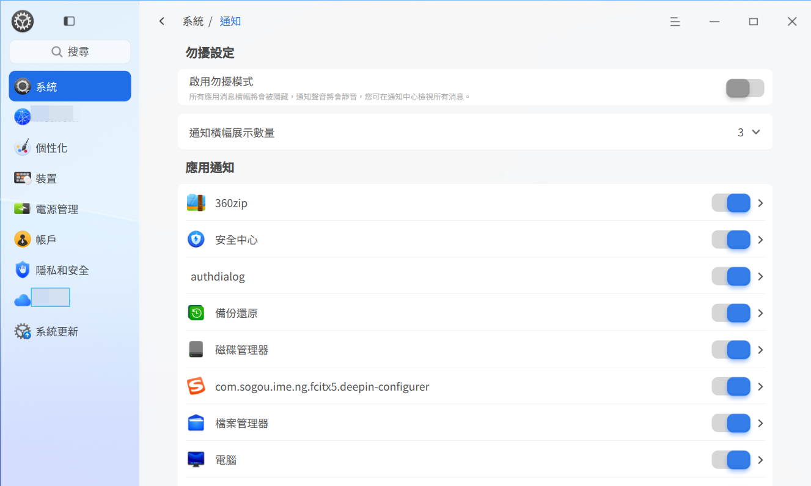

#### 設定系統通知
設定系統通知的勿擾模式。

1. 在控制中心側邊欄選擇 **系統**。
2. 按一下 **通知**，進入系統通知介面。
   - 開啟或關閉勿擾模式。
      當開啟勿擾模式後，可以設定勿擾模式的開啟時間、結束時間；也可以設定 **在螢幕鎖屏時** 顯示通知。開啟勿擾模式可以使所有通知靜音，但您可以在通知中心查看所有訊息。

#### 設定應用通知
自訂設定個人化的應用通知顯示。

1. 在控制中心側邊欄選擇 **系統**，按一下 **應用通知**。
2. 在應用通知區域選擇一個應用，開啟後，您可以選擇：
   - 開啟、關閉通知時提示聲音
   - 在通知中心或在桌面顯示
   - 是否顯示訊息預覽

### 聲音設定
輸入輸出設備聲音的設定（如設定揚聲器和麥克風），讓您聽得更舒適，錄音更清晰。

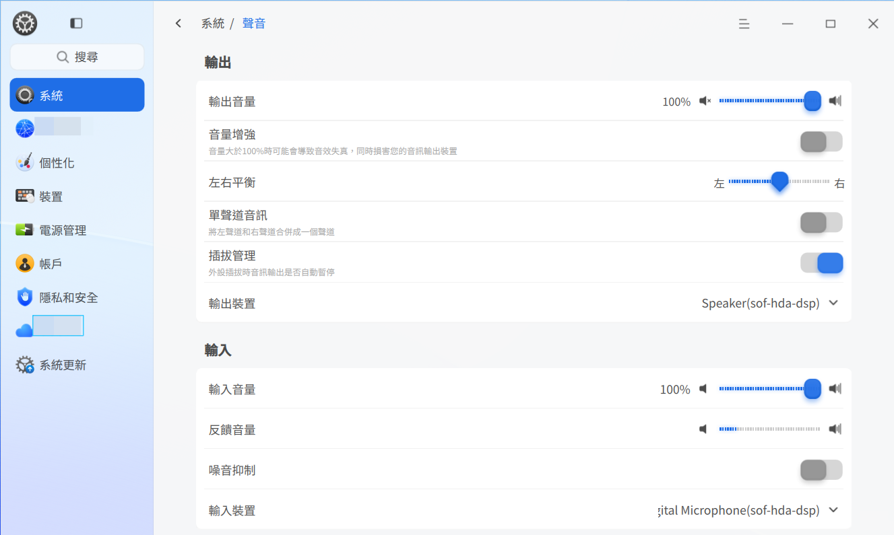

#### 輸出設定
1. 在控制中心側邊欄選擇 **系統**，按一下 **聲音**。
2. 進入聲音設備配置介面，您可以進行輸出設定：
   - 通過拖曳滑塊調節輸出音量和左/右聲道平衡。
   - 打開 **音量增強**，音量的可調節區間由 0~100% 轉變為 0~150%。
   - 打開 **單聲道音訊**，輸出聲音將左、右聲道合併為一個聲道。
   - 打開 **插拔管理**，外設拔出時音訊輸出將自動暫停。
   - 在輸出設備後面的下拉框中選擇輸出設備類型。

#### 輸入設定
1. 在控制中心側邊欄選擇 **系統**，按一下 **聲音**。
2. 進入聲音設備配置介面，您可以進行輸入設定：
   - 通過拖曳音量滑塊調節輸入音量。
   - 打開啟用開關，還可以設定 **噪音抑制** 功能。
   - 在輸入設備後面的下拉框中選擇輸入設備類型。

>  竅門：通常，需要調大輸入音量，確保能夠聽到聲源的聲音，但是音量不宜過大，因為這會導致聲音失真。可以對著輸入設備如麥克風以正常說話的音量講話，並觀察回饋音量的變化，變化較明顯，則說明輸入音量合適。

#### 系統音效
1. 在控制中心側邊欄選擇 **系統**，按一下 **聲音**。
2. 按一下 **系統音效**，勾選選項，開啟某一事件發生時的聲音效果。

>  竅門：您可以按一下試聽音效。

#### 設備管理
1.  в控制中心側邊欄選擇 **系統**，按一下 **聲音**。
2. 按一下 **設備管理**，開啟/禁用輸入設備、輸出設備。

### 藍牙設定
藍牙能夠實現短距離的無線通訊。通過藍牙無需網路或連接線就可以與附近的其它藍牙設備連接。常見的藍牙設備包括：藍牙鍵盤、藍牙滑鼠、藍牙耳機、藍牙音響等。

>  說明：當筆記型電腦配備了藍牙時，您可以直接開啟藍牙開關；當桌上型電腦沒有配備藍牙時，您可以購買藍牙適配器，插入到電腦的 USB 連接埠中，再使用藍牙。

#### 修改藍牙名稱
1. 在控制中心側邊欄選擇 **設備**，按一下 **藍牙**。
2. 按一下藍牙名稱旁的 **修改** 按鈕，輸入本機新的藍牙名稱。

>  說明：修改藍牙名稱後，將自動對外廣播藍牙設備的新名字，需要其他設備重新進行搜尋。

#### 連接藍牙設備
1. 在控制中心側邊欄選擇 **設備**，按一下 **藍牙**。
2. 開啟 **藍牙**，系統將自動掃描附近的藍牙設備，並顯示在 **其他設備** 清單。
3. 按一下想連接的藍牙設備，在該設備上輸入藍牙配對碼（若需要），配對成功後將自動連接。
4. 連接成功後，藍牙設備會添加到 **我的設備** 清單中。
5. 在我的設備清單中按一下該設備，您可以 **斷開連接**，或修改設備名稱。

#### 使用藍牙傳送/接收檔案
UOS PC 與非 UOS PC 或者 UOS PC 與移動設備（手機/平板）之間通過藍牙設備傳送/接收檔案。

前提條件：發送端藍牙設備與接收端藍牙設備已配對並連接成功。

**使用 UOS PC 端藍牙傳送檔案**
場景：發送端通過藍牙向接收端傳送檔案。

1. 在控制中心側邊欄選擇 **設備**，按一下 **藍牙**。
2. 開啟 **藍牙**，系統將自動掃描附近的藍牙設備。
3. 進入「我的設備」選擇已配對連接的藍牙設備，按一下已連接設備的 更多 按鈕進入詳情，按一下 **傳送檔案** 按鈕（僅 PC/手機/平板的藍牙設備有該按鈕)，在彈出的檔案管理器視窗中選擇要傳送的檔案，按一下 **打開**。
4. 在彈出的「藍牙檔案傳輸」視窗中，選擇接收此檔案的藍牙設備，按一下 **傳送**，發送傳輸檔案請求。

**使用手機端藍牙傳送檔案**
場景：發送端（以安卓手機為例）通過藍牙向接收端傳送檔案。

1. 開啟 **藍牙**，系統將自動掃描附近的藍牙設備。
2. 選擇已配對並連接成功的藍牙設備。
3. 在手機中選擇檔案，按一下 **傳送**，通過藍牙傳送檔案。

**使用藍牙接收檔案**
發送端傳送檔案後，接收端彈出提示視窗，用戶可以按一下 **接受** 或 **拒絕** 檔案。

- 如果接收端藍牙設備同意接收，則發送端開始傳輸檔案並顯示發送檔案視窗，檔案傳輸完成後，接收端會彈出提示資訊，用戶可以查看接收成功的檔案。
- 如果接收端為如下情況，發送端部分檔案傳輸失敗，會顯示在傳輸失敗清單。
   - 接收端藍牙設備選擇拒絕，則結束傳輸，顯示傳輸失敗。
   - 接收端藍牙設備超時未操作或超出傳輸範圍，則顯示傳輸失敗（藍牙設備連接失敗）。
   - 接收端既不按一下接收也不按一下拒絕，預設 1 分鐘後則結束傳輸，顯示傳輸失敗。

### 時間和日期
選擇正確的所在時區，即可在電腦上顯示所在地的時間和日期，也可以手動修改時間和日期。

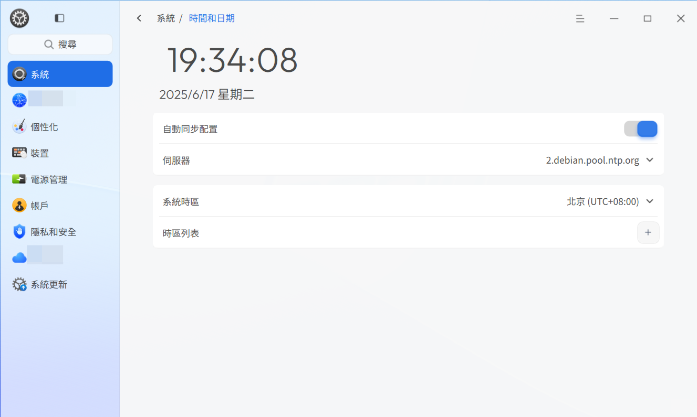

#### 修改時間和日期
預設情況下，系統通過網路自動同步該時區的本地時間和日期。您也可以關閉自動同步配置，手動修改時間和日期。

1. 在控制中心側邊欄選擇 **系統**，按一下 **時間和日期**。
2. 關閉 **自動同步配置**。
3. 手動設定正確的時間和日期。
4. 按一下 **確定**。

>  說明：您還可以打開 **自動同步配置**、設定伺服器同步參數。也可添加其他時區伺服器地址，進行自動同步。

#### 修改時區
在您安裝系統時，已設定了系統時區。若要修改系統時區，請按如下步驟設定。

1. 在控制中心側邊欄選擇 **系統**，按一下 **時間和日期**。
2. 按一下 **修改系統時區**，通過搜下拉框選擇時區。

#### 添加時區
您可以同時使用多個時區，以便查看另一時區的時間。

1. 在控制中心側邊欄選擇 **系統**，按一下 **時間和日期**。
2. 按一下時區清單中 **添加** 按鈕，通過搜尋或按一下地圖選擇時區。
3. 按一下 **添加**。

#### 刪除時區
1. 在控制中心側邊欄選擇 **系統**，按一下 **時間和日期**。
2. 按一下 **時區清單**。
3. 按一下時區清單後面的 **編輯**。
4. 按一下 **刪除** 按鈕，刪除已添加的時區。

### 電源管理
對系統電源進行一些設定，讓筆記本電池更耐用，讓系統更安全。

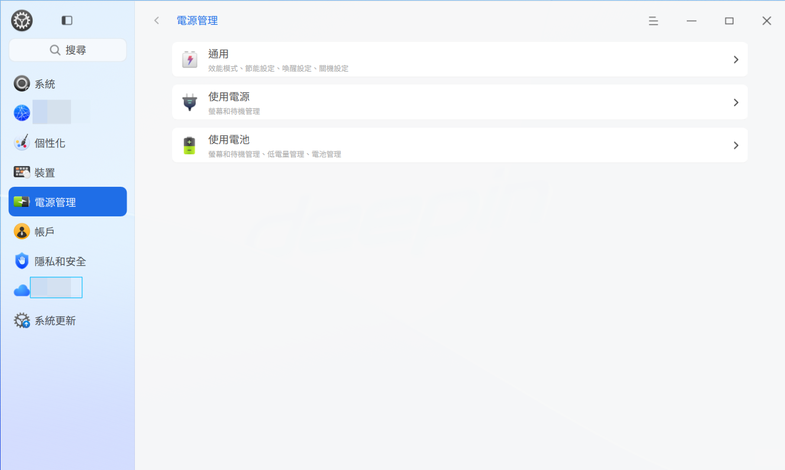

#### 調整性能模式
1. 在控制中心側邊欄選擇 **電源管理**。
2. 按一下 **通用**。
3. 在性能模式區域，選擇 **平衡模式**、**高性能模式** 或 **節能模式**。

#### 設定節能模式
為降低電腦的耗電量，您可以對節能模式進行設定，降低螢幕亮度。

1. 在控制中心側邊欄選擇 **電源管理**。
2. 按一下 **通用**。
3. 選擇 **節能模式**。
4. 在節能設定下：
   - 打開 **低電量時自動開啟** 節能模式（僅筆記型電腦支援）。
   - 設定 **低電量閾值** 下拉選項中選擇電量到達所設定的閾值後自動進入節能模式。
   - 打開 **使用電池時自動開啟** 節能模式（僅筆記型電腦支援）。
   - 拖動 **自動降低亮度** 條滑塊，調節節能模式開啟時螢幕亮度。

>  說明：當關閉 **使用電池時自動開啟** 節能模式時，則直接進入 **平衡模式**。

#### 喚醒設定
1. 在控制中心側邊欄選擇 **電源管理**。
2. 按一下 **通用**。
3. 在喚醒設定區域設定：
   - 打開 **待機恢復時需要密碼**，開啟待機喚醒時需重新登入設定。
   - 打開**喚醒顯示器時需要密碼**，開啟喚醒時需重新登入設定。

#### 關機設定
1. 在控制中心側邊欄選擇 **電源管理**。
2. 按一下 **通用**。
3. 在 **關機設定** 區域設定：
   - 設定 **定時關機時間**，可輸入時間或通過控件調整預設關機時間。
   - 設定 **重複頻次**，可設定單次、工作日重複、每天重複或自訂。

#### 設定顯示器關閉時間
1. 在控制中心側邊欄選擇 **電源管理**。
2. 按一下 **使用電源** 或 **使用電池**。
3. 選擇關閉顯示器的時間。

>  說明：筆記型電腦用戶可以在「使用電源」和「使用電池」下對同一設定項分別設定不同的時間。

#### 設定電腦待機時間
1. 在控制中心側邊欄選擇 **電源管理**。
2. 按一下 **使用電源** 或 **使用電池**。
3. 選擇電腦開始待機的時間。

>  竅門：筆記型電腦用戶還可以開啟 **合上筆記本時待機**，以便在使用電源時合蓋待機。

#### 設定自動鎖屏時間
1. 在控制中心側邊欄選擇 **電源管理**。
2. 按一下 **使用電源** 或 **使用電池**。
3. 選擇自動鎖屏的時間。

#### 設定合蓋顯示狀態
1. 在控制中心側邊欄選擇 **電源管理**。
2. 按一下 **使用電源** 或 **使用電池**。
3. 設定 **筆記本合蓋時** 為 **待機**、**休眠**、**關閉顯示器** 或 **無任何操作**。

>  說明：僅筆記型電腦支援設定合蓋顯示狀態。

#### 設定按電源按鈕時顯示狀態
1. 在控制中心側邊欄選擇 **電源
管理**。
2. 按一下 **使用電源** 或 **使用電池**。
3. 選擇按電源按鈕時的顯示狀態 **關機**、**待機**、**休眠**、**關閉顯示器**、**進入關機介面**或 **無任何操作**，變更改按電源按鈕時的設定。

#### 低電量管理
1. 在控制中心側邊欄選擇 **電源管理**。
2. 按一下 **使用電池**。
3. 設定低電量管理：
   - 打開 **低電量提醒**，當電池剩餘電量低於設定的閾值（例如，20%）時，系統會發出低電量通知。
   - 低電量自動進入狀態設定，可設定為自動待機或自動休眠。
   - 設定低電量閾值，可通過下拉框設定進入低電量閾值的電池量閾值。

>  說明：僅筆記型電腦支援設定低電量通知。

#### 電池管理
1. 在控制中心側邊欄選擇 **電源管理**。
2. 按一下 **使用電池**。
3. 在 **電池管理** 區域：
   - 可設定打開 **顯示剩餘使用時間及剩餘充電時間** 開關，調整工作列顯示電量資訊。
   - 顯示最大電池容量資訊。

### 賬戶
在安裝系統時會建立一個賬戶，在控制中心的賬戶設定模組可以修改賬戶設定或建立一個新賬戶。

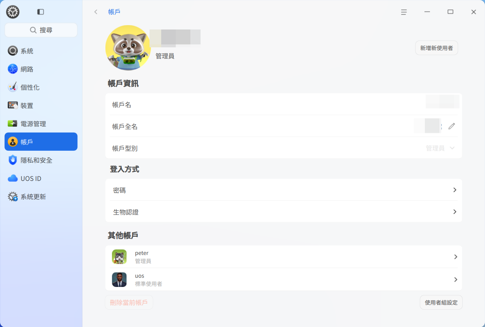

#### 建立新賬戶
1. 按一下 **添加新用戶** 按鈕。
2. 選擇賬戶類型，設定使用者名稱、全名、密碼、重複密碼、密碼提示資訊。
3. 按一下 **建立**。
4. 在授權對話方塊輸入目前賬戶的密碼，新賬戶就會添加到賬戶清單中。

>  竅門：您還可以將標準用戶的賬戶類型設定為管理員。

#### 更改頭像
滑鼠移動至賬戶頭像，會出現 **編輯**，按一下頭像，選擇一個頭像或添加本地頭像，頭像就替換完成了。

#### 設定全名
賬戶全名會顯示在賬戶清單和系統登入介面，可根據需要設定。

按一下 **設定全名** 後的 ，輸入賬戶全名。

#### 自動登入
開啟「自動登入」後，下次啟動系統時（重啟、開機）可直接進入桌面。在鎖屏和登出後再次登入需要密碼。

打開 **自動登入** 開關，在彈出的授權對話方塊中輸入目前賬戶密碼並確定後，開啟自動登入功能。

#### 免密登入
開啟「免密登入」後，下次登入系統（重啟，開機，和在登出後再次登入）和解鎖時，不需要密碼。

打開 **免密登入** 開關，在彈出的授權對話方塊中輸入目前賬戶密碼並確定後，開啟無密碼登入系統。

>  竅門：
> - 若「免密登入」和「自動登入」同時打開，下次啟動系統（重啟、開機）則直接進入桌面。

#### 登入方式
可對目前支援的登入方式進行編輯和配置。

**密碼-修改密碼**
1. 按一下 **密碼**，進入密碼二級頁面。
2. 輸入目前密碼、新密碼和重複密碼，按一下 **保存**。

>  說明：管理員賬號過期之後需要先修改密碼才能進行授權操作。

**密碼-密碼有效期**
1. 按一下 **密碼**，進入密碼二級頁面。
2. 設定密碼有效天數，可以設定密碼長期有效或具體的有效天數。

> 密碼有效期自修改之日起開始計算。
> 例如：用戶 A 在 9 月 1 日修改了密碼後，將密碼有效期更改為 30 天。在這種情況下，密碼可以在 9 月 1 日至 9 月 30 日這期間的 30 天正常使用。

**生物認證**
生物認證又稱生物識別，是通過電腦利用人體所固有的生理特徵或行為特徵來進行個人身份鑒定。常用的生物認證有指紋識別、人臉識別。

當接入具備生物認證的硬體設備後，在系統中錄入指紋、人臉資訊，可以用來登入系統、解鎖螢幕、授權特殊操作，還可以增強用戶體驗、提升系統使用效率、提高系統安全性。

>  說明：只有接入具備生物認證的硬體設備後才顯示生物認證模組，才可以進行指紋、人臉密碼設定。

**設定指紋密碼**
指紋是指手指末端正面皮膚上凸凹不平的紋路。一般來講，每個人的指紋是不同的，亦可設定為密碼。

1. 進入生物認證的二級頁面，在指紋板塊，按一下 **添加新的指紋**。
2. 在授權對話方塊輸入目前賬戶的密碼後，使用指紋設備錄入指紋。
3. 待指紋添加成功後按一下 **完成**。

>  說明：您可以添加多個指紋密碼；也可以刪除一個個指紋密碼。

**設定人臉識別**
1. 進入生物認證的二級頁面，在人臉板塊，按一下 **添加新的人臉**。
2. 在彈出的添加人臉數據對話方塊中，勾選 **我已閱讀並同意《用戶免責聲明》**，並按一下 **下一步**。
3. 按一下 **同意並開始錄入人臉**，按一下 **下一步** 使用人臉識別設備錄入人臉數據。
4. 按一下 **完成**。

>  說明：一個賬號最多可錄入 5 個人臉。

#### 刪除賬戶
1. 按一下其他未登入的賬戶。
2. 按一下 **刪除賬戶**。
3. 在彈出的確認介面中按一下 **刪除**。

>  注意: 已登入的賬戶無法被刪除。

### 滑鼠和觸控板
滑鼠和觸控板是電腦常用的輸入設備。使用滑鼠，可以使操作更加簡便快捷。對於筆記型電腦用戶，當沒有滑鼠時，也可以使用觸控板代替滑鼠進行操作。部分設備還支援指點杆，使用指點杆不需要將手指從基準鍵上移開便能操縱滑鼠。在控制中心滑鼠設定模組，用戶可以對滑鼠、觸控板和指點杆進行設定，從而讓設備使用體驗更加符合自己的使用習慣。

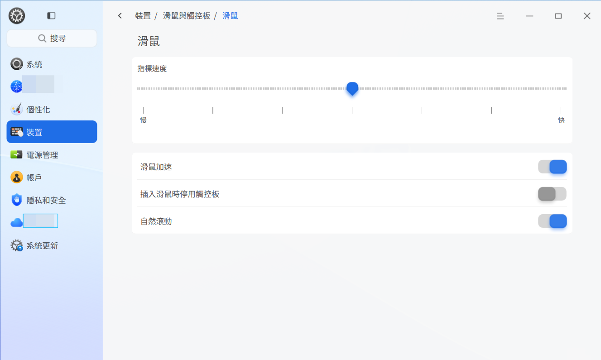

#### 通用設定
1. 在控制中心側邊欄選擇 **設備**，按一下 **滑鼠與觸控板**。
2. 在 **通用** 區域設定：
   - **捲動速度** 調節，拖動滑塊調整數值越高捲動速度越快。
   - **雙擊速度** 條件，拖動滑塊調整數值。
   - 開啟 **左手模式**，適用於左手操作。

>  說明：開啟左手模式後，滑鼠和觸控板的左右鍵功能互換。

#### 滑鼠設定
插入或連接滑鼠後，在控制中心進行相關設定，讓其更符合您的使用習慣。

>  說明：當沒有觸控板時，不會顯示「插入滑鼠時禁用觸控板」。

1. 在控制中心側邊欄選擇 **設備**，按一下 **滑鼠與觸控板**。
2. 按一下 **滑鼠**。
3. 調節 **指針速度**，控制滑鼠移動時指針移動的速度。
4. 開啟 **滑鼠加速**，調整滑鼠移動響應速度。
5. 開啟 插入滑鼠時禁用觸控板，在接入滑鼠後觸控板處於禁用狀態。
6. 按一下 **自然捲動** 開關，開啟相應功能。

>  說明：
> - 開啟滑鼠加速，提高了指針精確度，滑鼠指針在螢幕上的移動距離會根據移動速度的加快而增加。可以根據使用情況開啟或關閉。
> - 自然捲動開啟後，滑鼠滾輪向下捲動，內容會向下捲動；滑鼠滾輪向上捲動，內容會向上捲動。

#### 觸控板設定

若您使用的是筆記型電腦，可以在 **滑鼠與觸控板 > 滑鼠** 介面開啟 **輸入時禁用觸控板**，以避免誤觸觸控板。

您還可以調節觸控板的 **指針速度**，控制手指移動時指針移動的速度；開啟自然捲動，變更捲動方向。

#### 手勢設定
手勢設定，可通過觸控板手勢快速響應桌面功能，主要可設定三指手勢和四指手勢。

**三指手勢**，可設定以下功能：
1. 三指向上：預設為最大化視窗，可調整設定為恢復視窗、目前視窗左分屏、目前視窗右分屏或禁用。
2. 三指向下：預設為恢復視窗，可調整設定為最大化視窗、目前視窗左分屏、目前視窗右分屏或禁用。
3. 三指向左：預設為目前視窗左分屏，可調整設定為恢復視窗、最大化視窗、目前視窗右分屏或禁用。
4. 三指向右：預設為目前視窗右分屏，可調整設定為恢復視窗、最大化視窗、目前視窗左分屏或禁用。
5. 三指按一下：預設為打開/隱藏全域搜尋，可調整設定為顯示、隱藏啟動器、打開/隱藏剪貼簿、打開/隱藏消息中心或禁用。

**四指手勢**，可設定以下功能：
1. 四指向上：預設為顯示多工檢視，可調整設定為隱藏多工檢視、切換至前一個桌面、切換至後一個桌面、顯示桌面、隱藏桌面或禁用。
2. 四指向下：預設為隱藏多工檢視，可調整設定為顯示多工檢視、切換至前一個桌面、切換至後一個桌面、顯示桌面、隱藏桌面或禁用。
3. 四指向左：預設為切換至前一個桌面，可調整設定為顯示多工檢視、隱藏多工檢視、切換至後一個桌面、顯示桌面、隱藏桌面或禁用。
4. 四指向右：預設為切換至後一個桌面，可調整設定為顯示多工檢視、隱藏多工檢視、切換至前一個桌面、顯示桌面、隱藏桌面或禁用。
5. 四指按一下：預設為打開/關閉啟動器，可調整設定為打開/關閉全域搜尋、打開/關閉剪貼簿、打開/關閉通知中心或禁用。

### 繪圖板
繪圖板，又名繪圖板、繪畫板、手繪板等，主要用作繪畫創作，是電腦的一種輸入設備。
連接到電腦後，可以設定繪圖板的壓感力度，即筆尖和橡皮擦的壓力感應值。

>  說明：連接繪圖板設備後，該模組才會顯示。

1. 在控制中心側邊欄選擇 **設備**，按一下 **繪圖板**。
2. 選擇 **筆** 模式。
3. 調節 **壓感力度**。

### 鍵盤
在此模組可以設定鍵盤屬性，以便符合個人的輸入習慣，設定輸入法、系統語言，以及自訂快捷鍵。

#### 鍵盤屬性
1. 在控制中心邊欄選擇 **設備**，按一下 **快捷鍵**。
2. 在 **通用** 區域設定。
3. 調節 **重複延遲**/**重複速度**。
4. 按一下「請在此測試」，按下鍵盤上的任意字元不鬆開，查看調節效果。
5. 按一下 **啟用數字鍵盤**/**大寫鎖定提示** 開關，開啟相應功能。

#### 鍵盤佈局
鍵盤佈局可以為目前語言設定自訂鍵盤。完成鍵盤佈局設定後，按下鍵盤上的按鍵，螢幕上會按照鍵盤佈局設定好的字元進行顯示。更改鍵盤佈局後，螢幕上的字元可能與鍵盤按鍵上的字元不相符。

一般在安裝系統時就已經設定了鍵盤佈局，可以根據需求添加或刪除其他的鍵盤佈局。

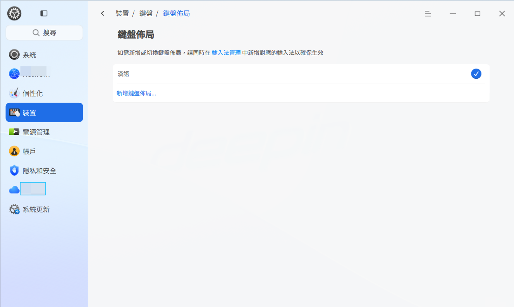

##### 添加鍵盤佈局
1. 在控制中心側邊欄選擇 **設備**，按一下 **鍵盤**。
2. 按一下 **鍵盤佈局**，進入鍵盤佈局介面。
3. 按一下 **添加鍵盤佈局** 按鈕，按一下某一鍵盤佈局即可添加到清單。

##### 刪除鍵盤佈局
1. 在控制中心側邊欄選擇 **設備**，按一下 **鍵盤**。
2. 按一下 **鍵盤佈局**，進入鍵盤佈局介面。
3. 按一下「鍵盤佈局」後的 **編輯**。
4. 按一下 **刪除** 按鈕，刪除該鍵盤佈局。

#### 輸入法
對輸入法進行設定，可以為系統提供更豐富的輸入方式。在輸入法介面可以添加多個輸入法，設定輸入法切換的快捷鍵，以便用戶選擇符合個人打字習慣的輸入方式。

##### 添加輸入法
您可以添加多個輸入法到輸入法管理清單，以便切換輸入法。

1. 在控制中心側邊欄選擇 **設備**，按一下 **鍵盤**。
2. 按一下 **輸入法**，進入輸入法介面。
3. 按一下 **添加輸入法** 按鈕，您可以：
   - 按一下 **前往商店下載**，在應用商店下載輸入法，當該輸入法下載完成後，系統自動設定其為預設輸入法。
   - 進入添加輸入法介面，選擇輸入法，將該輸入法添加到輸入法管理清單。

>  說明：在輸入法管理介面，按一下 **編輯** 後，按一下 **刪除** 按鈕即可移除某輸入法。對於被移除（非解除安裝）的輸入法，可以在添加輸入法介面進行添加。

##### 設定輸入法排序
1. 在控制中心側邊欄選擇 **設備**，按一下 **鍵盤**。
2. 按一下 **輸入法**，進入輸入法介面。
3. 在輸入法管理區域，上下拖動輸入法進行排序。

##### 設定輸入法配置項
1. 在控制中心側邊欄選擇 **設備**，按一下 **鍵盤**。
2. 按一下 **輸入法**，進入輸入法介面。
3. 在輸入法管理區域，按一下輸入法後面的 **設定** 按鈕，設定輸入法自身的配置項。

##### 設定輸入法切換快捷鍵
1. 在控制中心側邊欄選擇 **設備**，按一下 **鍵盤**。
2. 按一下 **輸入法**，進入輸入法介面。
3. 在快捷鍵區域，切換輸入法下拉框中，選擇輸入法切換的快捷鍵。

>  說明：在輸入法高級設定介面中，還可以設定更多快捷鍵。

##### 高級設定
1. 在控制中心側邊欄選擇 **設備**，按一下 **鍵盤**。
2. 按一下 **輸入法**，進入輸入法介面。
3. 按一下 **高級設定**，對輸入法進行全域配置如更多快捷鍵、程式、輸出和外觀設定，並附加元件。

#### 快捷鍵
快捷鍵清單顯示了系統所有的快捷鍵，在這裡查看、修改和自訂快捷鍵。

##### 查看快捷鍵
1. 在控制中心側邊欄選擇 **設備**，按一下 **鍵盤**。
2. 按一下 **快捷鍵**，進入快捷鍵設定介面。
3. 搜尋或查看預設的系統快捷鍵、視窗快捷鍵和工作區快捷鍵。

##### 修改快捷鍵
1. 在控制中心側邊欄選擇 **設備**，按一下 **鍵盤**。
2. 按一下 **快捷鍵**，進入快捷鍵設定介面。
3. 按一下需要修改的快捷鍵。
4. 使用鍵盤輸入新的快捷鍵。

>  竅門：若要禁用快捷鍵，請按下鍵盤上的 **Backspace**  鍵。若要取消修改快捷鍵，按下 **Esc** 鍵，或按一下下方的「恢復預設」按鈕。

##### 自訂快捷鍵
您可以為常用的應用自訂一個快捷鍵。

1. 在控制中心側邊欄選擇 **設備**，按一下 **鍵盤**。
2. 按一下 **快捷鍵**。
3. 按一下 **添加** 按鈕，進入添加自訂快捷鍵介面。
4. 輸入快捷鍵名稱、命令和快捷鍵。
5. 按一下 **添加**。
6. 添加成功後，按一下「自訂快捷鍵」後的 **編輯**。
7. 按一下某個快捷鍵後的刪除按鈕，刪除自訂的快捷鍵。

>  竅門：若要修改快捷鍵，按一下輸入新的快捷鍵即可。若要修改自訂快捷鍵的名稱和命令，按一下「自訂快捷鍵」後的 **編輯**，按一下快捷鍵名稱後的 ，進入修改頁面。

### 語言和區域
系統語言預設為安裝系統時所選擇的語言，可以隨時進行更改。在系統語言清單可以添加多個語言，以便切換系統語言。

##### 添加系統語言
您可以添加多個語言到系統語言清單，以便切換系統語言。

1. 在控制中心側邊欄選擇 **系統**。
2. 按一下 **語言和區域**，進入系統語言介面。
3. 按一下 **添加** 按鈕進入語言清單。
4. 選擇語言，該語言將自動添加到系統語言清單。

##### 設定系統語言
1. 在控制中心側邊欄選擇 **系統**。
2. 按一下 **語言和區域**，進入系統語言介面。
3. 選擇要切換的語言，系統將自動開始安裝語言包。
4. 語言包安裝完成後，需要登出後重新登入，以便設定生效。

>  注意：更改系統語言後，鍵盤佈局可能也會發生改變。重新登入時，請確保使用正確的鍵盤佈局來輸入密碼。

##### 區域
1. 在控制中心側邊欄選擇 **系統**。
2. 按一下 **語言和區域**，進入區域設定介面。
3. **地區** 初始化設定後，可調整區域設定，根據區域設定提供輸入法、鍵盤佈局和格式設定推薦。通過下拉框切換地區。
4. **區域和格式** 設定，可在初始化設定後進行調整，根據選擇的地區，提供對應的習慣格式，如日期顯示、貨幣符合及數字格式。選擇區域和格式後，選擇 **保存** 按鈕，保持切換區域。
5. 目前 **格式** 顯示設定，可通過設定時間、日期格式，調整系統工作列顯示時間格式。

### UOS ID
要使用 UOS ID 相關的功能，您需要先成功註冊並登入 UOS ID。如果您尚未註冊 UOS ID，可以通過以下方式進行註冊：

- **通過統信官方網站註冊**：進入統信官方網站（支援微信掃碼、手機號碼等多種註冊方式），完成註冊流程。
- **通過控制中心註冊**：
  1. 在控制中心的 UOS ID 介面中，按一下 **登入** 按鈕，系統將彈出 UOS ID 登入介面。
  2. 在登入介面中，按一下 **註冊** 按鈕，系統將彈出 UOS ID 註冊介面。
  3. 在註冊介面中，使用手機號碼或微信完成註冊操作。

成功登入 UOS ID 後，您還可以使用雲同步、應用商店、瀏覽器等應用程式的相關雲服務功能。

>   竅門：當 UOS ID 與本地賬戶綁定後，您可以使用 UOS ID 重設本地賬戶的登入密碼。

開啟雲同步功能後，系統會自動將各種配置（如聲音、電源、滑鼠、更新、螢幕保護等）同步到雲端。如果您希望在另一台電腦上使用相同的系統配置，只需登入同一個 UOS ID 賬戶，即可一鍵將雲端配置同步到新設備。

>    說明：
>   1. 自動同步配置功能僅在系統已啟動或處於試用期狀態下可用；未啟動狀態下無法使用該功能。
>   2. 當開啟「自動同步配置」選項時，您可以選擇要同步的具體項目；關閉該選項時，所有項目均無法同步。

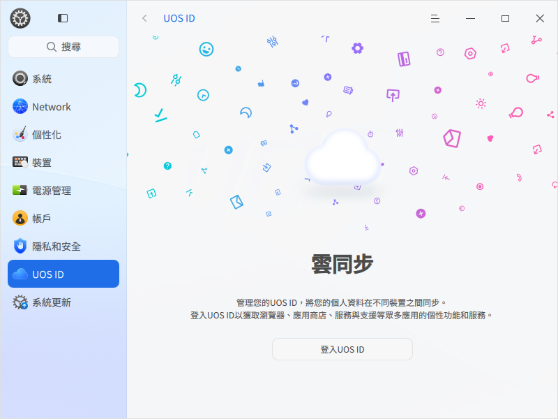

### 系統更新
在更新設定頁面開啟可從倉庫更新類型中的「系統更新」、或「安全更新」後，自動下載、更新提醒才能正常操作。

系統存在更新時會在控制中心側邊欄進行提示，按一下 **系統更新** 進入 **檢查更新** 頁面，按一下 **檢查更新**，檢查完畢後，即可下載和安裝更新。除此之外，在更新設定模組中還可以設定自動下載更新。

>  竅門：如果不需要自動檢查更新，不想收到系統或應用的更新提示，可在「更新設定」中關閉「更新提醒」。

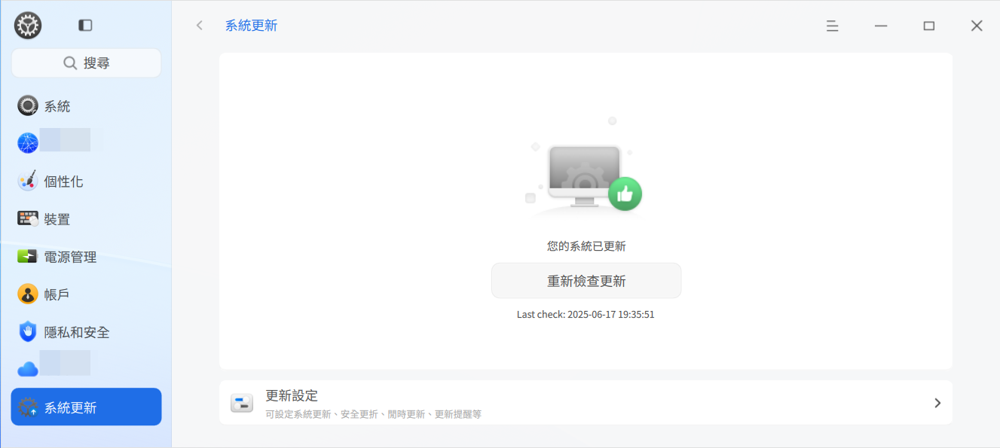

#### 更新和升級
1. 在控制中心側邊欄選擇 **系統更新**。
2. 按一下 **檢查更新/重新檢查更新**，進入檢查系統更新介面。
   - 如果系統沒有更新將會提示「您的系統已經是最新的」。
   - 如果系統存在更新，將顯示 **下載** 按鈕、**更新內容勾選**、下載數據大小和更新詳情。您可以繼續執行步驟 3 和步驟 4。
3. 按一下 **下載** 按鈕，系統將自動開始下載已經勾選的更新內容。
4. 在下載完成後，系統將通知您可以進行更新，您可以在控制中心-更新模組點擊**安裝更新**開始安裝更新檔案。
5. 更新完成後，會出現「更新成功」提示。您可以根據實際需要執行重啟、關機或取消操作。

#### 更新並關機/重啟
在您選擇開始安裝更新後，可以選擇**後台更新、更新並關機、更新並重啟**
- 後台更新：安裝更新的過程在後台完成，不影響目前系統的正常使用
- 更新並關機/重啟：安裝更新的過程呈現模態介面展示安裝進度，這段時間內系統將無法使用，在安裝更新完成後，系統會自動關機/重啟

> 說明：更新並關機/重啟適合在無人值守的時候使用（例如下班的時候)，相較於後台更新也會更加穩定。

#### 更新內容
1. 在控制中心側邊欄選擇 **系統更新**。
2. 檢查更新後，自動顯示可更新內容及版本更新日誌。

>  說明：當只開啟「安全更新」時，系統只會進行安全漏洞和兼容性相關的更新。

#### 更新設定
##### 更新類型
1. 在控制中心側邊欄選擇 **系統更新**。
2. 按一下 **更新設定**。
3. 在**更新類型**區域設定，檢查更新的類型，可選擇功能更新、安全更新和第三方倉庫更新。

##### 高級設定
1. 在控制中心側邊欄選擇 **系統更新**。
2. 按一下 **更新設定**。
3. 打開 **下載限速**。在開啟下載限速後，您可以設定數據下載的速度上限。預設下載速度上限為 10240 KB/s。
4. 打開 **自動下載**。在開啟自動下載後，您可以設定自動下載的時間段。當系統存在更新時，將自動下載數據系統會在規定的時間段內自動下載數據。
5. 打開 更新提醒。在收到更新通知消息提醒您有最新更新。
6. 打開 清除軟體包緩存。可自動清理已下載更新完成的軟體包。

>  竅門：打開 **清除軟體包緩存** 開關，系統會定期自動清理下載軟體包導致的緩存。

#### 查看歷史更新
您可以按一下 **查看歷史更新**，查看所有已安裝的系統版本日誌。

### 系統信息
查看系統版本、版本授權和電腦硬件等信息，以及該系統的一些協議。

#### 關於本機
1. 在控制中心側邊欄選擇 **系統**。
2. 在 **關於本機** 下，您可以：
   - 按一下  修改計算機名。
   - 查看目前系統版本、版本授權、系統安裝時間及電腦硬件資訊。

##### 版本授權
1. 點擊**啟動**進入啟動頁面

2. **啟動方式**分在線啟動（試用期啟動、輸入序號啟動、匯入啟動檔案啟動）和離線啟動。
   1. 試用期啟動
      - 點擊 **試用期啟動**，跳轉到啟動介面。
      - 按一下 **立即啟動**，彈出二次確認框，按一下 **確定**，彈出試用期啟動成功介面。
      - 系統成功啟動後，可以查看啟動狀態、試用到期時間等資訊。
   2. 輸入序號啟動
      - 按一下 **輸入序號**，輸入或複製正確的序號，按一下 **立即啟動**。
      
   3. 匯入啟動檔案啟動
      - 按一下 **匯入啟動檔案**，彈出檔案管理器，選擇 .key 格式的啟動檔案。
      - 
      - 選擇正確的檔案，按一下 **立即啟動**。
      - 在彈出二次確認框中，按一下 **確定**，彈出啟動成功介面。
3. **離線啟動**
   - 網路連接異常時，可使用離線啟動。
   - 選擇輸入序號或匯入授權檔案啟動時，系統檢測網路連接異常，則跳轉到離線啟動介面。
   - 
   - 使用手機掃描二維碼，手機端彈出啟動介面，介面顯示目前機器 ID 及序號。
   - 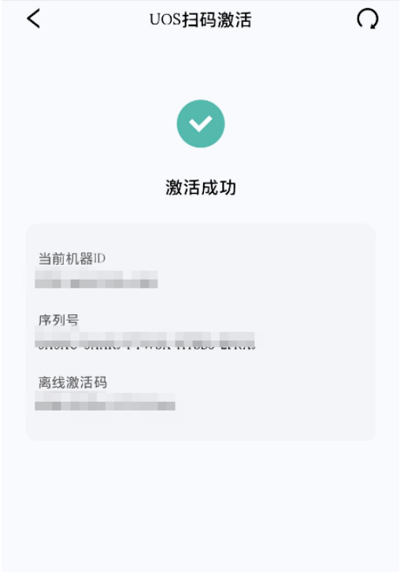
   - 手動將手機端的離線啟動碼輸入電腦端的離線啟動碼輸入框。
   - 
   - 按一下 **離線啟動**，跳轉到啟動成功介面。
4. **啟動成功**
   - 系統啟動成功後，右下角托盤不再顯示授權管理圖示，在「控制中心 > 系統信息 > 關於本機」中，按一下 **查看** 可以查看授權管理資訊。
   - 啟動成功介面包含產品名稱、版本和啟動狀態等資訊，也可以按一下 **查看詳情** 查看更多資訊。
   - 主要資訊如下所示：
     • 產品名稱：操作系統的名稱。
     • 版本：操作系統的版本。
     • 啟動狀態：分為未啟動、過期未啟動、已啟動等。
     • 授權狀態：分為試用期、未授權、已過期、已授權等。
     • 啟動方式：根據實際啟動方式體現。
     • 到期時間：到期時間前 10 天開始，每次開機進入系統，會彈出系統授權即將到期的提示資訊。
     
5. **更換序號**
   - 當系統啟動成功後，由於某些原因需要變更序號。
   - 有且僅當滿足如下條件時，支援更換序號。
     - 僅授權狀態為已啟動時，支援序號更換。
     - 僅授權模式為 OPEN 時，支援序號更換。
   - 更換序號操作步驟如下：
     1. 在啟動詳情介面，按一下 **更換序號**。
     2. 彈出更換序號提示框，按一下 **更換**。
     3. 進入序號啟動介面，輸入新的序號。
     4. 按一下 **立即啟動** 即可更換序號。
6. **啟動失敗**
   - 若啟動檔案已使用或已失效，則會彈出啟動失敗介面。
7. **啟動伺服器設定**
   - 如果目前啟動伺服器出現異常或崩潰了，通過授權管理介面，按一下主功能表中的設定，可以自訂新的啟動伺服器。

#### 開源軟體聲明
1. 在控制中心側邊欄選擇 **系統**。
2. 在 **開源軟體聲明** 下，查看開源軟體聲明。

#### 最終用戶許可協議
1. 在控制中心側邊欄選擇 **系統**。
2. 在 **最終用戶許可協議** 下，查看最終用戶許可協議。

#### 隱私政策
1. 在控制中心側邊欄選擇 **系統**。
2. 在 **隱私政策** 下，查看隱私政策。

### 備份還原
為避免因軟體缺陷、硬件損毀、人為操作不當等因素造成數據缺失或損壞，可以進行應用數據或系統數據的備份還原，以保障系統的正常運行。

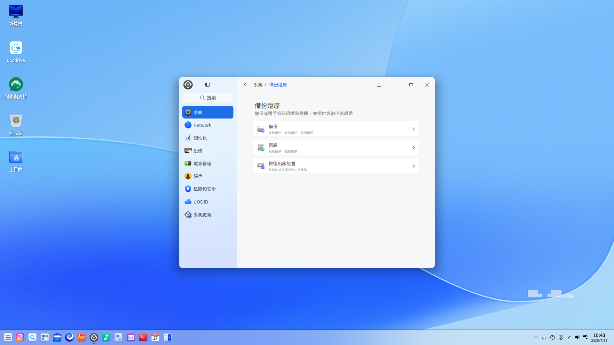

### 啟動菜單
啟動菜單模組管理開機啟動功能設定。

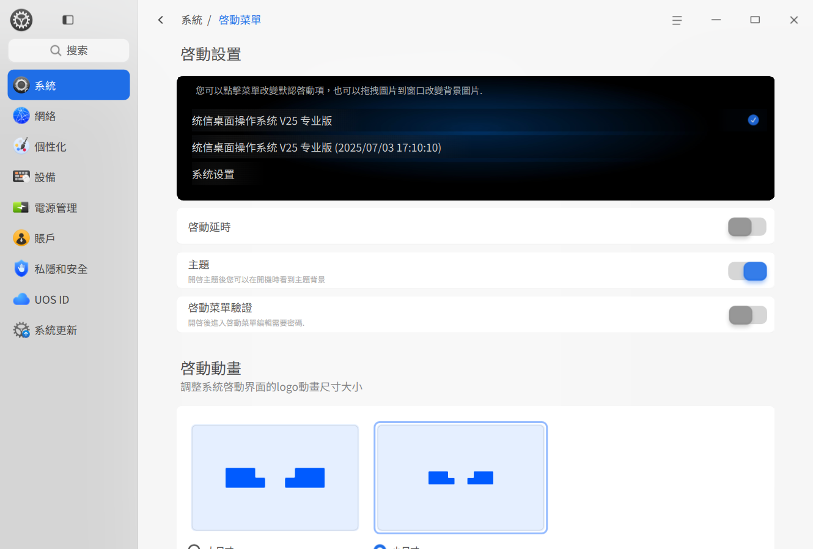

#### 設定啟動菜單
啟動菜單，指的是開機後選擇操作系統的菜單。選擇某一系統後，電腦就會引導進入該操作系統。

>  說明：arm 架構系統僅支援 grub 驗證，mips 架構系統暫不支援 grub 驗證、不支援更換啟動菜單背景圖。

##### 設定啟動延時
「啟動延時」為開啟狀態時，開機後在啟動菜單等待 5 秒鐘，以便您選擇啟動其它操作系統。
「啟動延時」為關閉狀態時，開機後在啟動菜單等待 1 秒鐘。

##### 修改預設啟動項
1. 在控制中心側邊欄選擇 **系統**。
2. 按一下 **啟動菜單**，進入啟動菜單介面。
3. 按一下選中某一菜單項後，彈出授權認證視窗，請輸入密碼授權該項，該項將成為預設啟動項。

##### 啟動動畫
1. 在控制中心側邊欄選擇 **系統**。
2. 按一下 **啟動菜單**，進入啟動菜單介面。
3. 可選擇啟動介面 logo 動畫尺寸為大尺寸/小尺寸。

>  竅門：您也可以把圖片拖曳到預覽視窗，來更換啟動菜單的背景。

##### 主題
1. 在控制中心側邊欄選擇 **系統**。
2. 按一下 **啟動菜單**，進入啟動菜單介面。
3. 開啟主題後，可在開機時看到主題背景。

#### 開發者選項
您可以在此啟動開發者模式，如需安裝和運行未簽名應用，請前往安全中心進行設定。

##### 開發者模式
進入開發者模式您可以使用 root 權限，執行 sudo 操作。系統預設未進入開發者模式。

>  注意：進入開發者模式後的行為可能存在風險，且將不再享有官方保修服務，請謹慎操作。

在控制中心側邊欄選擇 **系統**。選擇 **開發者選項**，按一下 **進入開發者模式** 按鈕，進入開發者模式視窗，您可以：
- 在線啟動
   1. 選擇 **在線啟動**，按一下 **下一步**，在彈出的 UOS ID 登入視窗中，輸入登入資訊。
   2. 彈出免責聲明視窗，仔細閱讀開發者模式免責聲明，了解注意事項後，勾選 **同意並進入開發者模式**，按一下 **確定**。
   3. 在彈出的授權認證視窗中輸入認證資訊。
   4. 認證通過，在彈出的是否重啟對話框中按一下 **現在重啟**，重啟系統後開發者模式生效。
- 離線啟動
   1. 選擇 **離線啟動**，根據提示下載證書，並匯入證書。
   2. 在彈出的授權認證視窗中輸入認證資訊。
   3. 認證通過，在彈出的是否重啟對話框中按一下 **現在重啟**，重啟系統後開發者模式生效。

>  注意：進入開發者模式後不可退出或撤銷。系統所有賬號都將擁有 root 權限。

##### 開發調試選項
進入開發者調試選項後，您可以更改 **系統日誌記錄級別** 配置。

在控制中心側邊欄選擇 **系統**。選擇 **開發者選項**，在 **開發調試選項** 區域，您可以更改 **系統日誌記錄級別** 選項為調試，獲得更詳細的日誌記錄，預設選項為關閉。

#### 域管理
1. 在控制中心側邊欄選擇 **系統**。
2. 按一下 **域管理**，進入域管理介面。
3. 開啟 **域管理**，設定 **域地址**、**埠** 資訊。
4. 按一下 **確定**。

>  說明：amd、arm 架構系統支援域管理設定功能。