# 桌面環境|dde|

## 概觀

深度作業系統 (deepin) 是一款美觀易用、安全可靠的國產桌面作業系統。deepin 預載檔案總管、應用商店、看圖、系統監視器等一系列原生應用。既能體驗豐富多彩的娛樂生活，也可以滿足您的日常工作需求。隨著功能不斷升級完善，深度作業系統已成為國內最受歡迎的桌面作業系統之一。

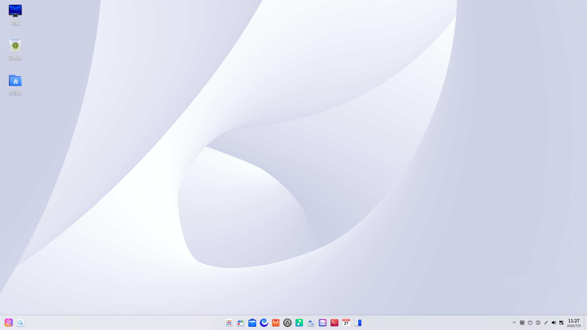

### 系統簡介

初次進入深度作業系統，會自動開啟歡迎程式。您可以觀看影片瞭解系統功能，選擇桌面模式和圖示主題，進一步瞭解該系統。

成功登入系統後，即可體驗 deepin 桌面環境。桌面環境主要由桌面、工作列、啟動器、控制中心和視窗管理器等組成，是您使用該作業系統的基礎。

## 桌面

桌面是登入後看到的主畫面區域。在桌面上可新增檔案/資料夾、排列檔案、開啟終端機、設定桌布和螢幕保護程式等，亦可透過 [傳送到桌面](#设置快捷方式) 向桌面新增應用的捷徑。

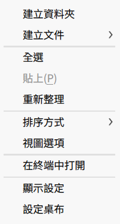

>  說明：在觸控板上，四指/五指向下移動顯示桌面，緊接向上移動隱藏桌面，對應 **Super** + **D** 快捷鍵。

### 新增資料夾/文件

在桌面新增資料夾或文件，也可以對檔案進行一般操作，和在檔案總管中一樣。

- 在桌面上按右鍵，點選 **新增資料夾**，輸入新增資料夾的名稱。
- 在桌面上按右鍵，點選 **新增文件**，選擇新增文件的類型，輸入新增文件的名稱。

在桌面檔案或資料夾上按右鍵，在彈出的選單中主要包含以下功能：

| 功能    | 說明                           |
| ----- | ---------------------------- |
| 開啟方式  | 選定系統預設開啟方式，也可以選擇其他關聯應用程式來開啟。 |
| 壓縮/解壓 | 壓縮檔案或資料夾，或對壓縮檔案進行解壓。         |
| 剪下    | 移動檔案或資料夾。                    |
| 複製    | 複製檔案或資料夾。                    |
| 重新命名   | 重新命名檔案或資料夾。                   |
| 刪除    | 刪除檔案或資料夾。                    |
| 建立連結  | 建立一個捷徑。                    |
| 標記資訊  | 新增標記資訊，以對檔案或資料夾進行標籤化管理。      |
| 屬性    | 檢視檔案或資料夾的基本資訊、分享方式及其權限。      |

>  說明：
> 
> - 當使用觸控螢幕電腦時，在觸控螢幕上長按 1 秒再抬起，即開啟目前物件的右鍵選單。
> - 在觸控板上，兩指點選，顯示右鍵選單。
> - 在鍵盤上按下 **Alt** + **M** 快捷鍵，開啟右鍵選單。

### 設定排列方式

您可以依需求對桌面上的圖示進行排序。

1. 在桌面上按右鍵。
2. 點選 **排序方式**，您可以：
   - 點選 **名稱**，將按檔案的名稱順序顯示。
   - 點選 **修改時間**，檔案將按最近一次的修改日期順序顯示。
   - 點選 **建立時間**，檔案將按建立日期順序顯示。
   - 點選 **大小**，將按檔案大小順序顯示。
   - 點選 **類型**，將按檔案類型順序顯示。

>  竅門：您也可以勾選 **自動排列**，桌面圖示將從上往下、從左往右按目前排序規則排列；有圖示被刪除時，後續圖示會自動向前填補。

### 調整圖示大小

1. 在桌面上按右鍵。
2. 點選 **圖示大小**。
3. 選擇合適的圖示大小。

>  竅門：您也可以用 **Ctrl** + //滑鼠滾輪來調整桌面和啟動器中的圖示大小。

### 設定顯示器

從桌面右鍵選單選擇「顯示設定」，可快速進入控制中心設定顯示器的縮放比例、解析度和亮度等。

1. 在桌面上按右鍵。
2. 點選 **顯示設定**，快速進入控制中心的顯示設定介面。

>  說明：關於顯示的設定，具體操作請參考 [显示设置](#显示设置) 。

### 剪貼簿

剪貼簿展示目前使用者登入系統後複製與剪下的所有文字、圖片和檔案。使用剪貼簿可快速複製其中某項內容。登出或關機後，剪貼簿會自動清空。

在剪貼簿上，可將圖片、檔案類資訊直接拖曳到桌面儲存，也可將文字、字元等資訊拖曳到可編輯文字中。

1. 使用快捷鍵 **Super** + **V** 開啟剪貼簿。
2. 雙擊剪貼簿內的某一區塊，會快速複製目前內容，且目前區塊會移動到剪貼簿頂部。
3. 選擇目標位置貼上。
4. 滑鼠移入剪貼簿的某一區塊，點選上方的  刪除目前內容；點選頂部的 全部清除，清空剪貼簿。

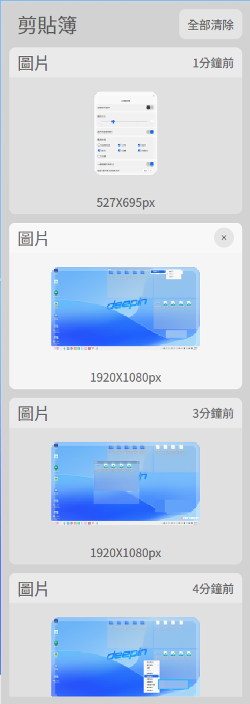

## 工作列

工作列一般是指位於桌面底部的長條，主要由啟動器、應用程式圖示、系統匣、系統外掛程式等組成。在工作列中，可以開啟啟動器、顯示桌面、進入工作區，對其上的應用程式進行開啟、新建、關閉、強制結束等操作，亦可設定輸入法、調整音量、連線網路、檢視行事曆、進入關機介面等。

>  說明：在控制中心「個人化 > 工作列」介面，也可以對工作列的模式、位置、狀態等進行設定。

### 認識工作列圖示

工作列圖示包含啟動器圖示、應用程式圖示、系統匣圖示、系統外掛程式圖示等。

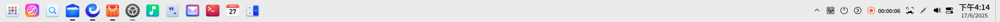

| 圖示                                                                    | 說明                         | 圖示                                                                  | 說明                        |
| --------------------------------------------------------------------- |:-------------------------- | ------------------------------------------------------------------- | ------------------------- |
|                             | 啟動器 - 點選檢視所有已安裝的應用。        |             | 全域搜尋 - 搜尋、查找內容。        |
|       | 多工檢視 - 點選顯示工作區。           |                  | 檔案總管 - 點選檢視磁碟中的檔案、資料夾。   |
|                    | UOS AI Bar - AI 功能場景回應入口。 |              | 瀏覽器 - 點選開啟網頁。             |
|                     | 應用商店 - 搜尋安裝應用軟體。           |                   | 控制中心 - 點選進入系統設定。          |
|                         | 音樂 - 播放音樂應用軟體。             |                      | 文字編輯器 - 檢視和編輯文字檔案的應用軟體。    |
|                          | 郵件 - 編輯、管理與傳送電子郵件的應用軟體。     |                    | 終端機 - 終端機模擬器。               |
|                         | 行事曆 - 檢視日期、管理行程的應用軟體。        |                  | 計算機 - 標準、科學型和程式設計師型桌面計算機工具。 |
|                            | 通知中心 - 顯示所有系統與應用的通知。       |                                    | 螢幕小鍵盤 - 點選使用虛擬鍵盤。          |
|  | 快捷設定面板 - 快捷設定系統功能。           |  | 關機 - 點選進入關機介面。            |

### 切換顯示模式

工作列提供兩種顯示模式：傳統模式和效率模式，顯示不同的圖示大小和應用視窗啟用效果。

您可以透過以下操作切換顯示模式：

1. 右鍵工作列。
2. 在 **模式** 子選單中選擇一種顯示模式。

### 設定工作列位置

您可以將工作列放置在桌面的任意方向。

1. 右鍵工作列。
2. 在 **位置** 子選單中選擇一個方向。

### 調整工作列高度

拖曳工作列邊緣，改變工作列高度。

### 停用自由調節
開啟「停用自由調節」後，可鎖定工作列高度，避免誤拖曳而改變工作列大小。
1. 右鍵工作列
2. 開啟或關閉 **停用自由調節** 開關。

### 顯示/隱藏工作列

工作列可隱藏，以便最大程度擴展桌面的可操作區域。

1. 右鍵工作列。
2. 在 **狀態** 子選單中您可以：
   - 選擇 **一直顯示**，工作列將會一直顯示在桌面上。
   - 選擇 **一直隱藏**，工作列將會隱藏起來，只有在滑鼠移至工作列區域時才會顯示。
   - 選擇 **智能隱藏**，當佔用工作列區域時，工作列自動隱藏。

>  說明：在觸控螢幕電腦上，當工作列設定為「智能隱藏」或「一直隱藏」時：
> 
> - 如果工作列在底部，在螢幕邊緣從下往上滑入，喚出工作列；
> - 如果工作列在頂部，在螢幕邊緣從上往下滑入，喚出工作列；
> - 如果工作列在左側，在螢幕邊緣從左往右滑入，喚出工作列；
> - 如果工作列在右側，在螢幕邊緣從右往左滑入，喚出工作列。

### 顯示/隱藏外掛程式

1. 右鍵工作列。
2. 點選 **工作列設定** 進入控制中心「個人化 > 工作列」介面。
3. 在外掛程式區域勾選或取消勾選 **回收站**、**系統監視器**、**關機**、**顯示桌面**、**螢幕小鍵盤**、**通知中心**、**時間**、**螢幕擷取/錄影** 等外掛程式，可設定這些外掛程式在工作列上的顯示或隱藏效果。

### 檢視通知訊息

當有系統或應用通知時，桌面上方會彈出通知訊息。若有按鈕，點選按鈕執行對應操作；若無按鈕，點選關閉此訊息。

此外，亦可點選工作列上的 ，開啟通知中心，檢視所有通知。
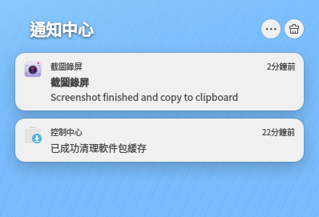

>  說明：當使用觸控螢幕電腦時，手指從螢幕右側邊緣滑入超過工作列高度，喚出通知中心。

### 檢視日期時間

- 滑鼠指標暫留在工作列時間上，可檢視目前日期、星期和時間。
- 點選時間，開啟行事曆外掛程式。

### 進入關機介面

點選工作列上的  進入關機介面，或在啟動器的精簡模式中點選  進入關機介面。

| 功能                                                                 | 說明                                   |
| ------------------------------------------------------------------ | ------------------------------------ |
| 關機                | 關閉電腦。                                |
| 重新開機                    | 重新啟動電腦。                       |
| 睡眠                  | 系統將處於低耗電運轉狀態。                     |
| 休眠                        | 沒有 swap 分割區不顯示此項；有 swap 分割區的電腦休眠會儲存到硬碟。 |
| 鎖定                        | 鎖定電腦，按下快捷鍵 **Super** + **L** 鎖定。     |
| 切換使用者          | 選擇另一個使用者帳戶登入。                         |
| 登出                    | 清除目前登入使用者的資訊。                         |
| 系統監視器 | 快速啟動系統監視器。                           |

&nbsp;&nbsp;&nbsp;&nbsp;&nbsp;&nbsp;&nbsp;&nbsp;&nbsp;&nbsp;&nbsp;&nbsp;&nbsp;

>  說明：當系統存在多個帳戶時才顯示 **切換使用者** 。

### 回收站

回收站會暫存電腦中被刪除的檔案，您也可以選擇還原或清空這些檔案。

#### 還原檔案

暫時被刪除的檔案，可在回收站中還原，或使用快捷鍵 **Ctrl** + **Z** 還原剛刪除的檔案。

1. 在回收站中選擇要還原的檔案。
2. 右鍵檔案，選擇 **還原**。
3. 檔案將還原至原本的儲存路徑。

>  注意：若原本所在的資料夾已被刪除，還原檔案時會自動建立資料夾。

#### 刪除檔案

回收站中可以單獨清除某一檔案。

1. 在回收站中選擇要刪除的檔案。
2. 右鍵檔案，選擇 **刪除**，即可刪除回收站中的檔案。

#### 清空回收站

在回收站中點選 **清空**，將永久刪除回收站的所有內容。

## 啟動器

啟動器  可管理系統中所有已安裝的應用程式。在啟動器中使用分類導覽或搜尋功能，可快速找到需要的應用程式。

在啟動器中可檢視新安裝的應用程式；新安裝應用旁會出現小藍點提示。

>  說明：在觸控板上，四指點選可顯示/隱藏啟動器，對應 **Super** 快捷鍵。

### 切換模式

啟動器有全螢幕和精簡兩種模式。點選啟動器介面右上角的圖示切換模式。

兩種模式均支援搜尋應用程式、設定捷徑等操作。

精簡模式亦支援快速開啟檔案總管、控制中心和進入關機介面等功能。

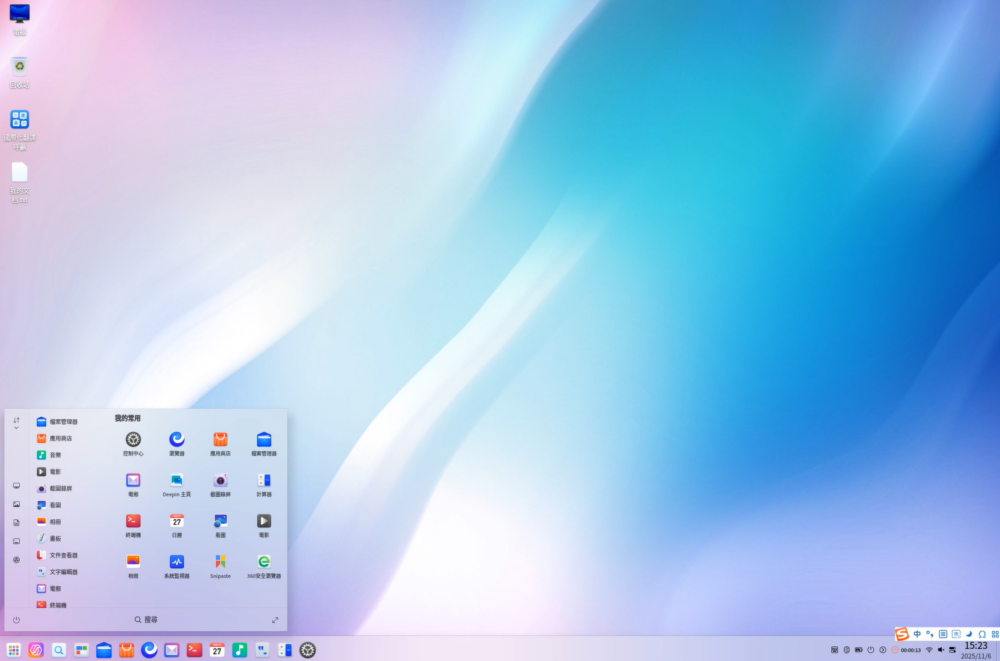

### 排列應用程式

在精簡模式下，系統預設 **自由排序**：新安裝的應用置頂，並按使用頻率排序。同時支援切換以下排序方式：

- **按分類**：依應用類型排序。
- **按名稱**：依應用名稱首字母排序。

### 尋找應用程式

在啟動器中，您可以捲動滑鼠滾輪或切換分類導覽來尋找應用程式。

若知道應用名稱，直接在搜尋框輸入關鍵字或首字母縮寫，即可快速定位到需要的應用程式。

### 設定捷徑

捷徑提供一種簡單快速的方式啟動應用程式。

#### 建立捷徑

將應用程式傳送到桌面或工作列，方便後續操作。

在啟動器中右鍵應用程式圖示，您可以：

- 點選 **发送到桌面**，在桌面建立捷徑。

- 點選 **发送到工作列**，將應用程式釘選到工作列。

>  說明：您也可以從啟動器拖曳應用程式圖示到工作列。但當應用程式處於執行狀態時將無法拖曳釘選；此時您可右鍵工作列上的應用程式圖示，選擇 **驻留** 釘選到工作列，以便下次從工作列快速開啟。

#### 刪除捷徑

您可以在桌面直接刪除應用捷徑，也可以在工作列和啟動器中刪除。

**從工作列刪除**

- 在工作列上按住滑鼠左鍵不放，將應用圖示拖曳到工作列以外的區域移除捷徑。
- 右鍵工作列上的應用程式圖示，選擇 **移除驻留** 將應用從工作列移除。

**從啟動器刪除**

在啟動器中右鍵應用程式圖示，您可以：

- 點選 **从桌面上移除**，刪除桌面捷徑。
- 點選 **从工作列上移除**，移除釘選在工作列上的應用程式。

>  說明：以上操作只能刪除應用程式捷徑，不會解除安裝應用程式。

### 安裝應用程式

若啟動器中沒有您需要的應用程式，可在應用商店一鍵下載安裝。

### 執行應用程式

對於已建立桌面捷徑或釘選到工作列的應用程式，您可以透過以下方式開啟：

- 雙擊桌面圖示，或右鍵桌面圖示選擇 **開啟**。
- 直接點選工作列上的應用程式圖示，或右鍵工作列上的應用程式圖示選擇 **開啟**。

在啟動器中，直接點選應用程式圖示開啟，或右鍵應用程式圖示選擇 **開啟**。

>  竅門：對於經常使用的應用程式，您可以在啟動器中右鍵應用程式圖示選擇 **開機自動啟動**。

### 解除安裝應用程式

對於不再使用的應用程式，您可以解除安裝以節省硬碟空間。

1. 在啟動器中右鍵應用程式圖示。
2. 點選 **卸載**。

>  說明：部分系統應用程式無法解除安裝。

## 控制中心

深度作業系統透過控制中心管理系統的基本設定，包含帳戶管理、網路設定、時間日期設定、個人化設定、顯示設定、系統升級等。進入桌面環境後，點選工作列上的  即可開啟控制中心視窗。

### 首頁介紹

控制中心首頁主要展示各個設定模組，方便日常檢視與快速設定。

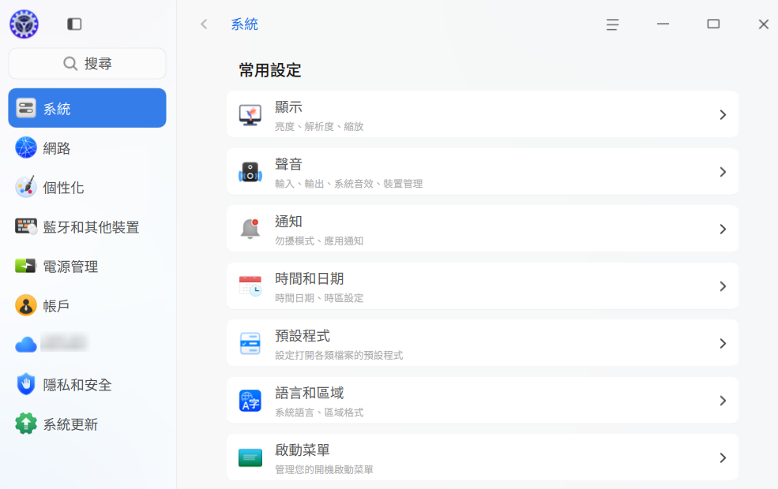

開啟控制中心的某一設定模組後，可透過左側導覽列快速切換至其他設定模組。

#### 標題列

標題列包含返回按鈕、搜尋方塊、主選單及視窗按鈕。

- 返回按鈕 ：點選即可返回上一層級。
- 麵包屑導覽：點選返回對應頁面層級。
- 搜尋方塊：輸入關鍵字後按 Enter，搜尋相應設定。
- 主選單：點選開啟主選單。於主選單中可設定視窗主題、檢視版本或結束控制中心。

### 系統

#### 顯示

設定顯示器的亮度、解析度、螢幕方向以及縮放倍數等，讓您的電腦顯示達到最佳狀態。

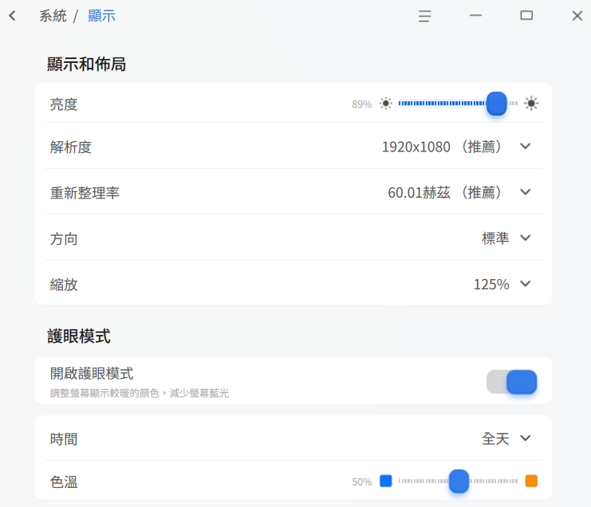

##### 單一顯示器

當顯示器為單一顯示器時，可調整亮度、解析度、重新整理率、顯示方向等。

**調整亮度**

當裝置或配置支援亮度調節功能時，才會顯示亮度模組，您可以進行以下操作：

1. 在控制中心側邊欄選擇 **系統**，點選 **顯示**。
2. 在亮度區域，拖曳亮度滑桿調整螢幕亮度。

**設定螢幕縮放**

當桌面與視窗顯示過大或過小時，您可能需要調整螢幕縮放，以便正常顯示。

1. 在控制中心側邊欄選擇 **系統**，點選 **顯示**。
2. 點選下拉式選單，選擇縮放倍數。
3. 登出後重新登入系統，螢幕縮放設定即可生效。

>  說明：
> 
> - 偵測到高解析度螢幕時，會自動調整縮放倍數。
> - 部分應用程式不支援螢幕縮放，您可以在啟動器中右鍵該應用程式，選擇 **禁用屏幕缩放**，以獲得更好的顯示效果。

**變更解析度**

1. 在控制中心側邊欄選擇 **系統**，點選 **顯示**。
2. 在解析度區域的下拉清單中選擇合適的解析度。
3. 點選 **保存**。

**設定桌面顯示**

當顯示卡支援桌面顯示功能且解析度設定為非建議解析度時，您可以進行以下操作：

1. 在控制中心側邊欄選擇 **系統**，點選 **顯示**。
2. 在桌面顯示區域的下拉清單中選擇合適的桌面顯示效果。

**設定螢幕重新整理率**

1. 在控制中心側邊欄選擇 **系統**，點選 **顯示**。
2. 在重新整理率區域的下拉清單中，選擇合適的重新整理率。
3. 點選 **保存**。

**變更螢幕方向**

1. 在控制中心側邊欄選擇 **系統**，點選 **顯示**。
2. 在方向區域的下拉清單中，選擇合適的方向參數。
3. 點選 **保存**。

**設定護眼模式**

當裝置或配置支援護眼功能時，才會顯示護眼模組，您可以進行以下操作：

1. 在控制中心側邊欄選擇 **系統**，點選 **顯示**。
2. 在 **護眼模式** 區域，您可以：
   - 開啟 **護眼模式** 開關，進入護眼模式。
   - 設定護眼模式生效時間：於時間區域在下拉選單中選擇生效時間，包含「全天」、「日落到日出」、「自定义」，預設為「全天」。
   - 設定護眼色溫：於色溫區域拖曳色溫滑桿調整螢幕色溫。

##### 多重顯示器

多螢幕顯示可延伸視野。使用 VGA、HDMI、DP 等線材連接電腦與另一台顯示器、投影機等後，電腦上的內容即可同時在多個螢幕中顯示。當電腦連接另一台顯示裝置後，才會出現多螢幕顯示模式設定模組。

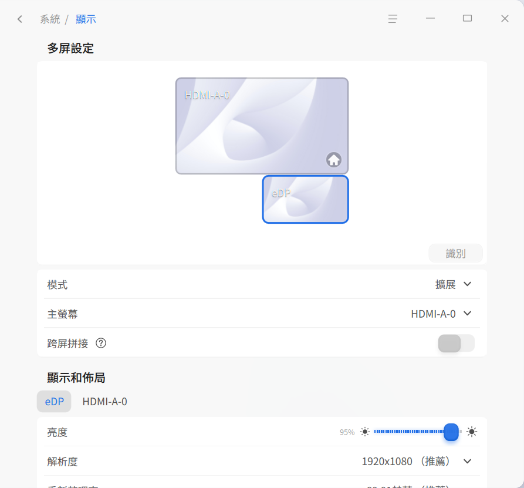

1. 在控制中心側邊欄選擇 **系統**，點選 **顯示**。
2. 在多螢幕設定區域，於 **模式** 下拉選單選擇顯示模式：
   - **複製**：將主螢幕內容複製到其他螢幕。
   - **擴展**：將主螢幕內容延伸到其他螢幕，擴大桌面區域。
   - **仅在xxx显示**：僅在某個螢幕顯示內容。

多螢幕複製或擴展模式時，點選識別後，多個螢幕中央會顯示螢幕名稱。

多螢幕擴展模式時，集合視窗會將其他螢幕的設定視窗集中顯示在該螢幕中心位置。

- 主螢幕集合視窗：主螢幕設定視窗置於底層，副螢幕視窗位於其上方。
- 副螢幕集合視窗：目前副螢幕設定視窗置於頂層，主螢幕設定視窗置於底層。

>  說明：多螢幕擴展模式時，在控制中心「個人化 > 工作列」介面中的多螢幕顯示設定區域，工作列設定包含 **仅主屏显示**、**跟随滑鼠位置显示** 兩個互斥選項。

在多螢幕環境下，按下快捷鍵 **Super** + **P** 可呼出多螢幕顯示模式的 OSD，操作如下：

1. 按住 **Super** 不放，再按下 **P**，或以滑鼠點選以進行模式選擇。
2. 放開按鍵，確認選擇後模式生效。

>  說明：多螢幕顯示時，副螢幕也支援桌面圖示顯示、右鍵選單操作等功能。

多螢幕下亮度、色溫、螢幕縮放、解析度、重新整理率、方向等設定方式與單一顯示器相同，詳細操作請參考 [单屏设置](#单屏设置)。

#### 聲音

設定輸入/輸出裝置的音效（例如喇叭、麥克風），讓您聽得更舒適、錄音更清晰。

##### 輸出設定

1. 在控制中心側邊欄選擇 **系統**，點選 **聲音**。
2. 進入音效裝置配置介面後，您可以進行輸出設定：
   - 透過拖曳滑桿調整輸出音量及左/右聲道平衡。
   - 開啟 **音量增强**，音量可調整區間由 0~100% 變更為 0~150%。
   - 開啟 **单声道音频**，輸出聲音會將左、右聲道合併為單一聲道。
   - 開啟 **插拔管理**，外接裝置拔除時音訊輸出會自動暫停。
   - 在輸出裝置後的下拉選單中選擇輸出裝置類型。

##### 輸入設定

1. 在控制中心側邊欄選擇 **系統**，點選 **聲音**。
2. 進入音效裝置配置介面後，您可以進行輸入設定：
   - 透過拖曳滑桿調整輸入音量。
   - 開啟啟用開關後，還可以設定 **噪音抑制** 功能。
   - 在輸入裝置後的下拉選單中選擇輸入裝置類型。

>  竅門：通常需要調大輸入音量，確保能收錄聲源，但音量不宜過大，否則會導致失真。可對著麥克風以正常說話音量說話並觀察回饋音量變化；變化明顯則表示輸入音量合適。

##### 系統音效

1. 在控制中心側邊欄選擇 **系統**，點選 **聲音**。
2. 點選 **系統音效**，勾選選項以開啟某一事件發生時的音效。

>  竅門：您可以單擊播放按鈕試聽音效。

##### 裝置管理

1. 在控制中心側邊欄選擇 **系統**，點選 **聲音**。
2. 點選 **裝置管理**，啟用/停用輸入裝置、輸出裝置。

#### 通知

設定勿擾模式，並可開啟或關閉某些應用程式的通知顯示。

##### 設定系統通知

設定系統通知的勿擾模式。

1. 在控制中心側邊欄選擇 **系統**。

2. 點選 **通知**，進入系統通知介面。
   
   - 開啟或關閉勿擾模式。
     開啟勿擾模式後，可以設定勿擾模式的開始與結束時間；亦可設定 **在屏幕锁屏时** 顯示通知。勿擾模式會讓所有通知靜音，但您仍可在通知中心檢視所有訊息。

##### 設定應用通知

自訂各應用程式的通知顯示方式。

1. 在控制中心側邊欄選擇 **系統**，點選 **应用通知**。
2. 在應用通知區域選擇一個應用程式並開啟後，您可以選擇：
   - 開啟/關閉通知提示音
   - 在通知中心或桌面顯示
   - 是否顯示訊息預覽

#### 時間與日期

選擇正確時區後，電腦即可顯示所在地的時間與日期，也可手動修改時間與日期。

##### 修改時間與日期

預設情況下，系統會透過網路自動同步該時區的本機時間與日期。您也可以關閉自動同步，改為手動設定。

1. 在控制中心側邊欄選擇 **系統**，點選 **时间和日期**。
2. 關閉 **自动同步配置**。
3. 手動設定正確的時間與日期。
4. 點選 **确定**。

>  說明：您也可以開啟 **自动同步配置** 並設定伺服器同步參數；亦可新增其他時區伺服器位址以進行自動同步。

##### 修改時區

安裝系統時已選擇系統時區。若要修改系統時區，請依以下步驟設定：

1. 在控制中心側邊欄選擇 **系統**，點選 **时间和日期**。
2. 點選 **修改系統时区**，透過搜尋下拉選單選擇時區。

##### 新增時區

您可以同時使用多個時區，以便檢視其他時區的時間。

1. 在控制中心側邊欄選擇 **系統**，點選 **时间和日期**。
2. 點選時區清單中的 **添加** 按鈕，透過搜尋選擇時區。
3. 點選 **添加**。

##### 刪除時區

1. 在控制中心側邊欄選擇 **系統**，點選 **时间和日期**。
2. 點選時區清單後方的 **删除** 按鈕，刪除已新增的時區。

#### 語言與地區

系統語言預設為安裝時所選語言，可隨時更改。您也可以在語言清單中新增多種語言，方便切換。

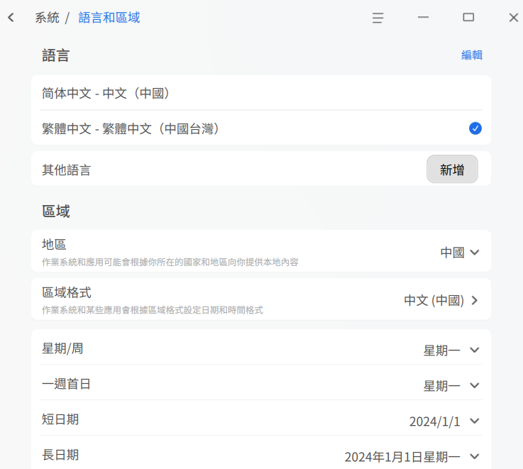

##### 新增系統語言

您可以新增多種語言到系統語言清單，以便切換系統語言。

1. 在控制中心側邊欄選擇 **系統**。
2. 點選 **语言和区域**，進入系統語言介面。
3. 點選 **添加** 按鈕進入語言清單。
4. 選擇語言後，該語言會自動新增到系統語言清單。

##### 設定系統語言

1. 在控制中心側邊欄選擇 **系統**。
2. 點選 **语言和区域**，進入系統語言介面。
3. 選擇要切換的語言，系統將自動開始安裝語言套件。
4. 語言套件安裝完成後，需要登出再登入以使設定生效。

>  注意：更改系統語言後，鍵盤配置可能也會改變。重新登入時，請確認使用正確的鍵盤配置輸入密碼。

##### 地區

1. 在控制中心側邊欄選擇 **系統**。
2. 點選 **语言和区域**，進入地區設定介面。
3. **地区** 初始化設定後可調整地區設定；系統會依地區提供輸入法、鍵盤配置與格式建議。透過下拉選單切換地區。
4. **区域和格式** 可於初始化設定後調整；依所選地區提供對應習慣格式，例如日期顯示、貨幣符號及數字格式。選擇後點選 **保存** 以保留切換結果。
5. 目前 **格式** 顯示設定可透過設定時間、日期格式，調整工作列顯示時間格式。

#### 預設程式

當安裝了多個功能相似的應用程式時，可透過右鍵選單或控制中心，為某一類型的檔案指定預設開啟程式。

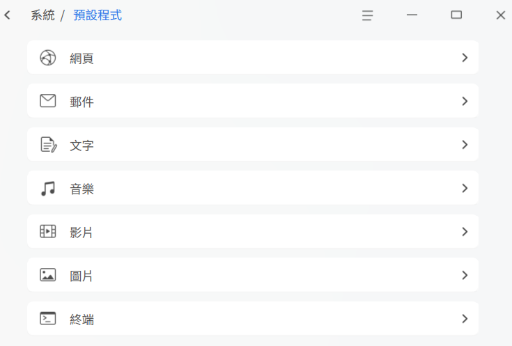

##### 設定預設程式

1. 右鍵檔案，選擇 **開啟方式** > **选择默认程序**。
2. 選擇一個應用程式，系統會自動勾選「設為預設」，點選 **确定**。
3. 該應用程式會自動新增到控制中心的預設程式清單。

##### 變更預設程式

1. 在控制中心側邊欄選擇 **系統**，點選 **默认程序**。
2. 選擇一個檔案類型以進入預設程式清單。
3. 在清單中選擇另一個應用程式。

##### 新增預設程式

1. 在控制中心側邊欄選擇 **系統**，點選 **默认程序**。
2. 選擇檔案類型以進入預設程式清單。
3. 點選清單下方的 **添加默认程序** 按鈕 **添加**，選擇 desktop 檔案（一般位於 /usr/share/applications），或特定二進位檔案。
4. 將程式新增到程式清單並勾選該程式，即可設定為預設程式。

##### 刪除預設程式

在預設程式清單中，您只能刪除自己新增的應用程式，無法刪除系統已安裝的應用程式。若要移除系統已安裝的應用程式，只能解除安裝；解除安裝後該應用程式會自動從預設程式清單移除。

刪除自己新增的預設程式可依下列方式操作：

1. 在控制中心側邊欄選擇 **系統**，點選 **默认程序**。
2. 選擇檔案類型進入預設程式清單。
3. 點選程式後方的  以刪除預設程式。

#### 開機選單

開機選單模組用於管理開機啟動相關設定。

##### 設定開機選單

開機選單是指開機後用於選擇作業系統的選單。選擇某一系統後，電腦就會引導進入該作業系統。

>  說明：arm 架構系統僅支援 grub 驗證，mips 架構系統暫不支援 grub 驗證，也不支援更換開機選單背景圖。

**修改預設啟動項目**

1. 在控制中心側邊欄選擇 **系統**。
2. 點選 **启动菜单**，進入開機選單介面。
3. 點選某一選單項目後，會彈出授權驗證視窗；輸入密碼授權後，該項目即成為預設啟動項目。

**設定開機延遲**

「启动延时」為開啟狀態時，開機後會在開機選單等待 5 秒，以便您選擇啟動其他作業系統。
「启动延时」為關閉狀態時，開機後會在開機選單等待 1 秒。

**佈景主題**

1. 在控制中心側邊欄選擇 **系統**。
2. 點選 **启动菜单**，進入開機選單介面。
3. 開啟佈景主題後，開機時會顯示佈景主題背景。

>  竅門：您也可以將圖片拖曳到預覽視窗，以更換開機選單背景。

##### 開機動畫

1. 在控制中心側邊欄選擇 **系統**。
2. 點選 **启动菜单**，進入開機選單介面。
3. 可選擇開機介面 logo 動畫尺寸為大尺寸/小尺寸。

#### 開發者選項

##### 開發調試選項

進入開發者模式後，您可以更改 **系統日志记录级别** 配置。

在控制中心側邊欄選擇 **系統**，點選 **开发者选项**；在 **开发调试选项** 區域，您可以將 **系統日志记录级别** 設為調試以取得更詳細的日誌記錄，預設為關閉。

#### 備份還原

為避免因軟體缺陷、硬體損毀、人為操作不當等因素造成資料缺失或損壞，可進行應用資料或系統資料的備份還原，以保障系統正常運作。

#### 關於本機

1. 在控制中心側邊欄選擇 **系統**。

2. 在 **关于本机** 下，您可以：
   
   - 點選  修改電腦名稱。
   
   - 檢視目前系統版本、授權、安裝時間及硬體資訊。

#### 開源軟體聲明

1. 在控制中心側邊欄選擇 **系統**。

2. 在 **开源软件声明** 下，檢視開源軟體聲明。

#### 最終使用者授權合約

1. 在控制中心側邊欄選擇 **系統**。
2. 在 **最终用户许可协议** 下，檢視最終使用者授權合約。

#### 隱私權政策

1. 在控制中心側邊欄選擇 **系統**。
2. 在 **隐私政策** 下，檢視隱私權政策。

### 網路

登入系統後，您需要連線網路，才能收發郵件、瀏覽新聞、下載檔案、聊天、網路購物等。

>  竅門：您可點選工作列的快捷面板，設定並檢視目前網路狀態。

#### 有線網路

有線網路安全、快速且穩定，是最常見的連線方式。設定好路由器後，將網路線兩端分別插入電腦與路由器即可連線。

1. 將網路線插入電腦的網路插孔。
2. 將網路線另一端插入路由器或網路端口。
3. 在控制中心側邊欄選擇 **网络**。
4. 點選 **有线网络**，進入有線網路設定介面。
5. 開啟 **有线网卡**，啟用有線網路連線。
6. 連線成功後，桌面上方會彈出「已连接有线连接」提示訊息。

您也可以在有線網路設定介面中編輯或建立有線網路設定。

#### 無線網路

無線網路讓您擺脫線材束縛，上網更靈活，並支援更多裝置。

##### 連線無線網路

1. 在控制中心側邊欄選擇 **网络**。
2. 點選 **无线网络**，進入無線網路設定介面。
3. 開啟 **无线网卡**，啟用無線網路連線。
4. 電腦會自動搜尋並顯示附近可用的無線網路。
5. 選擇要連線的無線網路。
   - 若為開放網路，將自動連線。
   - 若為加密網路，請依提示輸入密碼並點選 **连接**，系統會自動完成連線。

##### 連線隱藏網路

若您在路由器中隱藏無線網路，需手動連線隱藏網路才能上網。

1. 在控制中心側邊欄選擇 **网络**。
2. 點選 **无线网络**，進入無線網路設定介面。
3. 點選 **连接到隐藏网络**。
4. 輸入網路名稱 SSID 與其他必填選項。
5. 點選 **保存**。

#### 個人熱點

透過個人熱點將電腦網路訊號轉為無線熱點，供一定距離內的其他裝置連線。要啟用無線熱點，電腦需具備支援熱點功能的無線網卡。

1. 在控制中心側邊欄選擇 **网络**。
2. 點選 **个人热点**。
3. 開啟 **热点** 開關並設定熱點資訊。
4. 點選 **保存**。

#### 飛航模式

開啟飛航模式可停用無線網路、個人熱點與藍牙。除了在控制中心，您也可在工作列快捷面板中點選飛航模式開關以開啟或關閉。

1. 在控制中心側邊欄選擇 **网络**。
2. 點選 **飞行模式**。
3. 開啟開關以啟用飛航模式。

> 注意：若電腦沒有無線網卡也沒有藍牙模組，系統不會顯示飛航模式相關介面。

#### 撥號網路

撥號上網（DSL）是透過本地電話撥號連線網路的方式。設定好數據機後，使用網路線連接數據機與電腦，再建立寬頻撥號連線並輸入業者提供的帳號與密碼，即可連線至 Internet。

##### 新增撥號連線

1. 在控制中心側邊欄選擇 **网络**。
2. 點選 **DSL**，並點選 **创建PPPoE连接** 按鈕。
3. 輸入寬頻名稱、帳戶、密碼。
4. 點選 **保存**，系統會自動建立寬頻連線並嘗試連線。

#### VPN

VPN（虛擬專用網路）可在公用網路上建立專用網路並加密通訊。無論您在外出差或居家辦公，只要能上網即可透過 VPN 存取企業內網資源；也可使用 VPN 加速存取其他國家網站。

1. 在控制中心側邊欄選擇 **网络**。
2. 點選 **VPN**，選擇 **添加 VPN** 或 **导入 VPN**。
3. 選擇 VPN 協議類型，並輸入名稱、閘道、使用者名稱、密碼等資訊。（匯入 VPN 會自動填入資訊）
4. 點選 **保存**，系統會自動嘗試連線 VPN。
5. 您也可以匯出 VPN 設定以備用或分享給其他使用者。

>  說明：開啟 **仅用于相对应的网络上的资源** 後，可不將 VPN 設為預設路由，僅在特定網路資源上生效。

#### 系統代理

1. 在控制中心側邊欄選擇 **网络**。
2. 點選 **系統代理**，進入系統代理介面。
3. 開啟系統代理，在代理類型下拉選單選擇 **手动** 或 **自动**：
   - **手动**：需配置代理伺服器位址、連接埠等資訊。
   - **自动**：需配置 URL，系統會自動取得代理伺服器資訊。
4. 點選 保存。

#### 網路詳情

在網路詳情介面中，您可以檢視 MAC 位址、IP 位址、閘道及其他網路資訊。

1. 在控制中心側邊欄選擇 **网络**。
2. 點選 **网络详情**，進入網路資訊介面。
3. 檢視目前有線或無線網路資訊。

### 個人化

控制中心的個人化模組提供通用外觀設定，包含系統主題、活動用色、字型、視窗特效與不透明度等，改變桌面與視窗外觀；亦可設定圖示主題、游標主題與字型。

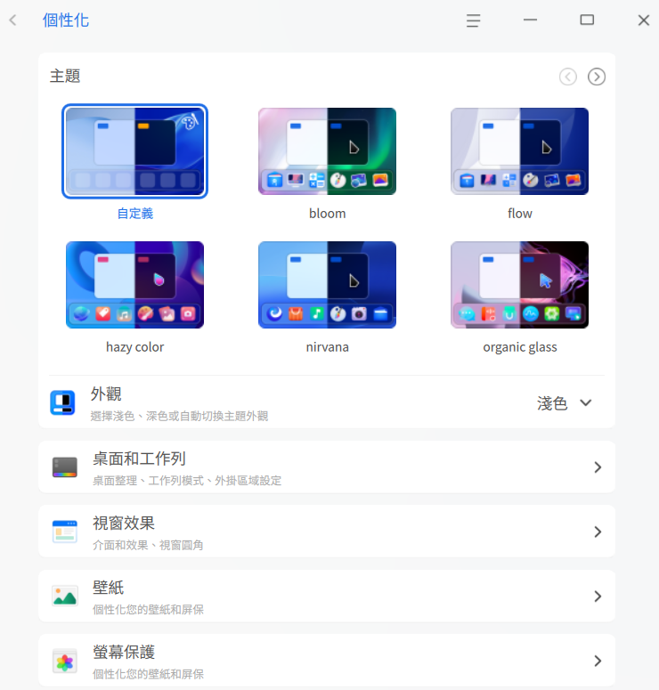

#### 設定視窗主題

1. 在控制中心側邊欄選擇 **個人化**。
2. 點選 **主题**，選擇一種系統主題。
3. 該主題即為系統主題。

#### 外觀

外觀用於調整主題的淺色/深色模式。

1. 在控制中心側邊欄選擇 **個人化**。
2. 點選 **通用**。
3. 點選 **外观** 選擇框選擇模式，可選 **浅色、深色** 或 **自动**；自動模式會依日出、日落時間切換深淺外觀。

>  說明：自動外觀會依目前時區時間，根據日出日落自動更換視窗主題。日出後為淺色，日落後為深色。

#### 桌面與工作列設定

在「個人化 > 桌面和工作列」介面，可設定工作列模式、位置、狀態等。

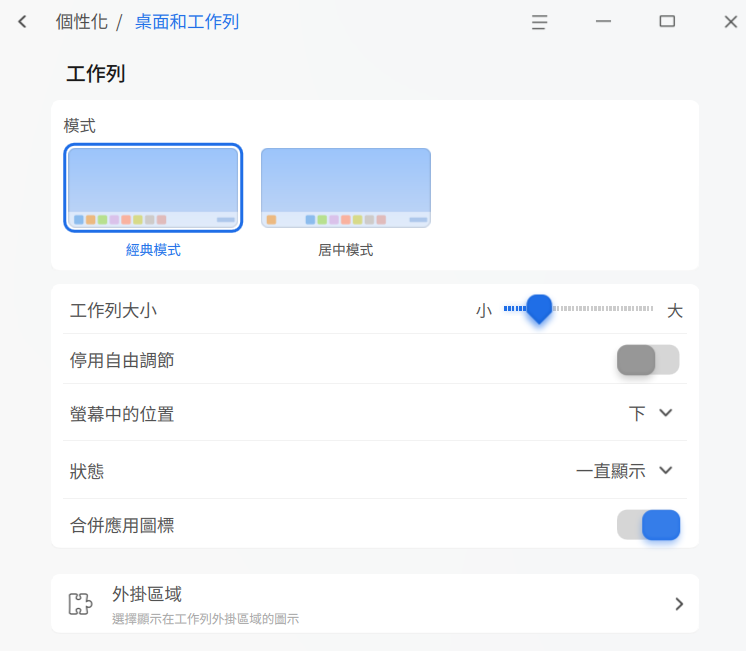

1. 在控制中心側邊欄選擇 **個人化**。
2. 點選 **桌面和工作列** 進入設定介面後，您可以：
   - 選擇工作列模式為傳統模式或效率模式。
   - 拖曳工作列大小滑桿調整工作列大小。
   - 開啟或關閉 **停用自由調節**，鎖定工作列高度，避免誤拖曳改變工作列大小。
   - 設定位置為上、下、左或右。
   - 設定顯示狀態為一直顯示、一直隱藏或智能隱藏。
   - 開啟或關閉**合併應用圖標**，設定同一應用程式的多個視窗是否合併為一個工作列圖標顯示。
   - 在外掛程式區域勾選或取消勾選外掛程式，設定其顯示/隱藏。

多螢幕擴展模式時，工作列位置可設定為跟隨滑鼠位置顯示，或僅主螢幕顯示。

#### 視窗效果

視窗效果表現與硬體效能相關。您可切換不同視窗效果，以獲得最佳操作體驗。

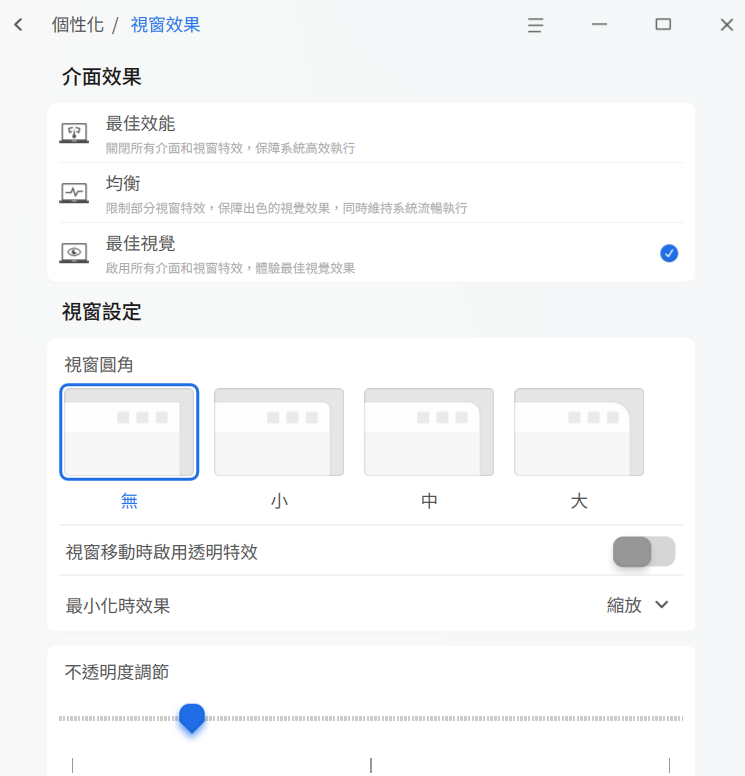

1. 在控制中心側邊欄選擇 **個人化**。
2. 點選 **窗口效果** 進入設定介面後，您可以：
   - **界面效果** 選擇 **最佳性能**：關閉所有介面與視窗特效，保障系統高效運行。
   - **界面效果** 選擇 **均衡**：限制部分特效，兼顧視覺效果與流暢度。
   - **界面效果** 選擇 **最佳视觉**：啟用所有介面與視窗特效，提供最佳視覺體驗。
   - 視窗圓角：可選 無、小、中、大。
   - 視窗移動透明特效：可開啟或關閉；開啟後移動視窗會觸發透明特效。
   - 視窗最小化效果：可切換 **缩放** 或 **魔灯**。
   - 工作列、啟動器（精簡模式）不透明度：滑桿越靠左越透明，越靠右越不透明。
   - 捲動軸顯示方式：可選捲動時顯示或一直顯示。
   - 標題列高度：拖曳 **标题栏高度** 滑桿調整，可即時預覽效果。

>  說明：此功能僅適用於視窗管理器繪製的應用程式標題列。

#### 壁紙

選擇精美、時尚的壁紙來美化桌面，讓您的電腦顯示與眾不同。

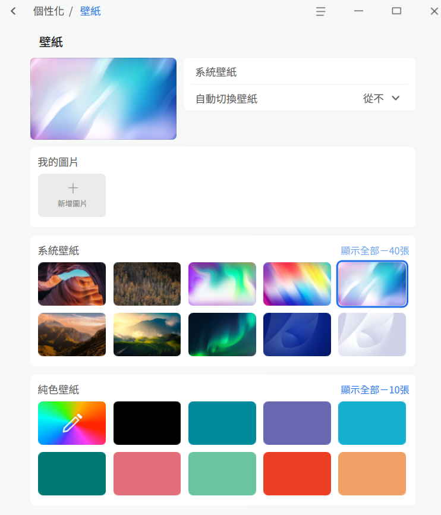

1. 在桌面上按右鍵，點選 **设置壁纸**，進入控制中心預覽所有壁紙。
2. 您可以選擇我的圖片、系統壁紙或純色壁紙 3 種壁紙類型。
3. 點選某張壁紙後，壁紙會立即在桌面生效。
4. 在壁紙上右鍵點選 **设置锁屏**，壁紙會套用至鎖定畫面。

>  竅門：
> 
> - 您可在自動切換壁紙選項中設定自動更換壁紙的時間間隔，亦可設定在「登入時」和「喚醒時」自動更換壁紙。
> - 您也可以在圖片檢視器中將喜愛的圖片設為桌面壁紙，或前往應用商店搜尋壁紙下載喜愛的壁紙。

#### 螢幕保護

螢幕保護程式最初用於保護顯像管，現今一般用於防止他人窺視電腦上的隱私內容。

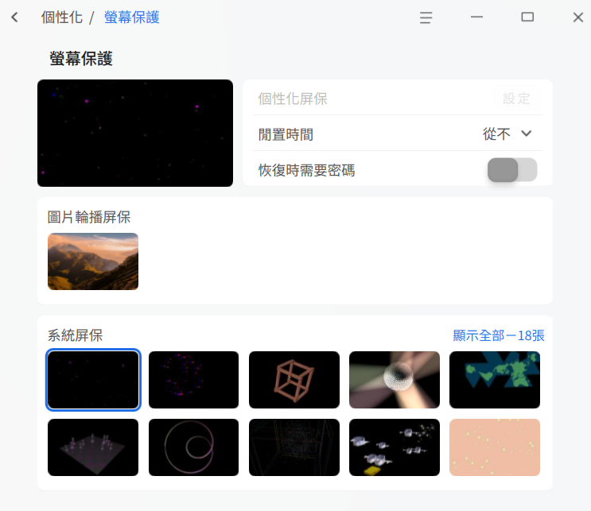

1. 在 控制中心>個人化 中，點選 **屏幕保护** 進入設定介面，預覽所有螢幕保護程式。
2. 您可以選擇圖片輪播螢幕保護程式或系統螢幕保護程式 2 種類型。
3. 選取螢幕保護程式後，設定閒置時間；當電腦閒置達指定時間後，將啟動所選螢幕保護程式。
4. 若選擇圖片輪播螢幕保護程式，在個人化螢幕保護程式選項中點選 **设置** 開啟設定視窗，可自訂圖片路徑、輪播間隔並設定隨機輪播。
5. 可開啟 **恢复时需要密码**，加強隱私保護。

#### 色彩與圖示

1. 在控制中心側邊欄選擇 **個人化**。
2. 點選 **颜色和图标** 進入設定介面後，您可以：
   - 活動用色：選擇顏色並即時預覽效果，用於調整強調色。
   - 圖示主題：可切換系統提供的圖示主題，亦可透過商店下載或自訂匯入後在此切換。
   - 點選 **光标主题**，選擇游標樣式。

#### 字型與字號

1. 在控制中心側邊欄選擇 **個人化**。
2. 點選 **字体和字号** 進入字型設定介面。
3. 設定系統字型與字號。

### 藍牙和其他裝置

#### 藍牙

藍牙可實現短距離無線通訊。透過藍牙，無需網路或連接線即可與附近的其他藍牙裝置連線。常見藍牙裝置包含：藍牙鍵盤、藍牙滑鼠、藍牙耳機、藍牙喇叭等。

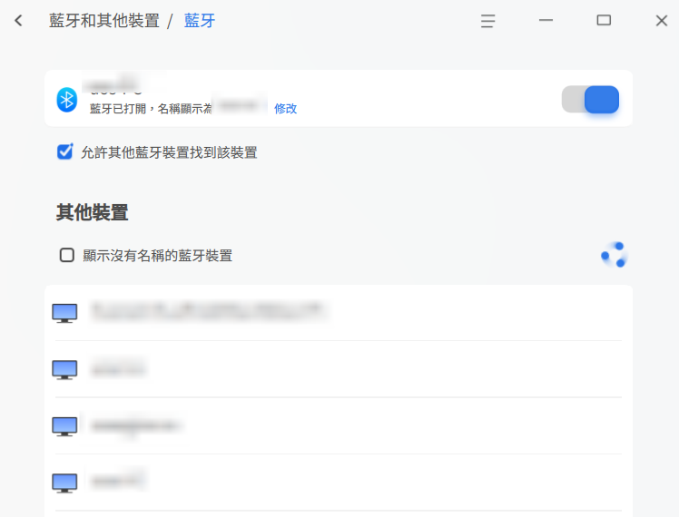

>  說明：若手提電腦具備藍牙，可直接開啟藍牙開關；若桌上型電腦未配備藍牙，可購買藍牙轉接器插入 USB 連接埠後使用。

##### 修改藍牙名稱

1. 在控制中心側邊欄選擇 **藍牙和其他裝置**，點選 **蓝牙**。
2. 點選藍牙名稱旁的 **修改** 按鈕，輸入本機新的藍牙名稱。

>  說明：修改藍牙名稱後，系統會自動對外廣播新名稱，需要其他裝置重新搜尋。

##### 連線藍牙裝置

1. 在控制中心側邊欄選擇 **藍牙和其他裝置**，點選 **蓝牙**。
2. 開啟 **蓝牙**，系統會自動掃描附近的藍牙裝置，並顯示在 **其他裝置** 清單中。
3. 雙擊要連線的藍牙裝置，或點選 **连接**；如需配對碼，請依提示在該裝置上輸入。配對成功後會自動連線。
4. 連線成功後，裝置會新增到 **我的裝置** 清單。
5. 在「我的裝置」清單點選該裝置，可 **断开连接** 或修改裝置名稱。

##### 使用藍牙傳送/接收檔案

deepin PC 與非 deepin PC，或 deepin PC 與行動裝置（手機/平板）之間可透過藍牙傳送/接收檔案。

前提：傳送端與接收端藍牙裝置已配對並連線成功。

**使用 deepin PC 端藍牙傳送檔案**

場景：傳送端透過藍牙向接收端傳送檔案。

1. 在控制中心側邊欄選擇 **藍牙和其他裝置**，點選 **蓝牙**。
2. 開啟 **蓝牙**，系統會自動掃描附近的藍牙裝置。
3. 進入「我的裝置」選擇已配對連線的藍牙裝置，點選已連線裝置的 更多 按鈕進入詳情，點選 **发送文件** 按鈕（僅 PC/手機/平板裝置會顯示該按鈕），在彈出的檔案總管視窗選擇要傳送的檔案，點選 **打开**。
4. 在彈出的「藍牙檔案傳輸」視窗中，選擇接收此檔案的藍牙裝置，點選 **发送** 送出傳輸請求。

**使用手機端藍牙傳送檔案**

場景：傳送端（以 Android 手機為例）透過藍牙向接收端傳送檔案。

1. 開啟 **蓝牙**，系統會自動掃描附近的藍牙裝置。
2. 選擇已配對並連線成功的藍牙裝置。
3. 在手機中選擇檔案，點選 **发送**，透過藍牙傳送檔案。

**使用藍牙接收檔案**

傳送端傳送檔案後，接收端會彈出提示視窗，使用者可點選 **接受** 或 **拒绝**。

- 若接收端同意接收，傳送端會開始傳輸並顯示傳送視窗；完成後接收端會彈出提示訊息，使用者可檢視接收成功的檔案。
- 若接收端出現下列情況，傳送端部分檔案會傳輸失敗，並顯示在失敗清單：
  - 接收端選擇拒絕：結束傳輸並顯示失敗。
  - 接收端逾時未操作或超出傳輸範圍：顯示失敗（藍牙連線失敗）。
  - 接收端既不點選接收也不點選拒絕：預設 1 分鐘後結束傳輸並顯示失敗。

#### 滑鼠與觸控板

滑鼠與觸控板是常用輸入裝置。使用滑鼠可讓操作更簡便快速；手提電腦在未連接滑鼠時，也可用觸控板操作。部分裝置亦支援指點杆。在控制中心的滑鼠設定模組中，您可對滑鼠、觸控板與指點杆進行設定，使操作更符合個人習慣。

##### 通用設定

1. 在控制中心側邊欄選擇 **藍牙和其他裝置**，點選 **滑鼠與觸控板**。

2. 在 **通用** 區域設定：
   
   - **滚动速度**：拖曳滑桿調整；數值越高捲動越快。
   
   - **双击速度**：拖曳滑桿調整。
   
   - 開啟 **左手模式**，適用於左手操作。
     
     >  說明：開啟左手模式後，滑鼠與觸控板的左右鍵功能互換。

##### 滑鼠設定

連接滑鼠後，可於控制中心設定，使其更符合使用習慣。

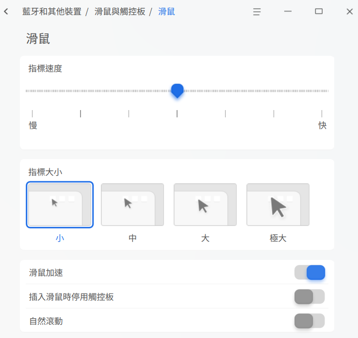

1. 在控制中心側邊欄選擇 **藍牙和其他裝置**，點選 **滑鼠與觸控板**。
2. 點選 **滑鼠**。
3. 調整 **指標速度**，控制指標移動速度。
4. 在 **指標大小** 區域，點選 小／中／大，調整游標大小。
5. 開啟 **滑鼠加速**，調整滑鼠移動回應速度。
6. 開啟 **插入滑鼠时停用觸控板**，連接滑鼠後停用觸控板。
7. 點選 **自然滚动** 開關以啟用功能。

>  說明：
> 
> - 開啟滑鼠加速後，指標移動距離會隨移動速度加快而增加，可依使用情況開啟或關閉。
> - 若沒有觸控板，將不顯示「插入滑鼠时停用觸控板」。
> - 開啟自然捲動後，滑鼠滾輪向下捲動時內容向下捲動；向上捲動時內容向上捲動。

##### 觸控板設定

若您使用手提電腦，可在 **滑鼠與觸控板 > 滑鼠** 介面開啟 **输入时禁用觸控板**，避免誤觸。

您亦可調整觸控板 **指標速度**，並可開啟自然捲動以變更捲動方向。

**手勢設定**

可透過觸控板手勢快速執行桌面功能，主要可設定三指手勢與四指手勢。

**三指手勢** 可設定：

1. 三指向上：預設最大化視窗，可改為還原視窗、目前視窗左分屏、目前視窗右分屏或停用。
2. 三指向下：預設還原視窗，可改為最大化視窗、目前視窗左分屏、目前視窗右分屏或停用。
3. 三指向左：預設目前視窗左分屏，可改為還原視窗、最大化視窗、目前視窗右分屏或停用。
4. 三指向右：預設目前視窗右分屏，可改為還原視窗、最大化視窗、目前視窗左分屏或停用。
5. 三指點按：預設開啟/隱藏全域搜尋，可改為顯示/隱藏啟動器、開啟/隱藏剪貼簿、開啟/隱藏訊息中心或停用。

**四指手勢** 可設定：

1. 四指向上：預設顯示多工檢視，可改為隱藏多工檢視、切換至上一個桌面、切換至下一個桌面、顯示桌面、隱藏桌面或停用。
2. 四指向下：預設隱藏多工檢視，可改為顯示多工檢視、切換至上一個桌面、切換至下一個桌面、顯示桌面、隱藏桌面或停用。
3. 四指向左：預設切換至上一個桌面，可改為顯示多工檢視、隱藏多工檢視、切換至下一個桌面、顯示桌面、隱藏桌面或停用。
4. 四指向右：預設切換至下一個桌面，可改為顯示多工檢視、隱藏多工檢視、切換至上一個桌面、顯示桌面、隱藏桌面或停用。
5. 四指點按：預設開啟/關閉啟動器，可改為開啟/關閉全域搜尋、開啟/關閉剪貼簿、開啟/關閉通知中心或停用。

#### 鍵盤

此模組可設定鍵盤屬性以符合個人輸入習慣，設定輸入法，以及自訂快捷鍵。

##### 鍵盤屬性

1. 在控制中心側邊欄選擇 **藍牙和其他裝置**，點選 **键盘**。
2. 在 **通用** 區域設定。
3. 調整 **重复延迟**/**重复速度**。
4. 點選「请在此测试」，按住鍵盤任意字元不放，檢視效果。
5. 開啟 **启用数字键盘**/**大写锁定提示** 開關以啟用功能。

##### 輸入法

在輸入法介面可新增多個輸入法，並設定切換輸入法的快捷鍵，以提供更豐富的輸入方式。

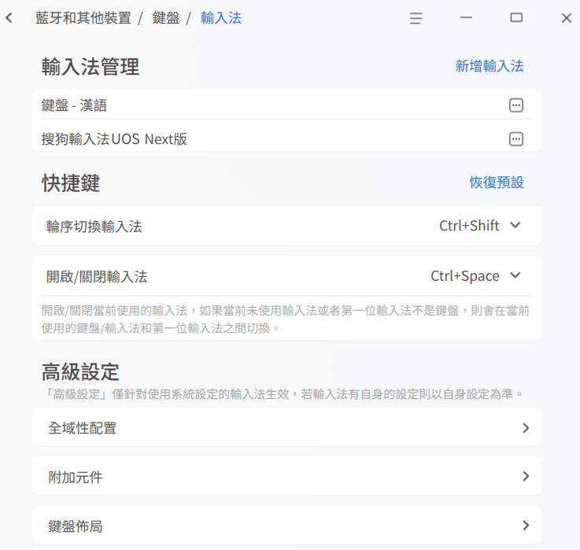

**新增輸入法**

1. 在控制中心側邊欄選擇 **藍牙和其他裝置**，點選 **键盘**。
2. 點選 **输入法**，進入輸入法介面。
3. 點選 **添加输入法** 按鈕，您可以：
   - 點選 **前往商店下载**，至應用商店下載輸入法；下載完成後系統會自動設為預設輸入法。
   - 進入新增輸入法介面，選擇輸入法並新增至管理清單。

>  說明：在輸入法管理介面中，點選 **编辑** 後再點選 **删除** 即可移除輸入法。被移除（非解除安裝）的輸入法可於新增輸入法介面再次新增。

**設定輸入法排序**

1. 在控制中心側邊欄選擇 **藍牙和其他裝置**，點選 **键盘**。
2. 點選 **输入法**。
3. 在輸入法管理區域上下拖曳輸入法以排序。

**設定輸入法配置**

1. 在控制中心側邊欄選擇 **藍牙和其他裝置**，點選 **键盘**。
2. 點選 **输入法**。
3. 在輸入法管理區域點選輸入法後方的 **设置** 以調整輸入法自身配置。

**設定切換輸入法快捷鍵**

1. 在控制中心側邊欄選擇 **藍牙和其他裝置**，點選 **键盘**。
2. 點選 **输入法**。
3. 在快捷鍵區域的下拉選單中，選擇切換輸入法的快捷鍵。

>  說明：在輸入法進階設定介面中亦可設定更多快捷鍵。

**進階設定**

1. 在控制中心側邊欄選擇 **藍牙和其他裝置**，點選 **键盘**。
2. 點選 **输入法**。
3. 點選 **高级设置**，對輸入法進行全域配置（如更多快捷鍵、程式、輸出與外觀設定等），以及附加元件。

**鍵盤配置**

鍵盤配置可為目前語言設定自訂鍵盤。完成設定後，按下按鍵時螢幕會顯示對應字元。更改鍵盤配置後，螢幕顯示字元可能與鍵盤鍵帽字元不同。

一般在安裝系統時已設定鍵盤配置，亦可按需要新增或刪除其他鍵盤配置。

**新增鍵盤配置**

1. 在控制中心側邊欄選擇 **藍牙和其他裝置**，點選 **键盘**。
2. 點選 **键盘布局**。
3. 點選 **添加键盘布局**，點選某一鍵盤配置即可新增至清單。

**刪除鍵盤配置**

1. 在控制中心側邊欄選擇 **藍牙和其他裝置**，點選 **键盘**。
2. 點選 **键盘布局**。
3. 點選「键盘布局」後的 **编辑**。
4. 點選 **删除**，刪除鍵盤配置。

##### 快捷鍵

快捷鍵清單顯示系統所有快捷鍵，可在此檢視、修改與自訂。

**檢視快捷鍵**

1. 在控制中心側邊欄選擇 **藍牙和其他裝置**，點選 **键盘**。
2. 點選 **快捷键**。
3. 搜尋或檢視預設的系統快捷鍵、視窗快捷鍵與工作區快捷鍵。

**修改快捷鍵**

1. 在控制中心側邊欄選擇 **藍牙和其他裝置**，點選 **键盘**。
2. 點選 **快捷键**。
3. 點選要修改的快捷鍵。
4. 直接用鍵盤輸入新的快捷鍵。

>  竅門：若要停用快捷鍵，請按下鍵盤上的 **Backspace**  鍵。若要取消修改，按 **Esc** 鍵，或點選下方的「恢复默认」按鈕。

**自訂快捷鍵**

您可以為常用應用程式自訂快捷鍵。

1. 在控制中心側邊欄選擇 **藍牙和其他裝置**，點選 **键盘**。
2. 點選 **快捷键**。
3. 點選 **添加**，進入新增自訂快捷鍵介面。
4. 輸入快捷鍵名稱、指令與快捷鍵。
5. 點選 **添加**。
6. 新增成功後，點選「自定义快捷键」後的 **编辑**。
7. 點選某快捷鍵後方的刪除按鈕，刪除自訂快捷鍵。

>  竅門：若要修改快捷鍵，點選後直接輸入新快捷鍵即可。若要修改自訂快捷鍵名稱與指令，點選「自定义快捷键」後的 **编辑**，再點選名稱後的  進入修改頁面。

#### 觸控螢幕設定

連接觸控螢幕後，您可以設定其所在螢幕並進行調整。

1. 在控制中心側邊欄選擇 **藍牙和其他裝置**，點選 **觸控螢幕**。
2. 設定完成後，點選 **确定**。

#### 數位板

數位板（又稱繪圖板）主要用於繪畫創作，是電腦輸入裝置之一。連接後可設定壓感力度，即筆尖與橡皮擦的壓力感應值。

>  說明：連接數位板裝置後，此模組才會顯示。

1. 在控制中心側邊欄選擇 **藍牙和其他裝置**，點選 **數位板**。
2. 選擇 **笔** 模式。
3. 調整 **压感力度**。

### 電源管理

設定系統電源選項，提升手提電腦電池續航並強化安全性。

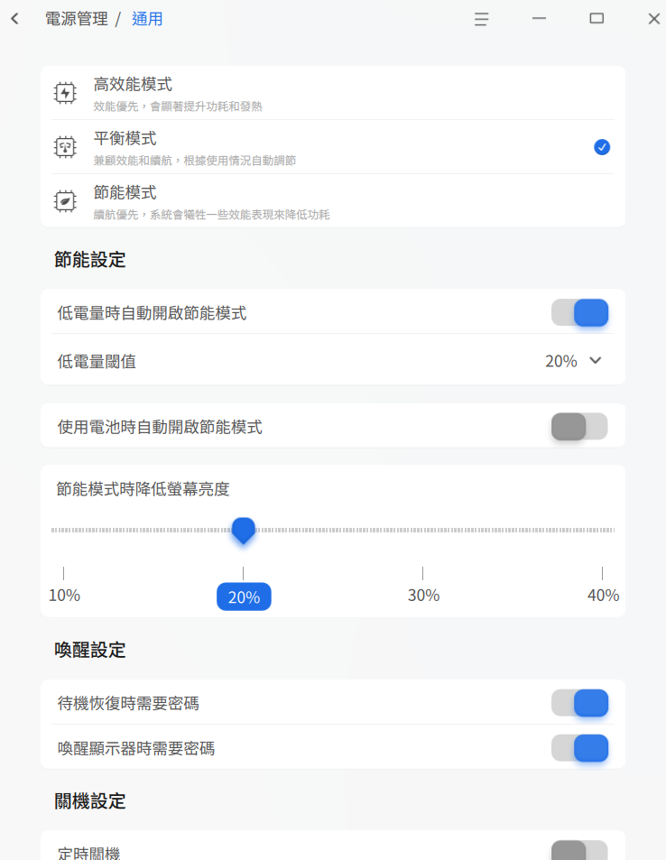

#### 調整效能模式

1. 在控制中心側邊欄選擇 **电源管理**。
2. 點選 **通用**。
3. 在效能模式區域選擇 **平衡模式**、**高性能模式** 或 **节能模式**。

#### 設定節能模式

為降低耗電量，您可以設定節能模式並降低螢幕亮度。

1. 在控制中心側邊欄選擇 **电源管理**。
2. 點選 **通用**。
3. 在節能設定中：
   - 開啟 **低电量时自动开启**（僅手提電腦支援）。
   - 設定 **低电量阈值**：當電量達到閾值時自動進入節能模式。
   - 開啟 **使用电池时自动开启**（僅手提電腦支援）。
   - 拖曳 **自动降低亮度** 滑桿，調整節能模式啟用時螢幕亮度。

> 

#### 喚醒設定

1. 在控制中心側邊欄選擇 **电源管理**。
2. 點選 **通用**。
3. 在 唤醒设置 區域：
   - 開啟 **待机恢复时需要密码**，睡眠喚醒後需重新登入。
   - 開啟 **唤醒显示器时需要密码**，喚醒顯示器後需重新登入。

#### 關機設定

1. 在控制中心側邊欄選擇 **电源管理**。
2. 點選 **通用**。
3. 在 **关机设置** 區域：
   - 設定 **定时关机时间**。
   - 設定 **重复频次**：單次、工作日重複、每天重複或自訂。

#### 設定關閉顯示器時間

1. 在控制中心側邊欄選擇 **电源管理**。
2. 點選 **使用电源** 或 **使用电池**。
3. 選擇關閉顯示器的時間。

>  說明：手提電腦使用者可在「使用电源」與「使用电池」下，對同一設定項分別設定不同時間。

#### 設定電腦睡眠時間

1. 在控制中心側邊欄選擇 **电源管理**。
2. 點選 **使用电源** 或 **使用电池**。
3. 選擇電腦開始睡眠的時間。

>  竅門：手提電腦使用者亦可開啟 **合上笔记本时待机**，以便在使用電源時合蓋睡眠。

#### 設定自動鎖定螢幕時間

1. 在控制中心側邊欄選擇 **电源管理**。
2. 點選 **使用电源** 或 **使用电池**。
3. 選擇自動鎖定螢幕的時間。

#### 設定合蓋動作

1. 在控制中心側邊欄選擇 **电源管理**。
2. 點選 **使用电源** 或 **使用电池**。
3. 設定 **笔记本合盖时** 為 **待机**、**休眠**、**关闭显示器** 或 **无任何操作**。

>  說明：僅手提電腦支援設定合蓋動作。

#### 設定按下電源按鈕時動作

1. 在控制中心側邊欄選擇 **电源管理**。
2. 點選 **使用电源** 或 **使用电池**。
3. 選擇按下電源按鈕時的動作：**关机**、**待机**、**休眠**、**关闭显示器**、**进入关机界面** 或 **无任何操作**。

#### 低電量管理

1. 在控制中心側邊欄選擇 **电源管理**。
2. 點選 **使用电池**。
3. 設定低電量管理：
   - 開啟 **低电量提醒**：電量低於閾值（例如 20%）時發出通知。
   - 設定低電量自動進入狀態：自動睡眠或自動休眠。
   - 設定低電量閾值。

>  說明：僅手提電腦支援低電量通知。

#### 電池管理

1. 在控制中心側邊欄選擇 **电源管理**。
2. 點選 **使用电池**。
3. 在 **电池管理** 區域：
   - 可開啟 **显示剩余使用时间及剩余充电时间**，調整工作列顯示電量資訊。
   - 檢視最大電池容量資訊。

### 帳戶

安裝系統時會建立一個帳戶；在控制中心的帳戶設定模組可修改帳戶設定或建立新帳戶。

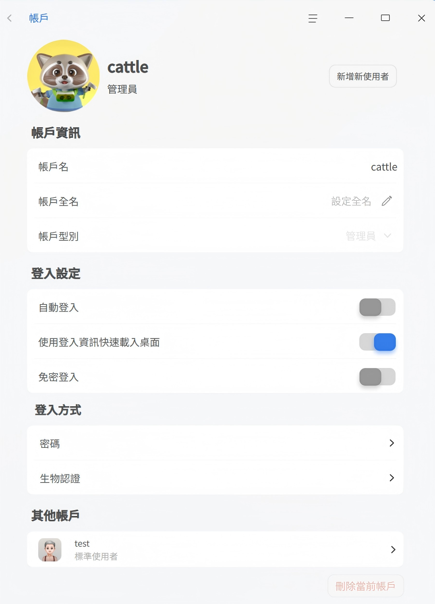

#### 建立新帳戶

1. 點選 **添加新用户** 按鈕。
2. 選擇帳戶類型，設定使用者名稱、全名、密碼、重複密碼、密碼提示資訊。
3. 點選 **创建**。
4. 在授權對話方塊輸入目前帳戶的密碼，新帳戶就會新增到帳戶清單中。

>  竅門：您也可以將標準使用者的帳戶類型設定為管理員。

#### 變更大頭貼

滑鼠移動至帳戶大頭貼會出現 **编辑**；點選大頭貼，選擇一個大頭貼或新增本機大頭貼，即完成替換。

#### 設定全名

帳戶全名會顯示在帳戶清單與系統登入介面，可按需要設定。

點選 **设置全名** 後的 ，輸入帳戶全名。

#### 自動登入

開啟「自动登录」後，下次啟動系統（重新開機、開機）可直接進入桌面。在鎖定螢幕與登出後再次登入仍需密碼。

開啟 **自动登录** 開關，於授權對話方塊輸入目前帳戶密碼並確認後，即可啟用自動登入。

#### 免密登入

開啟「免密登录」後，下次登入系統（重新開機、開機，以及登出後再次登入）與解鎖時不需密碼。

開啟 **免密登录** 開關，於授權對話方塊輸入目前帳戶密碼並確認後，即可啟用免密登入。

>  竅門：若「免密登录」與「自动登录」同時開啟，下次啟動系統（重新開機、開機）會直接進入桌面。

#### 登入方式

可編輯與設定目前支援的登入方式。

**密碼-修改密碼**

1. 點選 **密码**，進入密碼頁面。
2. 輸入目前密碼、新密碼與重複密碼，點選 **保存**。

>  說明：管理員帳號過期後需先修改密碼，才能進行授權操作。

**密碼-密碼有效期**

1. 點選 **密码**，進入密碼頁面。
2. 設定密碼有效天數，可設定長期有效或指定有效天數。

> 密碼有效期自修改之日起開始計算。
> 
> 例如：使用者 A 在 9 月 1 日修改密碼後，將有效期更改為 30 天，則密碼可於 9 月 1 日至 9 月 30 日期間正常使用。

**生物认证**

生物認證（生物識別）是透過電腦利用人體固有的生理或行為特徵進行身分鑑定。常見的生物認證包含指紋識別、人臉識別。

接入具備生物認證的硬體設備後，於系統中錄入指紋、人臉資訊，可用於登入系統、解鎖螢幕、授權特殊操作，並可提升使用體驗、效率與安全性。

>  說明：僅接入具備生物認證的硬體設備後才會顯示生物認證模組，並可進行指紋/人臉設定。

**設定指紋密碼**

指紋是手指末端正面皮膚的紋路；一般每個人的指紋不同，亦可設定為密碼。

1. 進入生物認證頁面，在指紋區塊點選 **添加新的指纹**。
2. 在授權對話方塊輸入目前帳戶密碼後，使用指紋設備錄入指紋。
3. 指紋新增成功後點選 **完成**。

>  說明：您可新增多個指紋密碼，也可刪除個別指紋密碼。

**設定人臉識別**

1. 進入生物認證頁面，在人臉區塊點選 **添加新的人脸**。
2. 在彈出的新增人臉資料對話方塊中，勾選 **我已阅读并同意《用户免责声明》**，並點選 **下一步**。
3. 點選 **同意并开始录入人脸**，點選 **下一步** 使用人臉識別設備錄入人臉資料。
4. 點選 **完成**。

>  說明：每個帳號最多可錄入 5 個人臉。

#### 刪除帳戶

1. 點選其他未登入的帳戶。
2. 點選 **删除账户**。
3. 在彈出的確認介面點選 **删除**。

>  注意: 已登入的帳戶無法刪除。

### deepin ID

要使用 deepin ID 相關功能，您需要先成功註冊並登入 deepin ID。若尚未註冊，可透過以下方式註冊：

- **透過統信官方網站註冊**：進入統信官方網站（支援微信掃碼、手機號碼等多種註冊方式），完成註冊流程。
- **透過控制中心註冊**：
  1. 在控制中心的 deepin ID 介面中，點選 **登录** 按鈕，系統將彈出 deepin ID 登入介面。
  2. 在登入介面中，點選 **注册** 按鈕，系統將彈出 deepin ID 註冊介面。
  3. 在註冊介面中，使用手機號碼或微信完成註冊操作。

成功登入 deepin ID 後，您也可使用雲同步、應用商店、瀏覽器等應用程式的雲端服務功能。

>   竅門：當 deepin ID 與本機帳戶綁定後，您可以使用 deepin ID 重設本機帳戶的登入密碼。

開啟雲同步功能後，系統會自動將各種配置（如聲音、電源、滑鼠、更新、螢幕保護等）同步到雲端。若您希望在另一台電腦上使用相同系統配置，只需登入同一個 deepin ID 帳戶，即可一鍵同步雲端配置至新裝置。

>    說明：
> 
> 1. 自動同步配置功能僅在系統已啟用或處於試用期狀態下可用；未啟用狀態下無法使用該功能。
> 2. 當開啟「自動同步配置」選項時，您可以選擇要同步的具體項目；關閉該選項時，所有項目均無法同步。

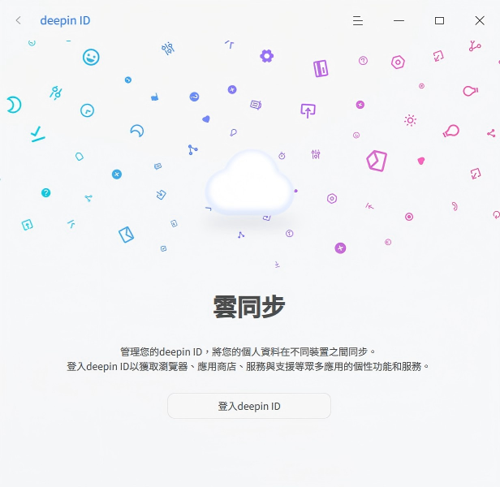

### 隱私和安全

- 在隱私和安全介面，您可以設定應用訪問攝影機、文件和資料夾的權限。系統預設情況下，所有應用都可以訪問攝影機、文件和資料夾；針對文件和資料夾模組，系統目前支援對“圖片”資料夾和“文件”資料夾的權限管控。
- 當權限開啟時，應用可以正常訪問相關權限；當權限關閉時，應用將無法訪問相關權限，系統會提示您前往控制中心-隱私和安全模組開啟權限，或者不予處理。

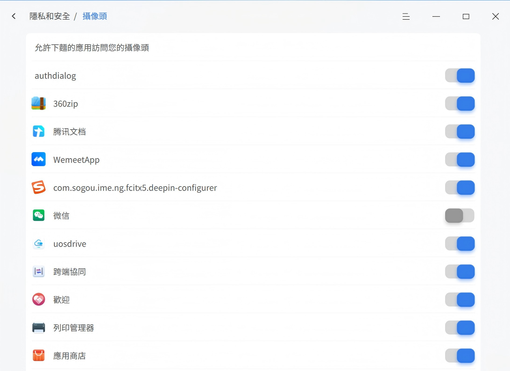

#### 攝影機

- 支援管理單個應用對攝影機的訪問權限，單擊 關閉權限，或者單擊 重新開啟權限。

#### 文件和資料夾

- 支援分別管理單個應用對“圖片”資料夾和“文件”資料夾的訪問權限，單擊 關閉權限，或者單擊 重新開啟權限。

### 系統更新

在更新設定頁面開啟倉庫更新類型中的「系統更新」或「安全更新」後，自動下載與更新提醒功能才可正常運作。

當系統有更新時，控制中心側邊欄會顯示提示。點選 **系統更新** 進入 **檢查更新** 頁面，點選 **檢查更新**；檢查完成後即可下載並安裝更新。此外，也可在更新設定中設定自動下載更新。

>  竅門：若不需要自動檢查更新、不想收到系統或應用程式更新提示，可在「更新設定」中關閉「更新提醒」。

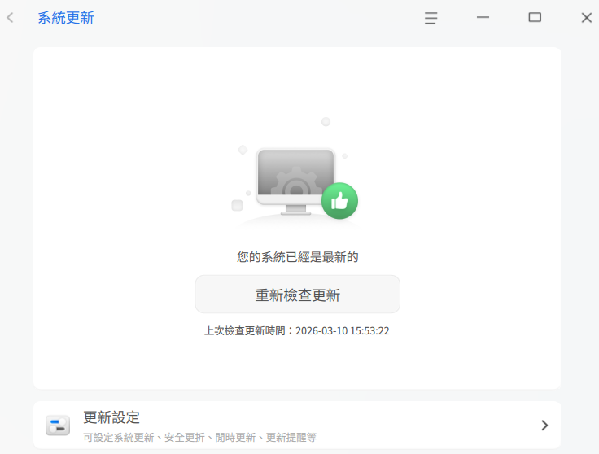

#### 更新和升級

1. 在控制中心側邊欄選擇 **系統更新**。
2. 點選 **檢查更新/重新檢查更新**，進入檢查系統更新介面。
   - 若系統沒有更新，會提示「您的系統已是最新版本」。
   - 若系統有更新，會顯示 **下載** 按鈕、**可勾選更新內容**、下載資料大小與更新詳情。您可繼續執行步驟 3 與步驟 4。
3. 點選 **下載**，系統會自動開始下載已勾選的更新內容。
4. 下載完成後，系統會通知您可以更新；您可於控制中心的更新模組點選 **安裝更新** 開始安裝更新檔案。
5. 更新完成後，會出現「更新成功」提示。您可依需要選擇重新開機、關機或取消。

#### 更新並關機/重新開機

開始安裝更新後，可選擇 **背景更新、更新並關機、更新並重新開機**：

- 背景更新：更新過程在背景完成，不影響目前系統使用。
- 更新並關機/重新開機：更新過程會以全螢幕介面顯示進度，此期間系統無法使用；更新完成後系統會自動關機/重新開機。

>  說明：更新並關機/重新開機適合在無人值守時使用（例如下班時），相較於背景更新也更穩定。

#### 更新內容

1. 在控制中心側邊欄選擇 **系統更新**。
2. 檢查更新後，會自動顯示可更新內容與版本更新日誌。

>  說明：當僅開啟「安全更新」時，系統只會進行安全漏洞與相容性相關更新。

#### 更新設定

##### 更新類型

1. 在控制中心側邊欄選擇 **系統更新**。
2. 點選 **更新設定**。
3. 在 **更新類型** 區域設定檢查更新的類型，可選功能更新、安全更新與第三方倉庫更新。

##### 進階設定

1. 在控制中心側邊欄選擇 **系統更新**。
2. 點選 **更新設定**。
3. 開啟 **下載限速**。啟用後可設定下載速度上限，預設上限為 10240 KB/s。
4. 開啟 **自動下載**。啟用後可設定自動下載時段；當系統有更新時，會在指定時段內自動下載。
5. 開啟 **更新提醒**，收到更新通知時提醒您有最新更新。
6. 開啟 **清除軟體套件快取**，可自動清理已下載並完成更新的套件快取。

>  竅門：開啟 **清除軟體套件快取** 後，系統會定期自動清理因下載套件造成的快取。

#### 檢視歷史更新

您可以點選 **檢視歷史更新**，檢視所有已安裝的系統版本日誌。

# 視窗管理器

視窗管理器可以在不同的工作區內展示不同的視窗內容。透過視窗管理器您可以同時使用多個桌面，以便對桌面視窗進行分組管理。

>  說明：只有在控制中心 > 個性化 > 一般介面，開啟了視窗特效功能後，才支援執行視窗管理器功能。

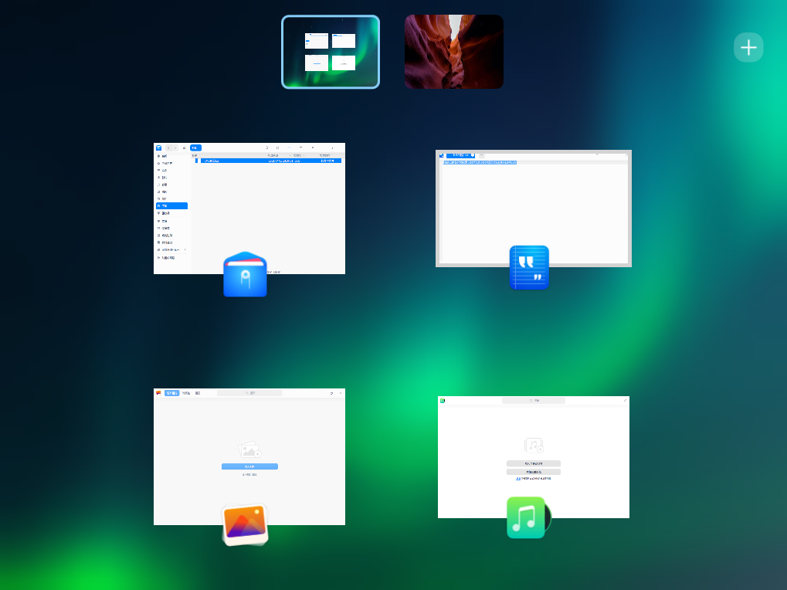

>  說明：在觸控板上，四指/五指向上移動顯示多任務檢視，緊接著向下移動隱藏多任務檢視， 對應 **Super** + **S** 快捷鍵。

### 打開工作區

工作區將您的桌面視窗進行分組管理，透過劃分工作區可以增大您的工作區域。

按下 **Super** + **S** 組合鍵，或單擊  打開工作區介面。

>  說明：當使用觸控螢幕電腦時，手指從螢幕底部劃入超過任務欄高度，打開工作區。

### 添加工作區

在工作區介面，您可以透過以下方式添加工作區。

- 單擊工作區右上角的 **+**。

- 按下鍵盤上的 **Alt** + **+**。

>  說明：當您添加的工作區達到最大值 **6** 時，將不能再添加工作區。

### 切換工作區

在桌面和工作區介面，您可以透過以下方式切換工作區。

- 在桌面，按下鍵盤上的 **Super** +  /  組合鍵，切換到上一個/下一個工作區。
- 在桌面，按下鍵盤上的 **Super** + 數字鍵（1-6）， 切換到指定順序的工作區。
- 在工作區介面，滾動滑鼠滾輪切換到上一個/下一個工作區。
- 在工作區介面，單擊對應的預覽視窗來切換到指定工作區。

>  說明：在觸控板上，四指/五指向左或向右移動，切換到前一個或後一個工作區，對應 **Super** + **Left** 或 **Super** + **Right** 快捷鍵。

>  竅門：在工作區介面，透過拖曳可以調整工作區位置。

### 刪除工作區

當您執行刪除工作區操作後，該工作區中的所有視窗將自動轉移到相鄰的工作區中顯示，當桌面環境中只存在一個工作區時，將不能執行刪除工作區的操作。

- 在工作區介面，單擊  刪除工作區。
- 在工作區介面，按下鍵盤上的 **Alt** + **-**。
- 滑鼠將某個工作區向上拖曳出螢幕，刪除目前工作區。

### 退出工作區

當您在工作區介面完成相關操作後，可以透過以下方式退出工作區。

- 按下鍵盤上的 **Esc** 鍵。
- 單擊目前工作區介面區域外的任意位置。
- 再次按下鍵盤上的 **Super** + **S** 組合鍵。

### 移動工作區視窗

您可以透過以下方式移動視窗到另一工作區。

- 在工作區介面，拖曳視窗到指定的工作區。
- 在桌面，按下鍵盤上的 **Super** + **Shift** +  /  鍵，將目前視窗移動到上一個/下一個工作區。
- 在桌面，按下鍵盤上的 **Super** + **Shift** + 數字鍵，將目前視窗移動到對應順序的工作區。
- 在桌面，按下鍵盤上的 **Alt** + **Space** 或在視窗標題欄上單擊右鍵，打開視窗快捷操作選單，選擇 **永遠在可見工作區**，或 **移至右方工作區** 或 **移至左方工作區**，將目前視窗移動到指定的工作區。

>  竅門：在視窗快捷操作選單，您還可以選擇最小化、最大化、移動、變更大小、永遠置頂和關閉視窗。

### 切換桌面視窗

您可以透過以下方式切換目前工作區的桌面視窗。

#### 快速切換相鄰視窗

同時按下 **Alt** + **Tab** 並快速釋放，快速切換目前視窗和相鄰程式視窗；

同時按下 **Alt** + **Shift** + **Tab** 並快速釋放，快速反向切換目前視窗和相鄰程式視窗。

#### 快速切換同類型視窗

同時按下 **Alt** +  並快速釋放，快速切換目前同類型視窗；

同時按下 **Alt** + **Shift** +  並快速釋放，快速反向切換目前同類型視窗。

#### 切換所有視窗

按住鍵盤上的 **Alt** 鍵不放，連續按下鍵盤上的 **Tab** 鍵，所有視窗依次向右切換顯示；

按住鍵盤上的 **Alt** + **Shift** 鍵不放，連續按下鍵盤上的 **Tab** 鍵，所有視窗依次向左切換顯示。

#### 切換同類型視窗

按住鍵盤上的 **Alt** 鍵不放，連續按下鍵盤上的  鍵，目前同類型視窗依次向右切換顯示；按住鍵盤上的 **Alt** + **Shift** 鍵不放，連續按下鍵盤上的  鍵，視窗依次向左切換顯示。

### 視窗分屏

使用視窗分屏，讓多個應用程式和任務視窗同時顯示在大螢幕上，既充分利用了大螢幕的空間，又能減少在多個應用程式視窗之間頻繁切換，提高您的工作學習效率。

#### 進入分屏

1. 拖曳視窗到螢幕左側或右側，當游標接觸到螢幕左右側邊緣時，會出現分屏提⽰動效，動效顏色與活動色一致，釋放視窗，視窗將吸附在螢幕左半邊或右半邊。
   
   >  說明：當應用支援分屏時，將游標懸浮於應用視窗的最大/還原按鈕上，在彈出的選單中選擇  ，即可進入分屏。

2. 在另一半未被占據的螢幕中，會出現其他所有視窗的預覽，單擊其中一個使其顯示在另一半螢幕中，實現分屏瀏覽。也可以把其他視窗拖曳到螢幕兩邊，疊加分屏視窗。
   
   >  竅門：要取消視窗分屏，只需將視窗從螢幕一側拖離即可。

多屏分屏模式下，支援在同一塊螢幕配對分屏視窗，不支援跨屏配對分屏視窗。

#### 調整視窗位置

分屏瀏覽時，移動視窗的1/2位置越過分屏區域中線，另一視窗自動切換到移動視窗分屏位置，釋放移動視窗，移動視窗補位到空缺的分屏位置。

#### 調整視窗大小

分屏瀏覽時，將游標移動到螢幕中間兩個視窗的連接處進行左右拖曳，可以同時修改兩個視窗的寬度。

>  說明：當視窗不能繼續向某一方向拖曳時，游標會指示其他可拖曳方向。

#### 退出分屏

- 單擊目前任意視窗的最大化按鈕或關閉按鈕，僅該視窗退出分屏，剩餘視窗不退出分屏。
- 兩個視窗分屏時，拖曳其中一個視窗到螢幕頂部可觸發一分屏，目前操作的視窗退出分屏，剩餘視窗不退出分屏。
- 拖曳視窗遠離分屏視窗拼接方向，退出分屏。
