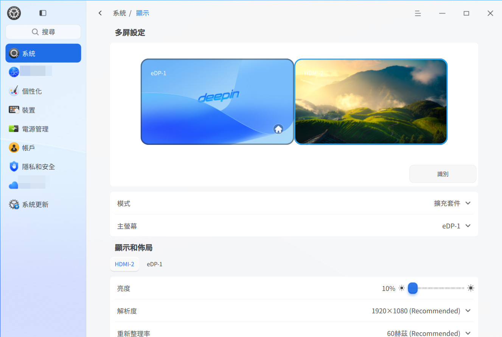
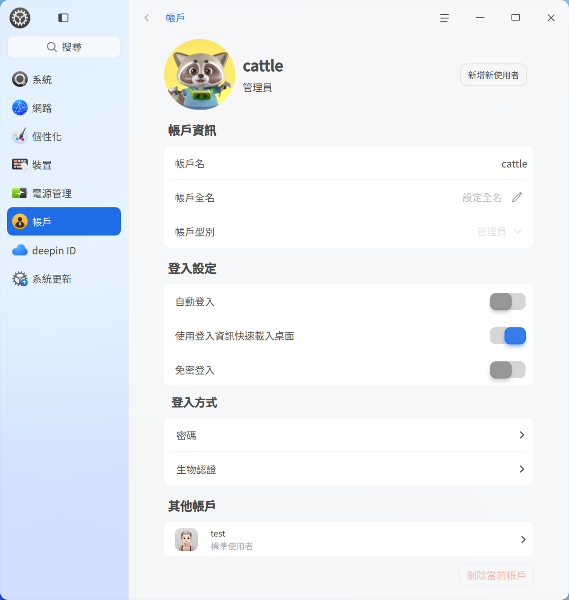
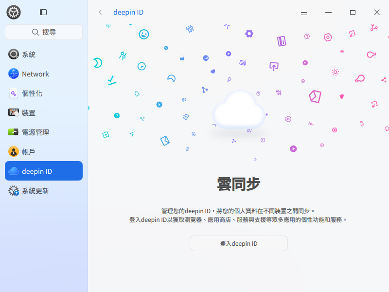
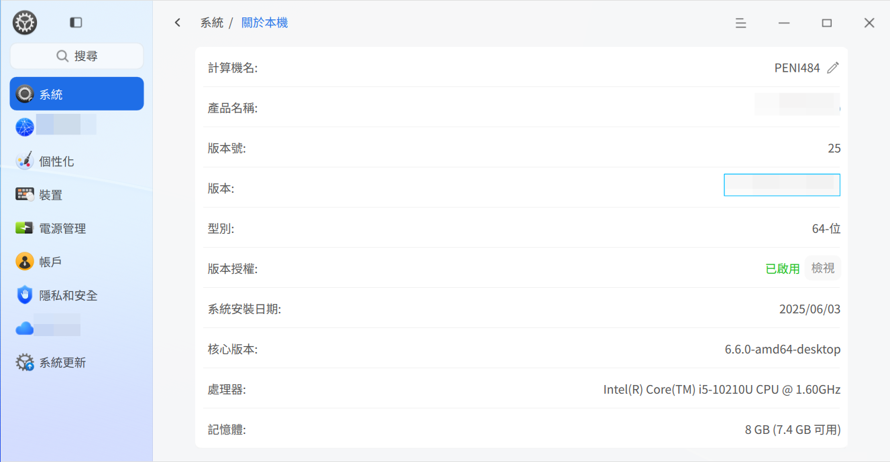

# 桌面環境|DDE|

## 概觀
深度作業系統 (deepin) 是一款美觀易用、安全可靠的國產桌面作業系統。預載檔案總管、應用商店、看圖、系統監視器等原生應用。既能體驗豐富娛樂生活，也能滿足日常工作需求。隨著功能不斷升級完善，已成為中國最受歡迎的桌面作業系統之一。

### 系統簡介
初次進入深度作業系統，會自動開啟歡迎程式。可觀看影片瞭解系統功能，選擇桌面模式和圖示主題，進一步瞭解該系統。

成功登入系統後，即可體驗 deepin 桌面環境。桌面環境主要由桌面、工作列、啟動器、控制中心和視窗管理員組成，是使用該作業系統的基礎。

## 桌面
桌面是登入後看到的主畫面區域。在桌面上可新增檔案/資料夾、排列檔案、開啟終端機、設定桌布和螢幕保護程式等，亦可透過 [傳送到桌面](#設定捷徑) 新增應用程式捷徑。

>  說明：觸控板上，四指/五指向下滑動顯示桌面，緊接上滑隱藏桌面，對應 **Super** + **D** 快速鍵。

### 新增資料夾/文件
在桌面新增資料夾或文件，操作方式與檔案總管相同。

- 右鍵桌面 > **新增資料夾**，輸入名稱
- 右鍵桌面 > **新增文件** > 選擇類型 > 輸入名稱

檔案/資料夾右鍵功能：

| 功能          | 說明 |
|--------------|------|
| 開啟方式      | 設定預設程式或選擇關聯應用程式 |
| 壓縮/解壓縮   | 壓縮檔案/夾或解壓縮檔案 |
| 剪下          | 移動檔案/夾 |
| 複製          | 複製檔案/夾 |
| 重新命名      | 重新命名檔案/夾 |
| 刪除          | 刪除檔案/夾 |
| 建立連結      | 建立捷徑 |
| 標記資訊      | 新增標籤管理檔案 |
| 內容          | 檢視基本資訊與權限 |

>  說明：
> - 觸控裝置：長按 1 秒開啟右鍵選單
> - 觸控板：兩指點選顯示右鍵選單
> - 鍵盤：**Alt** + **M** 開啟右鍵選單

### 設定排列方式
依需要排列桌面圖示：

1. 右鍵桌面
2. 點選 **排序方式** 並選擇：
   - **名稱**：依字母排序
   - **修改時間**：依修改日期排序
   - **創建時間**：依創建時間排序
   - **大小**：依檔案大小排序
   - **類型**：依檔案類型排序

>  提示：啟用 **自動排列** 可自動整理圖示。刪除圖示時，後續圖示會自動填補空間。

### 調整圖示大小
1. 右鍵桌面
2. 點選 **圖示大小**
3. 選擇合適尺寸

>  提示：使用 **Ctrl** + //滑鼠滾輪調整桌面/啟動器圖示

### 顯示器設定
透過桌面右鍵選單快速進入：

1. 右鍵桌面
2. 點選 **顯示器設定** 進入控制中心

>  詳見 [顯示器設定](#顯示器設定)

### 剪貼簿
顯示登入後複製/剪下的文字、圖片和檔案。登出/關機後自動清除。

1. 按 **Super** + **V** 開啟剪貼簿
2. 雙擊項目複製並移至頂部
3. 在目標位置貼上
4. 暫留項目 > 點選  刪除

>  觸控裝置：從左邊緣滑入開啟剪貼簿

## 工作列
預設位於底部，包含啟動器、應用程式圖示、系統匣和外掛程式。用於開啟應用程式、顯示桌面、管理工作區、設定輸入法、調整音量、連線網路、檢視行事曆和電源選項。

>  在控制中心 > 個人化 > 工作列 設定

### 工作列圖示

| 圖示 | 說明 | 圖示 | 說明 |
|------|------|------|------|
|  | 啟動器 |  | 全域搜尋 |
|  | 多工檢視 |  | 檔案總管 |
|  | UOS AI Bar |  | 瀏覽器 |
|  | 應用程式商店 |  | 控制中心 |
|  | 音樂 |  | 文字編輯器 |
|  | 郵件 |  | 終端機 |
|  | 行事曆 |  | 計算機 |
|  | 通知 |  | 螢幕小鍵盤 |
|  | 快速設定 |  | 電源選項 |

### 切換顯示模式
兩種模式：傳統模式 (小圖示) 和效率模式 (大圖示)

1. 右鍵工作列
2. 在 **模式** 下選擇

### 設定工作列位置
1. 右鍵工作列
2. 在 **位置** 下選擇方向

### 調整高度
拖曳工作列邊緣調整大小

### 顯示/隱藏工作列
1. 右鍵工作列
2. 在 **狀態** 下：
   - **一律顯示**：常駐顯示
   - **一律隱藏**：僅滑鼠暫留時顯示
   - **自動隱藏**：被覆蓋時自動隱藏

>  觸控手勢：
> - 底部：從邊緣向上滑動
> - 頂部：從邊緣向下滑動
> - 左側：從邊緣向右滑動
> - 右側：從邊緣向左滑動

### 管理外掛程式
1. 右鍵工作列 > **工作列設定**
2. 切換外掛：
   - 資源回收筒
   - 系統監視器
   - 電源選項
   - 顯示桌面
   - 螢幕小鍵盤
   - 通知中心
   - 時鐘
   - 智慧助理
   - 螢幕擷取/錄影

### 檢視通知
系統/應用程式通知顯示在頂部。點選操作或關閉。

點選  開啟通知中心。

>  觸控裝置：從右邊緣滑入開啟

### 檢視日期/時間
- 暫留時間檢視詳細資料
- 點選時間開啟行事曆

### 電源選項
點選  開啟電源選單：

| 選項       | 圖示 | 說明 |
|------------|------|------|
| 關機       |  | 關閉電源 |
| 重新開機   |  | 重新啟動系統 |
| 睡眠       |  | 低耗電狀態 |
| 休眠       |  | 儲存至硬碟 (需分頁檔) |
| 鎖定       |  | **Super** + **L** |
| 切換使用者 |  | 變更帳戶 |
| 登出       |  | 登出系統 |
| 系統監視器 |  | 開啟監視器 |

>  多帳戶時才顯示使用者切換

## 資源回收筒
暫存刪除的檔案。還原或清空內容。

### 還原檔案
1. 開啟資源回收筒
2. 右鍵檔案 > **還原**
3. 檔案返回原始位置

>  原始資料夾刪除時會建立新資料夾

### 刪除檔案
1. 開啟資源回收筒
2. 右鍵檔案 > **刪除**

### 清空資源回收筒
點選 **清空** 永久刪除所有內容

## 啟動器
 管理已安裝應用程式。使用分類或搜尋尋找應用程式。

>  觸控板：四指/五指点選切換啟動器 (**Super** 鍵)

### 切換模式
兩種模式：全螢幕和精簡

精簡模式支援快速開啟檔案總管、控制中心和電源選項。

### 排列應用程式 (精簡模式)
預設：**自由排序** (最新置頂，頻率排序)
其他：
- **依分類**
- **依名稱**

### 尋找應用程式
- 捲動或瀏覽分類
- 在搜尋方塊輸入名稱/縮寫

### 建立捷徑
傳送應用程式至桌面或工作列：

1. 右鍵應用程式圖示
2. 選擇：
   - **傳送到桌面**
   - **傳送到工作列**

>  提示：拖曳圖示至工作列。執行中應用程式需右鍵 > **釘選**

### 刪除捷徑
**從工作列**：
- 將圖示拖離工作列
- 右鍵 > **取消釘選**

**從啟動器**：
- 右鍵應用程式 > **從桌面移除**
- 右鍵應用程式 > **從工作列移除**

>  僅移除捷徑，不解除安裝應用程式

### 安裝應用程式
使用應用程式商店安裝新應用程式：

### 執行應用程式
- 雙擊桌面捷徑
- 點選工作列圖示
- 點選啟動器圖示

>  提示：右鍵應用程式 > **開機啟動**

### 解除安裝應用程式
1. 在啟動器中右鍵應用程式
2. 點選 **解除安裝**

>  系統應用程式無法解除安裝

## 控制中心
管理帳戶、網路、時間、個人化、顯示器、更新等。透過工作列進入：

>  觸控板：兩指向右滑動開啟；向左滑動關閉

### 首頁
設定模組概覽。

側邊欄導覽快速切換。

#### 標題列
- 返回按鈕 
- 瀏覽路徑
- 搜尋方塊
- 主選單 (主題/版本/結束)

### 顯示器設定
設定亮度、解析度、方向、縮放。

#### 單一顯示器
##### 調整亮度
1. 控制中心 > 系統 > 顯示器
2. 拖曳亮度滑桿

##### 設定縮放
1. 控制中心 > 系統 > 顯示器
2. 選擇縮放比例
3. 登出/登入套用

>  註：
> - 高解析度螢幕自動調整
> - 不相容應用程式：右鍵 > **停用縮放**

##### 變更解析度
1. 控制中心 > 系統 > 顯示器
2. 選擇解析度
3. 點選 **儲存**

##### 桌面顯示
1. 控制中心 > 系統 > 顯示器
2. 選擇顯示模式

##### 重新整理率
1. 控制中心 > 系統 > 顯示器
2. 選擇重新整理率
3. 點選 **儲存**

##### 方向
1. 控制中心 > 系統 > 顯示器
2. 選擇方向
3. 點選 **儲存**

##### 護眼模式
1. 控制中心 > 系統 > 顯示器
2. 切換 **護眼模式**
3. 設定時段 (全天/日落至日出/自訂)
4. 調整色溫

##### 無線投影
1. 控制中心 > 顯示器
2. 從清單選擇裝置
3. 等待連線

>  點選  重新整理裝置

#### 多重顯示器
透過 VGA/HDMI/DP 連接次要顯示器。

1. 控制中心 > 系統 > 顯示器
2. 選擇模式：
   - **複製**：複製主顯示器
   - **延伸**：延伸桌面
   - **僅顯示**：單一顯示器

按 **Super** + **P** 切換模式。

>  工作列設定：**僅主顯示器** 或 **跟隨滑鼠**

### 觸控螢幕設定
1. 控制中心 > 系統 > 觸控螢幕
2. 設定配置
3. 點選 **確定**

### 預設應用程式
設定檔案類型的預設應用程式。

#### 設定預設
1. 右鍵檔案 > **開啟方式** > **設為預設**
2. 選擇應用程式 > **確定**

#### 變更預設
1. 控制中心 > 系統 > 預設應用程式
2. 選擇檔案類型
3. 選擇不同應用程式

#### 新增預設
1. 控制中心 > 系統 > 預設應用程式
2. 點選 **新增**
3. 選擇 .desktop 或執行檔

#### 移除預設
1. 控制中心 > 系統 > 預設應用程式
2. 點選 **編輯**
3. 點選  移除應用程式

### 個人化
自訂主題、色彩、字型、效果。

#### 主題
1. 控制中心 > 系統 > 個人化
2. 點選 **主題**
3. 選擇主題

#### 外觀
1. 控制中心 > 系統 > 個人化
2. 點選 **一般**
3. 選擇 **淺色/深色/自動**

>  自動根據日出日落切換

#### 桌面與工作列
1. 控制中心 > 系統 > 個人化
2. 點選 **桌面與工作列**
3. 設定：
   - 工作列模式 (傳統/效率)
   - 大小
   - 位置
   - 能見度
   - 外掛程式

#### 視窗效果
1. 控制中心 > 系統 > 個人化
2. 點選 **視窗效果**
3. 選擇：
   - **效能模式** (最少效果)
   - **平衡模式**
   - **視覺模式** (全部效果)
   - 圓角半徑
   - 移動時透明
   - 最小化效果 (縮放/魔燈)
   - 工作列/啟動器透明度
   - 捲軸行為
   - 標題列高度

#### 壁紙

選擇精美、時尚的壁紙來美化桌面，讓您的電腦顯示與眾不同。

1. 在桌面上，按滑鼠右鍵，點選 **設定壁紙**，進入控制中心預覽所有壁紙。
2. 您可以選擇「我的圖片」、「系統壁紙」或「純色壁紙」三種壁紙類型。
3. 點選壁紙後，該壁紙將立即在桌面生效。
4. 在壁紙上按右鍵選擇 **設為鎖定畫面**，該壁紙將套用至鎖定畫面。

>  小技巧：
>
> - 您可在「自動切換壁紙」選項中設定自動更換壁紙的時間間隔，亦可設定在「登入時」和「喚醒時」自動更換壁紙。
> - 您也可在圖片檢視器中將喜愛的圖片設為桌面壁紙，或前往應用商店搜尋壁紙以下載喜愛的壁紙。

---

#### 螢幕保護程式

螢幕保護程式最初用於保護顯像管，現今主要用於防止他人窺視電腦上的隱私內容。

1. 前往 **控制中心 > 個人化**，點選 **螢幕保護程式** 進入設定介面預覽所有螢幕保護程式。
2. 可選擇「圖片輪播螢幕保護程式」或「系統螢幕保護程式」兩種類型。
3. 選取螢幕保護程式後，設定閒置時間。當電腦閒置達指定時間後，將啟動所選的螢幕保護程式。
4. 若選擇圖片輪播螢幕保護程式，可在「個人化螢幕保護程式」選項中點選 **設定** 開啟設定視窗，自訂圖片路徑、輪播間隔及啟用隨機播放。
5. 可開啟 **恢復時需要密碼** 以加強隱私保護。

#### 色彩與圖示

1. 控制中心 > 系統 > 個人化
2. 點選 **色彩與圖示**
3. 設定：
   - 強調色
   - 圖示主題
   - 游標主題

#### 字型
1. 控制中心 > 系統 > 個人化
2. 點選 **字型**
3. 設定系統字型/大小

### 網路設定
連線網路以使用郵件、瀏覽、下載等功能。

>  透過工作列快速面板檢查狀態

#### 有線網路
1. 連接乙太網路線
2. 控制中心 > 網路 > 有線
3. 切換 **開啟**
4. 編輯/建立連線

#### 無線網路
##### 連線
1. 控制中心 > 網路 > 無線
2. 切換 **開啟**
3. 選擇網路
4. 需要時輸入密碼

##### 隱藏網路
1. 控制中心 > 網路 > 無線
2. 點選 **連線到隱藏網路**
3. 輸入 SSID/詳細資料
4. 點選 **儲存**

#### 個人熱點
1. 控制中心 > 網路 > 個人熱點
2. 切換 **開啟**
3. 設定配置
4. 點選 **儲存**

#### 飛航模式
停用 Wi-Fi、熱點、藍牙。

1. 控制中心 > 網路 > 飛航模式
2. 切換 **開啟**

>  無無線/藍牙硬體時不顯示

#### 撥號連線 (DSL)
1. 控制中心 > 網路 > DSL
2. 點選 **建立 PPPoE 連線**
3. 輸入 ISP 資料
4. 點選 **儲存**

#### VPN
1. 控制中心 > 網路 > VPN
2. 點選 **新增** 或 **匯入**
3. 設定配置
4. 點選 **儲存**
5. 匯出分享

#### 系統 Proxy
1. 控制中心 > 網路 > 系統 Proxy
2. 切換 **開啟**
3. 選擇手動/自動設定
4. 點選 **儲存**

#### 應用程式 Proxy
1. 控制中心 > 網路 > 應用程式 Proxy
2. 設定配置
3. 點選 **儲存**

>  透過啟動器右鍵選單啟用單一應用程式

#### 網路詳細資料
1. 控制中心 > 網路 > 詳細資料
2. 檢視 MAC/IP/閘道資訊

### 通知設定
管理勿擾模式和應用程式通知。

#### 系統通知
1. 控制中心 > 系統 > 通知
2. 設定勿擾模式：
   - 排程
   - 鎖定時顯示

#### 應用程式通知
1. 控制中心 > 系統 > 應用程式通知
2. 單一應用程式設定：
   - 通知音效
   - 顯示位置
   - 訊息預覽

### 音效設定
設定輸入/輸出裝置。

#### 輸出
1. 控制中心 > 系統 > 音效
2. 調整：
   - 音量平衡
   - 音量增強 (0-150%)
   - 單聲道音訊
   - 拔除時自動暫停
   - 輸出裝置

#### 輸入
1. 控制中心 > 系統 > 音效
2. 調整：
   - 輸入音量
   - 雜訊抑制
   - 輸入裝置

>  提示：以正常說話音量測試麥克風

#### 系統音效
1. 控制中心 > 系統 > 音效
2. 點選 **系統音效**
3. 啟用事件音效

#### 裝置管理
1. 控制中心 > 系統 > 音效
2. 點選 **裝置管理**
3. 啟用/停用裝置

### 藍牙設定
連接鍵盤、滑鼠、耳機、喇叭。

>  桌上型電腦需藍牙介面卡

#### 重新命名裝置
1. 控制中心 > 裝置 > 藍牙
2. 點選名稱旁的 **編輯**
3. 輸入新名稱

#### 連線裝置
1. 切換 **藍牙開啟**
2. 從清單選擇裝置
3. 需要時輸入 PIN
4. 透過 **我的裝置** 管理

#### 傳送/接收檔案
##### 從電腦
1. 選擇配對裝置
2. 點選 **傳送檔案**
3. 選擇檔案
4. 選擇接收者

##### 從手機
1. 選擇配對裝置
2. 選擇檔案 > **傳送**

##### 接收檔案
接受/拒絕傳輸要求。失敗情況：
- 接收者拒絕
- 連線中斷
- 無回應 (1分鐘逾時)

### 時間與日期
設定時區和管理時鐘。

#### 修改時間/日期
1. 控制中心 > 系統 > 時間與日期
2. 停用 **自動同步**
3. 手動設定
4. 點選 **確定**

#### 變更時區
1. 控制中心 > 系統 > 時間與日期
2. 點選 **變更時區**
3. 選擇時區

#### 新增時區
1. 控制中心 > 系統 > 時間與日期
2. 點選 **新增**
3. 選擇時區

#### 刪除時區
1. 控制中心 > 系統 > 時間與日期
2. 點選 **編輯**
3. 點選 **刪除**

### 電源管理
最佳化電池使用和安全性。

#### 效能模式
1. 控制中心 > 電源管理
2. 點選 **一般**
3. 選擇：
   - **平衡模式**
   - **高效能模式**
   - **省電模式**

#### 省電設定
1. 控制中心 > 電源管理
2. 點選 **一般**
3. 設定：
   - 低電量時自動啟用
   - 低電量臨界值
   - 使用電池時自動啟用
   - 自動調暗亮度

#### 喚醒設定
1. 控制中心 > 電源管理
2. 點選 **一般**
3. 啟用：
   - 睡眠喚醒需密碼
   - 螢幕喚醒需密碼

#### 排程關機
1. 控制中心 > 電源管理
2. 點選 **一般**
3. 設定時間和頻率

#### 關閉螢幕
1. 控制中心 > 電源管理
2. 選擇 **使用電源** 或 **使用電池**
3. 設定逾時

#### 睡眠模式
1. 控制中心 > 電源管理
2. 選擇 **使用電源** 或 **使用電池**
3. 設定逾時

>  筆記型電腦啟用 **闔上時睡眠**

#### 自動鎖定
1. 控制中心 > 電源管理
2. 選擇 **使用電源** 或 **使用電池**
3. 設定逾時

#### 闔上動作
1. 控制中心 > 電源管理
2. 選擇 **使用電源** 或 **使用電池**
3. 選擇動作：
   - 睡眠
   - 休眠
   - 關閉螢幕
   - 無動作

#### 電源按鈕動作
1. 控制中心 > 電源管理
2. 選擇 **使用電源** 或 **使用電池**
3. 選擇動作：
   - 關機
   - 睡眠
   - 休眠
   - 關閉螢幕
   - 顯示電源選單
   - 無動作

#### 低電量管理
1. 控制中心 > 電源管理
2. 點選 **使用電池**
3. 設定：
   - 低電量通知
   - 自動睡眠/休眠
   - 臨界值水平

#### 電池資訊
1. 控制中心 > 電源管理
2. 點選 **使用電池**
3. 檢視：
   - 預估使用時間
   - 最大容量

### 帳戶

安裝系統時會建立一個帳戶，在控制中心的帳戶設定模組可以修改帳戶設定或建立一個新帳戶。

#### 建立新帳戶

1. 按一下 **新增使用者** 按鈕。
2. 選擇帳戶類型，設定使用者名稱、全名、密碼、重複密碼、密碼提示資訊。
3. 按一下 **建立**。
4. 在授權對話方塊輸入目前帳戶的密碼，新帳戶就會新增到帳戶清單中。

>  提示：您還可以將標準使用者的帳戶類型設定為管理員。

#### 變更大頭貼

滑鼠移動至帳戶大頭貼，會出現 **編輯**，點擊大頭貼，選擇一個大頭貼或新增本機大頭貼，大頭貼就替換完成了。

#### 設定全名

帳戶全名會顯示在帳戶清單和系統登入介面，可根據需要設定。

按一下 **設定全名** 後的 ，輸入帳戶全名。

#### 自動登入

開啟「自動登入」後，下次啟動系統時（重新啟動、開機）可直接進入桌面。在鎖定螢幕和登出後再次登入需要密碼。

開啟 **自動登入** 開關，在彈出的授權對話方塊中輸入目前帳戶密碼並確認後，啟用自動登入功能。

#### 免密碼登入

開啟「免密碼登入」後，下次登入系統（重新啟動，開機，和在登出後再次登入）和解鎖時，不需要密碼。

開啟 **免密碼登入** 開關，在彈出的授權對話方塊中輸入目前帳戶密碼並確認後，啟用免密碼登入系統。

>  提示： 若「免密碼登入」和「自動登入」同時開啟，下次啟動系統（重新啟動、開機）則直接進入桌面。
>

#### 登入方式

可對目前支援的登入方式進行編輯和設定。

**密碼-修改密碼**

1. 按一下 **密碼**，進入密碼二級頁面。
2. 輸入目前密碼、新密碼和重複密碼，按一下 **儲存**。

>  說明：管理員帳號過期之後需要先修改密碼才能進行授權操作。

**密碼-密碼有效期限**

1. 按一下 **密碼**，進入密碼二級頁面。
2. 設定密碼有效天數，可以設定密碼長期有效或具體的有效天數。

> 密碼有效期限自修改之日起開始計算。
>
> 例如：使用者A在9月1日修改了密碼後，將密碼有效期限變更為30天。在這種情況下，密碼可以在9月1日至9月30日期間的30天正常使用。

**生物辨識**

生物辨識又稱生物識別，是透過電腦利用人體所固有的生理特徵或行為特徵來進行個人身份鑑定。常用的生物辨識有指紋識別和人臉識別。

當接入具備生物辨識的硬體設備後，在系統中錄入指紋、人臉資訊，可以用來登入系統、解鎖螢幕、授權特殊操作，還可以增強使用者體驗、提升系統使用效率、提高系統安全性。

>  說明：只有接入具備生物辨識的硬體設備後才顯示生物辨識模組，才可以進行指紋、人臉密碼設定。

**設定指紋密碼**

指紋是指手指末端正面皮膚上凸凹不平的紋路。一般來講，每個人的指紋是不同的，亦可設定為密碼。

1. 進入生物辨識的二級頁面，在指紋區塊，按一下 **新增指紋** 。
2. 在授權對話方塊輸入目前帳戶的密碼後，使用指紋設備錄入指紋。
3. 待指紋新增成功後按一下 **完成**。

>  說明：您可以新增多個指紋密碼；也可以刪除個別指紋密碼。

**設定人臉識別**

1. 進入生物辨識的二級頁面，在人臉區塊，按一下 **新增人臉** 。
2. 在彈出的新增人臉資料對話方塊中，勾選 **我已閱讀並同意《使用者免責聲明》**，並按一下 **下一步**。
3. 按一下 **同意並開始錄入人臉**，按一下 **下一步** 使用人臉識別設備錄入人臉資料。
4. 按一下 **完成**。

>  說明：一個帳號最多可錄入5個人臉。

#### 刪除帳戶

1. 按一下其他未登入的帳戶。
2. 按一下 **刪除帳戶** 。
3. 在彈出的確認介面中按一下 **刪除**。

>  注意: 已登入的帳戶無法被刪除。

### 滑鼠與觸控板
設定輸入裝置。

#### 一般
1. 控制中心 > 裝置 > 滑鼠與觸控板
2. 調整：
   - 捲動速度
   - 按兩下速度
   - 左手模式

>  左手模式交換滑鼠按鈕

#### 滑鼠設定
1. 控制中心 > 裝置 > 滑鼠與觸控板
2. 點選 **滑鼠**
3. 設定：
   - 指標速度
   - 滑鼠加速
   - 連接滑鼠時停用觸控板
   - 自然捲動

#### 觸控板設定

1. 控制中心 > 裝置 > 滑鼠與觸控板
2. 點選 **觸控板**
3. 設定：
   - 指標速度
   - 自然捲動
   - 輸入時停用

#### 手勢
設定 3/4 指手勢：
- 上下左右滑動
- 點選動作

### 繪圖板
設定繪圖壓力靈敏度。

>  連接繪圖板時顯示

1. 控制中心 > 裝置 > 繪圖板
2. 選擇 **筆**
3. 調整壓力靈敏度

### 鍵盤設定
設定輸入法和快速鍵。

#### 內容
1. 控制中心 > 裝置 > 鍵盤
2. 調整：
   - 按鍵重複延遲/速度
   - 數字鍵啟用
   - 大寫鎖定指示

#### 鍵盤配置
新增/移除鍵盤配置。

##### 新增配置
1. 控制中心 > 裝置 > 鍵盤
2. 點選 **鍵盤配置**
3. 點選 **新增配置**

##### 移除配置
1. 控制中心 > 裝置 > 鍵盤
2. 點選 **鍵盤配置**
3. 點選 **編輯**
4. 點選 **刪除**

#### 輸入法
##### 新增輸入法
1. 控制中心 > 裝置 > 鍵盤
2. 點選 **輸入法**
3. 點選 **新增**：
   - 從商店安裝
   - 從清單選擇

##### 重新排序
拖曳重新排列清單

##### 設定輸入法
點選輸入法旁的 **設定**

##### 切換快速鍵
從下拉式選單選擇快速鍵

##### 進階設定
設定全域選項

#### 快速鍵
檢視/修改系統快速鍵。

##### 檢視快速鍵
瀏覽分類

##### 修改快速鍵
點選快速鍵 > 輸入新按鍵

>  按 **Backspace** 停用

##### 自訂快速鍵
1. 點選 **新增**
2. 輸入名稱/指令/快速鍵
3. 點選 **新增**

### 語言與地區
管理系統語言和格式。

#### 新增語言
1. 控制中心 > 系統 > 語言與地區
2. 點選 **新增**
3. 選擇語言

#### 設定系統語言
1. 控制中心 > 系統 > 語言與地區
2. 選擇語言
3. 安裝後登出/登入

>  變更後鍵盤配置可能改變

#### 地區設定
1. 控制中心 > 系統 > 語言與地區
2. 設定：
   - 地區
   - 日期/數字格式
   - 工作列時間顯示

### deepin ID

要使用 deepin ID 相關的功能，您需要先成功註冊並登入 deepin ID。如果您尚未註冊 deepin ID，可以透過以下方式進行註冊：

- **透過統信官方網站註冊**：進入統信官方網站（支援微信掃碼、手機號碼等多種註冊方式），完成註冊流程。
- **透過控制中心註冊**：
  1. 在控制中心的 deepin ID 介面中，單擊 **登入** 按鈕，系統將彈出 deepin ID 登入介面。
  2. 在登入介面中，單擊 **註冊** 按鈕，系統將彈出 deepin ID 註冊介面。
  3. 在註冊介面中，使用手機號碼或微信完成註冊操作。

成功登入 deepin ID 後，您還可以使用雲同步、應用商店、瀏覽器等應用程式的相關雲服務功能。

>   竅門：當 deepin ID 與本機帳戶綁定後，您可以使用 deepin ID 重設本機帳戶的登入密碼。

開啟雲同步功能後，系統會自動將各種配置（如聲音、電源、滑鼠、更新、螢幕保護等）同步到雲端。如果您希望在另一台電腦上使用相同的系統配置，只需登入同一個 deepin ID 帳戶，即可一鍵將雲端配置同步到新裝置。

>    說明：
>
>   1. 自動同步配置功能僅在系統已啟用或處於試用期狀態下可用；未啟用狀態下無法使用該功能。
>   2. 當開啟“自動同步配置”選項時，您可以選擇要同步的具體項目；關閉該選項時，所有項目均無法同步。

### 系統更新

管理作業系統和安全更新。

#### 檢查/安裝更新
1. 控制中心 > 系統更新
2. 點選 **檢查更新**
3. 下載更新
4. 安裝更新
5. 需要時重新開機

#### 更新並關機/重新開機
安裝時選擇：
- **背景更新** (非干擾式)
- **更新並關機/重新開機** (全螢幕)

#### 更新內容
檢查後檢視更新記錄

#### 更新設定
##### 更新類型
選擇：
- 功能更新
- 安全更新
- 第三方更新

##### 進階
- 下載速度限制
- 自動下載排程
- 更新通知
- 清除套件快取

#### 更新記錄
檢視已安裝更新

### 系統資訊
檢視硬體/軟體詳細資料。

#### 關於
- 編輯電腦名稱
- 檢視作業系統版本/授權/安裝日期/硬體資訊

#### 開源授權
檢視開源聲明

#### 使用者授權合約
檢視 EULA

#### 隱私權政策
檢視隱私權聲明

### 備份與還原
防止資料遺失。

### 開機選單
設定開機選項。

#### 設定
##### 開機延遲
- 開啟：等候 5 秒
- 關閉：等候 1 秒

##### 預設項目
選擇開機項目

##### 開機動畫
設定標誌大小

##### 佈景主題
啟用/停用背景

#### 開發人員選項

##### 離線啟用
1. 選擇 **離線啟用**
2. 匯入憑證
3. 驗證
4. 重新開機

#### 使用者體驗計畫
分享使用資料改善系統。

1. 切換 **開啟**
2. 接受協議
3. 點選 **確定**

#### 網域管理
企業環境使用。

1. 切換 **開啟**
2. 輸入網域/連接埠
3. 點選 **確定**

## 視窗管理器

視窗管理器可以在不同的工作區內展示不同的視窗內容。透過視窗管理器您可以同時使用多個桌面，以便對桌面視窗進行分組管理。

>  說明：只有在控制中心 > 個性化 > 一般介面，開啟了視窗特效功能後，才支援執行視窗管理器功能。

>  說明：在觸控板上，四指/五指向上移動顯示多任務檢視，緊接著向下移動隱藏多任務檢視， 對應 **Super** + **S** 快捷鍵。

### 打開工作區

工作區將您的桌面視窗進行分組管理，透過劃分工作區可以增大您的工作區域。

按下 **Super** + **S** 組合鍵，或單擊  打開工作區介面。

>  說明：當使用觸控螢幕電腦時，手指從螢幕底部劃入超過任務欄高度，打開工作區。

### 添加工作區

在工作區介面，您可以透過以下方式添加工作區。

- 單擊工作區右上角的 **+**。

- 按下鍵盤上的 **Alt** + **+**。

>  說明：當您添加的工作區達到最大值 **6** 時，將不能再添加工作區。

### 切換工作區

在桌面和工作區介面，您可以透過以下方式切換工作區。

- 在桌面，按下鍵盤上的 **Super** +  /  組合鍵，切換到上一個/下一個工作區。
- 在桌面，按下鍵盤上的 **Super** + 數字鍵（1-6）， 切換到指定順序的工作區。
- 在工作區介面，滾動滑鼠滾輪切換到上一個/下一個工作區。
- 在工作區介面，單擊對應的預覽視窗來切換到指定工作區。

>  說明：在觸控板上，四指/五指向左或向右移動，切換到前一個或後一個工作區，對應 **Super** + **Left** 或 **Super** + **Right** 快捷鍵。

>  竅門：在工作區介面，透過拖曳可以調整工作區位置。

### 刪除工作區

當您執行刪除工作區操作後，該工作區中的所有視窗將自動轉移到相鄰的工作區中顯示，當桌面環境中只存在一個工作區時，將不能執行刪除工作區的操作。

- 在工作區介面，單擊  刪除工作區。
- 在工作區介面，按下鍵盤上的 **Alt** + **-**。
- 滑鼠將某個工作區向上拖曳出螢幕，刪除目前工作區。

### 退出工作區

當您在工作區介面完成相關操作後，可以透過以下方式退出工作區。

- 按下鍵盤上的 **Esc** 鍵。
- 單擊目前工作區介面區域外的任意位置。
- 再次按下鍵盤上的 **Super** + **S** 組合鍵。

### 移動工作區視窗

您可以透過以下方式移動視窗到另一工作區。

- 在工作區介面，拖曳視窗到指定的工作區。
- 在桌面，按下鍵盤上的 **Super** + **Shift** +  /  鍵，將目前視窗移動到上一個/下一個工作區。
- 在桌面，按下鍵盤上的 **Super** + **Shift** + 數字鍵，將目前視窗移動到對應順序的工作區。
- 在桌面，按下鍵盤上的 **Alt** + **Space** 或在視窗標題欄上單擊右鍵，打開視窗快捷操作選單，選擇 **永遠在可見工作區**，或 **移至右方工作區** 或 **移至左方工作區**，將目前視窗移動到指定的工作區。

>  竅門：在視窗快捷操作選單，您還可以選擇最小化、最大化、移動、變更大小、永遠置頂和關閉視窗。

### 切換桌面視窗

您可以透過以下方式切換目前工作區的桌面視窗。

#### 快速切換相鄰視窗

同時按下 **Alt** + **Tab** 並快速釋放，快速切換目前視窗和相鄰程式視窗；

同時按下 **Alt** + **Shift** + **Tab** 並快速釋放，快速反向切換目前視窗和相鄰程式視窗。

#### 快速切換同類型視窗

同時按下 **Alt** +  並快速釋放，快速切換目前同類型視窗；

同時按下 **Alt** + **Shift** +  並快速釋放，快速反向切換目前同類型視窗。

#### 切換所有視窗

按住鍵盤上的 **Alt** 鍵不放，連續按下鍵盤上的 **Tab** 鍵，所有視窗依次向右切換顯示；

按住鍵盤上的 **Alt** + **Shift** 鍵不放，連續按下鍵盤上的 **Tab** 鍵，所有視窗依次向左切換顯示。

#### 切換同類型視窗

按住鍵盤上的 **Alt** 鍵不放，連續按下鍵盤上的  鍵，目前同類型視窗依次向右切換顯示；按住鍵盤上的 **Alt** + **Shift** 鍵不放，連續按下鍵盤上的  鍵，視窗依次向左切換顯示。

### 視窗分屏

使用視窗分屏，讓多個應用程式和任務視窗同時顯示在大螢幕上，既充分利用了大螢幕的空間，又能減少在多個應用程式視窗之間頻繁切換，提高您的工作學習效率。

#### 進入分屏

1. 拖曳視窗到螢幕左側或右側，當游標接觸到螢幕左右側邊緣時，會出現分屏提⽰動效，動效顏色與活動色一致，釋放視窗，視窗將吸附在螢幕左半邊或右半邊。

   >  說明：當應用支援分屏時，將游標懸浮於應用視窗的最大/還原按鈕上，在彈出的選單中選擇  ，即可進入分屏。

2. 在另一半未被占據的螢幕中，會出現其他所有視窗的預覽，單擊其中一個使其顯示在另一半螢幕中，實現分屏瀏覽。也可以把其他視窗拖曳到螢幕兩邊，疊加分屏視窗。

   >  竅門：要取消視窗分屏，只需將視窗從螢幕一側拖離即可。

多屏分屏模式下，支援在同一塊螢幕配對分屏視窗，不支援跨屏配對分屏視窗。

#### 調整視窗位置

分屏瀏覽時，移動視窗的1/2位置越過分屏區域中線，另一視窗自動切換到移動視窗分屏位置，釋放移動視窗，移動視窗補位到空缺的分屏位置。

#### 調整視窗大小

分屏瀏覽時，將游標移動到螢幕中間兩個視窗的連接處進行左右拖曳，可以同時修改兩個視窗的寬度。

>  說明：當視窗不能繼續向某一方向拖曳時，游標會指示其他可拖曳方向。

#### 退出分屏

- 單擊目前任意視窗的最大化按鈕或關閉按鈕，僅該視窗退出分屏，剩餘視窗不退出分屏。
- 兩個視窗分屏時，拖曳其中一個視窗到螢幕頂部可觸發一分屏，目前操作的視窗退出分屏，剩餘視窗不退出分屏。
- 拖曳視窗遠離分屏視窗拼接方向，退出分屏。